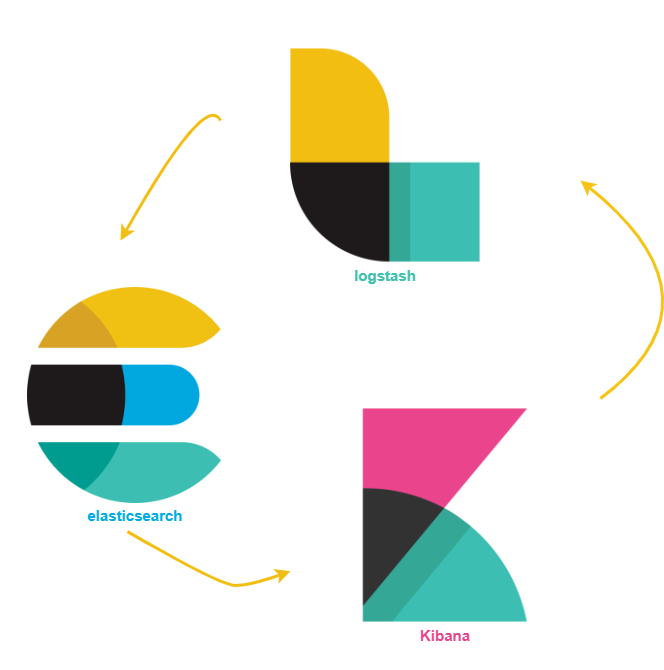
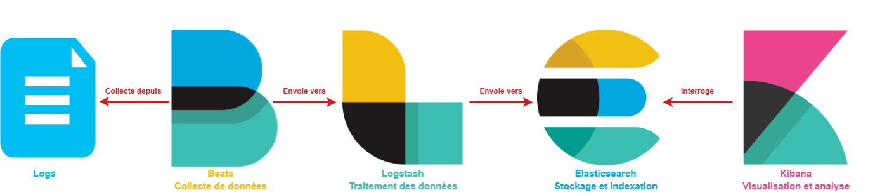

# Analyse SOC : Découverte d'ElasticStack
<ESDInfo />

## 3 en un

Elastic Stack est composé de trois outils :
1. Elasticsearch
2. Logstash
3. Kibana

## Elasticsearch

***Elasticsearch*** est un moteur de recherche et d'analyse. C'est le coeur de la solution ElasticStack. Dans ce logiciel, sera stocké toutes les données qui seront collectées sur l'infrastructure. Paradoxalement, c'est la couche avec laquelle on intéragit le moins au début, puisqu'on passe surtout du temps à configurer en amont la collecte des logs au niveau Logstash, puis en aval avec la visualisation dans Kibana.

## Logstash

Logstash est le module de collecte des logs. C'est lui qui est chargé de récolter les logs et métriques pour les transmettre à Elasticsearch. C'est un pipeline de traitement de données qui fournit les éléments pour lire des données fournies par diverses sources pour transformer, parser, formaliser et compléter ces données et enfin pour les renvoyer à une base de données.

## Kibana

Kibana est une interface web qui permet d'explorer/visualiser des informations provenant d'Elasticsearch et de les afficher sous forme de graphiques. 

## Processus de fonctionnement

Avec tous ces outils combinés, on obtient le processus de fonctionnement suivant :

