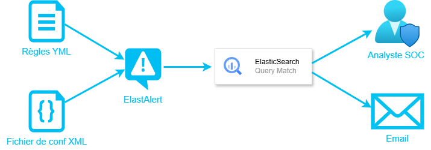
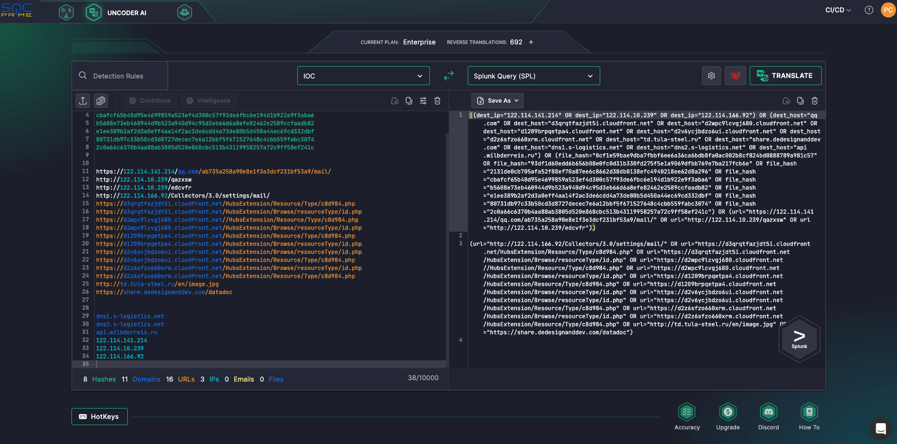

# Analyse SOC : ElasticSearch
<ESDInfo />

## Terminologie

La structure des données ElasticSearch est souvent associée à la strcture d'une BDD relationnelle :

|SQL|ElasticSearch|Descriptions|
|-|-|-|
|Column|Field|Contient une valeur|
|Row|Document|Représente l'ensemble d'une donnée|
|Table|Index|La cible contre laquelle les requêtes sont exécutées|
|Database|Instance|Serveur hébergeant les données (Node)|

## Syntaxe Lucene

Elasticsearch repose sur Lucene, une librairie de recherche d'Apache.

Voici quelques éléments afin d'effectuer une requête de recherche avec la syntax Lucene :

* Lorsque l'on entre un mot, supposons `smb`, on va obtenir tous les fields contenant le terme `smb`
* Si l'on ajoute `:` au bout de ce mot, on va chercher une valeur à l'intérieur de ce field, exemple : `smb:v1`
* Si l'on recherche une phrase, on utilisera des guillemets : `message:"upload files success`

### Wildcard *

Le `*` représente toutes possibilités :

* Requête tous les mots commençant par `win` :  `hostname win*`

* Requête sur tous les mots commençant par `win` et se terminant par `ws` : `hostname: win*ws`

La syntaxe Lucene ne supporte pas l'utilisation du `*` comme premier caractère.

### Caractères inconnus

Le caractère `?` va permettre de faire une recherche de valeur avec un ou plusieurs caractères inconnus :

* Requête pour rechercher un mot avec un caractère inconnu : `type.os: m?c`

* Requête pour rechercher un mot avec deux caractères inconnus : `type.os: m??`

### Approximation

Le caractère `~` permet de rechercher une valeur avec approximation possible entre 0 & 2 caractères :

* Requête avec approximation de 1 caractère : `os.type: max~1`

* Requête avec approximation entre 0 & 2 caractères : `os.type: max~0.2`

Cela permet également d'effectuer une recherche basée sur la distance entre deux mots :

* Requête avec un écart de 1 mot : `message: "POST /upload.php"~1`
* Requête avec un écart de 10 mots : `message: "POST /upload.php"~10`

### Plage inclusive

Il est possible d'utiliser des plages de valeurs avec la structure `[value TO value]` :

* Requête pour une recherche entre deux valeurs : `date: [20200101 TO 20201231]`
* Requête pour une recherche à partir d'une valeur : `date: [20200101 TO *]`

### Plage exclusive

Il est possible d'utiliser des plages exclusives de valeurs avec la structure `{value TO value}`

* Requête pour une recherche exclusive entre deux valeurs : `response_code: {200 TO 404}`

Cette requête va rechercher tous les événements ou "response_code" est compris entre 200 et 404 mais sans inclure ces deux valeurs.

### Caractères spéciaux

Il est possible d'effectuer une recherche basée sur des caractères spéciaux :

* Requête pour une recherche d'événement contenant une adresse IP : `message: /[0-9]{1,3}\.[0-9]{1,3}\.[0-9]{1,3}\.[0-9]{1,3}/`

`/` Encadre la valeur de recherche
`[0-9]` Nombre compris entre 0 et 9
`{1,3}` Valeur précédente comprise en 1 et 3 caractère
`\` Marque la fin de la valeur

### Opérateur Booléens

Ils permettent de combiner plusieurs éléments de recherche :

* `AND` : `root AND admin`
  * `AND` : Requête permettant de faire une recherche de document contenant les mots *root* et *admin*, il contiendra obligatoirement le mot *root* et potentiellement le mot *admin*.
* `+` : `+root admin`
* `OR` : `"Michel Dupond" OR mdupond`
  * L'opérateur `OR` est l'opérateur de conjonction par défaut. Cela signifie que s'il n'y a pas d'opérateur booléen entre deux termes, l'opérateur `OR` est utilisé. Requête permettant d'effectuer une recherche soit par le mot *Michel Dupond* ou par *mdupond*
* `NOT` : `root NOT admin`
  * `NOT` : La requête permet d'effectuer une recherche contenant le mot root mais exclue les résultats contenant le mot *admin*.
* `-` : `root -admin`

Les opérateurs booléens sont toujours écrits en majuscules.

Il est aussi possible d'intéragir directement avec ElasticSearch via des requêtes HTTP, afin de pouvoir obtenir des données (GET), ajouter des données (PUT), et supprimer des données (DELETE).

## SIGMA & ElastAlert

### SIGMA

SIGMA est un format générique de signature décrivant des événements. L'objectif principal est de pouvoir écrire une règle SIGMA de manière standardisée et de les convertir afin de les rendre utilisable sur les différents outils de SIEM.

Le projet a pour but d'améliorer la collecte et le partage de mécanisme de détection afin d'optimiser les capacités de détection pour tous.

Les règles de détections créées sont basées sur les éléments de la base MITRE ATT&CK, ainsi il est donc possible de créer des règles de détection adaptées au contexte de l'entreprise afin d'affiner le résultat souhaité et limiter le déclenchement d'alerte de faux positif.

Les règles SIGMA sont basées sur le langage YAML :

```YAML
title: LSASS Memory Dump
id: 5ef9853e-4d0e-4a70-846f-a9ca37d87da
status: experimental
description: Detects process LSASS memory dump using procdump or taskmgr based on the CallTrace pointing to dbghelp.dll or dbgcore.dll for Win10
author: Samir Bousseaden
date: 2019/04/03
modified: 2020/08/24
references:
  - https://blog.menasec.net/2019/02/threat-hunting-21-procdump-or-taskmgr.html
tags:
  - attack.credential_access
  - attack.t1003.001
  - attack.t1003 # an old one
  - attack.s0002
logsource:
  category: process_access
  product: windows
detection:
  selection:
    TargetImage: 'C:\Windows\system32\lsass.exe'
    GrantedAccess: '0x1fffff'
    CallTrace:
      - '*dbghelp.dll'
      - '*dbgcore.dll'
    condition: selection
falsepositives:
  - unknown
level : high
```

Voir [SIGMA - Generic Signature Format for SIEM Systems sur Github](https://github.com/SigmaHQ/sigma/tree/master)

### ElastAlert

Il s'agit d'un outil permettant de fénérer des alertes basées sur des événements, des patterns... depuis des données stockées dans ElasticSearch.



ElastAlert requête périodiquement ElasticSearch, des règles sont définies afin de déterminer une correspondance sur un type de données précises. Lorsqu'il y a une correspondance, cela déclenche une action d'alerte via différents moyens (Email, Slack, Jira, Teams...).

Quelques types de règles qu'il est possible de définir avec ElastAlert :
* Correspondance lors de la détection de X événements en temps Y (frequency)
* Correspondance lorsque le nombre d'événements augmente ou diminue (spike)
* Correspondance sur n'importe quel événement défini (any)
* Correspondance lorsqu'une valeur pour un champs est en dessous ou au dessus d'une limite (cardinality)

ElastAlert comprend plusieurs fichiers essentiels pour son fonctionnement :
* Le fichier `../elastalert/config.yaml` qui contient notamment les informations de référence du serveur ElasticSearch.
* Les fichiers `/elastalert/example_rules` contenant les règles d'alertes
* Un script de test afin de valider les fichiers de règles est également disponible :
  * `elastalert-test-rule --config ../elastalert/config.yaml ../elastalert/example_rules/<name_rule>.yaml`

Les règles ElastAlert sont également basées sur du langage YAML :

```YAML
name: Nom de la règle
type: change
index: filebeat-*
filter:
- query:
    query_string: 
        query: "document_type: login"
alert:
- "email" 
email:
- "elastalert@exemple.com"
```

Le besoin est donc de pouvoir utiliser des règles du framework SIGMA dans l'outil ElastAlert. SIGMA met une suite d'outil à disposition, **sigmatools**, dont un est prévu à cet effet : ***Sigmac***.

Sigmac permet donc la conversion de règle SIGMA en requête ou fichier supporté par les principaux langages/outils utilisés dans les SIEM :
* es-qs
* es-dsl
* kibana
* xpack-watcher
* elastalert
* graylog
* qradar
* splunk, splunkxml

Sigmac fonctionne de la manière suivante :

`tools/sigmac -t splunk -c splunk-windows rules/windows/sysmon/sysmon_susp_image_load.yml`

* `-t` permet de choisir la plateforme de sortie
* `-c` est un fichier de configuration contenant les champs (fields) et les indexs correspondant à la plateforme cible
* Le fichier `.yml` est le fichier source de la règle SIGMA à convertir

Un autre outil permet également de faire de la conversion de format de règle : ***uncoder.io***



Ces outils sont donc utilisés pour faciliter l'intégration des données mises à disposition à la communauté Cyber. Cependant, il faut prendre en considération qu'il accompagne l'utilisateur, mais ne fournit pas une solution "clé en main".

En effet, les fichiers de sortie sont pour la plupart du temps à adapter à l'environnement et aux besoins dans lequel ils seront utilisés.