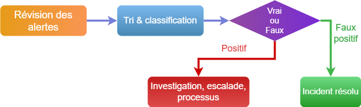

# Analyse SOC : Quel travail au quotidien ?
<ESDInfo />

## Compétences recherchées

Les compétences recherchées sont pour un tel poste sont :

### Les compétences techniques

* Expérience en administration système
* Expérience en administration d'équipements type NIDS
* Connaissances approfondies des protocoles réseaux et expertise dans l'analyse de flux réseau
* Connaissances approfondies sur le SIEM
* Connaissances sur la cyber offensives
* Expérience en virtualisation, cloud... en fonction des besoins du SOC

### Les compétences en sécurité

* Connaissances des principales techniques d'attaques
* Connaissances de base en cryptographie et protocoles de sécurité
* Connaissances des produits de sécurisation du réseau
* Expérience en interprétion de résultats de scanneurs de vulnérabilités
* Capacité de veilles techniques et l'évolution des cyber menaces

### Les soft skills d'un analyste SOC

* Avoir une vue d'ensemble
* Comprendre un événement dans son contexte
* Etre curieux
* Avoir le souci du détail

## Activité quotidienne

L'analyste SOC est un expert en sécurité informatique qui travaille dans un SOC (Security Operation Center) pour surveiller, analyser et répondre aux incidents de sécurité. 

L'activité quotidienne de l'analyste SOC est la suivante :

- Traiter les alertes identifiées par les SIEMs
- Identifier les menaces potentielles
- Evaluer leurs impacts
- Ajouter ou optimiser des règles de détection
- Relation avec le client (SOC externalisé)
- Etudier les nouvelles menaces, les rapports des CERTs
- Recherche de traces de compromission sur les systèmes d'information

## Trier les alertes

L'analyste SOC a comme principale tâche de trier en temps réel les alertes de sécurité et de les remonter au niveau 2 s'il estime que ce n'est pas un faux positif. 

## Vérification du bon fonctionnement

Il est important de vérifier le bon fonctionnement du SOC quotidiennement, ces actions peuvent être réalisées :

- Vérifier l'état de santé du SIEM
- Contrôler l'état du trafic réseau
- Vérifier le volume des logs

## Rapport & ticket

L'analyste SOC doit être capable de remonter un incident, et pour cela il a besoin d'avoir une méthodologie, comme par exemple :

|N°|Evènement|Méthode de détection|Atténué|Nécessite investigation|Commentaire|
|-|-|-|-|-|-|
|54|Scan sur Firewall interne|Logs du Firewall|Non|Oui|Escalade au niveau 2|

L'idée ici est de remonter l'incident, en indiquant les zones identifiées comme potentiellement attaquées ou vulnérables.

## Threat hunting

La "chasse aux menaces" est une tactique permettant de connaître précisément le degré de risque de cyberattaque auquel est soumise une société. La méthode consiste à dresser un portrait général de la surface d'attaque, tout en identifiant les attaquants potentiels, leurs motifs et leurs façons de faire.

L'analyste SOC doit savoir comment fonctionne une cyberattaque, ses tactiques et avoir les connaissances techniques nécessaires pour les détecter.