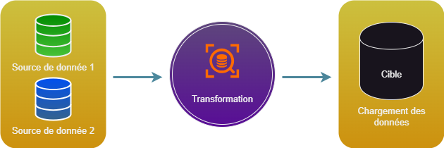

# Analyse SOC : Fonctionnement de Logstash
<ESDInfo />

## Introduction

***Logstash*** est un outil de collecte de données et de traitement de données, il permet de collecter des données provenant de divers sources et de les traiter afin de les mettre en forme et de les exporter dans des formats standardisés.

Il fait partie de la famille des ***ETL*** (***E***xtract, ***T***ransform, ***L***oad), qui ont pour mission de rendre des données propres, structurées et accessibles dans le but d'être exploitées par des équipes d'analyste.



Il existe un autre processus de traitement appelé ***ELT*** (***E***xecution, ***L***oad, ***T***ransform), qui lui charge d'abord les données afin de les transformer au même endroit. Ce mode est plutôt utilisé dans les environnements de Big Data, car l'ELT supprime l'étape de copie des données qui peut être longue dans le cas ou le volume de donnée est conséquent.


## Configuration

Logstash se configure au travers des fichiers suivants : 
* logstash.yml
* jvm.options
* pipeline.yml 
* `/conf.d/ <pipeline files>.conf`

## Fonctionnement

### Pipeline

Le processus de traitement appelé ***Pipeline*** de Logstash fonctionne via des plugins :
* Les plugins ***Inputs*** : réceptionne l'événement
* Les plugins ***Filters*** : modifie l'événement
* Les plugins ***Outputs*** : exporte l'événement

Les pipelines de Logstash sont créés à partir d'un ou plusieurs fichiers de configuration. 

#### Un seul pipeline utilisant un seul fichier de configuration

La méthode la plus simple pour démarrer Logstash consiste à demander au système de créer un pipeline, à partir d'un fichier de configuration, défini grâce au paramètre de ligne de commande `-f`.

#### Un seul pipeline utilisant plusieurs fichiers de configuration

Logstash peut aussi être configuré de manière à utiliser tous les fichiers d'un répertoire spécifique comme fchiers de configuration. Cette option peut être paramétrée grâce au fichier `logstash.yml` ou en intégrant le chemin d'un répertoire dans la ligne de commande, à l'aide du paramètre `-f`. Il s'agit de l'option par défaut pour installer LOgstash en tant que service.

Lorsqu'un répertoire est spécifié, tous les fichiers de ce répertoire sont concaténés par ordre léxicographique, puis analysés sous la forme d'un seul fichier de configuration. Les données provenant de toutes les entrées sont alors traitées par l'ensemble des filtres et envoyées à toutes les sorties, sauf si on utilise des conditions pour contrôler le flux.

#### Utilisation de plusieurs pipelines

Pour utiliser plusieurs pipelines, on doit modifier les fichiers `pipelines.yml` fournis avec logstash. Pour ce faire, on doit accéder au répertoire des paramètres. Il contient des fichiers de configuration et des paramètres de configuration pour tous les pipelines pris en charge par cette instance de logstash.

L'utilisation de plusieurs pipelines permet de séparer les flux logiques différents. Cela permet de réduire considérablmeent la complexité et la quantité de conditions utilisées. Ainsi, il est plus facile de régler et de préserver la configuration. Les données qui passent dans le pipeline deviennent alors de plus en plus homogènes. Cela permet d'améliorer les gains de performance, car les plug-ins de sortie peuvent être utilisés plus efficacement.

## Les plugins Input

Ils permettent de recevoir les données dans logstash, quelques uns des plus utilisés sont :
* ***file*** : lecture d'un fichier sur un système de fichier
* ***syslog*** : reçois les messages au format syslog sur le port **514**
* ***tcp*** : lecture d'événements depuis une connexion TCP
* ***beats*** : reçoit les événements envoyés par un agent Beats

Une liste complète des plugins Input est consultable [ici](https://www.elastic.co/guide/en/logstash/current/input-plugins.html).

Un premier exemple de configuration d'un plugin input est le suivant :

```YAML
input {
  file {
    path => "/tmp/access.log"
    start_position => "beginning"
  }
}
```

Ou encore pour une configuration de syslog :

```YAML
input {
  syslog {
    type => syslog
    port => 514
  }
}
```	

Ou pour un agent Beats :

```YAML
input {
  beats {
    port => 5044
  }
}
```
## Les plugins Filter

Ce plugin est intermédiaire, non obligatoire, qui permet de combiner des filtres et des conditions pour effectuer une action sur un événement si celui-ci répond à certains critères. On retrouve les plugins suivants :
* ***grok*** : parse et structure un événement
* ***mutate*** : effectue des transformations sur les champs des événments. Il est possible de renommer, supprimer et modifier des champs dans vos événemts
* ***geoip*** : ajoute des informations sur la localisation géographiques des événements

Une liste complète des plugins Filters est consultable [ici](https://www.elastic.co/guide/en/logstash/current/filter-plugins.html).

Exemple de configuration du plugin `grok` :

```YAML
filter {
  grok {
    match => { "message" => "%{SYSLOGTIMESTAMP:timestamp} %{IPORHOST:host} (?:%{PROG:program}(?:\[%{POSINT:pid}\])?: )?%{GREEDYDATA:message}" }
    add_field => { "received_at" => "%{@timestamp}" }
    add_field => { "received_from" => "%{host}" }
  }
}
```

Pour mutate :

```YAML
filter {
  mutate {
    remove_field => [ "message" ]
  }
}
```

Pour geoip :

```YAML
filter {
  geoip {
    source => "[dstip"
  }
}
```

## Les plugins Output

Ils représentent la phase finale du pipeline Logstash. Une fois l'étape de sortie terminée, l'événement a terminé son exéctuion, voici quelques exemples :
* ***elasticsearch*** : exporte les événements vers Elasticsearch
* ***file*** : Ecrit les événements dans un fichier
* ***graphite*** : Envoie les événements dans l'outil open source "*Graphite*"

Liste complète des plugins Outputs est consultable [ici](https://www.elastic.co/guide/en/logstash/current/output-plugins.html).
Outil *Grapite* : https://graphite.readthedocs.io/en/latest/

Exemple de configuration d'un plugin output :

```YAML
output {
  elasticsearch {
    hosts => ["elasticearch_srv:9200"]
    index => "%{[@metadata][beat]}-%{+YYYY.MM.dd}"
  }
}
```

## Exemple de configuration de Logstash

```YAML
input {
  beats {
    port => 5044
  }
}

filter {
  grok {
    match => { "message" => "%{SYSLOGTIMESTAMP:timestamp} %{IPORHOST:host} (?:%{PROG:program}(?:\[%{POSINT:pid}\])?: )?%{GREEDYDATA:message}" }
    add_field => { "received_at" => "%{@timestamp}" }
    add_field => { "received_from" => "%{host}" }
  }
  geoip {
    source => "[dstip"
  }
}

output {
  elasticsearch {
    hosts => ["elasticearch_srv:9200"]
    index => "%{[@metadata][beat]}-%{+YYYY.MM.dd}"
  }
}
```


