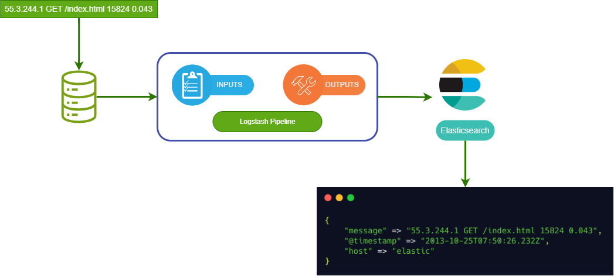
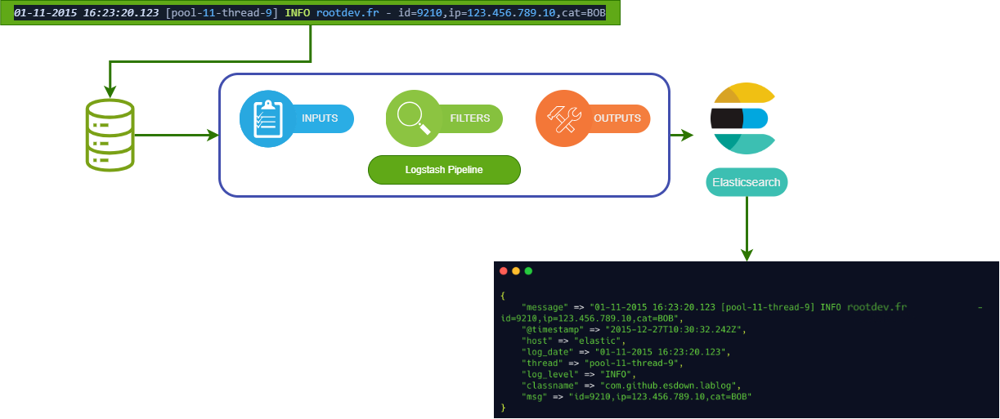

# Analyse SOC : Filtres Groks & sources externes
<ESDInfo />

## Structure des événements

Lors du traitement d'un log dans un pipeline Logstash, celui-ci est **parsé** avec des champs par défaut :
* ***@timestamp*** : date à laquelle logstash a collecté le message
* ***host*** : host qui a effectué la collecte
* ***message*** : texte original du log

Il sera alors possible d'ajouter, modifier ou supprimer des champs afin de pouvoir obtenir un message final le plus adapté à notre besoin.



## Filters Groks

Le filtre **Grok** se base sur des expressions régulières, il permet d'extraire des informations et de les ranger dans le champs "*fields*" de l'événement. Logstash inclut un grand nombre d'expressions régulières prédéfinies. Il existe 2 syntaxes :
* La syntaxe "built-in" qui est la plus simple et permet de définir des expressions régulières simples
* La syntaxe "custom" qui permet de définir des expressions régulières plus complexes

### Syntaxe "built-in"

La syntaxe built-in : `%{PATTERN:mon_champ}`

Exemple :

```log
55.3.2441 GET /index.html 15824 0.043
```

Pattern :

```
%{IP:client}%{WORD:method}%{URIPATHPARAM:request}%{NUMBER:bytes}%{NUMBER:duration}
```

### Application de Grok

Pour appliquer le filtre Grok, il faut ajouter le plugin `grok` dans le fichier de configuration de Logstash.

```YAML
filter {
  grok {
    match => { "message" => "%{IP:client} %{WORD:method} %{URIPATHPARAM:request} %{NUMBER:bytes} %{NUMBER:duration}" }
  }
}
```

### Syntaxe "custom"

Il arrive parfois que logstash ne dispose pas du pattern dont on a besoin, il est alors possible de créer un nouveau pattern personnalisé :
* Directement dans le fichier de configuration de logstash
* Depuis un dossier de pattern

Modèle : (?<field_name>the pattern here)

Log :
```log
01-11-2015 16:23:20.123 [pool-11-thread-9] INFO rootdev.fr - id=9210,ip=123.456.789.10,cat=BOB
```

Grok : 
```
(?<log_date>%{MONTHDAY}-%{MONTHNUM}-%{YEAR} %{HOUR}:%{MINUTE}:%{SECOND}.[0-9]{3}) 
\[%{NOTSPACE:thread}\]
%{LOGLEVEL:log_level} %{NOTSPACE:classname} - %{GREEDYDATA:msg}
```

En mettant cela en forme pour le fichier de configuration de logstash :

```YAML
filter {
  grok {
    match => { "message" => "(?<log_date>%{MONTHDAY}-%{MONTHNUM}-%{YEAR} %{HOUR}:%{MINUTE}:%{SECOND}.[0-9]{3}) \[%{NOTSPACE:thread}\] %{LOGLEVEL:log_level} %{NOTSPACE:classname} - %{GREEDYDATA:msg}" }
  }
}
```

Si on voulait utiliser un pattern dans un dossier de pattern, on peut le faire ainsi :

Créer un sous-dossiers dans le dossier de configuration de logstash, puis créer un fichier contenant les inforamtions suivantes :

```
LOG_DATE %{MONTHDAY}-%{MONTHNUM}-%{YEAR} %{HOUR}:%{MINUTE}:%{SECOND}.[0-9]{3}
```

Puis dans le fichier de configuration de logstash :

```YAML
filter {
  grok {
    patterns_dir => ["./patterns"] // On ajoute le dossier de pattern
    match => { ... }
  }
}
```

Exemple d'exécution d'un pipeline avec traitement (plugin filter) :

