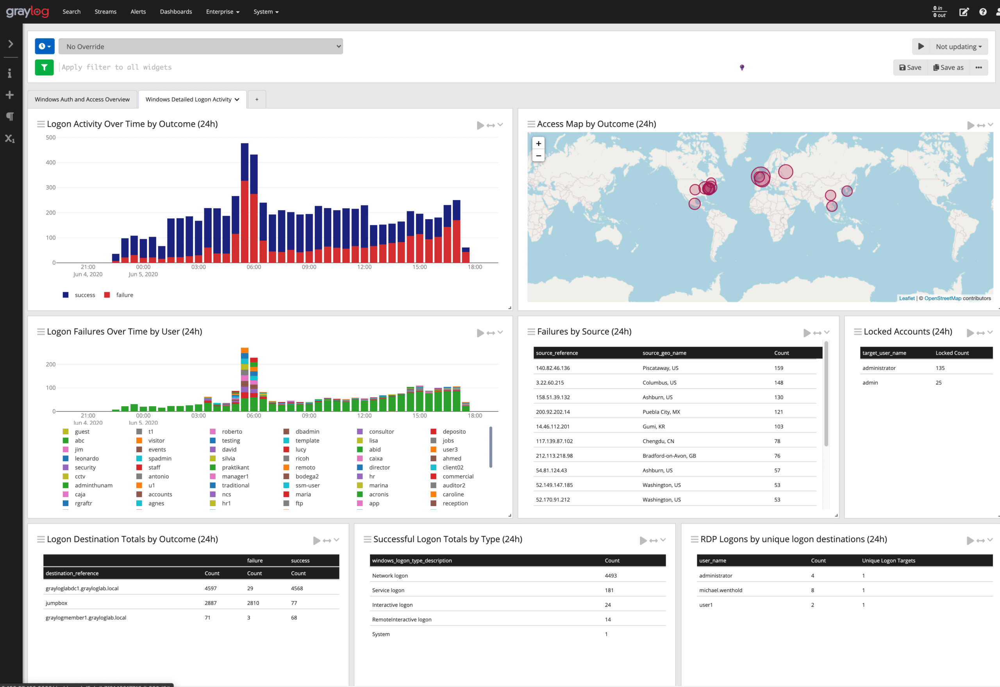
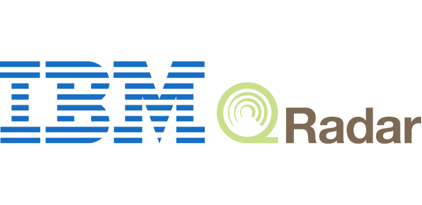
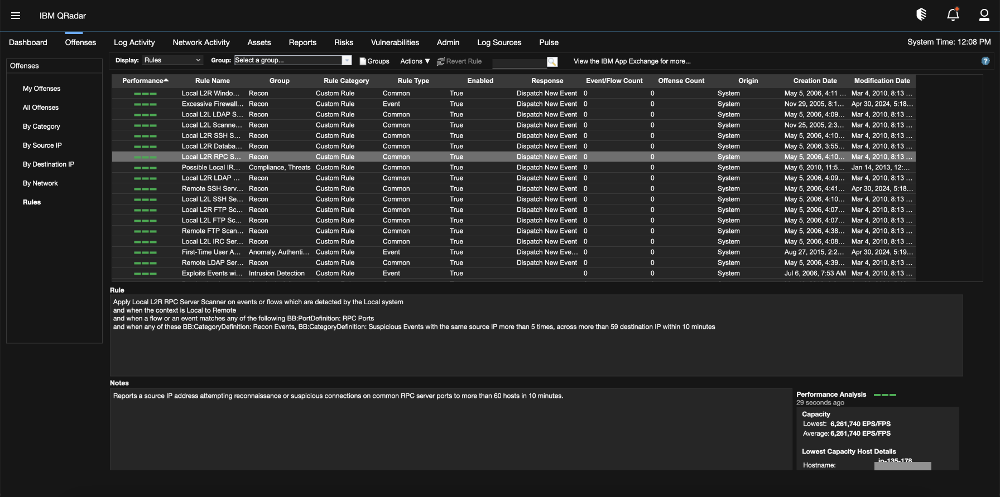
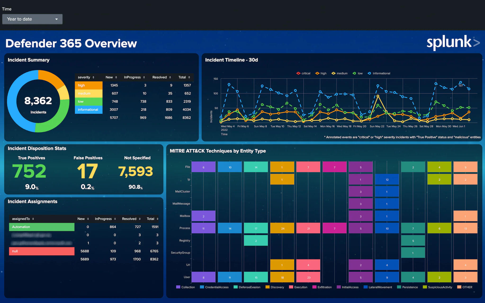
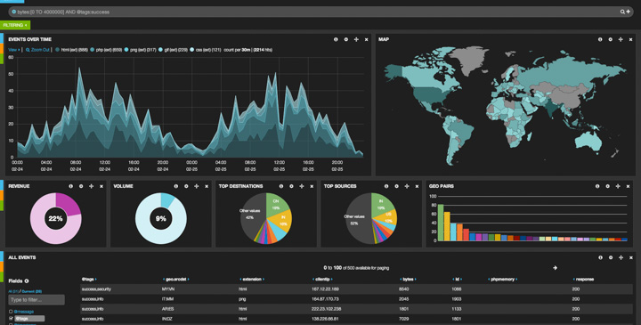

# Analyse SOC : Tour d'horizon d'un SIEM
<ESDInfo />

## Contexte d'un SIEM

Les risques cyber étant de plus en plus présents et menaçants, les organisations ont besoin de surveillances en permancences de leurs systèmes d'informations. L'identification des actions malveillantes qui les menacent permettent de se prémunir de potentielles attaques avant qu'elles ne causent de graves dommages. Le ***SIEM*** (***S***ecurity ***I***nformation and ***E***vent ***M***anagement) représente un ensemble de composants permettant de détecter des cyber-menaces, permet également aux organisations de disposer d'une vue globale de l'état de leur sécurité informatique.

## Solutions existante

### Choix d'une solution

Le choix d'une solution SIEM doit se baser sur 4 points :

- Le premier étant la taille du périmètre, une PME n'aura pas les mêmes besoins qu'un grand groupe.
- Le second étant la volumétrie des logs : plus il y a de personnels, plus il y a de logs, donc la nécessité d'un SIEM performant
- Le troisième étant les compétences des équipes d'analyste
- Et le dernier, le plus important, c'est le budget

### Graylog

Graylog est une solution Open Source :
* Gestion des utilisateurs avancée
* Système d'alerte inclus
* Dashboard pas interactif
* Coût de licence > Support

### IBM Qradar

IBM Qradar est une solution propriétaire, dont les licences sont plutôt orientées pour les grandes entreprises. Le support est afficace et la intègre une certaine communauté de développeurs "éditeurs".

### Splunk

Splunk est également une solution propriétaire, facile d'installation et de prise en main. La version communauté est limitée en fonctionnalités et en taille de collecte, contrairement à la version Enterprise.

### Elastic stack

Elastic est une solution open source, avec un dashboard interactif et avancé, disposnant d'une grande communauté pour le support.

## Principe de fonctionnement d'un SIEM

Le principe d'un SIEM est d'agréger des données émanantes de plusieurs sources :
* Pare-feu
* Serveurs (serveur de fichiers, FTP, VPN, Proxy, ...)
* Applications métiers
* Bases de données
* IDS & IPS

Celles-ci sont donc centralisées dans le but de pouvoir être exploitées par des agents ou des IA. Des règles de détections sont créées afin de pouvoir établir des zones de surveillance correspondant aux menaces pesant sur l'environnement informatique de l'organisation. Il est possible de visualiser et inspecter les différents résultats d'analyse et de points de contrôles dans les tableaux de bord afin de répondre de façon précise aux exigences souhaitées par l'organisation.

### L'horodatage

Un événement journalisé n'est pertinent que si celui-ci peut être situé dans le temps :
* Occurences
* Fréquences
* Post-mortem

Chaque équipement dispose d'une horloge interne qui lui permet d'horodater les journaux d'événements :
* Les horloges dérivent naturellement dans le temps
* Utilisent des serveurs de temps pour garder les équipements synchronisés
* Protocole NTP (***N***etwork ***T***ime ***P***rotocole)

## Objectifs d'un SIEM

### Fonctionnalités apportées par le SIEM :

1. Corrélation
2. Alerter
3. Tableau de bord / Reporting
4. Conformité
5. Investigation numérique (Forensics)

### Corrélation

La corrélation consiste à faire correspondre des événements de plusieurs systèmes (hôtes, dispositifs réseau, contrôles de sécurité, n'importe quelle source de logs). Des événements de plusieurs sources peuvent être combinés et comparés afin d'identifier des patterns de comportement invisibles avec une simple analyse.

### Alerte

Grâce à la corrélation, le SIEM va automatiser la détection d'événements qui ne devrait pas se produire au sein d'un réseau et va pouvoir alerter les équipes de sécurité.

### Tableau de bord / Reporting

Le SIEM va permettre de créer des Dashboards de l'activité d'un système d'information, en temps réel et de créer des rapports. Ainsi, les différents acteurs du SI, RSSI, administrateurs, utilisateurs, peuvent avoir une visibilité sur le SI (nombre d'attaques, nombre d'alertes par jours...)

### Conformité

Le SIEM automatise la conformité à des réglementations gouvernementales et industrielles, de cadres de gouvernances et d'exigences internes, notamment ***PCI DSS***, ***HIPAA***, ***FISMA***, ***SOC***, ***ISO***, ***COBIT***... par la génération de rapports afin de prouver automatiquement leur conformité ou d'identifier les domaines de non-conformité aux contrôles techniques.

### Investigation numérique

Dans le cas de la recherche de preuves lors d'incident de sécurité, le SIEM est un gain de temps énorme et d'une efficacité redoutable grâce à sa capacité d'analyse des logs agrégés.