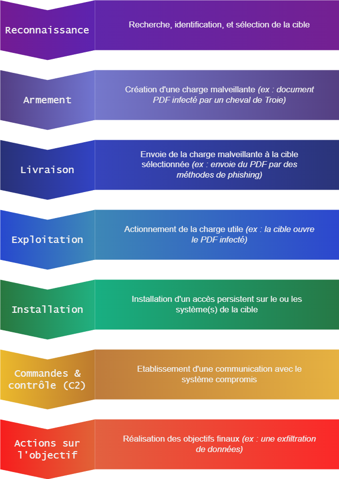
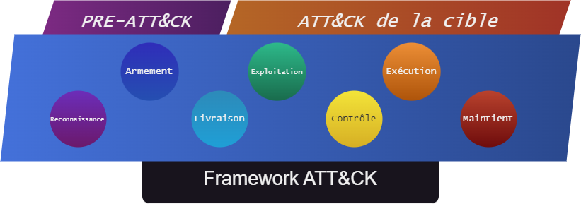

# Analyse SOC : Référentiels ATT&CK, DeTT&CT, Sigma, MISP
<ESDInfo />

## La Cyber Kill Chain

Un terme "**Kill Chain**" est un terme utilisé pour décrire la série d'étapes que doit franchir un attaquant pour réaliser une attaque, il a été introduit par les militaires pour expliquer les étapes utilisées pour attaquer la cible. Plus tard, en 2011, Lockheed Martin a introduit la **Cyber Kill Chain** pour décrire les étapes nécessaires pour réaliser une attaque informatique.

 

 

## Le framework ATT&CK

***MITRE ATT & CK*** est un framework open source qui décrit les techniques et les processus utilisés par les attaquants pour compromettre les systèmes informatiques basées sur des observations de cas réels et de la ***Cyber Threat Intelligence***. Il est utilisé pour identifier les menaces et les vulnérabilités, et pour évaluer la sécurité des systèmes informatiques.

 

***ATT&CK*** permet de définir un cadre de l'adversaire pour décrire les actions qui pourrait entreprendre pour compromettre et opérer au sein d'un réseau d'entreprise. Le modèle peut être utilisé pour mieux catégoriser et décrire le comportement de l'adversaire après avoir été compromis. Il élargit les connaissances des défenseurs (Blue Team) et aide à prioriser la défense en détaillant les tactiques, techniques et procédures (TTP) utilisées par les cybermenaces pour accéder et exécuter leurs objectifs tout en opérant à l'intérieur d'un réseau.

::: info Définition de la CTI
La ***Threat Intelligence***, ou ***Cyber Threat Intelligence*** est une discipline basée sur des techniques du renseignement, qui a pour but la collecte et l'organisation de toutes les informations liées aux menaces du cyber-espace, afin de dresser un portrait des attaquants ou de mettre en exergue des tendances.
:::
