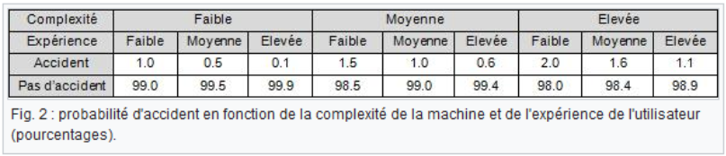

# Analyse SOC : Services intégrés & données collectées
<ESDInfo />

## Les éléments d'un SOC

|Prévention|Détection|Réaction|
|---|---|---|
|Veille vulnérabilités critiques (0 day)|Tests d'intrusion, veille cybercriminelle, contrôles ponctuels, veille cybersquatting|Forensics, réponse active|
|Sensibilisaition|Qualification des alertes de sécurité, contrôles de conformité, collecte, centralisation et analyse des logs|Investigations étendues|
|Gestion des vulnérabilités|Contrôles automatiques, analyse de production|Investigations de base, lutte défensive|

Le premier service de **prévention**, regroupant les aspects de veille et de recherche des vulnérabilités critiques connues et recensées. La sensibilisation, plus particulièrement avec le personnel de l'entreprise, car plus de 90% des attaques recensées auprès de grandes sociétés sont dues à un manque de sensibilisation des salariés aux risques et menaces cyber.

En second service, la **détection**, qui regroupe les aspects de test d'intrusion, de contrôles ponctuels au sein du SI et du SOC, de la qualification des alertes de sécurité, de la collecte, centralisation et analyse des logs.

Puis enfin le service de **réaction**, qui regroupe les aspects de l'investigation étendue, de la lutte défensive et de la réponse active. Il est considéré comme étant celui qui intervient à la suite d'un événement de sécurité. On y retrouve l'aspect forensics étant l'enquête post incident, ou l'aspect de réponse active, qui est la rédaction de règles, tests et optimisations de ces dernières, et l'aspect de lutte défensive ou la recherche de solution de défenses perfectionnées et adaptées aux menaces en constantes évolutions.

## Le SIEM, central au SOC

Les ***Security Information and Event Management (SIEM)*** prennent en entrée les événements collectés du SI, les journaux systèmes des équipements : pare-feux, routeurs, serveurs, bases de données, etc... et les centralisent dans une plateforme de gestion de ces événements.

## L'importance d'une analyse des risques

Une analyse des risques en amont du projet permet :
1. Une mise en place du SOC en priorisant les budgets et la défense
2. Créer ses règles SIEM et tableaux de bord en fonction des priorités de l'organisation
3. Ajouter une cohérence et de la communication sur le projet

L'utilisation d'EBIOS Risk Manager peut être intéressante car son approche vise à identifier la partie conformité, hygiène SSI et à la fois les risques de haut niveau numérique. De ce fait, cet outil permet d'avoir un aperçu des point névralgiques de la défense à intégrer dans le SI et permet une aide à la configuration du SOC.

## Les processus

De nombreux processus doivent être définis au sein du SOC, ici limités à ceux liés à la supervision des événements de sécurité :
1. Processus de détection :
    * analyse des alertes détectées par les outils du SOC
    * analyse les informations sur la veille de sécurité SI
    * analyse les sollicitations externes des autres équipes opérationnelles
    * analyse éventuellement les incidents provenants des outils de supervision des réseaux ou des systèmes
2. Processus de qualification :
    - Il s'agit d'un ensemble de tâches attribuées au rôle d'analyste SOC de niveau 2, qui incluent :
        * L'étude des lots d'alertes remontées par les analystes de niveau 1 après tri et priorisation
        * La détermination de la véracité de l'incident de sécurité sous-jacent
        * Prendre la décision de passer à un processus de gestion d'incident en cas d'alerte avérée
        * L'isolation et la description des faux positifs afin de les passer en entrée du processus d'administration du SOC
3. Processus de supervision :
    - La supervision concerne uniquement le périmètre du SI du SOC. il doit être supervisé par les analystes. L'ensemble des processus (détection, qualification, supervision et veille) impliquent des opérations d'administration du SOC. Ce processus d'administration permet l'amélioration continue des performances de détection et de qualification. Une partie des actions d'administration consiste à maintenir et améliorer la disponibilité et la sécurité des équipements du SOC (serveurs, infrastructure de sauvegarde, postes de travail des analystes, réseau du SOC...)
4. Processus de veille :
    - La veille est donc une fonction centrale du SOC pour garder un tempo de défense convenable. Tous les membres du SOC doivent être impliqués dans ce processus.

## Quels équipements ?

Dans la plupart des cas, ces solutions sont en place bien avant la création d'un SOC, et opérées par différents services :
* Anti-malware classique
* Anti-malware de type "bac à sable"
* EDR (Détection et réponse sur les endpoints), EPP, SOAR
* Pare-feu
* PKI
* IDS, IPS
* Scanneurs de vulnérabilités

## Le machine learning

Le machine learning permet de détecter, trier et qualifier plus rapidement les alertes. Un humain vérifiera les alertes, les incidents avérés et les faux positifs. L'exemple le plus connu est la détection de spam.

L'algorithme bayésien permet une prise de décision rapide en fonction des probabilités, l'efficacité de ce dernier est dépendant de la qualité des données d'entrainement.

## Les outils d'analyse comportementale (UBA)

Il s'agit de solutions distinctes interopérables avec les SIEM actuels, présents dans les solutions SIEM "2.0", et permettent des analyses plus fines. L'objectif est de détection des APT et autres malwares sophistiqués. Ils s'appuient sur des techniques de machine learning en apprenant les usages du SI en régime "normal" et en comparant les comportements avec les usages "anormaux".

*UBA* est un acronyme pour *User and Entity Behavior Analytics*.

## Quelles données collecter ?

* Authentification du matériel réseau
* Transaction DHCP, DNS
* Activité VPN, partage, Proxy, BDD
* Antivirus
* sudo Linux
* Firewall
* Authentification Windows, processus, etc...

Il n'y a pas de liste exhaustive des données à collecter, cela dépend de l'organisation et de ses besoins.

## Les Playbooks

Les playbooks sont des listes de contrôles, étapes et actions à réaliser en cas d'incident afin d'y répondre avec succès, selon les types d'incidents et de menaces spécifiques. Ils aident à établir des processus et des procédures de réponse aux incidents formalisés.

Les Playbooks sont liés généralement à la réponse à incident, mais ils peuvent aussi alimenter les SOARs et donc automatiser un maximum la réponse lors de la détection d'une attaque. Il est important pour les responsables SOC d'alimenter les Playbooks afin de gagner en maturité et répondre le plus vite à des incidents.