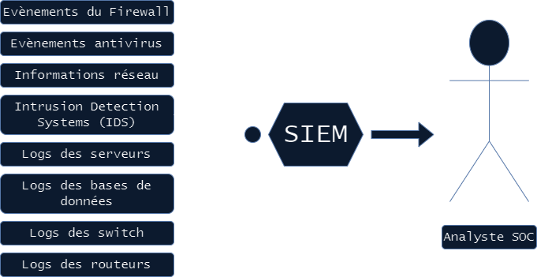

# Analyse SOC : Security Operation Center (SOC)
<ESDInfo />

## Définition du SOC

### De quoi s'agit-il ?

Le ***SOC*** (Security Operation Center) est un service d'analyste en cybersécurité qui surveille, détecte, analyse et qualifie et répond aux événements et incidents de sécurité. Le ***SOC*** est aussi un ensemble de technologies et d'équipements permettant la centralisation, le traitement et l'affichage d'incidents de sécurité.

## Avantages & évolution du SOC 

Le ***SOC*** est composé d'une équipe d'experts en cybersécurité chargée de :
* La centralisation de la défense
* L'amélioration de la gestion des menaces
* Du maintien de sa conformité réglementaire
* L'augmentation de la chaîne de valeur pour le S.I.

## Les services intégrés & données collectées

### Les éléments d'un SOC

|Prévention|Détection|Réaction|
|---|---|---|
|Veille vulnérabilités critiques (0 day)|Tests d'intrusion, veille cybercriminelle, contrôles ponctuels, veille cybersquatting|Forensics, réponse active|
|Sensibilisaition|Qualification des alertes de sécurité, contrôles de conformité, collecte, centralisation et analyse des logs|Investigations étendues|
|Gestion des vulnérabilités|Contrôles automatiques, analyse de production|Investigations de base, lutte défensive|

### Le SIEM, centrale du SOC

### L'importance d'une analyse des risques

Une analyse des risques en amont du projet permet :
1. Une mise en place du SOC en priorisant les budgets et la défense
2. Créer ses règles SIEM et tableaux de bord en fonction des priorités de l'organisation
3. Ajouter une cohérence et de la communication sur le projet

### Les processus

De nombreux processus doivent être définis au sein du SOC, ici limités à ceux liés à la supervision des événements de sécurité :
* Processus de détection
* Processus de qualification
* Processus de supervision
* Processus de veille
