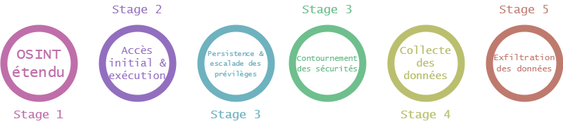
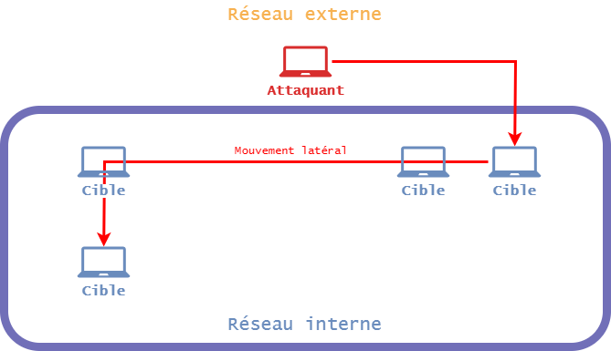
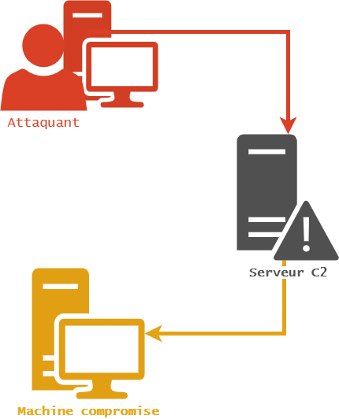
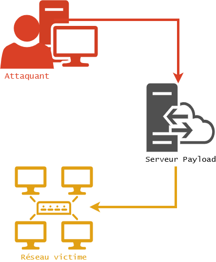
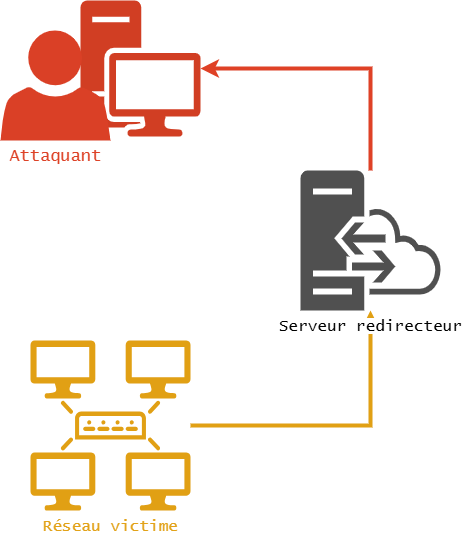
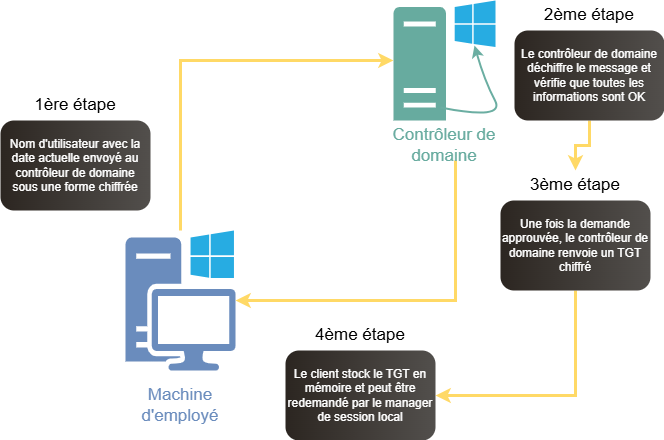
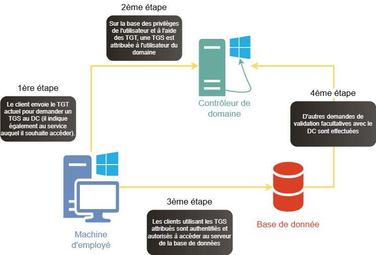

# 🛡️ Red Teaming : comprendre la sécurité offensive
::: danger Avertissement
Ce cours est à but éducatif uniquement.

Les techniques présentées doivent être utilisées uniquement dans un cadre légal et éthique, avec une autorisation explicite.
:::

## Qu'est-ce que le Red Teaming ?

Le Red Teaming est une simulation de cyberattaque réaliste qui a pour but de:

1. Tester exhaustivement les défenses d'une organisation
2. Identifier les vulnérabilités systémiques
3. Évaluer les capacités de détection et de réponse

Ils performent différents types d'attaque, tel que le Social Engineering, les attaques Cyber (attaques web, réseau, infrastructure...) et attaques physiques (manipulations sur site directement).

Les opérations de Red Team sont similaires aux Pentest mais de façon mieux encadrées et avec une cible bien précise, en employant les techniques utilisées par un réel attaquant. le but va être d'accéder à des informations sensibles, de n'importe quelle manière, de façon la plus discrète possible sans laisser de trace derrière eux.

## Quelles différences avec le Pentest ?

|Pentest|Red Teaming|
|-|-|
|Une attaque contre un hôte, un réseau ou toute application pour mesurer et identifier les risques liés à l'exploitation d'un environnement.|Processus d'utilisation de tactiques et de techniques réelles employées par des acteurs de la menace ayant pour objectif de mesurer l'efficacité des personnes, des technologies, etc. utilisées pour défendre un environnement.|
|L'accent est davantage mis sur la réduction des vulnérabilités exposées, etc.|Plus d'importance accordée à la formation et à la mesure des risques et des capacités de défense d'une organisation|
|Le champ d'application est limité - 1 ou 2 systèmes ou réseaux spécifiques|Une partie spécifique de l'organisation (ou l'ensemble de l'organisation)|
|Fait des suppositions sur l'environnement, peut ne pas tester là où on ne lui a pas dit d'aller.|Ne fait aucune supposition, tente de faire des compromissions partout, pivote et change de stratégie et de techniques si nécessaire.|
|Utilise les outils présents au moment du test|Recherche constante de nouveaux exploits, de vulnérabilités et mise en œuvre d'attaques avec de nouveaux outils dès qu'elles sont découvertes.|

## Cycle d'une attaque

### OSINT étendu

- Cette phase consiste généralement à recueillir de plus en plus d'informations sur l'organisation cible.
- Les sites de réseaux sociaux, les plateformes où les employés sont généralement actifs sont au centre de l'attention.
- Les attaquants, qui ont accès à des tonnes d'informations disponibles sur Internet, tentent de découvrir les informations sensibles qui peuvent être utilisées à des fins d'exploitation ultérieure.

### Accès initial & exécution

- L'accès initial consiste à utiliser différents vecteurs d'entrée pour accéder au réseau interne.
- Il existe des moyens tels que l'exploitation de services externes à distance, des erreurs de configuration dans les applications Web, etc. qui peuvent servir de passerelle vers le réseau interne.
- Il existe de nombreux moyens d'obtenir un accès initial, mais cela dépend des technologies utilisées par l'organisation, qui ont pu être identifiées dans la section précédente.
- L'exécution est un code contrôlé par l'attaquant qui s'exécute sur la machine cible. Par exemple : Un adversaire peut utiliser un outil d'accès à distance pour lancer une invite de commande qui permet de découvrir le réseau. 

### Persistence & escalade des privilèges

- Les attaquants recherchent toujours des techniques cachées pour garder l'accès aux systèmes malgré les redémarrages, les changements d'identifiants, etc. qui pourraient couper l'accès de l'attaquant.
- Exemples : Réinitialisation du mot de passe d'un utilisateur discret et utilisation de ce mot de passe comme porte dérobée vers le réseau.
- L'escalade des privilèges consiste à obtenir des autorisations de niveau supérieur sur un système ou un réseau. Les approches les plus courantes consistent à tirer parti des faiblesses, des mauvaises configurations et des vulnérabilités du système.
- Comptes à accès élevé :
  - Niveau SYSTEM/root
  - Administrateur local
  - Utilisateur disposant de capacités similaires à celles d'un administrateur
  - Groupes privilégiés, etc. 

### Contournement des sécurités

#### Mouvement latéral

On parle de mouvement latéral lorsqu'un attaquant compromet ou prend le contrôle d'un équipement au sein d'un réseau, puis passe de cet équipement à d'autres au sein du même réseau.
- Les attaquants peuvent installer leurs propres outils d'accès à distance pour réaliser le mouvement latéral ou utiliser des informations d'identification légitimes avec des outils natifs du réseau et du système d'exploitation, ce qui peut être plus furtif.
- Exemple :
  - **Hameçonnage interne** : Les attaquants peuvent utiliser l'hameçonnage interne pour obtenir l'accès à des informations supplémentaires ou exploiter d'autres utilisateurs au sein de la même organisation alors qu'ils ont déjà accès à des comptes ou à des systèmes dans l'environnement.
  - **Services à distance** : Les attaquants peuvent utiliser des informations d'identification valides pour se connecter à des services tels que SSH, VNC, RDP, puis effectuer des opérations, etc.

#### Contournement des sécurités

- L'évasion défensive consiste à éviter la détection tout au long de la compromission.
- Les attaquants contournent la détection en obscurcissant les scripts malveillants, en se cachant dans des processus de confiance, en désactivant les logiciels de sécurité, etc.
- L'évasion défensive bénéficie de la découverte, mais elle est davantage liée à la compréhension de la manière dont un attaquant peut éviter les défenseurs du réseau, que ce soit par le biais de certains processus ou en connaissant les outils de sécurité présents sur un système.
- Exemple :
  - Affaiblir les défenses : Il s'agit notamment de désactiver les pare-feu, les antivirus et les capacités de détection que les défenseurs peuvent utiliser pour vérifier l'activité et identifier les comportements malveillants.

### Découverte et collecte des données

- L'attaquant se concentre sur la connaissance de la situation en essayant de comprendre l'environnement de l'organisation.
- Ces techniques aident les adversaires à observer l'environnement et à s'orienter avant de décider comment agir.
- Ces techniques sont très utiles pour déterminer où se trouvent les actifs critiques situés dans l'architecture du réseau.
- Exemples :
  - Découverte de fichiers et de répertoires : les attaquants énumèrent des fichiers et des répertoires ou peuvent rechercher certaines informations dans un système de fichiers à des endroits spécifiques d'un hôte ou d'un partage de réseau.

- La collecte de données est le processus de collecte et de mesure d'informations à partir d'un système établi.
- Les données collectées peuvent être n'importe quelle information sensible présente dans un système/réseau.
- Exemple :
  - Archiver les données collectées : Un adversaire peut compresser et/ou crypter les données collectées avant de les exfiltrer.
  - Données du presse-papiers : Les attaquants peuvent collecter des données stockées dans le presse-papiers des utilisateurs qui copient des informations au sein d'une application ou d'une application à l'autre. 

## Les infrastructure d'un opérateur Red Team

***Serveur C2*** : il est utilisé par les attaquants pour maintenir la communication avec les systèmes compromis au sein d'un réseau cible. 

***Serveur de charge utile*** : il s'agit d'un serveur dédié qui héberge tous les scripts malveillants, exécutables, etc. et qui est accessible à la fois depuis le réseau de l'attaquant et celui de la victime. 

***Serveur de redirection*** : Un redirecteur est un système qui redirige tout le trafic vers le serveur de commande et de contrôle de l'attaquant. 

Les acteurs de la menace n'utilisent pas un seul système pour lancer des attaques et obtenir des shell. Ils mettent en place plusieurs systèmes qui servent de points de pivot (redirecteurs) vers leur serveur C2. Ils empêchent le client de voir le C2 réel et doivent être faciles à monter et à démonter. Il se situe entre l'environnement de la victime et le réseau de l'attaquant, écoute les connexions de la machine cible et les renvoie à l'attaquant.

Il protège l'emplacement d'origine du serveur de l'équipe.

## Processus d'authentification de Kerberos

::: info Authentification Kerberos
Dans l'environnement Active Directory, toutes les requêtes et le processus d'authentification sont effectués par le biais de tickets. Par conséquent, aucun mot de passe n'est utilisé pour accéder au réseau.
- Un ticket est une forme de jeton d'authentification et d'autorisation et peut être classé comme suit :
  - Ticket Granting Ticket (TGT) pour l'authentification
  - Ticket Granting Service (TGS) pour l'autorisation
  - Les tickets (TGT et TGS) sont stockés en mémoire et peuvent être extraits à des fins abusives, car ils représentent les informations d'identification de l'utilisateur.
  - Le TGS peut être utilisé pour accéder à un service spécifique d'un serveur du domaine. 
:::

 

### Demande de TGT

### Demande de TGS

### Délégation Kerberos

Elle permet de réutiliser les informations d'identification d'un utilisateur de domaine authentifié pour accéder à des ressources hébergées sur un autre serveur d'un domaine. Cet utilitaire est utile dans les applications ou les architectures à plusieurs niveaux.
- Par exemple : Un utilisateur du domaine s'authentifie auprès d'un serveur d'application et le serveur d'application appelle le serveur de base de données. Le serveur d'application peut demander l'accès aux ressources du serveur de base de données en tant qu'utilisateur du domaine (l'utilisateur est identifié) et non en tant que compte de service du serveur d'application.
- Le compte de service du serveur d'application doit être approuvé pour que la délégation puisse faire des demandes en tant qu'utilisateur de domaine authentifié.