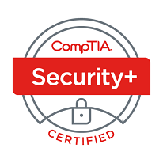

# 📛 Certification CompTIA Security+ SY0-701

Page dédiée à la certification CompTIA Security+ SY0-701. Cette certification est une accréditation reconnue dans le domaine de la sécurité informatique et est conçue pour valider les compétences essentielles nécessaires pour assurer la sécurité des systèmes et des réseaux.

## Objectifs de la certification

Les objectifs de la certification CompTIA Security+ SY0-701 sont définis par CompTIA et couvrent plusieurs domaines clés de la sécurité informatique. En développant chaque objectif avec des exemples concrets, des concepts clés et en citant les types d'attaques associés, les candidats peuvent mieux comprendre comment ces concepts s'appliquent dans des situations réelles et être mieux préparés pour l'examen de certification CompTIA Security+ SY0-701.

## Menaces, attaques et vulnérabilités

Ce domaine évalue la capacité des candidats à analyser les menaces potentielles, les différentes techniques d'attaque et à identifier les vulnérabilités dans les systèmes et les réseaux.

### Types d'attaques :

### 1. Ingénierie Sociale

- **Phishing :** Envoyer des e-mails ou des messages frauduleux pour tromper les utilisateurs et leur soutirer des informations sensibles.

### 2. Exploitation de Vulnérabilités

- **Injection SQL :** Exploiter les failles de sécurité des applications web pour injecter du code SQL malveillant et accéder ou manipuler les bases de données.
- **Cross-Site Scripting (XSS) :** Insérer du code JavaScript malveillant dans des pages web accessibles par d'autres utilisateurs, compromettant ainsi la sécurité de leur session.

### 3. Attaques Réseau

- **Déni de Service (DoS) :** Inonder un système ou un réseau de requêtes légitimes pour le rendre indisponible aux utilisateurs légitimes.
- **Déni de Service Distribué (DDoS) :** Coordonner une attaque DoS à partir de multiples sources pour rendre un service ou un réseau indisponible.

### 4. Menaces Internes

- **Abus de Privilèges :** Utilisation abusive des privilèges d'accès accordés à un utilisateur légitime pour des activités malveillantes.
- **Fuites de Données :** Divulguer intentionnellement des informations sensibles ou confidentielles à des tiers non autorisés.

### Types de Phishing

#### 1. Phishing Classique

- **Phishing par E-mail :** Envoyer des e-mails frauduleux prétendant provenir d'entités légitimes pour inciter les utilisateurs à divulguer des informations personnelles ou financières.

#### 2. Spear Phishing

- **Spear Phishing :** Personnaliser les e-mails de phishing pour cibler des individus spécifiques ou des entreprises, en utilisant des informations préalablement collectées sur la victime.

#### 3. Vishing

- **Vishing :** Utiliser des appels téléphoniques pour tromper les utilisateurs et leur soutirer des informations sensibles, souvent en se faisant passer pour des représentants d'entreprises légitimes.

#### 4. Smishing

- **Smishing :** Envoyer des SMS frauduleux contenant des liens ou des numéros de téléphone pour inciter les utilisateurs à divulguer des informations personnelles ou financières.

#### 5. Pharming

- **Pharming :** Rediriger les utilisateurs vers des sites web frauduleux en modifiant les paramètres de résolution DNS ou en utilisant d'autres techniques de manipulation du trafic réseau.

#### Exemple :
Une entreprise subit une attaque par déni de service distribué (DDoS), où un grand nombre de machines compromises inondent son réseau de requêtes, rendant les services inaccessibles pour les utilisateurs légitimes.

## Architecture et design

Dans ce domaine, les candidats doivent démontrer leur compréhension des principes fondamentaux de l'architecture sécurisée, y compris la conception de réseaux sécurisés et la mise en place de mesures de sécurité appropriées.

### Concepts clés :

- **Segmentation du réseau :** Diviser le réseau en segments isolés pour limiter la propagation des menaces en cas de compromission.
  
- **Principe du moindre privilège :** Accorder aux utilisateurs uniquement les privilèges nécessaires pour accomplir leurs tâches.

#### Exemple :
Une entreprise utilise des VLANs (Virtual Local Area Networks) pour séparer les départements au sein de son réseau, limitant ainsi l'accès aux ressources sensibles uniquement aux employés autorisés.

## Attaques d'application

Ce domaine se concentre sur les attaques ciblant les applications, telles que les injections SQL, les attaques XSS (Cross-Site Scripting) et les attaques CSRF (Cross-Site Request Forgery). Les candidats doivent être capables de reconnaître et de contrer ces types d'attaques.

### Types d'attaques :

- **XSS (Cross-Site Scripting) :** Les attaquants insèrent du code JavaScript malveillant dans des pages web accessibles par d'autres utilisateurs, permettant ainsi de voler des informations sensibles ou de compromettre les sessions utilisateur.

#### Exemple :
Un site web vulnérable à une attaque XSS permet à un attaquant d'injecter un script malveillant dans une page web, ce qui peut ensuite être exécuté sur le navigateur des utilisateurs, compromettant ainsi la sécurité de leur session.

## Opérations et réponses d'incident

Ce domaine évalue la capacité des candidats à mettre en œuvre et à gérer les opérations de sécurité au quotidien, ainsi qu'à élaborer et à exécuter des plans de réponse aux incidents en cas de violation de la sécurité.

### Plan de réponse aux incidents :

- **Identification :** Détecter et confirmer les incidents de sécurité potentiels.
- **Isolement :** Isoler les systèmes affectés pour limiter les dommages potentiels.
- **Eradiquer :** Éliminer la cause de l'incident et restaurer les systèmes à un état sûr.
- **Récupération :** Rétablir les opérations normales et surveiller les systèmes pour prévenir de futures intrusions.

#### Exemple :
En cas de violation de la sécurité, une équipe de réponse aux incidents est activée pour enquêter sur l'incident, identifier les sources de la compromission et restaurer l'intégrité du système.

## Gouvernance, risque et conformité

Dans ce domaine, les candidats doivent démontrer leur compréhension des concepts de gouvernance de la sécurité, de gestion des risques et de conformité aux réglementations en matière de sécurité informatique.

### Concepts clés :

- **Gouvernance de la sécurité :** Élaboration et mise en œuvre de politiques et de procédures pour assurer la sécurité des systèmes d'information.
- **Gestion des risques :** Identifier, évaluer et atténuer les risques potentiels pour les actifs informatiques.
- **Conformité :** Respect des réglementations et des normes de sécurité applicables, telles que le RGPD, HIPAA ou PCI DSS.

#### Exemple :
Une entreprise établit un programme de gestion des risques pour identifier et évaluer les risques potentiels pour ses actifs informatiques, puis met en œuvre des mesures de sécurité appropriées pour atténuer ces risques.

