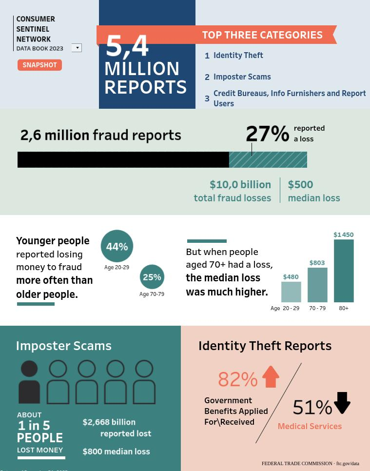

# Attaques de Social Engineering
<Badge type="tip" text="Rédigé le 18/04/2024" />

## Techniques d'ingénierie sociale

Les menaces numériques ne sont pas les seules préoccupations des professionnels de la sécurité de l'information. Parmi les risques les plus dangereux figurent ceux de l'ingénierie sociale, des tactiques qui **exploitent la psychologie humaine** pour obtenir des informations sensibles. Ces tactiques sont parmi les plus difficiles à contrer, car elles exploitent les failles de l'humain plutôt que des systèmes informatiques.

### Autorité

Les expériences psychologiques, telles que celle menée par [Stanley Milgram](https://fr.wikipedia.org/wiki/Exp%C3%A9rience_de_Milgram), ont démontré que les individus ont tendance à **suivre les ordres d'une autorité perçue**. Cette confiance accordée à l'autorité peut être exploitée par les ingénieurs sociaux qui affichent des signes extérieurs d'autorité pour manipuler les autres.

### Intimidation

L'intimidation consiste à **contraindre les individus à agir par la peur et les menaces**. Par exemple, un ingénieur social pourrait se faire passer pour un assistant administratif et exiger de manière agressive qu'un mot de passe soit réinitialisé pour un compte exécutif, utilisant la peur de l'irritation du cadre pour obtenir sa demande.

### Consensus

Lorsque les individus ne savent pas comment réagir dans une situation, ils ont tendance à **suivre le comportement des autres**, adoptant ainsi une mentalité de troupeau. Cette pression sociale peut être utilisée par les ingénieurs sociaux pour **inciter les individus à agir de manière contraire à leur jugement**.

### Rareté

Les tactiques de rareté induisent les individus à agir rapidement en leur faisant croire qu'ils **risquent de manquer une opportunité**. Les ingénieurs sociaux peuvent simuler la rareté pour inciter les individus à prendre des décisions précipitées, comme installer un équipement dans un bureau sous prétexte d'une opportunité unique.

### Urgence

En créant une situation où le temps est compté, les ingénieurs sociaux peuvent forcer les individus à agir rapidement. Par exemple, un pirate informatique prétendant être un technicien réseau peut **exiger un accès immédiat à un local réseau** en affirmant qu'un dysfonctionnement imminent menacerait de provoquer une panne.

### Familiarité

Les individus ont **tendance à dire oui à ceux qu'ils apprécient**. Les ingénieurs sociaux utilisent la flatterie, les compliments et les relations fictives pour gagner la confiance de leur cible et les inciter à coopérer.

### S'en défendre

La meilleure défense contre l'ingénierie sociale est l'éducation des utilisateurs. Tous les membres de l'organisation doivent être **sensibilisés aux tactiques utilisées par les ingénieurs sociaux** et être **vigilants contre les tentatives de manipulation**. En reconnaissant et en comprenant ces tactiques, les individus peuvent mieux se protéger contre les menaces humaines qui peuvent compromettre la sécurité de l'organisation.

## Utilisation des hoax et de la tromperie

*Hoax : information fausse, périmée ou invérifiable propagée par internet.*

Le spam et de nombreux autres types d'arnaques peuvent être utilisés comme armes dans les attaques d'ingénierie sociale à travers des attaques d'usurpation d'identité. Le spam, également connu sous le nom de courrier électronique commercial non sollicité ou UCE, consiste en des messages non désirés envoyés à des fins de marketing et de fraude à l'identité. La plupart des spams sont illégaux en vertu de la loi [CAN-SPAM](https://www.cloudflare.com/fr-fr/learning/privacy/what-is-the-can-spam-act/#:~:text=Le%20CAN%2DSPAM%20Act%20est,organisations%20%C3%A0%20but%20non%20lucratif.), mais il est difficile de poursuivre les contrevenants car il est souvent difficile de les identifier.

### Phishing

Le phishing consiste à envoyer des messages **dans le but explicite de recueillir des informations confidentielles**. Il vise à tromper les utilisateurs pour qu'ils révèlent des mots de passe de comptes sensibles, tels que des comptes bancaires ou les systèmes de leur employeur. Les attaques de phishing sont souvent utilisées pendant la phase de reconnaissance d'une attaque plus large.

### Phishing ciblé

Les attaques de phishing ciblé, également appelées spear phishing, visent spécifiquement un très petit public, tel que les employés d'une petite entreprise. Ils **utilisent le jargon de cette entreprise** et éventuellement **les noms des dirigeants de l'entreprise** pour donner un **air de légitimité** au message. Avec cette autorité ajoutée, les attaques de phishing ciblé ont des taux de réussite plus élevés que les attaques de phishing générique.

### Whaling

Le whaling est une sous-catégorie du spear phishing qui **vise spécifiquement les cadres supérieurs** pour obtenir leur argent, leur pouvoir, leur influence ou leur autorité. Une tactique de whaling courante consiste à envoyer de faux documents judiciaires aux dirigeants d'entreprise, affirmant que leur organisation est poursuivie et qu'ils doivent cliquer sur un lien pour lire les documents légaux.

### Pharming

Les attaques de pharming commencent par des messages de phishing mais vont plus loin pour les rendre efficaces. L'attaquant **met en place un faux site Web** qui ressemble au site légitime et envoie aux victimes un lien vers ce faux site. Ils peuvent utiliser le typosquatting pour rendre l'URL très similaire au vrai site, puis copier l'apparence du site déjà familier aux utilisateurs.

### Vishing

Les attaques de vishing, ou phishing vocal, consistent à appeler des personnes en utilisant des tactiques d'ingénierie sociale pour les tromper et obtenir des informations sensibles. Les attaquants peuvent se faire passer pour un agent du service d'assistance et demander le mot de passe d'un utilisateur pour corriger un problème de compte.

### Smishing

Les attaques de smishing utilisent les services de messagerie instantanée pour envoyer du spam et des messages de phishing. Ces attaques ont commencé via AOL instant messenger il y a des années, mais se sont étendues à SMS et iMessage ces dernières années. Elles utilisent souvent une attaque appelée **spoofing pour falsifier l'identité de l'expéditeur**.

### Conclusion

Les attaquants sont persistants et ingénieux dans leurs tentatives d'infiltration des entreprises par le biais de messages frauduleux. Alors que bon nombre de leurs tentatives peuvent sembler simplistes, d'autres sont sophistiquées. L'éducation et la sensibilisation sont les outils les plus efficaces pour se défendre contre les attaques d'ingénierie sociale, car une seule victime peut suffire à la réussite d'une attaque de phishing.

## Les crimes d'identité

Les crimes d'identité sont insidieux. Au lieu de cibler de grandes entreprises, les attaquants ciblent les individus, tentant de voler leurs identités pour ouvrir des comptes frauduleux, voler des fonds ou se livrer à d'autres activités illégales. Les statistiques autour des crimes d'identité sont alarmantes, comme le montre ce tableau de bord public du réseau [Consumer Sentinel de la Federal Trade Commission](https://public.tableau.com/app/profile/federal.trade.commission/viz/ConsumerSentinel/Infographic), qui suit les fraudes, le vol d'identité et les crimes connexes :

*Sources : [Consumer Sentinel de la Federal Trade Commission](https://public.tableau.com/app/profile/federal.trade.commission/viz/ConsumerSentinel/Infographic)*

### Pretexting

Le pretexting est l'une des principales techniques utilisées dans la fraude d'identité. Dans une attaque de pretexting, l'attaquant contacte une entreprise tierce, se faisant passer pour le consommateur, et tente de prendre accès au compte de ce consommateur. Le pretexting est souvent la première étape d'un crime d'identité plus large.

### Exemple d'attaque

Imaginons qu'un attaquant, Andy en colère, cible un consommateur, Norm naïf. Andy souhaite accéder au compte bancaire de Norm. Il sait qu'il serait difficile de deviner directement le mot de passe de Norm, mais après avoir fait des recherches, il découvre que la banque de Norm dispose d'un mécanisme de réinitialisation de mot de passe sur son site web. Utiliser cette option de réinitialisation nécessite de saisir un code envoyé par SMS à un numéro de téléphone préenregistré.

Andy ne peut pas encore utiliser ce mécanisme de réinitialisation car il n'a pas accès au téléphone de Norm. Alors Andy appelle le fournisseur de téléphone de Norm et essaie de les convaincre de transférer le numéro de Norm vers un nouveau téléphone. Le fournisseur pose à Andy une série de questions de sécurité auxquelles Andy ne peut pas répondre. Il ne connaît pas le nom de l'animal de compagnie de Norm ni son lieu de vacances préféré, alors Andy raccroche simplement.

Mais ensuite, il fait des recherches sur les réseaux sociaux. Les comptes Facebook et Twitter de Norm ont des publications publiques, et Andy découvre en les lisant que Norm passe chaque année ses vacances dans les montagnes des Adirondacks de New York et qu'il emmène son chien Jake avec lui lors de ces voyages.

Armé de ces informations, Andy rappelle la compagnie de téléphone et prétend être Norm. Il répond aux questions de sécurité en utilisant les informations glanées sur les pages de médias sociaux de Norm et réussit les tests de la société. Andy dit alors à la société qu'il a acheté un nouveau téléphone et fournit les informations nécessaires pour transférer le numéro de Norm vers ce téléphone, qu'Andy possède.

Dès que le numéro est transféré, Andy retourne sur la page web de la banque et utilise le lien "mot de passe oublié". La banque envoie un code à Norm sur son numéro de téléphone enregistré, qui est maintenant connecté à un téléphone qu'Andy possède. Andy utilise ce code pour réinitialiser le mot de passe bancaire de Norm, et maintenant Andy a accès au compte bancaire de Norm.

### Défense contre le pretexting

Le pretexting est difficile à défendre car il nécessite la sécurité à chaque étape du processus. Si vous travaillez pour une organisation qui traite avec des clients, examinez vos processus d'authentification et pensez comme un attaquant. Y a-t-il des étapes de votre processus vulnérables au pretexting ?

1. Sensibilisation des employés : former régulièrement les employés sur les techniques de pretexting et les signes d'alerte associés aux tentatives d'usurpation d'identité. Les employés doivent être encouragés à signaler toute activité suspecte ou tout contact inattendu avec des tiers.
2. Renforcement des procédures d'authentification : examiner et renforcer les procédures d'authentification pour les demandes de réinitialisation de mot de passe, les transferts de compte ou toute autre activité sensible. Cela peut inclure l'utilisation de questions de sécurité personnalisées et de méthodes d'authentification à plusieurs facteurs.
3. Vérification des informations : avant de fournir des informations sensibles ou d'accéder à des demandes inhabituelles, les employés doivent vérifier l'identité et l'autorisation des personnes demandant l'accès. Cela peut impliquer de contacter directement le client ou l'utilisateur concerné pour confirmer la légitimité de la demande.
4. Surveillance des activités suspectes : mettre en place des systèmes de surveillance et d'audit pour détecter les comportements anormaux ou les tentatives de pretexting. Cela peut inclure la surveillance des journaux d'activité, des tentatives de connexion infructueuses ou des schémas de communication inhabituels.
5. Protection des données personnelles : limiter la quantité d'informations personnelles disponibles publiquement sur les plateformes de médias sociaux ou les sites Web de l'entreprise. Encourager les employés à examiner et à modifier leurs paramètres de confidentialité pour limiter l'accès aux informations sensibles.
6. Gestion des autorisations : mettre en œuvre des politiques strictes de gestion des autorisations pour les comptes utilisateur et les systèmes internes. Limiter l'accès aux données sensibles uniquement aux utilisateurs autorisés et mettre à jour régulièrement les droits d'accès en fonction des besoins.

En adoptant une approche proactive et en investissant dans la sensibilisation des employés et des mesures de sécurité robustes, les organisations peuvent réduire leur vulnérabilité aux attaques de pretexting et protéger efficacement leurs données et leurs actifs contre les usurpateurs d'identité.

## Les attaques Watering Hole

Les attaques Watering Hole sont des tactiques rusées utilisées pour attirer des utilisateurs peu méfiants et infecter leurs systèmes avec des logiciels malveillants.

### Nature des attaques Watering Hole

Dans la nature, un point d'eau est un lieu de rassemblement pour les animaux, notamment dans les climats arides. Bien que vital pour leur survie, ces points d'eau présentent également des risques. Les maladies peuvent facilement se propager parmi les animaux qui y boivent, et les prédateurs peuvent y guetter leurs proies.

Dans le monde numérique, les sites Web agissent comme des points d'eau où les utilisateurs se rendent en toute confiance. C'est l'équivalent numérique d'approcher quelqu'un en qui vous avez confiance. Les navigateurs Web, ainsi que leurs extensions, sont des points vulnérables fréquemment exploités dans les attaques.

### Méthodes d'attaque
Les attaques Watering Hole sont un type d'attaque côté client, exploitant des vulnérabilités dans le navigateur des utilisateurs plutôt que sur le serveur. Ces attaques génèrent souvent des avertissements contextuels, auxquels les utilisateurs ont tendance à répondre par une validation rapide.

### Risques et conséquences
Les attaquants utilisent des sites Web légitimes, car ils sont moins susceptibles d'être bloqués par les filtres de sécurité. Ils peuvent ainsi infecter les systèmes des utilisateurs qui visitent ces sites, sans que ces derniers se doutent de quoi que ce soit.

Pour se prémunir contre les attaques Watering Hole, il est crucial de maintenir à jour les correctifs de sécurité. Les propriétaires de sites Web doivent également être vigilants pour éviter que leur plateforme ne soit compromise à leur insu.

Les attaques Watering Hole sont une menace sérieuse, mais une vigilance constante et une mise à jour régulière des systèmes peuvent contribuer à réduire leur impact et à protéger les utilisateurs contre les logiciels malveillants.

## Les attaques de génie social physique

Les ingénieurs sociaux réalisent souvent leurs attaques par des moyens électroniques, mais parfois ils **passent à l'action dans le monde réel** et se livrent à des attaques physiques. Trois méthodes courantes sont le "*shoulder surfing*" (espionnage par-dessus l'épaule), le "*dumpster diving*" (plongée dans les poubelles) et le "*tailgating*" (suivi rapproché).

1. ***Shoulder Surfing*** :

    Le "shoulder surfing" est assez simple : l'attaquant regarde par-dessus l'épaule de la victime pendant qu'elle effectue une tâche sensible sur son ordinateur. Cette attaque peut être aussi discrète que quelqu'un regardant l'écran d'un ordinateur ouvert dans un avion ou un train. Les meilleures solutions sont la vigilance quant à son environnement et l'utilisation de filtres de confidentialité sur les écrans d'ordinateur.

2. ***Dumpster Diving*** :

    Les organisations jettent toutes sortes d'informations sensibles, et les ingénieurs sociaux adorent fouiller dans les poubelles à la recherche de documents contenant ces informations. La meilleure défense contre le "dumpster diving" est de détruire les documents sensibles.

3. ***Tailgating*** :

    Il est naturel d'aider les gens et de tenir la porte ouverte pour quelqu'un qui suit derrière vous est un simple acte de courtoisie, surtout s'ils ont les bras chargés. Les attaques de "tailgating" exploitent cette tendance humaine en permettant aux ingénieurs sociaux de suivre quelqu'un dans une zone sécurisée sans utiliser leur badge. La meilleure défense est l'éducation et la sensibilisation des employés.

Les attaques de génie social physique peuvent sembler simples, mais elles peuvent être efficaces et dangereuses pour les organisations. Heureusement, les solutions sont simples également. En utilisant des filtres de confidentialité, des destructeurs de documents et en sensibilisant les employés, les attaques de génie social physique peuvent être facilement contrecarrées.

 

::: info Sources
Ce cours s'inspire du cours sur Linkedin eLearning de ***Mike CHAPPLE*** :

https://www.linkedin.com/learning/comptia-security-plus-sy0-601-cert-prep-1-threats-attacks-and-vulnerabilities?contextUrn=urn%3Ali%3AlyndaLearningPath%3A57bdd64992015ae4c0cb990e&dApp=36524473&leis=LAA&u=98048682
:::