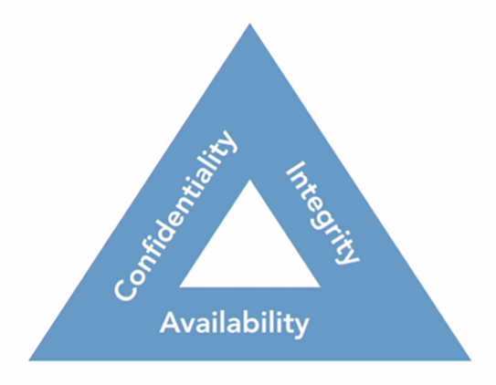

# Les types de vulnérabilité
<Badge type="tip" text="Rédigé le 01/05/2024" />

## L'impact des vulnérabilités

L'impact des vulnérabilités dans l'infrastructure, les systèmes et les applications d'une organisation peut être considérable, car elles exposent ladite organisation au risque de violation de sécurité. Avant d'entrer dans les détails des vulnérabilités, il est essentiel de comprendre les objectifs généraux de la cybersécurité et les différents types de risques impliqués.

1. Confidentialité : Cela garantit que seules les personnes autorisées ont accès aux informations et aux ressources. Les violations de la confidentialité impliquent la divulgation, où des informations sensibles sont mises à la disposition de personnes non autorisées ou du public sans consentement. Les violations de la confidentialité peuvent conduire à des violations de données et à l'exfiltration de données.
2. Intégrité : Protéger l'intégrité des informations signifie empêcher les modifications non autorisées. Cela pourrait impliquer des altérations intentionnelles par des pirates ou des perturbations accidentelles affectant les données stockées. Maintenir l'intégrité est crucial pour assurer la fiabilité et l'exactitude des informations.
3. Disponibilité : Les personnes autorisées doivent avoir accès aux informations lorsqu'elles en ont besoin. Les attaques visant à compromettre la disponibilité, telles que les attaques par déni de service, cherchent à submerger les systèmes ou à les faire planter, privant ainsi les utilisateurs légitimes des ressources nécessaires.

L'impact d'un incident de sécurité peut être catégorisé dans plusieurs domaines :

* Risque financier : Cela inclut les dommages monétaires pour l'organisation, couvrant des coûts tels que la restauration d'équipements et de données, les enquêtes sur les incidents et les notifications aux personnes concernées. Il englobe également les pertes potentielles dues au vol d'identité.
* Risque de réputation : La mauvaise publicité d'une violation de sécurité peut entraîner la perte de bonne volonté parmi les parties prenantes, notamment les clients, les employés et les fournisseurs. Bien qu'il soit difficile à quantifier, les dommages à la réputation peuvent influencer les futures décisions commerciales et les relations.
* Risque stratégique : Une violation peut entraver la capacité de l'organisation à atteindre ses principaux objectifs. Par exemple, la perte de plans ou de données critiques peut entraîner des retards dans le développement de produits, des désavantages concurrentiels ou des opportunités manquées sur le marché.
* Risque opérationnel : Les violations peuvent perturber les fonctions quotidiennes, ralentir les processus commerciaux, retarder les commandes des clients ou nécessiter des solutions de contournement manuelles. Ces perturbations peuvent avoir un impact sur l'efficacité et la productivité.
* Risque de conformité : Enfreindre les exigences légales ou réglementaires en raison d'une violation de sécurité peut entraîner des sanctions, des amendes ou des conséquences juridiques. Les organisations doivent respecter les réglementations spécifiques à leur secteur, telles que la [HIPAA](http://rootdev.fr/cybersecurite/normes.html#hipaa) dans le domaine de la santé, pour protéger les informations sensibles et éviter les sanctions.

Lors de l'analyse des vulnérabilités, il est essentiel de prendre en compte ces différents types de risques et leurs impacts potentiels sur l'organisation. L'évaluation des vulnérabilités implique de comprendre comment les attaquants pourraient les exploiter et les conséquences d'une telle exploitation sur la confidentialité, l'intégrité, la disponibilité, les finances, la réputation, les objectifs stratégiques, l'efficacité opérationnelle et la conformité réglementaire.

## Gestion des vulnérabilités dans la chaîne d'approvisionnement

### Les fournisseurs externes

Dans chaque organisation informatique, la dépendance aux matériels, logiciels et services fournis par des fournisseurs externes est incontournable. Cette relation soulève des préoccupations majeures en matière de sécurité, car les administrateurs doivent comprendre comment les problèmes de sécurité dans la chaîne d'approvisionnement peuvent affecter leur organisation.

#### L'importance de la gestion des correctifs

L'un des aspects critiques que les professionnels de la sécurité doivent surveiller sont les annonces de fin de vie des produits faites par les fournisseurs. Ces annonces signalent la cessation éventuelle du support des produits, ce qui rend difficile, voire impossible, de les exécuter de manière sécurisée.

#### Terminologie et processus de fin de support

Les fournisseurs utilisent différentes expressions pour décrire la fin du support de leurs produits. Comprendre ces termes est essentiel pour évaluer l'impact sur l'organisation. Des étapes telles que la fin de la vente du produit et la fin du support sont cruciales à surveiller.
1. ***Fin de vente (End-of-Sale)*** : Cette étape marque la fin de la commercialisation d'un produit par le fabricant. Cela signifie que le produit n'est plus disponible à l'achat, bien que le support pour les clients existants puisse encore être assuré pendant une période définie.
2. ***Fin de support (End-of-Support)*** : À ce stade, le fabricant cesse de fournir des correctifs de sécurité, des mises à jour logicielles et du support technique pour le produit concerné. Cela signifie que les utilisateurs ne recevront plus d'assistance en cas de problèmes ou de vulnérabilités, et que le produit devient essentiellement obsolète en termes de support.
3. ***Fin de vie (End-of-Life)*** : Lorsque le produit atteint la fin de vie, cela signifie que le fabricant ne fournit plus aucun type de support, même pour les problèmes critiques de sécurité. À ce stade, le produit est considéré comme obsolète et les utilisateurs sont encouragés à migrer vers des solutions alternatives.

Le processus de fin de support est important car il impacte la sécurité et la stabilité des systèmes informatiques. Lorsqu'un produit n'est plus pris en charge, les utilisateurs courent le risque d'exposer leur système à des vulnérabilités de sécurité non corrigées, ce qui peut entraîner des conséquences graves telles que des violations de données ou des attaques informatiques. Il est donc crucial pour les organisations de planifier et de gérer la transition vers de nouveaux produits ou solutions avant que le support ne prenne fin pour éviter tout impact négatif sur leurs opérations.

#### Détection des risques de manque de support

Outre les processus formels de fin de support, les fournisseurs peuvent également manquer de fournir un support adéquat pour leurs produits. Ces manques de support informels peuvent être aussi dangereux que l'utilisation de produits obsolètes.

#### Implantations cachées et vulnérabilités

Les fournisseurs peuvent intégrer des systèmes embarqués invisibles aux utilisateurs finaux. Les vulnérabilités dans ces systèmes peuvent compromettre la sécurité des produits finaux et sont difficiles à détecter.

#### Responsabilités et confiance dans les services cloud

Lorsque l'organisation dépend des fournisseurs pour les services cloud, la responsabilité de gérer les risques passe au fournisseur. Il est crucial d'avoir confiance dans la capacité du fournisseur à respecter cette responsabilité à long terme.

#### Stratégies d'atténuation des risques

Pour atténuer les risques associés à la perte d'accès aux données fournies par un fournisseur, des stratégies telles que la conservation de sauvegardes dans des environnements d'exploitation indépendants peuvent être mises en place.

## Vulnérabilités de configuration

### Impact des erreurs de configuration

Les vulnérabilités de configuration peuvent également avoir des impacts sérieux sur la sécurité des entreprises. Quelques erreurs simples dans la configuration d'un système peuvent entraîner des vulnérabilités de sécurité très significatives qu'un attaquant peut exploiter pour accéder à des informations sensibles ou à des systèmes.

### Utilisation de configurations par défaut

Une erreur courante commise par le personnel informatique est d'utiliser un système directement issu du fabricant et de l'installer sur leur réseau sans modifier la configuration par défaut. Cela est particulièrement dangereux dans le cas de dispositifs contenant des ordinateurs intégrés, mais qui ne sont pas couramment gérés dans le cadre de l'infrastructure informatique de l'entreprise. Il s'agit notamment des photocopieurs, des contrôleurs de bâtiment, de l'équipement de recherche et d'autres dispositifs fournis directement par les fournisseurs.

### Protocoles cryptographiques

Les protocoles cryptographiques constituent une autre source courante de configurations incorrectes. Si un administrateur configure involontairement des suites de chiffrement faibles ou des implémentations de protocoles faibles sur un dispositif, toutes les communications vers et depuis ce dispositif peuvent être sujettes à l'écoute et à la manipulation. Cette erreur peut être aussi simple que de cocher la mauvaise case.

### Gestion des correctifs

La gestion des correctifs garantit que les systèmes et les applications reçoivent toutes les mises à jour de sécurité fournies par les fabricants pour corriger les vulnérabilités connues. N'oubliez pas de patcher les applications et le micrologiciel des dispositifs utilisés dans votre environnement, en plus des patchs du système d'exploitation.

### Gestion des comptes

Enfin, la gestion des comptes est une tâche incroyablement importante pour les professionnels de la sécurité. Si un compte est configuré de manière incorrecte avec des autorisations excessives, l'utilisateur de ce compte peut utiliser ces privilèges supplémentaires pour causer des dommages. Souvenez-vous du principe du moindre privilège : un utilisateur ne devrait avoir que le minimum nécessaire de permissions requises pour accomplir sa fonction.

## Vulnérabilités architecturales

### Conception inappropriée de systèmes complexes

Les vulnérabilités architecturales surviennent lorsqu'un système complexe est mal conçu. Ces vulnérabilités peuvent créer des défauts fondamentaux dans un système qui sont très difficiles à remédier.

### Rôle des architectes informatiques

L'architecture informatique est un ensemble de pratiques et de processus bien définis utilisés pour construire des systèmes techniques complexes. Les architectes informatiques fonctionnent dans un rôle similaire à celui d'un architecte traditionnel, mais au lieu de concevoir des bâtiments complexes, ils assemblent différentes technologies de manière à répondre aux besoins commerciaux, la sécurité étant l'un des plus importants de ces besoins.

### Intégration précoce des exigences en matière de sécurité

La clé pour éviter les faiblesses de sécurité dans les architectures et les conceptions de systèmes est d'incorporer tôt des exigences en matière de sécurité, en les faisant figurer comme critères de conception, plutôt que comme des préoccupations après coup.

### Considération des processus métier et des utilisateurs

Lorsque vous envisagez la sécurité d'un système, ne vous contentez pas d'examiner l'architecture technique et la conception. Vous devez également tenir compte des processus métier et des personnes qui entourent la conception. Des utilisateurs non formés et des processus métier non sécurisés peuvent avoir un impact significatif sur la sécurité.

### Étalement du système et gestion du cycle de vie

Dans le monde d'aujourd'hui, presque toutes les organisations ont des milliers de systèmes et d'appareils connectés à leurs réseaux, et ce nombre augmente chaque jour. Cela entraîne un phénomène connu sous le nom d'étalement du système, où les appareils sont souvent connectés au réseau régulièrement, mais ils ne sont pas gérés selon un cycle de vie complet. Cela peut entraîner de graves problèmes de sécurité, en particulier lorsque ces actifs ne sont pas documentés.

### Évaluation des processus architecturaux

Les professionnels de la sécurité doivent évaluer tous les processus architecturaux de leur organisation pour s'assurer qu'ils incluent des contrôles de sécurité appropriés.

 

::: info Sources
Ce cours s'inspire du cours sur Linkedin eLearning de ***Mike CHAPPLE*** :

https://www.linkedin.com/learning/comptia-security-plus-sy0-601-cert-prep-1-threats-attacks-and-vulnerabilities?contextUrn=urn%3Ali%3AlyndaLearningPath%3A57bdd64992015ae4c0cb990e&dApp=36524473&leis=LAA&u=98048682
:::