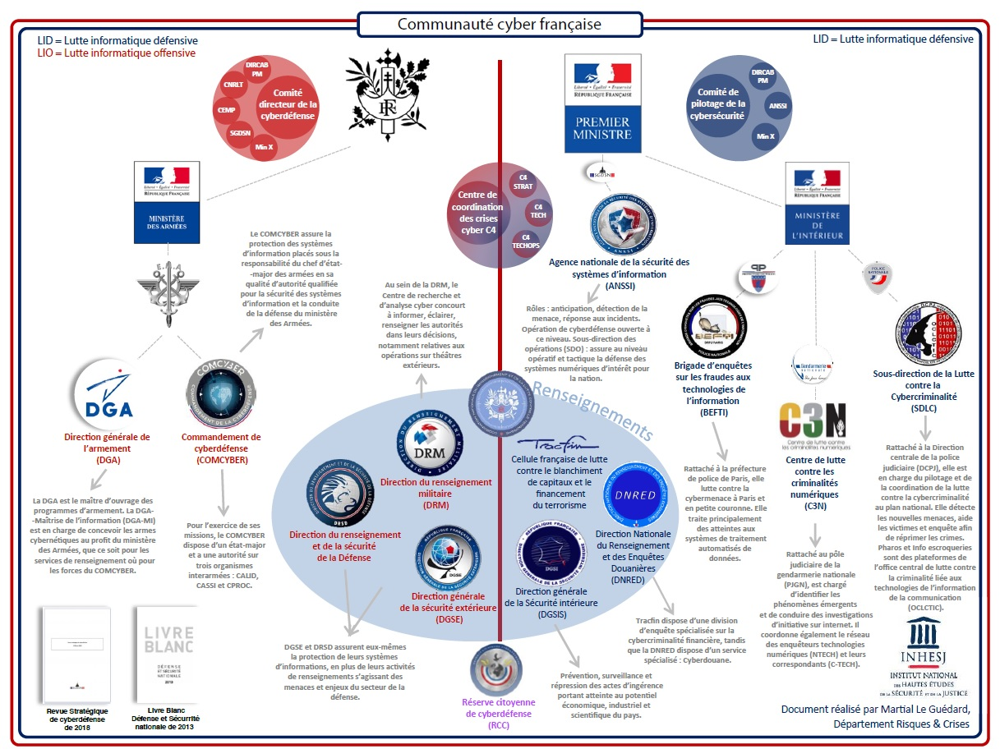

# Cyberdéfense : La cybersécurité en france
<ESDInfo />

## Introduction aux menaces

Ces dernières années, les entreprises et les institutions ont été victimes de nombreux types d'attaques plus ou moins complexes à détecter et à arrêter. Même si les approches peuvent rester similaires, il existe un nombre important de variantes permettant ces attaques.

**94%** des malwares ont été délivrés par email, et **34%** des violations de données impliquent des acteurs internes, selon Verizon.

Certaines secteurs d'activité peuvent être plus impactés que d'autres en fonction des informations détenues et échangées, par exemple :
* **43%** des victimes sont des petites organisations
* Les pertes estimées en 2019 pour le secteur des soins et de la santé sont de $25 milliards
* Les attaques sur les chaînes d'approvisionnement ont augmenté de **78%** en 2019
* L'industrie avec le plus grand nombre d'attaques par ransomware est le secteur de la santé

Selon certaines périodes et événements, certains secteurs sont plus ciblés que d'autres par les attaquants, notamment :
* Fin d'année 2020, les institutions de justice
* Fin 2019, début 2020, le secteur de la santé, notamment durant la pandémie de COVID-19.

En fonction des différents objectifs visés par les attaquants et de leurs profils, un certain nombre de secteurs d'activités ressortent comme étant principalement visés de par :
* Le contenu de leurs systèmes d'information
* Le positionnement sur le marché national ou international
* L'implication géopolitique

Une autre composante entre en jeu qui participe fortement au développement de nouvelles attaques est l'évolution des SI, notamment :
* Le Cloud
* L'intégration de *IoT*
* L'utilisation commune de terminaux mobiles au sein des organisations
* L'expansion des réseaux sociaux
* La mobilité et l'expérience utilisateur
* L'externalisation des ressources
* etc..

### Les profils des attaquants

Le croisement de l'ensemble de ces informations permet d'identifier et comprendre les différents profils d'attaquant, afin de mettre en place les mécanismes de défense nécessaires au sein des différentes organisations :

|Nom|Description|
|-|-|
|Black Hat|Individus détenant de grandes compétences informatique qu'ils emploient à des fins malveillantes ou destructives|
|Cyber Terroristes|Individus détenant de grandes compétences en hacking, ayant des motivations politiques ou religieuses, inspirant la peur|
|Script Kiddies|Individus ne disposant pas de vraies connaissances en hacking mais parvenant à nuire à des systèmes via des outils/scripts|
|Etatique|Individus financés par des gouvernements dans le but de voler des informations secrètes ou nuire à d'autres gouvernements|
|Hacktivistes|Individus prônant des idéaux politiques et utilisant des techniques de hacking pour nuire ou diffuser un message|

#### Etats / nations

Cette catégorie est la plus complexe de par les moyens financiers, les capacités de ciblage, ainsiq ue les compétences techniques mises à leur disposition. Les moitivations principales de ce type d'attaquant sont principalement le **cyberespionnage**, la **destabilisation politique** et le **sabotage**.

#### Hacktivistes

Cette catégorie est basée sur des convictions fortes sans forcément avoir de moyens financiers et techniques importants, le ciblage est l'axe majeur. Les motivations principales sont **idéologiques**, la **dénonciation de faits**, ou encore l'**atteinte à l'image**.

#### Cybercriminels

Les cybercriminels peuvent être appuyés par différentes entités, avec des moyens financiers importants ainsi que de fortes connaissances et compétences techniques, le **gain financier** est l'objectif majeur de cette catégorie.

#### Script kiddies

Néophytes sans principales compétences en hacking essayant d'infiltrer des systèmes en se servant de programme efficaces qu'ils ne comprennent pas forcément. Cette catégorie n'ayant pas d'objectifs précis hormis les **défis**, l'**amusement** ou les **tests**, ce qui crée sa dangerosité.

#### Terroristes

Cette dernière catégorie peut avoir des connaissances et moyens financiers plus ou moins importants. La différence majeure avec les différents autres types d'attaquants est l'objectif principal de ces groupes, qui se base notamment sur la **destruction** ou le **prosélytisme**.

#### Etats des lieux

Au vu des différents profils, certains groupes d'attaquants ont ces dernières années été mis en lumière "grâce" aux différents impacts qui ont pu être dégagés de leurs attaques. La difficulté principale des différentes équipes de défense est le repérage et la mise en place de mécanismes de protection adaptés aux attaques des différents profils précédemment cités.

## Vision des dirigeant vis-à-vis de la cybersécurité

Les notions de cybersécurité ont été pendant longtemps associées uniquement à l'aspect informatique. Mais depuis plusieurs années, que cela soit mis en avant par le biais d'attaques sur des grands groupes, des secteurs d'activités spécifiquement ciblés, ou par divers médias, la cybersécurité a pris une place forte dans les réflexions stratégiques des organisations.

Cependant et malgré cela, beaucoup d'entre elles n'ont pas encore mis en place ce genre de réflexion au sein de leurs processus.

Actuellement on parle plutôt de SSI (sécurité des systèmes d'information). Les termes de cybersécurité et sécurité de l'information ont été dissociés pour différencier l'aspect technique et organisationnel.

Parmi ces différents sujets, plusieurs reviennent de manière assez constante :

**1. Méconnaissance, non maîtrise du sujet, incompréhension**
   * Les notions associées à la cybersécurité peuvent être très vastes et sont liées à des sujets techniques dont les dirigeants d'organisations n'ont aucune connaissance.
   * La non compréhension de l'impact sur les activités générées par une cyberattaque peut deveir très préjudiciable pour une organisation.

**2. Fonctions existantes déjà occupées.**
   * Plusieurs dirigeants ayant embauchés des profils comme des administrateurs systèmes et réseaux, des responsables web, des responsables bases de données, partent du principe que l'ensemble des éléments qui seront créés et mis en place par les équipes seront sécurisés. Cela n'est malheuresement pas le cas et les connaissances ne sont souvent pas assez poussées sur les différents sujets de la cybersécurité en commençant par la notion de *Secure by Design*.

**3. Difficulté d'évolution de l'organisation globale.**
   * Comme vu précédemment, l'organisation intégrant la cybersécurité uniquement sur un plan technique aura des difficultés à comprendre les différents projets comme les notions d'analyse de risques ou d'intégration organisationnelle de la cybersécurité au sein de leurs processus métier.
   * La cybersécurité doit avant tout s'intégrer dans la stratégie et la vision de l'organisation vis à vis de son évolution.

**4. Incompréhension des préjudices réels et impacts business**
   * De nombreux dirigeants d'organisations, en raison de différents facteurs, ne font pas systématiquement le lien entre les problèmes de cybersécurité et les impacts business qui pourraient en découler.
   * La définition de cybersécurité est pour certains d'entre eux liée au côté purement informatique de l'organisation et non au business.
   
**5. Penser que cela n'arrive qu'aux autres**
   * C'est une fâcheuse tendance que certains dirigeants peuvent avoir : "*La pluie tombe toujours ailleurs*".
   * Ils partent du principe que leur organisation, de par ce qu'elles produisent, n'a pas vocation à intéresser les cybercriminels. 
   * C'est une erreur stratégique assez courante, qui peut, en cas d'attaque, provoquer un dysfonctionnement important du fait de la non pro-activité de la cybersécurité.
   
**6. Structure organisationnelle et hiérarchique SI & SSI**
   * Dabs de nombreuses structures, la sécurité de l'information peut être associée au service SI directement sous la direction du DSI de l'organisation. Cela produit alors un problème de "juge et partie", le budget de la sécurité pouvant alors être associé à ce service, la priorisation des actions à mener sur l'ensemble des projets pourrait se voir axée principalement sur le SI et non la sécurité.
   * La sécurité de l'information, pour un bon fonctionnement indépendant et efficient, doit avoir un lien direct avec la direction générale de l'organisation.

Le business des différents organisations étant l'élément clé pour les dirigeants, il convient de mettre en oeuvre une approche de la cybersécurité en lien direct avec la stratégie de l'organisation, afin de créer un alignement et une compréhension claire et synthétique des différents risques encourus vis-à-vis des impacts qui pourraient en être dégagés.

## Les différents corps d'état liés à la cybersécurité française

Depuis plusieurs années, l'état français a renforcé l'ensemble de ses branches liées à la cybersécurité, de sorte à pouvoir intervenir et répondre aux différentes problématiques (lutte informatique défensive / lutte informatique offensive).

### COMCYBER (Commandement de la cyberdéfense)

Le COMCYBER est affilié au *Ministère des Armées*, il assure la protection des SI sous la responsabilité des armées. Il définit les moyens RH, techniques et organisationnels nécessaires à la surveillance du réseau des armées, assure la lutte défensive mais également offensive. Il y avait en 2018 +1000 cybercombattants, avec un objectif de 4400 visé pour 2025.