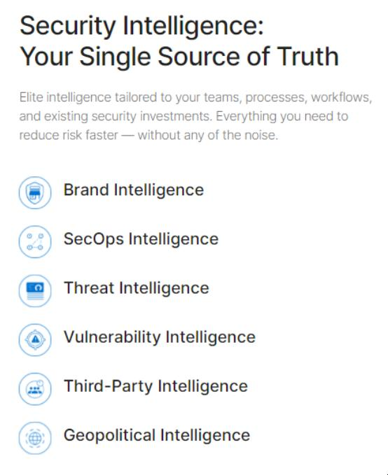

# Les intérêts du Dark Web

Le Dark Web présente également des avantages, en particulier dans des contextes légitimes.

### Collecte de renseignements sur les menaces

Le Dark Web offre un terrain fertile pour la collecte de renseignements sur les menaces. Les chercheurs en sécurité et les entreprises peuvent surveiller les activités des cybercriminels, recueillir des informations sur les logiciels malveillants, les vulnérabilités et les attaques planifiées, ce qui leur permet de prendre des **mesures préventives pour renforcer leur sécurité informatique**.

### Opérations de maintien de l'ordre

Les forces de l'ordre utilisent le Dark Web pour infiltrer des sites, des forums et des places de marché où se déroulent des activités criminelles. Ils peuvent ainsi recueillir des preuves et obtenir des renseignements cruciaux pour mener des enquêtes et poursuivre en justice les personnes impliquées dans des activités illégales.

### Liberté d'expression

Dans les pays où la censure est répandue et où la liberté d'expression est limitée, le Dark Web offre un moyen pour les citoyens de contourner les restrictions et de communiquer librement sans craindre la surveillance ou la répression gouvernementale.

### Confidentialité 

Bien que le Dark Web ne garantisse pas un anonymat absolu, il offre une plus grande confidentialité que les navigateurs traditionnels. En utilisant des outils comme Tor, les utilisateurs peuvent masquer leur adresse IP et protéger leur vie privée en ligne, ce qui est particulièrement important dans les régions où la surveillance gouvernementale est intense ou dans les cas où la vie privée est cruciale, comme dans les communications sensibles ou les activités militantes.

En résumé, le Dark Web présente des avantages significatifs pour la collecte de renseignements, les opérations de maintien de l'ordre, la liberté d'expression et la confidentialité en ligne, bien que son utilisation puisse également être associée à des activités illicites et à des risques potentiels.

## Activités légales

Il est essentiel de comprendre que les entreprises ou individus qui collectent et vendent des informations sur les menaces provenant du Dark Web doivent agir dans le cadre de la loi et respecter les réglementations en vigueur dans leur juridiction. 

1. Collecte passive d'informations

    Les entreprises peuvent collecter passivement des informations sur les menaces à partir de sources du Dark Web accessibles au public. Cela peut inclure la surveillance silencieuse des activités sur le Dark Web et l'enregistrement de ces informations à des fins d'analyse ou de partage ultérieur avec des clients.

2. Accès légal aux forums privés

    Dans la mesure où les individus peuvent accéder de manière légitime à un forum privé du Dark Web, ils sont autorisés à extraire le contenu de ce forum pour analyse ou partage ultérieur. Cela peut impliquer l'utilisation de faux personnages en ligne ou l'achat d'accès au forum.

3. Poser de questions à des criminels pour recueillir des renseignements

    Les entreprises peuvent se faire passer pour des criminels sur les forums du Dark Web afin de recueillir des renseignements légitimes. Cependant, cela doit être bien documenté pour que les forces de l'ordre sachent qu'il s'agit d'une activité légitime et non d'une réelle activité criminelle.

## Utilisation par les forces de l'ordre

Chacun sait que les forces de l'ordre du monde entier surveillent le Dark Web, infiltrent des sites et des forums privés et collectent des renseignements et des preuves qui peuvent être utilisés pour poursuivre les criminels qui se cachent derrière l'anonymat apparent fourni par TOR et le darkweb.

### Opération Onymous
 
Silk Road était le marché du darkweb le plus important et le plus connu, principalement utilisé pour la vente de drogues illégales dans le monde entier. Le site a été lancé en février 2011, mais a été fermé en octobre 2013 par le FBI qui a arrêté le fondateur, Ross Ulbricht. En novembre, Silk Road 2.0 a été créé par l'équipe à l'origine du site Web d'origine. Un an plus tard, le site a de nouveau été fermé par les forces de l'ordre dans le cadre de « l'opération Onymous », une initiative conjointe du FBI et d'Europol visant à « résoudre les problèmes liés aux malwares, aux systèmes de botnets et aux marchés illicites ou darknets ». Les forces de police de 17 pays différents ont été impliquées, et on estime qu'environ 27 sites ont été saisis, empêchant ainsi la poursuite des activités illégales. **Plus de 1 000 000$ en bitcoins** ont été récupérés, ainsi que d'autres actifs tels que de l'or, de l'argent, de l'argent et des médicaments.

### Infiltration de Hansa Darkmarket
 
Hansa, à l'instar de Silk Road, était auparavant la plus grande place de marché du dark web en Europe, avec 3 600 revendeurs, 24 000 produits différents liés à la drogue et d'autres ventes diverses de faux documents. Comme on l'a observé avec Silk Road, lorsqu'une place de marché est simplement fermée par les forces de l'ordre, les clients et les commerçants se rendent simplement sur l'un des nombreux autres sites disponibles. Dans le cas de Hansa, en 2016, des agents néerlandais de l'Unité nationale de lutte contre la criminalité technologique des Pays-Bas ont décidé d'infiltrer et de prendre le contrôle d'un marché, plutôt que de le fermer complètement.

Les enquêteurs néerlandais ont découvert l'identité de deux administrateurs de Hansa et ont eu accès à leurs deux comptes. Ils contrôlaient désormais totalement le site. Au cours des mois suivants, les agents se sont efforcés de découvrir l'identité des vendeurs et des acheteurs en procédant à des attaques d'ingénierie sociale, incitant les utilisateurs à ouvrir des fichiers sur leur propre système, qui récupéraient des informations sur le système et la localisation géographique et modifiaient le code du site pour effectuer une reconnaissance passive et collecter des informations auprès des visiteurs du site.

Cette opération a été considérée comme « l'une des attaques les plus réussies de sa courte histoire contre le Dark Web : des millions de dollars de bitcoins ont été confisqués, plus d'une douzaine d'arrestations et le décompte des principaux trafiquants de drogue du site, et une vaste base de données d'informations sur les utilisateurs de Hansa qui, selon les autorités, devrait hanter tous ceux qui ont acheté ou vendu sur le site au cours de son dernier mois en ligne ».

## Utilisation par les sociétés de recherche de menaces

Les équipes de sécurité peuvent bénéficier des informations collectées sur le Dark Web :

Préparation aux cyberattaques

En surveillant les discussions sur le Dark Web, les équipes de sécurité peuvent anticiper les cyberattaques planifiées ou en cours, ce qui leur permet de renforcer leurs défenses et de réduire les dommages potentiels.

Identification des comptes compromis

Les informations sur les acteurs malveillants vendant des accès à des entreprises permettent aux équipes de sécurité d'identifier les comptes ou les systèmes compromis et de prendre des mesures pour les sécuriser.

Blocage proactif des malwares

En surveillant les offres de malwares et d'outils de piratage sur le Dark Web, les équipes de sécurité peuvent obtenir des indicateurs précieux pour bloquer de manière proactive les menaces potentielles, comme le hachage de fichiers.

Gestion des violations de données

Les informations sur les données piratées, telles que les informations d'identification, peuvent aider les entreprises à déterminer si leurs comptes ont été compromis et à prendre des mesures pour protéger leurs données et leurs utilisateurs.

En explorant le cas de [Recorded Future](https://www.recordedfuture.com), une entreprise réputée pour sa capacité à collecter et analyser des données du Clear Web et du Dark Web, on peut voir comment les services qu'ils offrent répondent aux besoins de sécurité des entreprises :

Recorded Future parvient à accéder à des forums privés et cachés sur le Dark Web pour extraire des informations exploitables pour leurs clients. Leur capacité à fournir des alertes précoces sur les cyberattaques imminentes, des renseignements stratégiques sur les ventes de malwares et d'outils de piratage, ainsi que des informations sur les données piratées, est précieuse pour les équipes de sécurité des entreprises.

## Activités illégales

Il est important de souligner qu'il existe des activités illégales que les entreprises ou individus ne doivent pas entreprendre, telles que :

1. Fournir du matériel illégal

Fournir du matériel illégal, comme des logiciels malveillants ou des informations personnelles sensibles, à des forums ou des sites privés du Dark Web est illégal et peut conduire à des poursuites judiciaires.

2. Accéder illégalement à des forums ou des sites privés

L'accès illégal à des forums ou des sites privés en utilisant des méthodes telles que le piratage de comptes, l'exploitation de vulnérabilités ou l'utilisation d'informations d'identification compromises est illégal et peut entraîner des conséquences graves.

3. Aider à commettre des crimes

Offrir des conseils, des informations, de l'argent ou d'autres ressources pour aider des individus ou des parties à commettre des crimes constitue une complicité et peut également être poursuivi par la loi.

En résumé, les entreprises qui opèrent dans le domaine de la sécurité informatique doivent agir dans le respect de la loi et des réglementations, en s'abstenant de participer à des activités illégales sur le Dark Web et en se concentrant sur des pratiques légales et éthiques pour collecter et utiliser des informations sur les menaces.

### Ses dangers

Il est crucial de souligner les dangers associés à l'exploration du Dark Web. Bien que cette partie d'Internet puisse susciter de la curiosité, il est important de comprendre les risques encourus.

* ***Contenu illégal*** : Le Dark Web abrite des places de marché illégales proposant une gamme de produits et services illicites, y compris des armes, de la drogue, du contenu explicite, et même des humains. La visite de ces sites peut être illégale et peut entraîner des conséquences légales graves.
* ***Responsabilité personnelle*** : En cliquant sur des liens vers du contenu explicite ou illégal, chacun assume la responsabilité de ses actions. Les individus pourraient être poursuivis en justice pour avoir visionné ou accédé à ce type de contenu.
* ***Risques pour la sécurité*** : Le Dark Web est également un foyer de logiciels malveillants et d'activités de hacking. En cliquant sur des liens malveillants, les utilisateurs pourraient exposer leur système à des infections par des logiciels malveillants, entraînant le vol ou le cryptage de leurs fichiers, voire même des attaques de chantage.

Il est essentiel de prendre ces avertissements au sérieux et de ne pas céder à la curiosité de naviguer sur le Dark Web. La sécurité personnelle et la conformité avec la loi doivent toujours être prioritaires.

::: danger NE SOYEZ PAS CURIEUX
* Si vous cliquez sur un mauvais lien et que votre navigateur charge du contenu explicite, tel que de la pédopornographie, vous en êtes responsable et vous pouvez être poursuivi pour l'avoir visionné.
* Si vous cliquez sur un mauvais lien, votre système peut être infecté par un logiciel malveillant capable de voler ou de chiffrer vos fichiers, ce qui peut mener à des attaques de deuxième phase, comme le chantage par exemple.
:::

 

::: info Sources
Ce cours s'inspire de Security Blue Team du cours "*Introduction to Dark Web Operations*" :
https://elearning.securityblue.team/home/courses/free-courses/introduction-to-dark-web-operations#description
:::