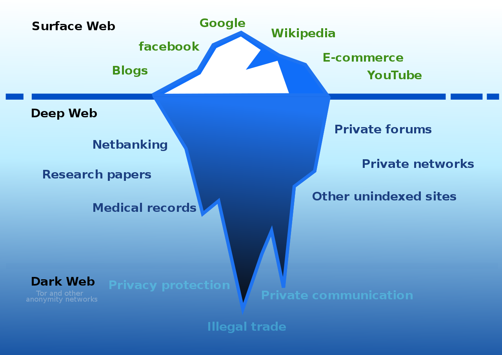

# Dark Web
<Badge type="tip" text="Rédigé le 19/04/2024" />

Internet est divisé en trois sections : le ***Clear Web***, le ***Deep Web*** ainsi que le ***Dark web***.

Il est important de se rendre compte de son intérêt, et comment celui-ci peut être utilisé dans le cadre du renseignement, tant pour les forces de l'ordre que pour les sociétés de renseignement sur les menaces.

## Le Clear Web

Cette partie est souvent appelée le *Web visible* ou le *Web indexé*. Elle est constituée de sites Web et de pages Web qui sont accessibles au public et qui sont indexés par les moteurs de recherche. Ces sites comprennent des plateformes populaires comme Facebook, Google, YouTube et Reddit, ainsi que de nombreux autres sites que les gens visitent quotidiennement.

Lorsqu'une personne effectue une recherche sur Google, par exemple, elle obtient des résultats provenant de ce Web visible, car les robots d'exploration de Google ont indexé ces pages et peuvent les présenter comme résultats de recherche. Les robots d'exploration sont des programmes informatiques qui parcourent le Web, suivent les liens entre les pages et indexent le contenu pour permettre aux moteurs de recherche de fournir des résultats pertinents aux utilisateurs.

Si un site autorise les robots d'exploration à indexer ses pages, cela signifie qu'il est plus susceptible d'apparaître dans les résultats de recherche lorsque les utilisateurs recherchent des termes pertinents. C'est une partie essentielle du référencement et de la visibilité en ligne pour de nombreux sites Web.

Le Clear Web contient des sites accessibles au public, conçus pour être utilisés sans avoir besoin de méthodes d'accès spéciales comme des clés ou des listes blanches d'adresses IP. Ces sites sont généralement disponibles sur la couche **Surface du Web**, où les utilisateurs peuvent les trouver et y accéder relativement facilement.

Les sites juridiques font partie de cette catégorie, offrant des informations et des services juridiques destinés au grand public. Ils ne nécessitent généralement pas de procédures d'accès complexes et peuvent être consultés par quiconque a accès à Internet, bien que certains d'entre eux puissent exiger un enregistrement pour accéder à certaines fonctionnalités ou contenus.

## Le Deep Web

Le Deep Web, aussi connu sous le nom de *Web souterrain* ou *Web invisible*, représente la partie d'Internet qui **n'est pas indexée par les moteurs de recherche** classiques comme Google ou Bing. Cette section du Web est immense et comprend une grande quantité de données et de pages qui ne sont pas accessibles au public de manière conventionnelle.

Les propriétaires de sites du Deep Web peuvent avoir **empêché l'indexation** de leurs pages par les robots d'exploration, ou bien ils peuvent avoir mis en place des contrôles d'accès restreints, ne permettant l'accès qu'à un public spécifique. Contrairement au Web visible, le Deep Web n'est pas facilement accessible par une simple recherche sur Google. Les informations qu'il **contient sont souvent des données sensibles ou privées**, telles que des comptes utilisateurs sur des plateformes comme Amazon ou Facebook, des forums privés, des pages d'adhésion restreintes ou des services bancaires en ligne.

Il est important de noter que ***le Dark Web et le Deep Web sont des termes distincts***. Bien que souvent confondus, le Dark Web se réfère à une partie spécifique du Deep Web qui est intentionnellement cachée et où les activités illicites sont souvent associées. Le Deep Web, en revanche, englobe toutes les données et pages non indexées, qu'elles soient légitimes ou non. En résumé, le Deep Web peut inclure des informations privées et sensibles qui ne sont pas destinées à être publiques, mais il ne se limite pas nécessairement à des activités illégales.

## Le Dark Web

Le Dark Web est une section distincte et souvent mal comprise d'Internet, utilisée pour diverses activités, y compris l'anonymat, les opérations illégales et la collecte de renseignements sensibles.

L'accès au Dark Web nécessite généralement l'utilisation de logiciels spéciaux comme ***Tor*** (***T***he ***O***nion ***R***outer), qui permettent aux utilisateurs de naviguer de manière anonyme en masquant leur adresse IP. Les sites du Dark Web utilisent des **domaines de premier niveau** (TLD) spécifiques, tels que `.onion`, plutôt que les TLD couramment utilisés sur le Web visible.

Quant à la légalité de visiter le Dark Web, cela dépend principalement des activités que l'on peut y mener. En soi, *visiter le Dark Web n'est pas illégal* dans la plupart des pays, mais il est important de noter que de **nombreuses activités qui s'y déroulent sont illégales**, telles que la vente de drogues, d'armes et d'autres biens illicites, ainsi que la distribution de contenu répréhensible comme la pornographie infantile.

Par conséquent, bien que l'accès au Dark Web puisse être légal, l'engagement dans des activités illégales sur cette plateforme *peut entraîner des conséquences juridiques graves*. Il est donc essentiel pour les utilisateurs de comprendre les risques associés à l'utilisation du Dark Web et de **veiller à respecter les lois** en vigueur dans leur juridiction. Une sensibilisation aux dangers potentiels et la prise de mesures pour rester en sécurité en ligne sont également cruciales lors de l'exploration de cette partie d'Internet.

## Activitées associées

L'accès au Dark Web est généralement limité et peu recommandé pour la plupart des utilisateurs, mais certains professionnels de la sécurité informatique peuvent être amenés à y accéder dans le cadre de leur travail.

### Analyste des menaces

Les analystes des menaces surveillent les activités potentiellement dangereuses sur le Dark Web, telles que la planification d'attaques ou la vente d'informations confidentielles. Ils peuvent infiltrer des forums ou des sites privés pour recueillir des informations et protéger leur entreprise contre les menaces émergentes.

### Analyste de programmes malveillants

Les analystes de programmes malveillants recherchent des échantillons de logiciels malveillants sur le Dark Web afin de les analyser et de développer des contre-mesures pour protéger leur organisation contre les attaques. Ils surveillent également les places de marché où des malwares sont vendus et étudient les tendances pour anticiper les nouvelles menaces.

### Chercheur en sécurité

Les chercheurs en sécurité explorent le Dark Web pour détecter et analyser les activités malveillantes, telles que la vente de vulnérabilités Zero Day ou l'échange d'informations sur les attaques. Leur travail consiste à identifier les nouvelles menaces et à partager leurs découvertes avec la communauté de la sécurité informatique.

### Forces de l'ordre

Les organismes chargés de l'application de la loi utilisent le Dark Web pour enquêter sur des activités criminelles telles que le trafic de drogue, la vente d'armes illicites et la cybercriminalité. Ils peuvent infiltrer des réseaux criminels, recueillir des preuves et prendre des mesures pour arrêter les personnes impliquées dans des activités illégales.

 

::: info Sources
Ce cours s'inspire de Security Blue Team du cours "*Introduction to Dark Web Operations*" :
https://elearning.securityblue.team/home/courses/free-courses/introduction-to-dark-web-operations#description
:::