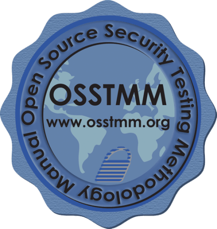
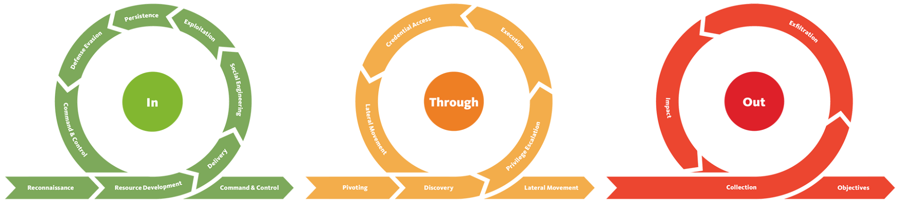

# PRINCIPES DE SECURITE 
<Badge type="tip" text="Rédigé le 26/02/2024" />
<Badge type="warning" text="En cours de rédaction" />
::: tip Bases de la cybersécurité

On va décrire ici les principaux fondamentaux de la sécurité, notamment les cadres utilisés pour protéger les données et les systèmes.
Les mesures, cadres & protocoles que l'on va découvrir sont utiles au rôle de la "défense en profondeur", qui consiste à utiliser plusieurs couches de sécurité variées pour les systèmes et les données d'une organisation, afin qu'elles assurent la redondance de la sécurisation d'une organisation.
:::

## La triade de la CIA

Il s'agit d'un modèle de la sécurité (comme le modèle OSI pour le réseau) qui est utilisé tout au long de la création d'une politique de sécurité.
Ce modèle est plutôt ancien (98), car il ne commence et/ou ne se termine pas avec la cybersécurité, mais s’applique plutôt à des scénarios tels que le classement, le stockage des enregistrements, etc.

Il est composé de trois sections :
*   La confidentialité
*   L'intégrité
*   La disponibilité

Ce modèle est devenu un standard de l'industrie, car il aide notamment à déterminer la valeur des données, dont notamment l'attention dont elles ont besoin de la part de l'entreprise.

La triade de la CIA est différente d'un modèle traditionnel dans lequel vous avez des sections individuelles ; il s’agit plutôt d’un cycle continu. Même si les trois éléments de la triade de la CIA peuvent sans doute se chevaucher, si un seul élément n’est pas respecté, alors les deux autres deviennent inutiles (semblable au triangle du feu). Si une politique de sécurité ne répond pas à ces trois sections, elle est rarement une politique de sécurité efficace.

### La confidentialité

Il s'agit de l'élément de protection des données contre tout accès non autorisé et toute utilisation abusive. 
Les organisations auront toujours des données d'une certaine valeur et d'un niveau de sensibilité stockées sur leurs systèmes. Assurer la confidentialité, c'est protéger des parties auxquelles elles ne sont pas destinées.

### L'intégrité

Il s'agit de la condition dans laquelles les informations restent exactes & cohérentes, outre le cas où des modifs autorisées sont appliquées.
L'intégrité est maintenue lorsque ces informations restent inchangées pendant le stockage, la transmission et l'utilisation n'impliquant pas la modification des infos.
Il faut donc prendre des mesures afin que ces données ne soient pas susceptibles d'être modifiées, bougées etc.. par des personnes non autorisées.

### La disponibilité

Afin que ces données soient utiles, elles doivent pouvoir être disponibles & accessibles par les utilisateurs dont l'accès leur est autorisé.
La disponibilité est un facteur clé d'une organisation : celles qui proposent des services web par exemple, doivent avoir des accès disponibles à ses utilisateurs en permanence, lorsqu'il ne l'est pas, cela entraîne une atteinte à la réputation de celle-ci et potentiellement une perte financière.

## Principes de privilèges

Notamment afin de garantir la triade de la CIA, il est essential de correctement définir les différents niveaux d'accès à un système selon les besoins des utilisateurs.
Ces rôles sont accordés selon deux critères :
*   Le rôle/la fonction de l'utilisateur
*   La sensibilité des infos stockées sur les systèmes

Deux concepts clés sont utilisés pour attribuer et gérer les droits d'accès des individus, deux concepts clés sont utilisés : Privileged Identity Management (PIM) et Privileged Access Management (ou PAM en abrégé).

PIM est utilisé pour traduire le rôle d'un utilisateur selon un rôle d'accès sur le système, alors que PAM gère la gestion des privilèges dont dispose le rôle d'accès d'un système.

### Le principe du moindre privilège

Les utilisateurs doivent bénéficier d'uniquement les outils & accès qui leur sont nécessaires.
::: danger Important
JAMAIS donner les droits d'accès identiques à tout le monde. Ceux-ci doivent être correctement administrés.
:::
On ne donne pas la gestion des comptes à l'agent d'entretien, tout comme on ne donne pas la gestion d'un server à la secretaire.

Seulement les accès nécessaire à l'aboutissement des fonctions des utilisateurs.

## Modelisation des menaces & réponse aux incidents

Il s'agit d'un processus d'examen, d'amélioration & de test des protocoles de sécurité mis en place dans l'infrastructure et services d'une organisation.
Elle consiste à identifier les menaces probables auxquelles une application ou un système peut-être confronté, ainsi que ses vulnérabilités.

Le processus de modélisation des menaces repose sur 4 principes :
*   La préparation
*   L'identification
*   L'atténuation
*   La révision

Cependant, le processus plus complexe du modèle des menaces lui comprend :
*   Le renseignement sur les menaces
*   L'identification des actifs
*   La capacité d'atténuation
*   L'évaluation des risques

Les incidents sont classés selon une évaluation de l'urgence et de l'impact. L'urgence sera déterminée par le type d'attaque rencontrée, l'impact sera déterminé par le système affecté et l'impact sur les opérations commerciales.

  | Impact/Urgence  |   Elevé    |   Moyen  |   Faible |
  |-----------------|------------|----------|----------|
  | Elevé           |      1     |     2    |     3    |
  | Moyen           |      2     |     3    |     4    |
  | Faible          |      2     |     4    |     5    |

::: details Exemples dans le support informatique
Impact élevé & urgence élevée : **P1**

Impact faible & urgence faible : **P5**
:::

## Méthodologie de test d'intrusion

Les tests d’intrusion peuvent avoir une grande variété d’objectifs et de cibles dans le champ d’application. Pour cette raison, aucun test d’intrusion n’est identique et il n’y a pas de cas unique quant à la façon dont un testeur d’intrusion doit l’aborder.

| Etape | Description |
|-------|-------------|
| Collecte d’informations	| Cette étape consiste à collecter autant d’informations accessibles au public sur une cible/organisation que possible, par exemple, l’OSINT et la recherche. Cela n’implique pas d’analyser les systèmes. |
| Énumération/Numérisation | Cette étape consiste à découvrir les applications et les services exécutés sur les systèmes. Par exemple, trouver un serveur Web qui peut être potentiellement vulnérable. |
| Exploitation | Cette étape consiste à exploiter les vulnérabilités découvertes sur un système ou une application. Cette étape peut impliquer l’utilisation d’exploits publics ou l’exploitation de la logique d’application. |
| Élévation de privilèges	| Cette étape est la tentative d’étendre l'accès à un système. On peut escalader horizontalement et verticalement, où horizontalement est l’accès à un autre compte du même groupe d’autorisations (c’est-à-dire un autre utilisateur), tandis que verticalement est celui d’un autre groupe d’autorisations (c’est-à-dire un administrateur). |
| Post-exploitation	| Cette étape comporte quelques sous-étapes : 1. Quels autres hôtes peuvent être ciblés (pivotement) 2. Quelles informations supplémentaires pouvons-nous recueillir auprès de l’hôte maintenant que nous sommes un utilisateur privilégié ? 3. Brouiller les pistes. 4. Rapports |

### OSSTMM (The Open Source Security Testing Methodology Manual)

The Open Source Security Testing Methodology Manual fournit un cadre détaillé de stratégies de test pour les systèmes, les logiciels, les applications, les communications et l’aspect humain de la cybersécurité.
La méthodologie se concentre principalement sur la façon dont ces systèmes, applications communiquent, elle comprend donc une méthodologie pour :

* Télécommunications (téléphones, VoIP, etc.)
* Réseaux câblés
* Communications sans fil

| Avantages | Inconvénients |
|-----------|---------------|
| Couvre en profondeur diverses stratégies de test. | Le cadre est difficile à comprendre, très détaillé et a tendance à utiliser des définitions uniques. |
| Comprend des stratégies de mise à l’essai pour des cibles spécifiques (c.-à-d. les télécommunications et les réseaux) | X |
| Le cadre est flexible en fonction des besoins de l’organisation. | X |
| Le cadre est destiné à établir une norme pour les systèmes et les applications, ce qui signifie qu’une méthodologie universelle peut être utilisée dans un scénario de test d’intrusion. | X |

### L'OWASP (Open Web Application Security Project)

Le framework « Open Web Application Security Project » est un framework communautaire et fréquemment mis à jour, utilisé uniquement pour tester la sécurité des applications et des services Web. La fondation rédige régulièrement des rapports indiquant les dix principales vulnérabilités de sécurité qu’une application Web peut avoir, l’approche de test et la remédiation.

| Avantages | Inconvénients |
|-----------|---------------|
| Facile à prendre en main et à comprendre | Il se peut que le type de vulnérabilité d'une application web ne soit pas clair |
| Activement maintenu et mis à jour fréquemment | L'OWASP ne fait pas de suggestion pour les cycles de vie spécifiques du développement logiciel |
| Il couvre toutes les étapes d'une mission : des tests aux rapports et à la remédiation | Le framework ne détient aucune accréditation telle que CHECK |
| Spécialisé dans les applications et services web | X |

### Framework de cybersécurité du NIST 1.1 (National Institute of Standards and Technology)

Le framework de cybersécurité du NIST est un cadre populaire utilisé pour améliorer les normes de cybersécurité d’une organisation et gérer le risque de cybermenaces. Ce cadre est un peu une mention honorable en raison de sa popularité et de ses détails. Le cadre fournit des lignes directrices sur les contrôles de sécurité et des critères de réussite pour les organisations, des infrastructures critiques (centrales électriques, etc.) jusqu’aux entreprises. Il y a une section limitée sur une ligne directrice standard pour la méthodologie qu’un testeur d’intrusion devrait suivre.

| Avantages | Inconvénients |
|-----------|---------------|
| On estime que le cadre du NIST sera utilisé par 50 % des organisations américaines d’ici 2020. | Le NIST propose de nombreuses itérations de frameworks, il peut donc être difficile de décider lequel s’applique à votre organisation. |
| Le cadre est extrêmement détaillé dans l’établissement de normes pour aider les organisations à atténuer la menace posée par les cybermenaces. | Le cadre du NIST a des politiques d’audit faibles, ce qui rend difficile de déterminer comment une violation s’est produite. |
| Le cadre est très fréquemment mis à jour.	| Le cadre ne prend pas en compte le cloud computing, qui devient rapidement de plus en plus populaire pour les organisations. |
| Le NIST fournit une accréditation aux organisations qui utilisent ce cadre.	| X |
| Le cadre du NIST est conçu pour être mis en œuvre parallèlement à d’autres cadres. | X |

### NCSC CAF (Cyber Assesment Framework)

Le CAF est un cadre exhaustif de quatorze principes utilisés pour évaluer le risque de diverses cybermenaces et les défenses d'une organisation contre celles-ci.
Le cadre s’applique aux organisations considérées comme fournissant des « services et activités d’importance vitale » tels que les infrastructures critiques, les services bancaires, etc. Le cadre se concentre principalement sur les sujets suivants et les évalue :
* Sécurité des données
* Sécurité du système
* Contrôle d’identité et d’accès
* Résilience
* Surveillance
* Planification de l’intervention et du rétablissement

| Avantages | Inconvénients |
|-----------|---------------|
| Ce cadre est soutenu par une agence gouvernementale de cybersécurité | Le cadre est encore nouveau dans l’industrie, ce qui signifie que les organisations n’ont pas eu beaucoup de temps pour apporter les modifications nécessaires pour s’y adapter. |
| Ce cadre permet l’accréditation. | Le cadre est basé sur des principes et des idées et n’est pas aussi direct que d’avoir des règles comme d’autres cadres. |
| Ce cadre couvre quatorze principes qui vont de la sécurité à la réponse. | X |

## Les tests d'intrusion sous forme de boîte

Il existe trois champs d’application principaux lors du test d’une application ou d’un service. La compréhension de la cible détermine le niveau de test que l'on effectue dans le cadre de la mission de test d’intrusion.

| Type | Niveau de connaissance |
|------|------------------------|
| Boîte noire | Aucune connaissance de la cible sur le fonctionnement interne de l'application ou service |
| Boîte grise | Connaissance limitée des composants de l’application ou du service. Néanmoins, il interagira avec l’application comme si elle était un scénario de boîte noire, puis utilise ses connaissances de l’application pour essayer de résoudre les problèmes au fur et à mesure qu’il les trouve. |
| Boîte blanche | Connaissance complète de l’application et de son comportement attendu et disposera de beaucoup plus de temps plus consommant que les tests en boîte noire. La connaissance complète d’un scénario de test en boîte blanche fournit une approche de test qui garantit que l’ensemble de la surface d’attaque peut être validée. |

## La pyramide de douleur

La pyramide de douleur est un modèle utilisé en cybersécurité pour classer les risques et les menaces informatiques en fonction de leur impact potentiel sur une organisation. Cette pyramide se compose de trois niveaux, chacun représentant un niveau croissant de gravité et de perturbation pour l'organisation.

### Niveau 1: Attaques Directes

Au sommet de la pyramide se trouvent les attaques directes, telles que les attaques par déni de service distribué (DDoS), les attaques de logiciels malveillants sophistiqués et les attaques ciblées par des cybercriminels expérimentés. Ces attaques ont le potentiel de causer des dommages significatifs à l'infrastructure et aux opérations de l'organisation.

### Niveau 2: Vulnérabilités Exploitées

Le deuxième niveau de la pyramide concerne les vulnérabilités exploitées, telles que les failles de sécurité dans les logiciels, les configurations incorrectes des systèmes et les faiblesses dans les processus de gestion des identités. Bien que moins immédiates que les attaques directes, ces vulnérabilités peuvent être exploitées par des cybercriminels pour accéder aux systèmes et aux données sensibles de l'organisation.

### Niveau 3: Erreurs et Omissions

À la base de la pyramide se trouvent les erreurs et omissions, telles que les mots de passe faibles, les mises à jour logicielles manquantes et les pratiques de sécurité laxistes. Bien que moins évidentes que les attaques directes ou les vulnérabilités exploitées, ces erreurs et omissions peuvent créer des failles de sécurité qui permettent aux cybercriminels de compromettre les systèmes de l'organisation.

La pyramide de douleur en cybersécurité aide les organisations à prioriser leurs efforts de sécurité en se concentrant d'abord sur la protection contre les attaques les plus graves et les plus susceptibles de causer des dommages importants.

::: tip Ressources supplémentaires
TryHackMe reprend parfaitement ce concept dans son cours "Pyramid of Pain" disponible [ici](https://tryhackme.com/room/pyramidofpainax) *(gratuit)*.
:::

## Cyber ​​Kill Chain

La chaîne d'attaque cybernétique est un modèle développé pour décrire les phases d'une attaque informatique, permettant ainsi d'identifier et de contrer les menaces à chaque étape. Ce modèle est souvent utilisé par les professionnels de la cybersécurité pour améliorer la détection et la réponse aux attaques. Voici une exploration des étapes de la chaîne d'attaque, avec des exemples pour illustrer chaque phase.

1. **Reconnaissance**

Il cherche des informations sur une entreprise cible. Par exemple, il utilise des outils comme Maltego pour cartographier les connexions et les réseaux sociaux de l'entreprise et ses employés.

2. **Armement**

Il crée une charge utile malveillante. Par exemple, il développe un cheval de Troie (Trojan) en utilisant un outil comme Metasploit et l'intègre dans un document PDF.

3. **Livraison**

Il envoie le document PDF malveillant à une victime par e-mail. Par exemple, il envoie un courriel d'hameçonnage (phishing) contenant le document PDF infecté, incitant la victime à l'ouvrir.

4. **Exploitation**

Lorsque la victime ouvre le PDF infecté, le code malveillant s'exécute. Par exemple, le PDF exploite une vulnérabilité du lecteur PDF de la victime pour exécuter du code.

5. **Installation**

Il installe un accès persistant sur la machine de la victime. Par exemple, il installe un backdoor pour garantir un accès continu à la machine compromise.

6. **Commande et contrôle (C2)**

Il établit une communication avec la machine compromise. Par exemple, il configure un serveur de commande et contrôle pour recevoir des instructions et exfiltrer des données.

7. **Actions sur objectifs**

Il réalise ses objectifs finaux. Par exemple, il exfiltre des données sensibles, comme des informations financières ou des secrets commerciaux, de la machine compromise.

### Unified Kill Chain

La modélisation des menaces, dans un contexte de cybersécurité, est une série d'étapes visant à améliorer la sécurité d'un système. La modélisation des menaces consiste à identifier les risques et se résume essentiellement à :

1. Identifier les systèmes et les applications qui doivent être sécurisés et leur fonction dans l'environnement. Par exemple, le système est-il essentiel au fonctionnement normal et contient-il des informations sensibles telles que des informations de paiement ou des adresses ?
2. Évaluer les vulnérabilités et les faiblesses de ces systèmes et applications et la manière dont elles pourraient être potentiellement exploitées
3. Créer un plan d'action pour sécuriser ces systèmes et applications contre les vulnérabilités mises en évidence
4. Mettre en place des politiques pour empêcher que ces vulnérabilités ne se reproduisent lorsque cela est possible (par exemple, mettre en œuvre un cycle de vie de développement logiciel (***SDLC***) pour une application ou former les employés à la sensibilisation au phishing).

La modélisation des menaces est une procédure importante pour réduire les risques au sein d'un système ou d'une application, car elle crée une vue d'ensemble de haut niveau des actifs (asset) informatiques d'une organisation (un actif informatique est un logiciel ou un matériel) et des procédures pour résoudre les vulnérabilités.

L'UKC peut encourager la modélisation des menaces car le cadre UKC aide à identifier les surfaces d'attaque potentielles et la manière dont ces systèmes peuvent être exploités.

*STRIDE*, *DREAD* et *CVSS* (pour n'en citer que quelques-uns) sont tous des frameworks spécifiquement utilisés dans la modélisation des menaces. Si vous souhaitez en savoir plus, consultez la salle «[Principes de sécurité](https://tryhackme.com/room/principlesofsecurity)» sur *TryHackMe*.

[Unified Kill Chain](https://www.unifiedkillchain.com/) de Paul Pols, publié en 2017, vise à compléter d'autres cadres de chaîne de destruction de cybersécurité, tels que ATT&CK de Lockheed Martin et de MITRE.

L'UKC indique qu'une attaque se déroule en 18 phases : de la reconnaissance à l'exfiltration de données et à la compréhension des motivations d'un attaquant. Ces phases ont été regroupées dans cette salle en quelques domaines d'intérêt pour des raisons de concision, qui seront détaillés dans les tâches restantes.

L'un des principaux avantages de l' UKC par rapport aux cadres traditionnels de chaîne de destruction de la cybersécurité est qu'il est moderne et extrêmement détaillé ( rappel : il comporte officiellement 18 phases, alors que d'autres cadres peuvent en avoir une petite poignée).

*Image de l'UKC disponible sur [unifiedkillchain.com](https://www.unifiedkillchain.com/)*

::: tip Ressources supplémentaires
TryHackMe reprend parfaitement ce concept dans son cours "Unified Kill Chain" disponible [ici](https://tryhackme.com/r/room/unifiedkillchain) *(gratuit)*.
:::

 

::: info Sources
Ce cours s'inspire (et utilise les images) de TryHackMe.com de la chambre "*Pentesting Fundamentals*" :
https://tryhackme.com/room/pentestingfundamentals
:::