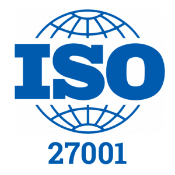

# Norme ISO 27001

 

L'ISO (Organisation internationale de normalisation) est une fédération mondiale d'organismes nationaux de normalisation.

Un **ISMS** (*Information Security Management System*, ou *Système de gestion de la sécurité de l'information* en français) comprend les politiques, procédures, lignes directrices ainsi que les ressources et activités associées, gérées collectivement par une organisation dans le but de protéger ses actifs informationnels. Un **ISMS** est une approche systématique pour établir, mettre en œuvre, exploiter, surveiller, examiner, maintenir et améliorer la sécurité des informations d'une organisation afin d'atteindre les objectifs commerciaux. Il repose sur une évaluation des risques et sur les niveaux d'acceptation des risques de l'organisation, conçus pour traiter et gérer efficacement les risques.

Son but est de protéger les actifs informatiques.

## ISO 19011

Les audits font partie du travail de nombreuses organisations (sinon la plupart). Si vous avez travaillé dans un bureau, vous avez peut-être déjà participé à un audit. Les audits des normes ISO sont effectués à l'aide d'une norme spéciale appelée ISO 19011, qui détaille comment les réaliser et fournit différents langages liés au monde des audits.

Cette norme comprend des sujets tels que la portée, le programme, le plan, les critères, les preuves, les objectifs, les membres de l'équipe et les responsabilités, de manière à pouvoir obtenir les résultats et une conclusion finale.

Il existe trois types d'audits :

1. Audits de première partie :

    Les audits de première partie, ou audits internes, sont généralement effectués au sein d'une entreprise pour mesurer les forces et les faiblesses par rapport à ses objectifs commerciaux internes. Cet audit ISO est essentiellement une évaluation de la conformité visant à vérifier les lacunes en matière de conformité et à préparer une organisation à un audit de certification ISO externe, c'est-à-dire un audit par un tiers.

2. Audits de seconde partie :

    Un audit par seconde partie, ou audit externe, est généralement effectué à la demande d'un client (ou d'une entreprise engagée pour agir au nom du client) sur un fournisseur de produits ou de services.

3. Audits tiers :

    L’audit tiers est l’audit de certification. Une organisation entreprend généralement un audit par un tiers lorsqu'elle souhaite obtenir une certification ISO. Lors de l'audit de certification, un auditeur de l'organisme de certification évalue si une entreprise se conforme à la norme ISO appropriée.

Au moment de planifier un audit, l'équipe doit déterminer un objectif ; cela peut être différent pour chaque organisation. Quelques exemples peuvent consister à renforcer un SMSI, à déterminer les risques et les opportunités, à gagner la confiance des fournisseurs ou à se conformer aux demandes légales.

Il existe également deux types de méthodes d'audit :

1. Audit sur site :

    C'est face à face; l'auditeur se rend sur le site physique et vérifie toute la documentation.

2. Audit à distance :

    Cela se fait à distance, en utilisant Internet comme outil pour atteindre les objectifs de l'audit. Celui-ci peut s’appliquer aux audits de première et de seconde partie.

Depuis la pandémie, les audits à distance sont plus courants, on peut donc désormais [consulter la documentation officielle](https://www.iaf.nu/articles/Mandatory_Documents_/38) sur la façon de réaliser un audit à distance.

 

::: info Sources
Ce cours s'inspire (et utilise les images) de TryHackMe.com de la chambre "*ISO27001*" :
https://tryhackme.com/r/room/iso27001
:::

