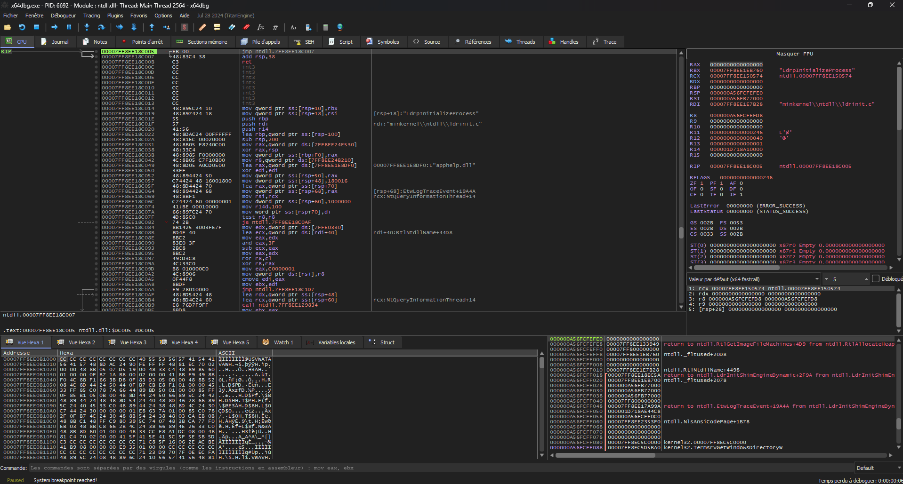

# Introduction au Développement de Malware <Badge type="warning" text="En cours de rédaction" />

## Introduction

Le malware est un type de logiciel spécifiquement conçu pour effectuer des actions malveillantes telles que l'accès non autorisé à une machine ou le vol de données sensibles. Le terme "malware" est souvent associé à des conduites illégales ou criminelles, mais il peut aussi être utilisé par des hackers éthiques tels que les testeurs d'intrusion et les équipes rouges pour une évaluation de sécurité autorisée d'une organisation.

Ce cours permet aux utilisateurs d'utiliser les connaissances acquises à des fins éthiques et légales uniquement, toute autre utilisation peut entraîner des poursuites pénales dont RootDev n'en sera pas responsable.

## Pourquoi développer des Malware ?

Il y a plusieurs raisons pour lesquelles quelqu'un voudrait apprendre le développement de malware. D'un point de vue de la sécurité offensive, les testeurs doivent souvent effectuer certaines tâches malveillantes contre l'environnement d'un client. Les testeurs ont généralement trois options principales en ce qui concerne les types d'outils utilisés lors d'un engagement :

* **Outils Open Source (OSTs)** : Ces outils sont généralement détectés par les fournisseurs de sécurité et identifiés dans toute organisation décemment protégée ou mature. Ils ne sont pas toujours fiables lors d'une évaluation de sécurité offensive.
* **Achat d'outils** : Les équipes avec des budgets plus importants optent souvent pour l'achat d'outils afin de gagner du temps précieux pendant les engagements. Semblables aux outils personnalisés, ceux-ci sont généralement fermés et ont une meilleure chance d'éviter les solutions de sécurité.
* **Développement d'outils personnalisés** : Parce que ces outils sont construits sur mesure, ils n'ont pas été analysés ou signés par les fournisseurs de sécurité, ce qui donne à l'équipe attaquante un avantage en matière de détection. C'est là que la connaissance du développement de malware devient primordiale pour une évaluation de sécurité offensive plus réussie.

## Quel langage de programmation utiliser ?

Techniquement, n'importe quel langage de programmation peut être utilisé pour créer un malware, comme Python, PowerShell, C#, C, C++ et Go. Cela dit, il existe quelques raisons pour lesquelles certains langages de programmation prévalent sur d'autres en matière de développement de malware, et cela se résume généralement aux points suivants :

* Certains langages de programmation sont plus difficiles à rétro-concevoir. Cela doit toujours faire partie de l'objectif de l'attaquant de s'assurer que les défenseurs comprennent peu comment le malware se comporte.
* Certains langages de programmation nécessitent des prérequis sur le système cible. Par exemple, exécuter un script Python nécessite la présence d'un interprète sur la machine cible. Sans l'interprète Python présent sur la machine, il est impossible d'exécuter un malware basé sur Python.
* Selon le langage de programmation, la taille du fichier généré peut varier.

### Langages de Programmation de haut niveau vs bas niveau

Les langages de programmation peuvent être classés en deux groupes différents : haut niveau et bas niveau.

* **Haut niveau** : Généralement plus abstraits du système d'exploitation, moins efficaces en mémoire et fournissent au développeur moins de contrôle global en raison de l'abstraction de plusieurs fonctions complexes. Un exemple de langage de programmation de haut niveau est Python.
* **Bas niveau** : Permet d'interagir avec le système d'exploitation à un niveau intime et donne au développeur plus de liberté lors de l'interaction avec le système. Un exemple de langage de programmation de bas niveau est C.

Étant donné les explications précédentes, il devrait être clair pourquoi les langages de programmation de bas niveau ont été le choix préféré dans le développement de malware, en particulier lorsqu'il s'agit de cibler les machines Windows.

## Cycle de vie du développement de Malware

Fondamentalement, un malware est un logiciel conçu pour effectuer certaines actions. Les implémentations logicielles réussies nécessitent un processus connu sous le nom de *cycle de vie du développement logiciel (***SDLC***)*. De même, un malware bien construit et complexe nécessitera une version adaptée du SDLC appelée *cycle de vie du développement de malware (***MDLC***)*.

Bien que le MDLC ne soit pas nécessairement un processus formalisé, il comprend 5 étapes principales :

1. **Développement** : Commencer le développement ou l'amélioration de la fonctionnalité du malware.
2. **Test** : Effectuer des tests pour découvrir des bugs cachés dans le code développé jusqu'à présent.
3. **Test AV/EDR hors ligne** : Exécuter le malware développé contre autant de produits de sécurité que possible. Il est important que les tests soient effectués hors ligne pour s'assurer qu'aucun échantillon n'est envoyé aux fournisseurs de sécurité. En utilisant Microsoft Defender, cela est réalisé en désactivant les soumissions d'échantillons automatisées et l'option de protection cloud.
4. **Test AV/EDR en ligne** : Exécuter le malware développé contre les produits de sécurité avec connectivité Internet. Les moteurs cloud sont souvent des composants clés dans les AVs/EDRs et donc tester le malware contre ces composants est crucial pour obtenir des résultats plus précis. Il faut être prudent car cette étape peut entraîner l'envoi d'échantillons au moteur cloud de la solution de sécurité.
5. **Analyse des indicateurs de compromission (IoC)** : À cette étape, il faut analyser le malware et extraire les IoCs qui peuvent potentiellement être utilisés pour détecter ou signer le malware.

## Outils de rétro-ingénierie

Plusieurs des outils mentionnés se concentrent davantage sur la rétro-ingénierie plutôt que sur le développement. Il est essentiel de rétro-ingénier le malware créé pour comprendre pleinement son fonctionnement interne et avoir une idée de ce que les analystes de malware verront lors de l'inspection du malware.

:::tip Définition
La rétro-ingénierie est une méthode qui tente d'expliquer, par déduction et analyse systémique, comment un mécanisme, un dispositif, un système ou un programme existant, accomplit une tâche sans connaissance précise de la manière dont il fonctionne.
:::

Outils à installer :

* **Visual Studio** : C'est l'environnement de développement où se dérouleront le codage et la compilation. Installer le Runtime C/C++.
* **x64dbg** : x64dbg est un débogueur qui sera utilisé tout au long des modules pour obtenir une compréhension interne du malware développé.
* **PE-Bear** : PE-Bear est un outil de rétro-ingénierie multiplateforme pour les fichiers PE. Il sera également utilisé pour évaluer le malware développé et rechercher des indicateurs suspects.
* **Process Hacker** : Process Hacker est un outil puissant et polyvalent qui aide à surveiller les ressources système, déboguer des logiciels et détecter des malwares.
* **Msfvenom** : Msfvenom est un outil en ligne de commande utilisé pour créer, manipuler et produire des payloads.

### Visual Studio

Visual Studio est un environnement de développement intégré (IDE) développé par Microsoft. Il est utilisé pour développer une large gamme de logiciels tels que des applications web, des services web et des programmes informatiques. Il comprend également des outils de développement et de débogage pour construire et tester des applications. Visual Studio sera le principal IDE utilisé pour le développement dans ce cours.

### x64dbg

x64dbg est un utilitaire de débogage open-source pour les binaires Windows x64 et x86. Il est utilisé pour analyser et déboguer les applications en mode utilisateur et les pilotes en mode noyau. Il fournit une interface graphique qui permet aux utilisateurs d'inspecter et d'analyser l'état de leurs programmes et de visualiser le contenu de la mémoire, les instructions d'assemblage et les valeurs des registres. Avec x64dbg, les utilisateurs peuvent définir des points d'arrêt, voir les données de la pile et du tas, parcourir le code pas à pas et lire et écrire des valeurs mémoire.

#### Le principal onglet "CPU" comporte 4 écrans :

* **Désassemblage (en haut à gauche)** : Cette fenêtre affiche les instructions d'assemblage exécutées par l'application.
* **Dump (en bas à gauche)** : Cette fenêtre affiche le contenu mémoire de l'application en cours de débogage.
* **Registres (en haut à droite)** : Cette fenêtre affiche les valeurs des registres du CPU.
* **Pile (en bas à droite)** : Cette fenêtre affiche le contenu de la pile.

Les onglets restants fournissent également des informations utiles mais seront abordés dans les modules lorsqu'ils seront utilisés.

### PE-Bear

PE-Bear est un outil gratuit et open-source conçu pour aider les analystes de malware et les ingénieurs en rétro-ingénierie à analyser rapidement et facilement les fichiers exécutables portables (PE) de Windows. Il aide à analyser et visualiser la structure du fichier PE, à visualiser les importations et exportations de chaque module, et à effectuer une analyse statique pour détecter les anomalies et les codes potentiellement malveillants. PE-Bear comprend également des fonctionnalités telles que la validation des en-têtes et des sections PE, ainsi qu'un éditeur hexadécimal.

### Process Hacker

Process Hacker est un outil open-source pour visualiser et manipuler les processus et services sous Windows. Il est similaire au gestionnaire de tâches mais fournit plus d'informations et de fonctionnalités avancées. Il peut être utilisé pour terminer des processus et des services, voir des informations et des statistiques détaillées sur les processus, définir des priorités de processus et plus encore. Process Hacker sera utile pour analyser les processus en cours afin de visualiser des éléments tels que les DLL chargées et les régions mémoire.

### Msfvenom

Msfvenom est un générateur de payload autonome du framework Metasploit qui permet aux utilisateurs de générer divers types de payloads. Ces payloads seront utilisés par le malware créé dans ce cours.

 

::: info Sources
Ce cours s'inspire de connaissances personnelles et de recherches sur le Web.
:::