## 🏰 Historique

Dans les années 90, Gerald Combs se penche sur une solution d’analyse de paquets et crée en 1998 **Ethereal**. Huit ans plus tard, le projet est renommé pour devenir ce que l’on connaît aujourd’hui sous le nom de **Wireshark**.

Wireshark est un logiciel open source, c'est-à-dire qu'il permet un accès libre au code source et la création de travaux dérivés. Si 30 ans après le projet Wireshark est toujours aussi populaire c'est grace à sa communauté qui compte près de 2000 contributeurs en 2024 (dont Gerard Combs) qui continuent de faire vivre Wireshark et proposent des améliorations continues. Ainsi Wireshark peut bénéficier encore aujourd'hui de mise à jour environ tous les mois.

## **📱 L'interface Wireshark**

Une fois ouvert, voici la fenêtre principale.

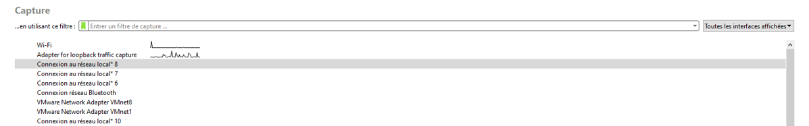

**De quoi s'agit-il ?** 

Cette fenêtre affiche les interfaces réseau de votre machine. Les interfaces actives sont identifiables par leur tracé à droite. Sélectionnez une interface active.

Note : Les interfaces sans signal sont généralement des cartes réseau virtuelles inactives.

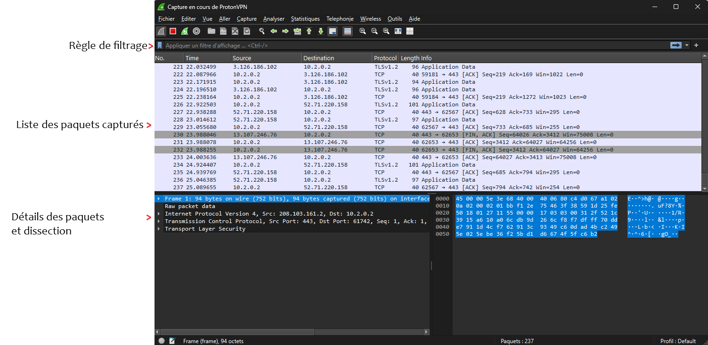

Chaque ligne représente un paquet capturé.

Les boutons principaux en haut à gauche permettent de :

|Action|Bouton|
|---|---|
|Démarrer la capture||
|Arrêter la capture||
|Relancer la capture||
|Accéder aux options de capture automatique||

Les colonnes principales sont :

- **N°**: Numéro du paquet
- **time**: Temps écoulé
- **source**: Émetteur
- **destination**: Destinataire
- **protocol**: Protocole utilisé
- **info**: Détails additionnels

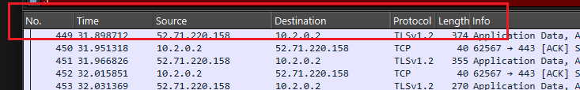

### **🏛️ Créer des colonnes**

Les colonnes personnalisées permettent d'afficher directement les informations importantes des paquets sans avoir à ouvrir les détails.

Deux méthodes pour ajouter des colonnes :

- **Première méthode** : clic droit sur l'information dans les détails puis "Appliquer en colonne" ou `CTRL + MAJ + I` :

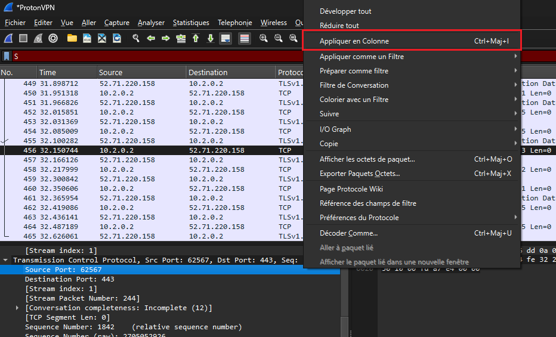

- **Seconde méthode** : Éditer -> Préférences -> Apparence -> Colonnes

La fenêtre des colonnes permet d'ajouter, supprimer et réorganiser les colonnes pour personnaliser l'affichage selon vos besoins.

### **🪟 Les différentes fenêtres**

### **👨‍💻 Information Expert**

Dans l'onglet Analyse, vous trouverez **information Expert**

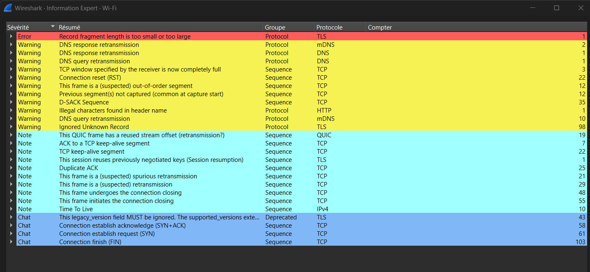

L'information Expert détecte les anomalies potentielles. Ces indications servent de point de départ mais nécessitent une analyse approfondie pour confirmation.

### **💾 Propriété du fichier de capture**

Dans l'onglet Statistiques, vous trouverez **Propriétés du fichier** de capture. Cette section fournit des informations complémentaires sur la capture que vous analysez, telles que la date de la capture, le nombre de paquets, la durée de la capture, et d'autres détails pertinents. Ces données pourront vous aider à contextualiser votre analyse et à mieux comprendre le trafic enregistré.

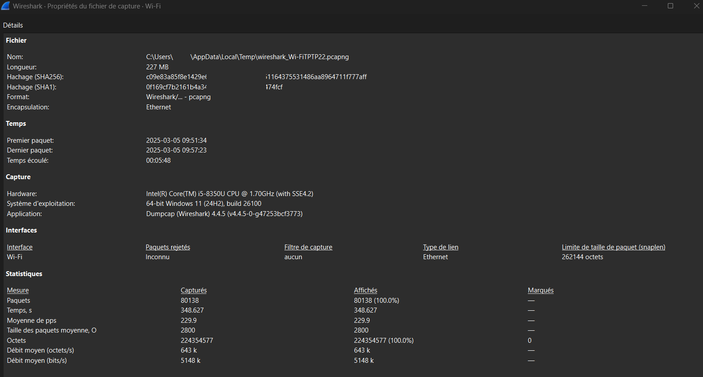

### **🫡 Hiérarchie des protocoles**

La hiérarchie des protocoles affiche la répartition et le poids des protocoles dans la capture. En comparant avec les utilisations habituelles du réseau, elle permet d'identifier des anomalies potentielles comme les attaques DDoS, ping of death ou les scans réseau.

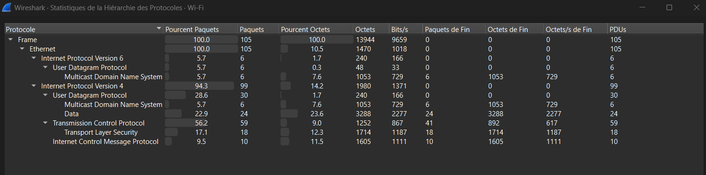

### **🗣️ Conversation**

Cette fonctionnalité permet de mettre en avant les différentes machines qui ont communiqué entre elles, en les identifiant par leurs adresses IP et MAC. Vous pourrez également voir le nombre de messages envoyés et la taille des paquets. Si vous suspectez la compromission d'une machine, cet outil peut s'avérer précieux pour aider à la détection et à l'analyse des comportements anormaux. Cela vous permet de suivre les communications suspectes et d'identifier d'éventuelles menaces sur votre réseau.

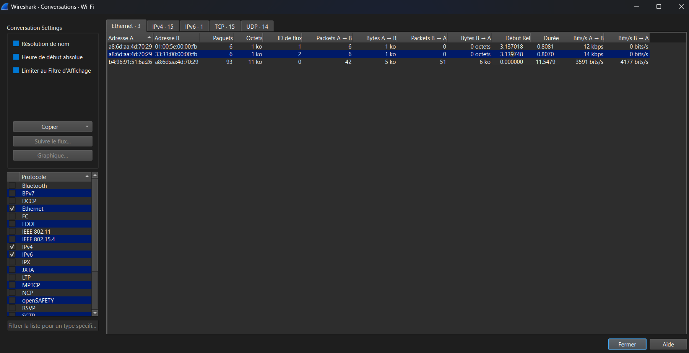

### **🔚 Endpoint**

Endpoint affiche les appareils présents dans une capture et leurs communications. Il permet de visualiser les interactions sur le réseau et d'identifier les comportements anormaux en analysant les relations entre les différents dispositifs.

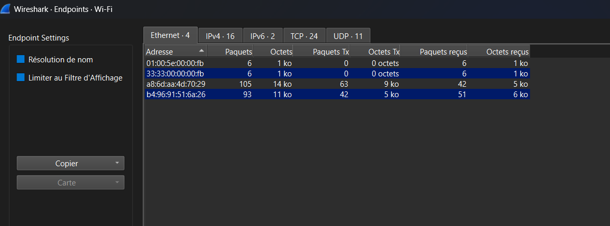

### **🛃 Le graphique d'E/S**

Le graphique d'entrée-sortie visualise la distribution temporelle des paquets sur le réseau. Il met en évidence les périodes d'activité forte et faible, permettant d'identifier rapidement les tendances, pics de trafic et anomalies potentielles pour détecter les problèmes de performance ou de sécurité.

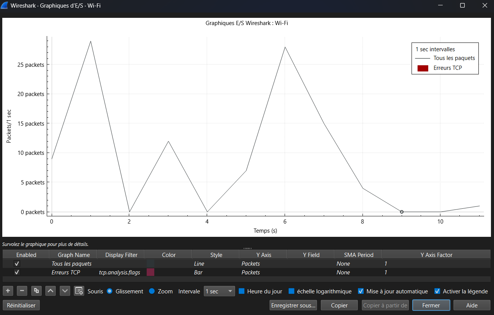

### **📈 Graphique des flux**

Ce graphique visualise les connexions et les flux de données entre les hôtes du réseau. Il permet d'identifier rapidement les interactions entre dispositifs et de repérer les anomalies potentielles pour résoudre les problèmes de performance ou de sécurité.

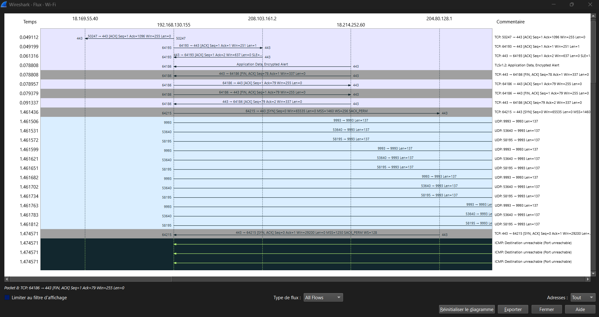

::: info Sources
Ce cours s'inspire de connaissances personnelles et de la documentation officielle de Wireshark :
https://www.wireshark.org/docs/
:::