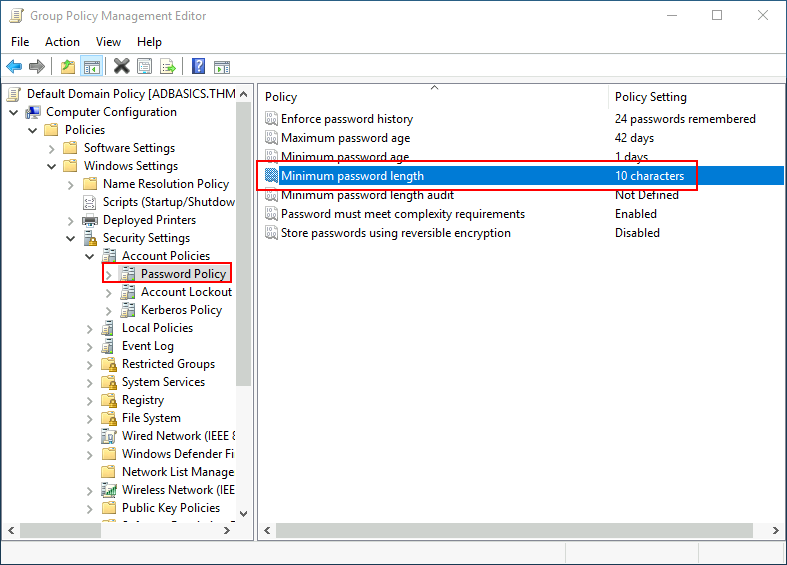

# Les fondamentaux de l'Active Directory
<Badge type="tip" text="Rédigé le 14/03/2024" />
<Badge type="warning" text="En cours de rédaction" />

L'Active Directory (AD) est un service d'annuaire développé par Microsoft pour les réseaux basés sur Windows. Il est utilisé pour gérer les ressources réseau telles que les utilisateurs, les ordinateurs, les groupes et les politiques de groupe. L'Active Directory est un composant central dans de nombreux environnements réseau Windows. En comprenant ses fonctionnalités de base telles que les domaines, les groupes, les politiques de groupe et les méthodes d'authentification, on peut mieux gérer et sécuriser des infrastructures réseaux.

## Domaine

Un domaine dans l'Active Directory est une unité d'organisation logique qui regroupe des objets tels que des utilisateurs, des ordinateurs, des groupes et des politiques de groupe. Les domaines permettent une gestion centralisée des ressources réseau.

## Groupe et Utilisateur

### Utilisateur

Les utilisateurs dans l'Active Directory représentent des individus autorisés à accéder aux ressources réseau. Chaque utilisateur a un compte qui leur permet de se connecter au domaine et d'accéder aux ressources autorisées.

### Groupe

Les groupes sont des collections d'utilisateurs et d'autres groupes. Ils simplifient la gestion des autorisations en permettant de définir des autorisations pour un groupe plutôt que pour chaque utilisateur individuellement.

| Groupe de sécurité | Description |
|--------------------|-------------|
| Domain Admins | Les utilisateurs de ce groupe ont des privilèges administratifs sur l'ensemble du domaine. Par défaut, ils peuvent administrer n'importe quel ordinateur sur le domaine, y compris les DC. |
| Server Operators | Les utilisateurs de ce groupe peuvent administrer des contrôleurs de domaine. Ils ne peuvent modifier aucune adhésion de groupe administratif. |
| Backup Operators | Les utilisateurs de ce groupe sont autorisés à accéder à n'importe quel fichier, ignorant leurs permissions. Ils sont utilisés pour effectuer des sauvegardes de données sur des ordinateurs. |
| Account Operators | Les utilisateurs de ce groupe peuvent créer ou modifier d'autres comptes dans le domaine. |
| Domain Users | Inclut tous les comptes d'utilisateurs existants dans le domaine. |
| Domain Computers | Inclut tous les ordinateurs existants dans le domaine. |
| Domain Controllers | Inclut tous les contrôleurs de domaine existants sur le domaine. |

## Ordinateurs

Les ordinateurs dans l'Active Directory sont des appareils qui font partie du domaine. Ils peuvent être des ordinateurs de bureau, des serveurs ou d'autres types d'appareils réseau. Les ordinateurs rejoignent le domaine pour bénéficier de la gestion centralisée des comptes utilisateurs et des politiques de groupe.

## Group Policies (Politiques de Groupe)

Les politiques de groupe sont des règles de configuration qui peuvent être appliquées à des utilisateurs et des ordinateurs dans un domaine. Elles permettent de contrôler divers aspects de la configuration du système, tels que les paramètres de sécurité, les restrictions logicielles et les paramètres du système d'exploitation.

Par exemple, ci-dessus se trouve les politiques de mot de passe.

## Méthodes d'Authentification

L'Active Directory prend en charge plusieurs méthodes d'authentification, notamment :

- **Authentification de base** : Utilise les informations d'identification de l'utilisateur pour vérifier l'accès.
- **Kerberos** : Protocole d'authentification réseau sécurisé qui utilise des tickets pour valider les utilisateurs et les services.
- **NTLM** : Ancien protocole d'authentification Windows qui utilise un hachage de mot de passe pour vérifier l'accès.

## Arbres et Forêts

### Arbres

Un arbre dans l'Active Directory est une hiérarchie de domaines liés les uns aux autres. Chaque domaine dans un arbre partage une relation de confiance avec les autres domaines.

### Forêts

Une forêt est une collection d'arbres d'Active Directory qui partagent un schéma commun, une configuration de domaine et une configuration de catalogue global. Les forêts permettent une gestion centralisée des ressources sur un ensemble de domaines.

 

::: info Sources
Ce cours s'inspire (et utilise les images) de TryHackMe.com de la chambre "*Active Directory Basics*" :
https://tryhackme.com/room/winadbasics
:::