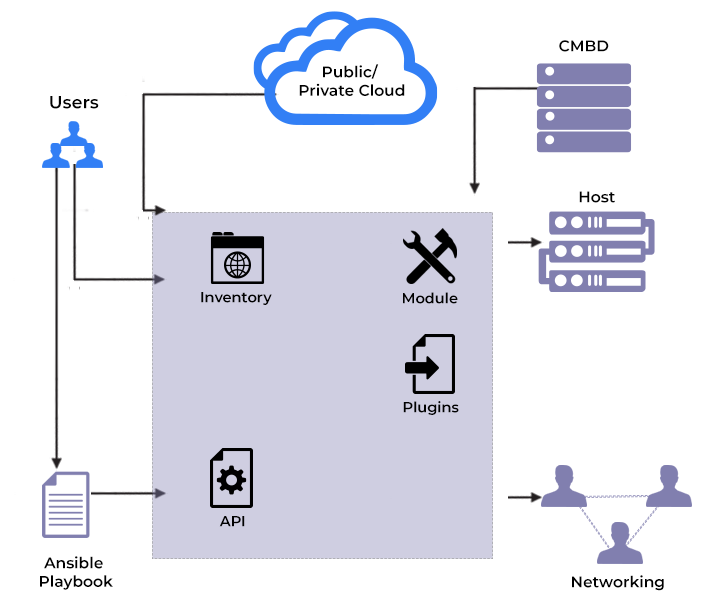

# 🔎 Introduction
<ais />

## **Le Projet Ansible**

### **Présentation générale**

[Ansible](https://www.ansible.com/) est un outil **d'automatisation** open source qui permet :

- **La gestion de la configuration**
- **Le déploiement d'applications**
- **L'orchestration entre les services**
- **Le provisionnement des ressources**

Face à la complexité croissante des systèmes, l'automatisation est devenue **cruciale**. Elle simplifie les tâches répétitives et libère du temps pour des activités à plus forte valeur ajoutée. Ansible, outil incontournable, utilise `SSH` sans agents tiers sur les clients. Sa configuration repose sur des fichiers **YAML** et des modèles **Jinja2**.

### **Les avantages d'Ansible**

Ansible comporte les avantages suivants :

- **Gratuit :** Ansible est un outil open source.
    
- **Sans agent** : Pas besoin d'installer d'autres logiciels sur les systèmes clients que l'on veut piloter.
    
- **Facile** : Aucune ressource extérieure n'est nécessaire pour utiliser Ansible, facilitant ainsi la configuration et l'utilisation d'Ansible.
    
- **Puissant** : Ansible permet de modéliser des flux de travail informatiques même très complexes.
    
- **Flexible** : On peut orchestrer l'ensemble de l'environnement applicatif, quel que soit l'endroit où il est déployé. On peut également le personnaliser en fonction des besoins.
    
- **Efficace** : Pas besoin d'installer de logiciel supplémentaire, libérant de la place sur les serveurs.
    

# **Les Fonctionnalités d'Ansible**

**1. Gestion des configurations**

Ansible offre une gestion de **configuration** simple et **fiable**. Il utilise des descriptions d'infrastructure lisibles et une **connexion SSH** avec **Python**.

Pour déployer des mises à jour, il suffit de lister les adresses IP des hôtes dans l'inventaire et d'écrire un **playbook** définissant les actions à exécuter.

**2. Déploiement d'applications**

Ansible automatise le déploiement d'applications **multi-niveaux** via des **playbooks** qui définissent l'état souhaité des systèmes.

Plus besoin de configuration **manuelle** : la machine de contrôle utilise SSH pour exécuter les **tâches** sur les hôtes distants.

**3. Provisionnement Cloud**

Pour **l'automatisation** des infrastructures, Ansible gère le provisionnement cloud, virtuel et physique, compatible avec les principaux fournisseurs comme `AWS`, `Azure`, `GCP`, `OVH`.

## Installation d'Ansible

On utilisera **Ubuntu** pour déployer l'instance Ansible.

Deux méthodes d'installation sont possibles :

- Via `apt` (débutants)
- Via `pip` (utilisateurs avancés)

La [documentation officielle](https://docs.ansible.com/ansible/latest/installation_guide/intro_installation.html#latest-releases-via-apt-ubuntu) recommande l'utilisation de `apt`. L'installation via `pip` offre plus de contrôle sur la version Python et ses dépendances.

### **1. Installation avec `apt`**

**Sur la machine "master" qui gérera les clients Ansible :**

``` bash
sudo apt-add-repository --yes --update ppa:ansible/ansible
sudo apt-get install ansible
```

Vérification de l'installation :

``` bash
ansible --version
```

Si la commande fonctionne, on peut commencer à gérer les machines via Ansible.

### **2. Ansible sur Ubuntu avec Python**

> Note : Section informative pour la configuration sur votre machine.

Vérifiez que `pip3` est installé sur votre système. La commande se trouve dans la variable d'environnement `PATH` qui contient les chemins des commandes système.

Vérifiez l'installation avec :

``` bash
which pip3
sudo apt install -y python3-pip
pip3 install ansible
```

Vérifiez qu'Ansible est bien dans le PATH :

``` bash
which ansible
ansible --version
```

## **Architecture Ansible**



- **1. Les Modules** : Les modules sont des codes Python qu'Ansible envoie aux **nœuds** distants pour **contrôler** services, packages et fichiers. Exécutés via playbooks, Ansible fournit plus de **450 modules** pour les tâches courantes.

- **2. Les Playbooks** : Les playbooks sont des fichiers **YAML** qui décrivent les **tâches** à effectuer. Simples et lisibles, ils sont au cœur d'Ansible. Ils permettent de définir des **configurations** et d'orchestrer des tâches en parallèle. Chaque playbook contient des **jeux** qui associent hôtes et rôles.

- **3. Les Inventaires** : L'**inventaire** liste toutes les machines gérées avec leurs adresses IP et configurations. Il peut être statique ou **dynamique**.

- **4. Les Plugins** : Les plugins **augmentent** les fonctionnalités d'Ansible. Plusieurs sont inclus par défaut.

- **5. Les Hôtes** : Les hôtes sont les **systèmes de nœuds** automatisés par Ansible.

- **6. La mise en réseau** : Ansible automatise la mise en réseau via un système **sans** agent.

- **7. Le Cloud** : Ansible permet de gérer les ressources cloud à distance.

- **8. La CMDB** : La CMDB est un référentiel de données pour la gestion des configurations IT.

### **1.6. Le fichier de configuration `ansible.cfg`**

Le fichier `ansible.cfg` est le fichier de configuration par défaut d'Ansible qui contrôle le comportement du nœud de contrôle. Il est situé par défaut dans `/etc/ansible/ansible.cfg`.

> Attention : Un fichier chargé depuis un dossier accessible en écriture peut présenter des risques de sécurité.

Ordre de recherche du fichier :

1. `ANSIBLE_CONFIG` (variable d'environnement)
2. `ansible.cfg` (répertoire courant)
3. `~/.ansible.cfg` (répertoire utilisateur)
4. `/etc/ansible/ansible.cfg` (par défaut)

Si `ANSIBLE_CONFIG` est défini, les autres emplacements sont ignorés. Sinon, le fichier par défaut est utilisé.