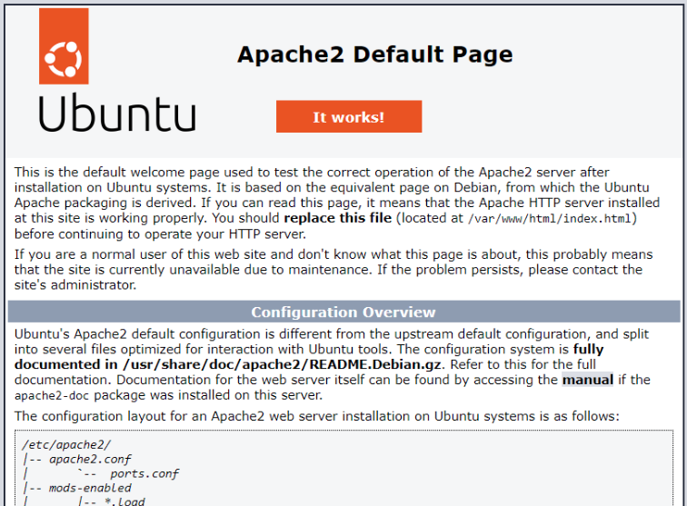

# ⏯️ Playbook
<ais />

## Présentation

Les `playbook` Ansible sont des fichiers `yaml` utilisés pour orchestrer des tâches informatiques. Ils contiennent un ou plusieurs *"jeux"* (`play`) définissant l'état souhaité d'un système distant.

Composant fondamental d'Ansible, un playbook automatise des séries de tâches sur des machines distantes en exécutant leur configuration.

Les `playbook` facilitent l'automatisation en regroupant les ressources nécessaires et en évitant les actions manuelles répétitives. Étant du code source, ils peuvent être réutilisés, partagés et versionnés pour un travail collaboratif.

## Structure du `playbook`

Un `playbook` contient des jeux ordonnés, chacun listant les tâches à exécuter sur des hôtes spécifiques.

Les tâches utilisent des modules pour définir actions et configurations. Leur nature idempotente permet une exécution sécurisée multiple.

Les playbooks utilisent la syntaxe [yaml](https://docs.ansible.com/ansible/latest/reference_appendices/YAMLSyntax.html#yaml-syntax) avec l'extension **`.yaml`**.

> Ci-dessous un exemple de playbook qui sera constitué de deux jeux et qui permettra de mettre en place des configurations pour les deux groupes serveurweb et serveurdatabase.

On commence par créer un fichier appelé `playbook.yaml` :

```yaml
- name: Installe apache , copie des fichiers sur le serveur du groupe serveurweb # nom du premier jeu
  hosts: serveurweb # groupes ou hôtes cibles sur lesquels on fera des déploiements
  become: yes # permet la mise en place des actions d'élévation de privilèges
  tasks:
    - name: Installation apache2 avec élévations de privilèges # nom de la tâche
      apt: # appel du module apt
        name: apache2
        state: present

    - name: Démarrage du service apache2 grâce au module service # nom de la tâche
      service: # appel du module service
        name: apache2 # nous voulons démarrer le service Apache
        state: started # état dans lequel nous voulons le service
        enabled: yes # nous voulons également que le service soit lancé au démarrage du serveur

    - name: Installe apache, copie des fichiers avec élévations de privilèges # nom de la tâche
      copy: # appel du module copy
        src: index.html # fichier à copier depuis le serveur ansible
        dest: /var/www/html # répertoire dans lequel sera copié le fichier index.html sur les cibles
        mode: "0644"

- name: Installation de postgresql et activation du service # nom du second play
  hosts: serveurdatabase # groupes ou hôtes cibles sur lesquels on fera des déploiements
  become: yes # permet la mise en place des actions d'élévation de privilèges
  tasks:
    - name: Installation de postgresql à la derniere version # nom de la tâche
      apt: # appel du module apt
        name: postgresql # nous voulons installer postgresql grâce au module apt
        state: latest # nous voulons postgresql en dernière version

    - name: Démarrage du service potgresql grâce au module service # nom de la tâche
      service: # appel du module service
        name: postgresql # nous voulons démarrer le service postgresql
        state: started # état dans lequel nous voulons le service
        enabled: yes # nous voulons également que le service soit lancé au démarrage du serveur
```

Chaque jeu a un **nom descriptif**, un groupe d'**hôtes** cible issu de l'inventaire, et l'option `become` pour l'exécution en tant que `root`.

Les [mots clés](https://docs.ansible.com/ansible/latest/reference_appendices/playbooks_keywords.html) peuvent être définis à plusieurs niveaux (`play`, `task`, `playbook`) via la ligne de commande, `ansible.cfg` ou l'inventaire, selon les [règles de priorité](https://docs.ansible.com/ansible/latest/reference_appendices/general_precedence.html#general-precedence-rules).

Le paramètre `tasks` liste les tâches de chaque jeu, chacune ayant un nom descriptif et utilisant un module spécifique.

Dans l'exemple, on utilise le module `apt` avec ses **arguments**, puis le module `service` pour gérer les services du système.

## Exécution du `playbook`

Ansible exécute séquentiellement les tâches du `playbook` sur tous les hôtes sélectionnés. Ce comportement est personnalisable via des [stratégies](https://docs.ansible.com/ansible/latest/user_guide/playbooks_strategies.html#playbooks-strategies).

En cas d'échec d'une tâche, l'exécution s'arrête pour l'hôte concerné mais continue pour les autres. Ansible affiche l'état des connexions, tâches et modifications pendant l'exécution.

**Un résumé des ressources créées et erreurs est fourni à la fin.**

On crée le fichier d'inventaire :

``` bash
nano inventaire.yaml
```

Contenu YAML pour les serveurs :

``` yaml
all:
  vars:
    ansible_user: rootdev
    ansible_ssh_private_key_file: ~/.ansible/key.pem
    ansible_become_pass: rootdev2025

serveurweb:
  hosts:
    serveurweb1.rootdev.fr:
      ansible_host: 172.31.x.x
  vars:
    tier: web

serveurdatabase:
  hosts:
    serveurdatabase1.rootdev.fr:
      ansible_host: 172.31.x.x
    tier: bd
```

Téléchargement de la page d'accueil :

``` bash
wget https://unepageindex.com/index.html
```

On exécute le playbook :

``` bash
ansible-playbook -i inventaire.yaml rootdev-playbook.yaml
```

Résultat :

``` bash
PLAY [Installe apache , Copie des fichiers sur le serveur du groupe serveurweb] ********************************************************************************************************

TASK [Gathering Facts] ***********************************************************************************************************************************************
ok: [serveurweb1.rootdev.fr]

TASK [installation apache2 avec élévations de privilèges] ************************************************************************************************************
changed: [serveurweb1.rootdev.fr]

TASK [démarrage du service apache2 grâce au module service] **********************************************************************************************************
ok: [serveurweb1.rootdev.fr]

TASK [Installe apache, copie des fichiers avec élévations de privilèges] **************************************************************************************************************
changed: [serveurweb1.rootdev.fr]
changed: [serveurdatabase1.rootdev.fr]

PLAY [installation de postgresql et activation du service] ***********************************************************************************************************

TASK [Gathering Facts] ***********************************************************************************************************************************************
ok: [serveurdatabase1.rootdev.fr]

TASK [Installation de postgresql à la derniere version] ***********************************************************************************************************

TASK [démarrage du service potgresql grâce au module service] ********************************************************************************************************
ok: [serveurdatabase1.rootdev.fr]

PLAY RECAP ***********************************************************************************************************************************************************
serveurdatabase1.rootdev.fr : ok=3    changed=1    unreachable=0    failed=0    skipped=0    rescued=0    ignored=0
serveurweb1.rootdev.fr : ok=4    changed=1    unreachable=0    failed=0    skipped=0    rescued=0    ignored=0
```

On vérifie la page web à l'adresse IP du `serveurweb` :



On vérifie le serveur de base de données :

``` bash
root@serveurdatabase1.rootdev.fr:~# sudo -i -u postgres
postgres@serveurdatabase1.rootdev.fr:/home/rootdev$ psql
psql (14.5 (Ubuntu 14.5-0ubuntu0.22.04.1))
Type "help" for help.

postgres=#
postgres=#
postgres=#
postgres=#
postgres=#
postgres=# \du
                                   List of roles
 Role name |                         Attributes                         | Member of
-----------+------------------------------------------------------------+-----------
 postgres  | Superuser, Create role, Create DB, Replication, Bypass RLS | {}

postgres=#
postgres=#
```

Pour cibler des hôtes spécifiques, on utilise `--limit` :

``` bash
ansible-playbook -i inventaire.yaml rootdev-playbook.yaml --limit serveurdatabase1.rootdev.fr
```

## Les variables

Les variables sont des valeurs réutilisables dans un `playbook` ou autres objets Ansible, composées uniquement de lettres, chiffres et traits de soulignement, et commençant par une lettre.

Elles peuvent être définies globalement, par hôte ou par lecture, selon une [hiérarchie de priorités](https://docs.ansible.com/ansible/latest/user_guide/playbooks_variables.html#variable-precedence-where-should-i-put-a-variable).

Les variables d'hôte et de groupe sont définies dans les répertoires `host_vars` et `group_vars`, ce dernier contenant des fichiers nommés selon les groupes concernés.

> On crée le fichier serveurweb.yaml dans group_vars pour les variables communes du groupe : 

``` bash
mkdir group_vars
cd group_vars
nano serveurweb.yaml
```

> On ajoute les variables du groupe :

```yaml
tier: web
```

> On crée serveurdatabase.yaml pour les variables du groupe base de données :

``` bash
nano serveurdatabase.yaml
```

Dans ce fichier, on ajoute :

```yaml
tier: db
```

> On modifie inventaire.yaml :

```yaml
all:

serveurdatabase:
  hosts:
    serveurdatabase1.rootdev.fr

serveurweb:
  hosts:
    serveurweb1.rootdev.fr
```

> On crée all.yaml dans group_vars pour les variables globales :

``` bash
nano group_vars/all.yaml
```

> Contenu de all.yaml :

``` yaml
ansible_user: rootdev
ansible_ssh_private_key_file: ~/.ansible/key.pem
ansible_become_pass: rootdev2025
```

Dans host_vars, on définit les variables par hôte :

> On crée le fichier pour le serveur web :

``` bash
mkdir host_vars
cd host_vars
nano serveurweb1.rootdev.fr.yaml
```

Contenu :

``` yaml
ansible_host: 172.31.x.x
```

Pour le serveur de base de données :

``` bash
nano serveurdatabase1.rootdev.fr.yaml
```

Contenu :

``` yaml
ansible_host: 172.31.x.x
```

Pour voir l'arborescence :

``` bash
ansible-inventory -i inventaire.yaml --graph
```

Ou avec tree :

``` bash
sudo apt-get install tree
```

``` bash
tree

# Resultat
.
├── ansible.cfg
├── rootdev-playbook.yaml
├── group_vars
│   ├── all.yaml
│   ├── serveurdatabase.yaml
│   └── serveurweb.yaml
├── host_vars
│   ├── serveurdatabase1.rootdev.fr.yaml
│   └── serveurweb1.rootdev.fr.yaml
├── index.html
├── inventaire.ini
└── inventaire.yaml

2 directories, 10 files
```

On teste avec une commande `Ad Hoc` :

``` bash
ansible all -i inventaire.yaml -m ping
```

Résultat :

``` bash
serveurdatabase1.rootdev.fr | SUCCESS => {
    "ansible_facts": {
        "discovered_interpreter_python": "/usr/bin/python3"
    },
    "changed": false,
    "ping": "pong"
}
serveurweb1.rootdev.fr | SUCCESS => {
    "ansible_facts": {
        "discovered_interpreter_python": "/usr/bin/python3"
    },
    "changed": false,
    "ping": "pong"
}
```

Pour substituer des variables à l'exécution, on utilise `-e` :

``` bash
ansible-playbook -i inventaire.yaml -e ansible_user=rootdev rootdev-playbook.yaml
```

Variables dans un bloc `vars` :

```yaml
- name: ceci est une variable
  hosts: serveurweb
  vars:
    ansble_user: rootdev
    ansible_sudo_pass: rootdev2025
```

Ou dans des fichiers externes avec `vars_files` :

```yaml
- name: ceci est une variable
  hosts: serveurweb
  vars_files:
    - variables/rootdev_variables.yaml
```

Utilisation avec la syntaxe Jinja2 :

```yaml
- name: ceci est une variable
  hosts: serveurweb
  vars:
    utilisateur: rootdev

  tasks:
    - name: Ajouter utilisateur {{ utilisateur }}
      user:
        name: "{{ utilisateur }}"
        state: present
```

Si une variable commence par des accolades, on cite toute l'expression pour une interprétation correcte par `yaml`.

Les variables peuvent être définies sous forme de listes pour stocker plusieurs valeurs.

```yaml
paquets:
  - git
  - tree
  - apache2
```

Pour accéder à un élément spécifique d'une liste :

```yaml
paquets: "{{ paquets[0] }}"
```

Les variables peuvent aussi être des dictionnaires :

```yaml
dictionnaire:
  - nom: rootdev
  - prenom: cyber
```

Pour accéder à une valeur du dictionnaire :

```bash
dictionnaire['nom']
```

Pour les variables imbriquées, on utilise la notation entre crochets ou points :

```yaml
vars:
  variable:
    formation:
      devops: cursus-devops
      cyber: cursus-cyber

tasks:
- name:creation cursus-devops
  user:
    name: "{{ variable['formation']['devops'] }}"
```

L'instruction `register` permet de stocker la sortie d'une commande dans une variable :

```yaml
- name: test du register
  hosts: all

  tasks:
    - name: lance un script et enregistre la sortie comme variable
      shell: "find rootdev.sh"
      args:
        chdir: "/tmp"
      register: sortie_register

    - name: affiche le resultat de la tâche précédente
      debug:
        var: sortie_register
```

## Les facts Ansible

Avant d'exécuter les tâches d'un `playbook`, Ansible collecte automatiquement des informations sur les hôtes distants appelées `facts` :

- **Les interfaces réseau et les adresses**
- **Le système d'exploitation** des nœuds **distants**
- **La mémoire disponible**
- **Le nombre de CPU**
- **Le fabricant de la machine**

Ces informations sont stockées au format `json`. Le module `setup` les collecte avant chaque exécution, sauf si l'option `gather_facts` est désactivée (`no` ou `False`).

Les `facts` sont les données système et propriétés de l'**hôte** cible (IP, `BIOS`, logiciels, matériel). Ils permettent à l'administrateur de gérer les hôtes selon leur état **actuel** plutôt que d'agir sans connaître la **santé** du système.

## Tâches conditionnelles

Les conditions dans Ansible permettent d'exécuter ou d'ignorer des tâches selon certains critères, en utilisant des variables, des facts ou des résultats de tâches précédentes.

Par exemple, on peut mettre à jour une variable selon une autre, sauter une tâche selon une condition, ou exécuter une action selon un seuil.

Pour une condition simple, on utilise le paramètre **when** :

```yaml
- hosts: all
  tasks:
  - package:
      name: "httpd"
      state: present
    when ansible_facts["hostname"] == "serveurweb1.rootdev.fr"
```

Les conditions peuvent aussi dépendre des attributs de l'hôte distant via les `facts`. Voir la [liste des facts](https://docs.ansible.com/ansible/latest/user_guide/playbooks_conditionals.html#commonly-used-facts) couramment utilisés.

```yaml
- name: Exemple de faits conditionnels
  hosts: all
  vars:
    os_support:
      - RedHat
      - Fedora
      - Centos
  tasks:
    - name: Installation de nginx
      yum:
        name: "nginx"
        state: present
      when: ansible_facts['distribution'] in os_support
```

Pour installer Apache sur différentes distributions Linux, il faut tenir compte des gestionnaires de paquets. Sur **RHEL**, Apache s'appelle `httpd`, tandis que le nom varie sur d'autres distributions.

> Exemple de playbook pour déployer httpd sur les hôtes RedHat :

```yaml
- name: Installation d'apache en fonction de la distibution
  hosts: serveurweb
  remote_user: rootdev
  become: true
  tasks:
    - name: Install Apache on CentOS Server
      yum: name=httpd state=present
      become: yes
      when: ansible_os_family == "RedHat"

    - name: Install Apache on Ubuntu Server
      apt: name=apache2 state=present
      become: yes
      when: ansible_os_family == "Debian"
```

Les conditions peuvent être combinées avec des opérateurs logiques :

```yaml
when: (couleur=="rouge" or couleur=="noir") and (taille="grand" or taille="moyen")
```

Pour plusieurs conditions devant toutes être vraies :

```yaml
when:
  - ansible_facts['distribution'] == "Ubuntu"
  - ansible_facts['distribution_version'] == "24.04"
  - ansible_facts['distribution_release'] == "bionic"
```

Les conditions peuvent aussi utiliser des variables enregistrées :

```yaml
- name: Exemple de variables enregistrées conditionnelles
  hosts: all
  tasks:
    - name: Enregistrer un exemple de variable
      shell: cat /etc/hosts
      register: contenu_fichier_hosts

    - name: Vérifie si le fichier hosts contient "localhost"
      shell: echo "/etc/hosts contains localhost"
      when: hosts_contents.stdout.find(localhost) != -1
```

## Boucles

Les boucles Ansible permettent d'exécuter une tâche plusieurs fois avec différents paramètres. Par exemple, une seule tâche avec une boucle peut créer plusieurs fichiers, évitant la répétition de code.

Pour une liste simple, on utilise `loop` avec la variable `item` :

```yaml
- name: "Création de plusieurs fichiers dans /tmp"
  file:
    state: touch
    path: /tmp/{{ item }}
  loop:
    - fichier1
    - fichier2
    - fichier3
```

Sortie de la commande :

``` bash
TASK [ Création de plusieurs fichiers dans le répertoire /tmp ] *********************************
changed: [vagrant1] => (item=fichier1)
changed: [vagrant1] => (item=fichier2)
changed: [vagrant1] => (item=fichier3)
```

Pour les dictionnaires :

```yaml
- name: "Créer des fichiers avec dictionnaires"
  file:
    state: touch
    path: "/tmp/{{ item.nom }}"
    mode: "{{ item.mode }}"
  loop:
    - { nom: "fichier1", mode: "755" }
    - { nom: "fichier2", mode: "775" }
    - { nom: "fichier3", mode: "777" }
```

Pour parcourir des groupes d'hôtes :

```yaml
- name: Permet de recupérer les hôtes du groupe databases
  ansible.builtin.debug:
    msg: "{{ item }}"
  loop: "{{ groups['databases'] }}"
```

Combinaison avec des conditions :

```yaml
- name: Exécuter lorsque les valeurs de la liste sont supérieures à 90
  command: echo {{ item }}
  loop: [100, 200, 3, 600, 7, 11]
  when: item > 90
```

Avec `until`, on réessaye une tâche jusqu'à satisfaction d'une condition :

```yaml
- name: Réessaye une tâche jusqu'à trouver "succes"
  shell: cat /var/log/rootdev.log
  register: logoutput
  until: logoutput.stdout.find("success") != -1
  retries: 10
  delay: 15
```

Pour plus d'informations, lire le [guide](https://docs.ansible.com/ansible/latest/user_guide/playbooks_loops.html) officiel des boucles Ansible.

## Les balises (TAGS)

Les balises permettent de simplifier les playbooks Ansible en ciblant des tâches spécifiques lors de l'exécution.

[Les balises](https://docs.ansible.com/ansible/latest/user_guide/playbooks_tags.html) sont des métadonnées attachées aux tâches, permettant d'exécuter ou d'ignorer certaines tâches à la demande.

> Exemple de playbook avec balises web et bd :

```yaml
- name: Installe apache
  hosts: serveurweb
  become: yes
  tasks:
    - name: Installation apache2
      apt:
        name: apache2
        state: present
      tags:
        - web

    - name: Démarrage apache2
      service:
        name: apache2
        state: started
        enabled: yes
      tags:
        - web

    - name: Copie fichiers
      copy:
        src: index.html
        dest: /var/www/html
        mode: "0644"
      tags:
        - web

- name: Installation postgresql
  hosts: serveurdatabase
  become: yes
  tasks:
    - name: Installation postgresql
      apt:
        name: postgresql
        state: latest
      tags:
        - bd
    - name: Démarrage postgresql
      service:
        name: postgresql
        state: started
        enabled: yes
      tags:
        - bd
```

Pour exécuter uniquement les tâches avec une balise spécifique :

``` bash
ansible-playbook -i inventaire.yaml --tags web rootdev-playbook.yaml
```

Pour ignorer des tâches avec une balise :

``` bash
ansible-playbook -i inventaire.yaml --skip-tags web rootdev-playbook.yaml
```

Pour lister les balises :

``` bash
ansible-playbook -i inventaire.yaml --list-tags rootdev-playbook.yaml
```

La balise `always` permet d'exécuter une tâche même avec `--tags` ou `--skip-tags`. La balise `never` fait l'inverse - la tâche ne s'exécute que si explicitement appelée.

> Exemple avec les balises `always` et `never` :

```yaml
- name: Installe apache
  hosts: serveurweb
  become: yes
  tasks:
    - name: Installation apache2
      apt:
        name: apache2
        state: present
      tags:
        - web

    - name: Démarrage apache2
      service:
        name: apache2
        state: started
        enabled: yes
      tags:
        - web
        - always

    - name: Copie fichiers
      copy:
        src: index.html
        dest: /var/www/html
        mode: "0644"
      tags:
        - web
        - always

- name: Installation postgresql
  hosts: serveurdatabase
  become: yes
  tasks:
    - name: Installation postgresql
      apt:
        name: postgresql
        state: latest
      tags:
        - bd
    - name: Démarrage postgresql
      service:
        name: postgresql
        state: started
        enabled: yes
      tags:
        - bd
        - never
```

> Exécution avec tag bd :

``` bash
ansible-playbook -i inventaire.yaml --tags bd rootdev-playbook.yaml
```

Les tâches avec `always` s'exécutent toujours, tandis que celles avec `never` ne s'exécutent que si explicitement appelées.

Plus d'informations : [Documentation](https://docs.ansible.com/ansible/latest/user_guide/playbooks_tags.html)

## Templating avec Jinja2

### **Introduction**

[Jinja2](https://palletsprojects.com/p/jinja/) est un moteur de template Python permettant de générer des données dynamiques. Ansible l'utilise pour ses fichiers de modèle.

Les modèles servent à générer des fichiers de configuration et autres fichiers texte sur le serveur distant via le module `template` d'Ansible. L'extension est `.j2`.

Jinja2 utilise trois types de délimiteurs :

- `{# #}` : Pour les commentaires

- `` : Pour les instructions de contrôle (boucles, conditions)

- `{ }` : Pour l'interpolation de variables

Les templates Jinja2 permettent de créer des fichiers dynamiques en remplaçant les variables par leurs valeurs lors de l'exécution des playbooks.

### Exemple pratique

> On crée un répertoire modeles pour les templates :

``` bash
mkdir modeles
```

> On crée index.html.j2 :

``` jinja2
Un message de la machine {{ inventory_hostname }}
{{ serveurweb_message }}
```

Structure du projet :

``` bash
├── ansible.cfg
├── rootdev-playbook.yaml
├── group_vars
│   ├── all.yaml
│   ├── serveurdatabase.yaml
│   └── serveurweb.yaml
├── host_vars
│   ├── serveurdatabase1.rootdev.fr.yaml
│   └── serveurweb1.rootdev.fr.yaml
├── index.html
├── inventaire.ini
├── inventaire.yaml
└── modeles
    └── index.html.j2

3 directories, 12 files
```

`inventory_hostname` fait référence à l'hôte en cours. `serveurweb_message` est défini dans le playbook.

> On crée apache2.yaml pour installer Apache et utiliser le template :

``` bash
touch apache2.yaml
```

> Contenu du playbook :

```yaml
- name: Playbook pour installer et démarrer le paquet apache
  hosts: serveurweb
  become: yes
  vars:
    serveurweb_message: "RootDev ANSIBLE."
  tasks:
    - name: Installer le paquet apache2
      apt:
        name: apache2
        state: present
    - name: Démarrer le service httpd
      service:
        name: apache2
        state: started

    - name: Créer index.html en utilisant Jinja2
      template:
        src: modeles/index.html.j2
        dest: /var/www/html/index.html
```

Ce playbook installe Apache et utilise le template pour créer index.html.

> Exécution :

``` bash
ansible-playbook -i inventaire.yaml apache2.yaml
```

Résultat :

``` bash
PLAY [Playbook pour installer et démarrer le paquet apache] *******************************************************************************

TASK [Gathering Facts] ********************************************************************************************************************
ok: [serveurweb1.rootdev.fr]

TASK [Installer le paquet apache2] ********************************************************************************************************
ok: [serveurweb1.rootdev.fr]

TASK [Démarrer le service httpd] **********************************************************************************************************
ok: [serveurweb1.rootdev.fr]

TASK [Créer index.html en utilisant Jinja2] ***********************************************************************************************
changed: [serveurweb1.rootdev.fr]

PLAY RECAP ********************************************************************************************************************************
serveurweb1.rootdev.fr : ok=4    changed=1    unreachable=0    failed=0    skipped=0    rescued=0    ignored=0
```

## Importation d'un `playbook` Ansible

Avec la directive `import_playbook`, un ou plusieurs `playbook` peuvent être importés. La directive `import_playbook` importe de façon statique un `playbook` dans un autre `playbook`. Cette directive est très utile quand on veut diviser un jeu en plusieurs fonctions, on en créera donc plusieurs ainsi qu'un fichier principal **parent** qui sera utilisé pour appeler les `playbook` **enfants** :

```yaml
- name: Installe php
  import_playbook: install_php.yaml

- name: Installe apache2
  import_playbook: install_apache2.yaml

- name: installe wordpress et copie les fichiers de configuration
  import_playbook: install_wordpress.yaml

- name: Démare les services apache , mariadb
  hosts: group1
  tasks:
    - name: Démarrage des services
      service:
        name: { { item } }
        enabled: true
        state: started
      loop:
        - apache2
        - mariadb

- name: Ouvre les ports iptables
  import_playbook: allow_apache2.yaml

```

Pour importer une tâche dans un playbook, le mot-clé `import_tasks` sera utilisé.