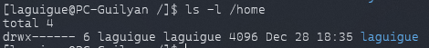

# ⌨️ Commandes de base
<ais />

## 🕹️ À quoi ressemble une commande ?

Pour effectuer diverses actions sur un système Linux *(comme lancer un programme, naviguer dans l’arborescence des fichiers, ou modifier les permissions d’un fichier ou d’un dossier)*, des **commandes** sont utilisées. Ces commandes sont généralement structurées de la manière suivante :

```bash
<nom de la commande> <options> <arguments>
```

Exemple :

```bash
ls -l /home
```



Dans cet exemple, `ls` est la commande pour lister le contenu d’un répertoire, `-l` est une option pour obtenir une liste détaillée, et `/home` est l’argument qui spécifie le répertoire à lister.

## Liste non exhaustive des commandes couramment utilisées

### 📂 Trouver le répertoire courant

Pour localiser sa position dans l'arborescence, on utilise la commande `pwd` *(print working directory)* :

```bash
pwd
```

### 📋 Lister le contenu d'un répertoire

La commande `ls` affiche le contenu d'un dossier :

```bash
ls
```

Pour voir le contenu d'un autre dossier, on ajoute son chemin comme argument :

```bash
ls /home
```

La commande `ls` offre plusieurs options utiles :

- **`-a`** : affiche les fichiers cachés *(commençant par `.`)*
- **`-l`** : affiche les détails *(permissions, taille, propriétaire)*
- **`-R`** : liste récursive des sous-dossiers
- **`-lh`** : taille des fichiers en format lisible *(Ko, Mo, Go)*
- **`-t`** : tri par date de modification

Pour voir toutes les options disponibles :

```bash
ls --help
```

### 📕 Accéder au manuel d'utilisation

La commande `man` affiche le manuel détaillé de n'importe quelle commande :

```bash
man ls
```

Appuyez sur `q` pour quitter.

### 📒 Comprendre les chemins

Dans le système de fichiers Linux :

`.` représente le répertoire courant
`..` représente le répertoire parent

Deux types de chemins existent :

- **Chemin absolu** : depuis la racine `/` (ex: `/home/ubuntu`)
- **Chemin relatif** : depuis la position actuelle (ex: `../dossier`)

Exemples d'utilisation :

```bash
ls ..
```

```bash
ls ../../usr/bin
```

Les chemins absolus et relatifs sont interchangeables dans la plupart des cas.

### ⛵ Naviguer dans l’arborescence de fichier

La commande `cd` *(change directory)* permet de naviguer entre les répertoires. Pour aller à la racine :

```bash
cd /
```

## 🫳 Manipulation de fichiers et dossiers

### 📁 Créer un fichier

La commande `touch` permet de créer un fichier vide :

```bash
touch file
```

> Si le fichier existe déjà, seule sa date de modification est mise à jour.

### 🗃️ Créer un répertoire

La commande `mkdir` crée un nouveau répertoire :

```bash
mkdir nouveau_dossier
```

On utilise `ls` pour vérifier la création du dossier.

Dans `/home`, les permissions sont plus restrictives qu'en `/home/ubuntu`. Pour y créer des fichiers ou dossiers, on utilise `sudo` avant la commande pour obtenir les privilèges administratifs nécessaires. 

> Par exemple : `sudo mkdir rootdev`. 

On peut aussi créer un fichier en spécifiant son chemin complet :

```bash
sudo touch ./rootdev/index_linux.md
```

### ❌ Supprimer un fichier

La commande `rm` supprime fichiers et dossiers. Exemple avec `index_linux.md` :

```bash
rm index_linux.md
```

ou avec chemin relatif/absolu :

```bash
rm ./index_linux.md
```

```bash
rm /home/rootdev/index_linux.md
```

Pour supprimer un dossier et son contenu, on utilise `-r` :

```bash
sudo rm -r /home/rootdev
```

### ➡️ Copier, coller ou déplacer un fichier ou un dossier

- Pour copier ou déplacer des fichiers, on utilise `cp` ou `mv`. Exemple de copie :

```bash
sudo cp ./index_linux.md /home/rootdev2/
```

> On peut utiliser des chemins relatifs et absolus dans la même commande.

Pour copier en renommant :

```bash
sudo cp ./index_linux.md /home/rootdev2/backup.md
```

Pour déplacer en renommant :

```bash
sudo mv ./index_linux.md /home/rootdev2/backup.md
```

> 💡 **Astuces supplémentaires :**
>
> 1. Utiliser `mv` pour renommer un fichier dans le même répertoire.
> 2. Vérifier les modifications avec la commande `ls -R`.
> 3. Pour copier des dossiers, ajouter l'option `-r` à la commande `cp`.


### 🖨️ Imprimer du contenu dans le terminal et dans un fichier

Pour imprimer du texte dans le terminal, on utilise la commande `echo` :

```bash
echo Hello World !
```

La sortie peut être redirigée vers un fichier avec `>` ***(écrase)*** ou `>>` ***(ajoute)*** :

```bash
echo Hello World ! > index_linux.md
```

Pour lire un fichier, utilisez `cat` :

```bash
cat index_linux.md
> Hello World !
```

Pour les fichiers volumineux, on peut rediriger la sortie vers un fichier :

```bash
ls -aRlth > content.txt
```

On utilise `head` ou `tail` avec `-n` pour afficher un nombre spécifique de lignes :

```bash
head -n 10 content.txt
```

ou

```bash
tail -n 10 content.txt
```

## 💬 Les éditeurs de texte

**`Nano`** et **`Vim`** : ces outils permettent de modifier des fichiers directement en ligne de commande. 

### 1️⃣ Nano

**Nano** est un éditeur simple pour débutants. Pour l'utiliser :

```bash
 nano content.txt
```

1. **Écrire et éditer du texte** : - Naviguer avec les flèches

```
- J'écris du texte dans mon fichier blablablabla.
```

2. **Commandes essentielles** :
    - **Enregistrer** : **`Ctrl + O`**, puis **`Entrée`**.
    - **Quitter** : **`Ctrl + X`**.
    - **Couper une ligne** : **`Ctrl + K`**.
    - **Coller une ligne** : **`Ctrl + U`**.

### 2️⃣ Vim

**Vim** est un éditeur de texte avancé avec deux modes principaux :

1. **Ouvrir un fichier** :

```bash
vim content.txt
```

1. **Modes principaux** :
    - **Mode normal** : Navigation et commandes
    - **Mode insertion** : Édition (touche **`i`**)
2. **Commandes essentielles** :
    - **Enregistrer et quitter** : **`:wq`**
    - **Quitter sans enregistrer** : **`:q!`**
    - **Supprimer** : **`dd`** | **Copier** : **`yy`** | **Coller** : **`p`**

Pratique régulière recommandée pour maîtriser ces commandes de base.

## 🔀 Les flux de redirection

### ➡️ Redirections des sorties

En utilisant `&gt;` et `&gt;&gt;`, on peut rediriger la **sortie standard** vers des fichiers. La sortie standard contient le résultat des commandes, tandis que l'**erreur standard** affiche les messages d'erreur. Par défaut, les deux s'affichent dans la console.

Les flux de sortie peuvent être redirigés vers d'autres destinations, comme des fichiers texte.

Si on exécute la commande ci-dessous, elle va générer une erreur :

```bash 
cat no_file
```

Pour rediriger cette erreur générée vers un fichier, on utilise `2&gt;` ou `2&gt;&gt;` :

```bash
cat no_file 2> errors_file
```

::: info Significations
`&lt;` = `<`

`&gt;` = `>`

`&le;` = `≤`

`&ge;` = `≥`
:::

Le message d'erreur sera enregistré dans `errors_file` au lieu de s'afficher dans la console.

> Pour visualiser le contenu de ce fichier :

```bash
head errors_file
```

Les descripteurs de fichier sont : 
- 0 (entrée standard)
- 1 (sortie standard)
- 2 (erreur standard). 

`&gt;` est l'équivalent de `1&gt;`, et l'entrée standard utilise `&lt;` ou `0&lt;`.

> Si on exécute la commande suivante :

```bash
head < root_content
```

Cette commande est identique à `head root_content`. L'entrée standard `&lt;` permet de passer le contenu d'un fichier en argument.

> Exemple :

On crée le fichier `nom.py` avec la commande `nano nom.py` avec le contenu suivant :

```python
name = input("Entrez votre nom\n")
print("Bonjour {} !".format(name))
```

Ensuite, on écrit RootDev dans un fichier texte prenom via la sortie standard.

`echo RootDev > prenom`

On exécute notre "script" Python :

```bash
python3 nom.py < prenom
> Bonjour RootDev !
```

Sans l'entrée standard, le programme demanderait le prénom avant d'afficher le message de bienvenue.


## 🔹 Opérateur pipe `|`

L'opérateur `|` permet d'utiliser la sortie d'une commande comme entrée d'une autre.

> Exemple :

```bash
ls / | grep bin
```

`ls /` affiche le contenu de la racine et `grep` filtre les lignes contenant `bin`. Les pipes peuvent être enchaînés :

L'opérateur `&&` permet simplement d'enchaîner des commandes indépendantes.

```bash
ls -l && python3 --version && mkdir RootDev
```

Si une commande échoue, les suivantes ne sont pas exécutées *(**évaluation paresseuse**)*.