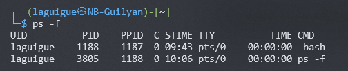

# ⚡ Gestion des programmes
<ais />

## 📦 Gestionnaires de paquets et dépôts de logiciels

### ❓ Qu’est-ce qu’un gestionnaire de paquets ?

Un **gestionnaire de paquets** automatise l'installation, la mise à jour et la désinstallation de logiciels Linux. Les deux principaux types sont **RPM** (Red Hat Package Manager) pour Redhat/Fedora/CentOS et **DPKG** (Debian Package) pour Debian/Ubuntu/Mint. Ici on utilisera **DPKG** et **APT**, son interface simplifiée.

### 🛠️ L’outil principal : `apt`

**`apt`** *(Advanced Package Tool)* est un gestionnaire de paquets adapté aux distributions basées sur **Debian**. Il simplifie grandement la gestion des logiciels, en prenant en charge automatiquement les dépendances nécessaires à l’installation.

> Pour les ***RPM***, on remplacera `apt` par `dnf`

**1. Mettre à jour la liste des paquets** *(une étape souvent requise avant toute installation)* :

```bash
sudo apt update
```

**2. Installer un logiciel** *(comme `wget`, par exemple)* :

```bash
sudo apt install wget
```

**3. Mettre à jour tous les logiciels installés :**

```bash
sudo apt upgrade
```

4. **Désinstaller un logiciel** :

```bash
sudo apt remove wget
```

> 💡 **Astuce : lire les messages d'erreur**
>
> Des erreurs peuvent survenir lors de l'installation avec `apt`. Le message indique souvent qu'il faut d'abord mettre à jour la liste des paquets avec `sudo apt update`.
>
> **La lecture attentive de ces messages** permet d'identifier et de résoudre rapidement les problèmes.


#### 🆚 Comparaison rapide avec `dpkg`

À propos de **`apt`** et **`dpkg`** :

- **`dpkg`** est l'outil de base qui installe les fichiers `.deb` sans gérer les dépendances.
- **`apt`** est l'outil recommandé : il gère les dépendances et les mises à jour automatiquement.

### 📦 Dépôts de paquets

Un **dépôt de paquets** est une source de logiciels en ligne où **`apt`** cherche les logiciels à installer. Dans Ubuntu, la liste des dépôts configurés se trouve dans le fichier `/etc/apt/sources.list`.

### ⚙️ Commandes principales pour interagir avec les dépôts via `apt`

**Rechercher un paquet :**

```bash
apt search wget
```

**Lister les paquets installés :**

```bash
apt list --installed
```

**Afficher des informations sur un paquet :**

```bash
apt show wget
> Package: wget
> Version: 1.24.5-2+b1
> Priority: standard
> Section: web
> Source: wget (1.24.5-2)
> Maintainer: Noël Köthe <noel@debian.org>
> Installed-Size: 3,856 kB
> [...]
```

## 📝 Gestion des processus

Lorsqu’un programme est exécuté, un processus est créé, une instance active du programme, qui fonctionne dans un environnement dédié. Cet environnement contient tout ce qui est nécessaire pour permettre au programme de fonctionner sans interférer directement avec d’autres processus.

### ❔ Qu’est-ce qu’un processus ?

Un processus est une instance active d'un programme. Lorsqu'une commande est lancée *(comme **`ls`** pour lister les fichiers)*, le système crée un processus avec un identifiant unique appelé **PID** (Process ID).

### ⚙️ Types de processus

Lors du démarrage d’un processus, il peut être exécuté de deux manières différentes : 

- **Processus de premier plan** ***(Foreground Processes)***
- **Processus d’arrière-plan** ***(Background Processes)***

Chacune de ces options offre des avantages en fonction des besoins de l'utilisateur.

### 🥇 Processus de premier plan

Un processus lancé en ligne de commande s'exécute au premier plan par défaut. Il occupe alors le terminal, recevant les entrées clavier et affichant ses sorties à l'écran. Le terminal reste bloqué jusqu'à la fin du processus. Par exemple, la commande suivante liste tous les fichiers qui commencent par `fich` : 

```bash
┌──(laguigue㉿NB-Guilyan)-[~]
└─$ ls -fich
16386 ..                         952286 Public             33104 .zprofile          952273 .cache
380 .bashrc                    952847 .Xauthority       952834 .xorgxrdp.12.log    33114 .config
952295 Documents                  952606 .xorgxrdp.11.log  952324 .bash_history      952362 .face.icon
33126 .sudo_as_admin_successful  952297 Pictures          952319 .gnupg             952283 Templates
952299 Videos                      33096 .zshrc             33109 .bashrc.original   952282 Downloads
228 .                          952223 .xsession-errors  951579 .xorgxrdp.10.log   952361 .face
952296 Music                      952315 .ICEauthority     952230 thinclient_drives   33117 .java
952275 Desktop                     33097 .bash_logout       33110 .profile            33121 .local
```

### 🔙 Processus d’arrière-plan

Un processus en arrière-plan s'exécute sans bloquer le terminal, permettant de continuer à utiliser le système pendant son exécution. Pour lancer un processus en arrière-plan, ajoutez `&`à la fin de la commande :

```bash
ls -fich &
```

> Cela est utile pour les processus longs ou lorsque des tâches parallèles doivent être effectuées.

### 🧠 Gestion des processus en cours

Il est important de savoir gérer les processus actifs sur le système. Lorsqu'on utilise des logiciels complexes qui lancent plusieurs processus, ces derniers peuvent parfois consommer trop de ressources et ralentir le système. Voici les commandes clés pour identifier et résoudre ces situations.

### 🤓 Comprendre la commande `ps -f`



La commande **`ps -f`** fournit une vue détaillée des processus en cours d'exécution.

- **UID** : Identifiant de l’utilisateur ayant lancé le processus 

- **PID** : Identifiant unique du processus 

- **PPID** : Identifiant du processus parent 

- **C%** : Pourcentage d'utilisation du CPU par le processus 

- **STIME** : Heure de début du processus 

- **TTY** : Terminal associé au processus 

- **TIME** : Temps CPU utilisé par le processus depuis son lancement 

- **CMD** : La commande ayant démarré le processus

### 🙅 Arrêt des processus

Pour arrêter un processus, plusieurs méthodes peuvent être utilisées : 

- **Processus en avant-plan** : On utilise la combinaison **`CTRL + C`** pour interrompre un processus qui occupe le terminal. 

- **Processus en arrière-plan** : On liste d'abord les processus en cours avec la commande **`ps`** pour récupérer le **PID**. Ensuite, on utilise **`kill [PID]`** pour arrêter le processus. Si le processus ne se termine pas, la commande **`kill -9 [PID]`** forcera son arrêt.

### 👨‍👨‍👧‍👦 Relations entre processus : parents et enfants

Chaque processus est créé par un autre processus, qui devient son **processus parent**. Le processus parent est identifié par le **PPID** *(Parent Process ID)*. Par exemple, lorsque une commande est exécutée dans le terminal, le shell (ayant son propre PID) est souvent le parent du processus qui a été lancé.

### 🧟 Processus zombies et orphelins

- **Processus orphelins** : Un processus devient orphelin lorsque son parent se termine avant lui. Dans ce cas, il est réassigné au processus **init** (PID 1), qui gère les processus restants.
- **Processus zombies** : Un processus zombie est un processus terminé qui reste dans la table des processus parce que son parent n’a pas encore récupéré son état de terminaison. Les processus zombies ne consomment pas de ressources mais peuvent encombrer la table des processus.

### 😈 Processus Daemon

Les **daemons** sont des processus en arrière-plan qui s'exécutent généralement avec des privilèges d'administrateur. Ils n'ont pas de terminal associé et sont souvent chargés de répondre à des requêtes spécifiques ou de gérer des services système *(comme les serveurs web, la gestion des tâches, etc.)*.

### 🔝 La commande `top`

La commande **`top`** est un outil puissant pour surveiller les processus en temps réel. Elle affiche de manière dynamique les processus actifs, leur consommation en mémoire et CPU, et permet de trier les processus selon divers critères. C'est un outil indispensable pour identifier les processus gourmands en ressources.

```bash
┌──(laguigue㉿NB-Guilyan)-[~]
└─$ top
top - 10:17:33 up 34 min,  2 users,  load average: 0.00, 0.06, 0.13
Tasks:  30 total,   1 running,  29 sleeping,   0 stopped,   0 zombie
%Cpu(s):  0.0 us,  0.0 sy,  0.0 ni, 99.9 id,  0.0 wa,  0.0 hi,  0.0 si,  0.0 st
MiB Mem :  15918.0 total,  14692.2 free,    771.3 used,    785.1 buff/cache
MiB Swap:   4096.0 total,   4096.0 free,      0.0 used.  15146.7 avail Mem
PID USER      PR  NI    VIRT    RES    SHR S  %CPU  %MEM     TIME+ COMMAND
481 root      20   0 2165976  47332  28872 S   0.3   0.3   0:01.11 containerd
  1 root      20   0   23632  14228  10492 S   0.0   0.1   0:02.06 systemd
  2 root      20   0    2776   1924   1796 S   0.0   0.0   0:00.04 init-systemd(ka
  6 root      20   0    2776      4      0 S   0.0   0.0   0:00.00 init
```

L'interface de **`top`** permet également de terminer des processus directement à partir de cette vue, en utilisant leur **PID**.


## 🤖 Automatisation des tâches avec Crontab

Pour automatiser des tâches sous Linux, deux éléments essentiels sont à comprendre : le programme **Cron** et le fichier **Crontab**. Ces deux éléments agissent en tandem pour permettre la programmation et l’exécution automatique de tâches à des intervalles définis.

### ✈️ Le programme Cron

Le programme **Cron** est un service Unix léger, conçu pour l’automatisation simple des tâches. Son nom provient du mot grec “Chronos”, signifiant le temps. Cron exécute les tâches selon un planning prédéfini et est adapté aux automatisations basiques. Cependant, sa simplicité présente des limites : 

- Les tâches ne peuvent pas être programmées pour des intervalles plus courts qu'une minute.
- Cron ne reconnaît pas les chemins relatifs. Par conséquent, il est **fortement recommandé** d'utiliser uniquement des **chemins absolus** dans les commandes et scripts.

### 📁 Le fichier Crontab

**Crontab** est le fichier de configuration qui définit quand exécuter des tâches automatisées. Il permet de programmer l'exécution périodique de commandes et scripts. 

> **Utilisations courantes** : gestion des logs, nettoyage du cache, envoi d'emails automatiques et traitement de données.

### 📖 Syntaxe d'un Cron Job

Un Cron Job est une automatisation de tâches à réaliser. 

La syntaxe est la suivante :

```bash
* * * * * command/script
```

Chaque astérisque `*` représente une unité de temps, dans cet ordre : 

- **Minute (0-59)** 

- **Heure (0-23)** 

- **Jour du mois (1-31)** 

- **Mois de l'année (1-12)** 

- **Jour de la semaine (0-6, du dimanche au samedi)**

### 📅 Opérateurs de planifications

Pour personnaliser l'intervalle d’exécution, on utilise : 

- **Astérisque (`*`)** : Pour exécuter la tâche pour toutes les valeurs possibles du champ, 

- **Tiret (`-`)** : Pour définir une plage de valeurs *(par ex. `1-5`)*, 

- **La virgule (`,`)** : Pour spécifier une liste de valeurs *(par ex. `1,15,30`)*, 

- **Le séparateur (`/`)** : Pour définir une fréquence d’étape *(par ex. `*/2` pour toutes les 2 unités)*.


> ⚠️ **Rappel important : utilisation des chemins absolus**
> 
> Dans les commandes et scripts Crontab, on utilise uniquement des **chemins absolus** pour éviter les erreurs d'exécution.
>
> 1. **Commandes Crontab** : On utilise le chemin complet (ex. `/home/user/script.sh`) et non relatif (ex. `~/script.sh`).
> 2. **Dans les scripts** : Pour les fichiers référencés, on utilise des chemins absolus (ex. `/home/user/dossier/fichier.txt`).
>
> Cette pratique assure une exécution fiable des tâches automatisées.


### 👉 Exemples

Voici quelques exemples pratiques :

Exécuter une tâche tous les jours à 5h15 :

```bash
15 5 * * * command/script
```

Exécuter une tâche à 5h15 tous les 2èmes jours du mois :

```bash
15 5 2 * * command/script
```

Exécuter une tâche toutes les 5 heures :

```bash
0 */5 * * * command/script
```

Exécuter une tâche chaque lundi et mercredi des mois de janvier et février :

```bash
0 0 * jan,feb mon,wed command/script
```

### 🧰 Commandes Crontab utiles

- **`crontab -e`** : Pour modifier le fichier crontab de l'utilisateur actuel
- **`crontab -l`** : Pour afficher le contenu du fichier crontab
- **`crontab -u [nom d'utilisateur]`** : Pour modifier le fichier crontab d'un autre utilisateur
- **`crontab -r`** : Pour supprimer le fichier crontab de l'utilisateur actuel
- **`crontab -i`** : Pour afficher une invite avant de supprimer le fichier crontab de l'utilisateur actuel