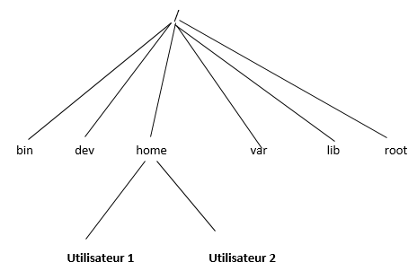
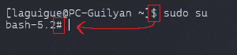
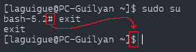
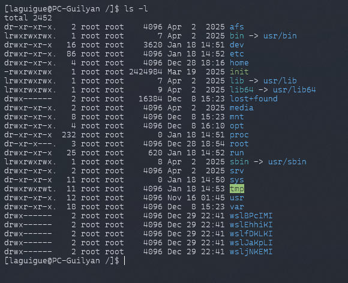

# 📔 Histoire et principes clés
<ais />

## 🤔 Pourquoi j'étudie ceci ?

- **L'histoire de Linux** permet de comprendre son évolution et son impact technologique.
- **La connaissance des distributions** aide à choisir la version adaptée à ses besoins.
- **Comprendre la structure du système de fichiers** est essentiel pour la sécurité des données.
- **Comprendre l'évolution de Linux** et identifier les principales distributions.
- **Naviguer dans la structure du système de fichiers sur Linux** pour localiser et organiser les fichiers.
- **Gérer les utilisateurs et les permissions** afin de protéger l'accès aux fichiers et ressources système.

## 🦕 Histoire & distributions

Dans les années 80, **Richard Stallman** crée GNU, un système d'exploitation libre basé sur Unix. Parallèlement, Linus Torwalds développe Linux. La fusion des deux projets donne naissance à GNU/Linux. Plusieurs distributions majeures en découlent :

- **Debian**
- **Red Hat**
- ...


Parmi les distributions dérivées, **Ubuntu** est la plus populaire. Basée sur Debian, elle bénéficie d'une grande communauté assurant documentation et mises à jour régulières.


## 🧱 Structure du système de fichiers sur Linux

L'architecture des dossiers Linux est comparable à un arbre : depuis la racine `/`, tous les fichiers sont accessibles en suivant un chemin spécifique, quel que soit leur support de stockage *(disques durs, clés USB, etc.)*.

La **racine** est la base du stockage, qui se divise en répertoires, puis en sous-répertoires jusqu'aux fichiers *(les feuilles de l'arbre)*.

Voici les principaux dossiers à la racine :



- **`/`** : Racine du système
- **`/bin`** : Programmes système essentiels
- **`/boot`** : Fichiers de démarrage
- **`/dev`** : Fichiers des périphériques
- **`/etc`** : Configuration système
- **`/home`** : Dossiers des utilisateurs
- **`/lib`** : Bibliothèques système
- `/lost+found` : contient les fichiers corrompus après une chute du système ;
- **`/media`** : Points de montage des médias amovibles
- **`/mnt`** : Montages temporaires
- **`/opt`** : Logiciels optionnels
- `/proc` : contient les informations système ;
- **`/root`** : Dossier de l'administrateur
- `/run` : contient des fichiers temporaires utilisés par des programmes qui ne doivent ***PAS*** être supprimés ;
- **`/sbin`** : Programmes d'administration
- `/srv` : contient les données nécessaires à des processus qui fournissent des services *(fichiers web par exemple, ...)* ;
- **`/tmp`** : Fichiers temporaires
- **`/usr`** : Programmes utilisateur
- **`/var`** : Données variables *(logs, mails, etc.)*

## 🧑‍⚖️ Utilisateurs et droits

Linux est un système multi-utilisateurs permettant des accès simultanés. **Il s'adapte parfaitement aux serveurs** *(notamment pour l'hébergement web où chaque site a son propre utilisateur)*.

Pour garantir la sécurité des données, Linux utilise deux niveaux d'autorisation : **la propriété** *(utilisateurs)* et **les permissions** *(droits)*.

### 🏠 Propriété

La propriété définit *"Qui a quels droits sur le fichier ou le dossier ?"* selon trois niveaux :

- **👨 User (l'utilisateur)** : l'utilisateur est le propriétaire du fichier, généralement celui qui l'a créé.

- **👨‍👩‍👧‍👦 Group (le groupe d'utilisateurs)** : un groupe permet de donner les mêmes droits d'accès à plusieurs utilisateurs sur des fichiers spécifiques.

- **👤 Others (les autres utilisateurs)** : les "autres" représentent tous les utilisateurs n'étant ni propriétaires ni membres d'un groupe autorisé. Leurs permissions sont souvent limitées pour protéger le système.

Pour des raisons de sécurité, les actions système importantes nécessitent les droits root *(Super Utilisateur)*.

## 👑 L'utilisateur Root et la commande `sudo`

L'utilisateur root (Super Utilisateur) possède des droits d'administration complets sur le système. Pour protéger contre les erreurs et attaques, les autres utilisateurs ont des droits limités et ne peuvent pas modifier les fichiers système critiques. Seul root peut accéder aux fonctionnalités sensibles, ce qui maintient la sécurité et la stabilité du système.

Voici comment utiliser ce rôle :

- Pour se connecter en mode super utilisateur (root), la commande suivante peut être utilisée :

```bash
sudo su
```



On peut remarquer que l'invite de commande change de **`$`** à **`#`**.

> De plus, la commande **`cd`** amène directement à **`/root`** au lieu de **`/home/ubuntu`**.

- Pour quitter ce mode, on utilise la commande :

```bash
exit
```



- Pour exécuter une commande avec les droits root, on ajoute le préfixe **`sudo`**. Un mot de passe peut être demandé pour confirmer l'élévation des privilèges.

## 🛂 Permissions

Les fichiers et dossiers possèdent trois types de permissions pour chaque propriétaire :

- **®️ Lire (R)** : Permet de lire un fichier ou lister le contenu d'un répertoire.

- **✍️ Écrire (W)** : Permet de modifier un fichier ou gérer les fichiers d'un répertoire.

- **🆗 Exécuter (X)** : Nécessaire pour exécuter un programme, même si on peut lire/modifier son code avec les autres permissions.

### ☑️ Vérifier les permissions

Listez les éléments disponibles à la racine `/` en utilisant l'argument `-l` :

```bash
ls -l /
```

Les sorties devraient ressembler à cela :



Différentes parties peuvent être observées.

La deuxième ligne peut être expliquée de la manière suivante : 

`lrwxrwxrwx 1 root root 7 Apr 2 2025 bin -> usr/bin`

- `lrwxrwxrwx` : liste des permissions sur l'objet
- `1` : nombre de liens vers cet objet
- `root` : nom d'utilisateur du propriétaire
- `root` : nom du groupe d'utilisateur du propriétaire
- `7` : taille de l'objet
- `Apr 2 2025` : dernière date de modification
- `bin` : nom de l'objet
- `-> usr/bin` : lien symbolique pointant vers `usr/bin`, indiquant que `bin` est un raccourci vers ce répertoire.

### La première partie `lrwxrwxrwx`

Représente les droits d’accès à l'objet. Elle se compose d’un premier caractère qui définit la nature de l’objet, suivi de trois groupes de trois caractères représentant les permissions.

- `l` : le premier caractère correspond à la nature de l'objet :
    - `d` pour un dossier,
    - `-` pour un fichier ordinaire,
    - `l` pour un lien symbolique, etc.
- `rwx` : correspond aux permissions accordées au propriétaire de l'objet *(ici toutes les actions sont autorisées : ***lecture***, ***écriture***, ***exécution***)*
- `rwx` : correspond aux permissions accordées aux utilisateurs qui appartiennent au même groupe que le propriétaire de l'objet
- `rwx` : correspond aux permissions accordées aux autres utilisateurs

Ces permissions peuvent sembler compliquées, mais en réalité, les lettres indiquent que l'autorisation est donnée, tandis que `-` indique que la permission n'est pas accordée. Ainsi, les lettres suivantes peuvent être rencontrées :

- Droits en lecture : `r`
- Droits en écriture : `w`
- Droits en exécution : `x`
- Information concernant le fait que ce soit un dossier ou non : `d`

L'utilisation de groupes d'utilisateurs est intéressante, car elle permet de donner des droits à un groupe de personnes (utilisateurs ou applications) d'un coup.

### 🪒 Modifier les permissions

Pour changer les permissions d'un fichier, il faut utiliser la commande `chmod` . Il existe deux manières de procéder :

#### 1️⃣ Utilisation des chiffres :

```bash
chmod 777 fichier
```

La première méthode consiste à utiliser une représentation binaire des permissions : chaque chiffre correspond à un groupe d'utilisateurs :

- **`0`** = **`---`** : aucun droit
- **`1`** = **`--x`** : uniquement le droit à l’exécution
- **`2`** = **`-w-`** : uniquement le droit en écriture *(impossible de lister le contenu d’un dossier ou d'afficher un document)*
- **`3`** = **`-wx`** : écriture et exécution autorisées
- **`4`** = **`r--`** : uniquement lecture autorisée
- **`5`** = **`r-x`** : écriture non autorisée, mais lecture et exécution accordées
- **`6`** = **`rw-`** : lecture et écriture autorisées, mais exécution impossible
- **`7`** = **`rwx`** : tout est autorisé

#### 2️⃣ Utilisation des lettres :

```bash
chmod a+rwx fichier
```

Cette méthode permet de spécifier les utilisateurs à qui des permissions doivent être attribuées ou retirées, ainsi que les droits à modifier.

- **`a`** : désigne les utilisateurs concernés par la modification. Il est possible d'utiliser :
    - **`a`** pour "all" *(tous les utilisateurs)*
    - **`u`** pour le propriétaire *(user)*
    - **`g`** pour le groupe *(group)*
    - **`o`** pour les autres utilisateurs *(others)*
- **`+` ou `-`**  : indique si des permissions sont ajoutées ou retirées.
    - **`+`** : ajoute les droits spécifiés
    - `-` : retire les droits spécifiés
- **`rwx`** : représente les droits à ajouter ou retirer :
    - **`r`** : droit de lecture *(read)*
    - **`w`** : droit d'écriture *(write)*
    - **`x`** : droit d'exécution *(execute)*

## 💼 Variables d'environnement

Les variables d'environnement permettent de configurer le comportement des logiciels. Par exemple, `LANG` définit la langue utilisée par le système.

Une variable est un nom associé à une valeur.

### ➕ Créer une variable d'environnement

Création avec la commande:

```bash
export NOM=VALEUR
```

Cette méthode crée une variable temporaire pour la session en cours. Pour la rendre permanente, modifiez le fichier `.bashrc` *(détaillé plus tard)*.

Pour lire une variable, on utilise `$` :

```
echo $VARIABLE
```

La commande `printenv` affiche toutes les variables d'environnement. Parmi les nombreuses variables système, voici les plus importantes :

- `PATH` : Liste des dossiers où rechercher les commandes
- `USER` : Nom de l'utilisateur connecté
- `PWD` : Répertoire de travail actuel
- `HOME` : Répertoire personnel de l'utilisateur

Ces variables maintiennent la cohérence du système. Par exemple, `pwd` affiche simplement la variable `PWD`.

### ➖ Supprimer une variable

Suppression avec la commande `unset` :

```
unset VARIABLE
```

### 📁 Fichier `.bashrc`

Le fichier `.bashrc` est un fichier de configuration du shell Bash spécifique à chaque utilisateur, situé dans leur répertoire personnel. Il permet de définir des variables d'environnement, des alias et des fonctions personnalisées qui sont chargés à l'ouverture d'un terminal.

Les modifications du `.bashrc` prennent effet à l'ouverture d'une nouvelle session ou via la commande `source ~/.bashrc`. 

::: danger
Attention : toute modification incorrecte peut causer des problèmes système.
:::

Pour créer une variable d'environnement persistante :

```bash
cd
nano .bashrc
```

On ajoute à la fin du fichier :

```bash
export variable="RootDev"
alias graphic_card='lspci -vnn | egrep "VGA|3D|Display"'
```

Puis on sauvegarde. La première ligne crée une variable persistante, la seconde un alias pour simplifier une commande complexe.

Pour activer les modifications dans la session actuelle :

```bash
source .bashrc
```

Ces variables seront désormais disponibles à chaque démarrage :

```bash
echo $variable # Affiche RootDev
graphic_card # Exécute lspci -vnn | egrep "VGA|3D|Display
```