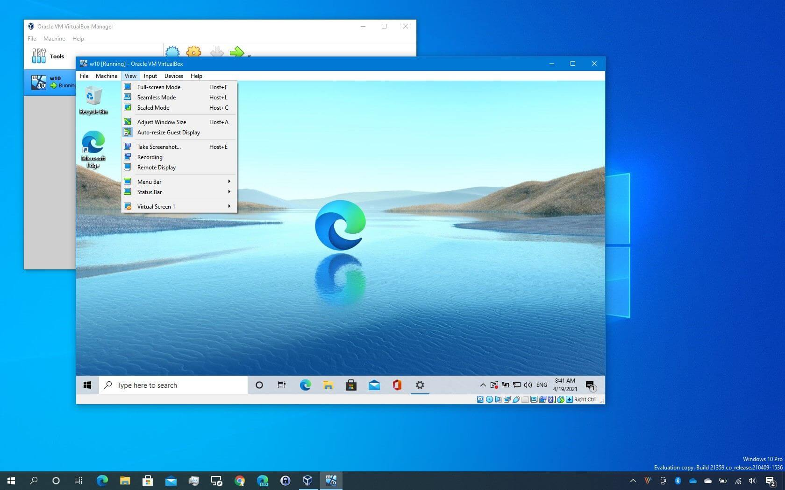
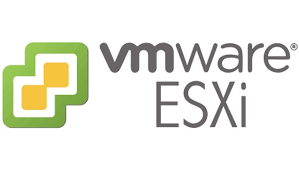
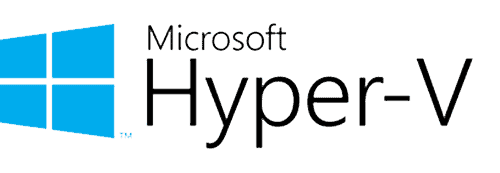

# 🖥️ Virtualisation
<ais />

## 📕 Fondamentaux

### **🔍 Qu'est-ce que la virtualisation ?**

La virtualisation permet de créer des versions virtuelles de ressources physiques (serveurs, systèmes d'exploitation, périphériques) et de partager les ressources d'un ordinateur physique (**hôte**) entre plusieurs environnements virtuels.

### **🎰 Qu'est-ce qu'une machine virtuelle ?**

Une **machine virtuelle (VM)** est un ordinateur simulé fonctionnant à l'intérieur d'un autre ordinateur. Chaque VM dispose de son propre système d'exploitation et fonctionne de manière indépendante.

Cette capture montre un poste Windows exécutant une machine virtuelle Windows, créant ainsi deux environnements Windows distincts.

Un ordinateur hôte peut héberger plusieurs machines virtuelles avec différents systèmes d'exploitation (VM 1 sous Windows et VM 2 sous Linux), gérées par un hyperviseur comme ***VMware Workstation***.

### **🆕 Comment ça fonctionne ?**

- **Hyperviseur :** C'est le logiciel qui gère les machines virtuelles. Il existe deux types d'hyperviseurs :
- **Type 1 (ou hyperviseur natif)** : Il s'installe directement sur le matériel de l'ordinateur (comme VMware ESXi ou Microsoft Hyper-V).
- **Type 2 (ou hyperviseur hébergé)** : Il s'installe comme une application sur un système d'exploitation existant (comme VirtualBox ou VMware Workstation).
- **Virtualisation des ressources :** L'hyperviseur partage les ressources du système physique (processeur, mémoire, stockage) entre les machines virtuelles. Chaque VM peut avoir un matériel virtuel configuré selon ses besoins, ce qui permet de faire fonctionner des systèmes d'exploitation anciens ou spécifiques même si le matériel physique ne les supporte plus.

### **⁉️ Pourquoi utiliser la virtualisation ?**

- **Exécution de plusieurs OS :** Permet de faire fonctionner différents systèmes d'exploitation simultanément sans redémarrage.
- **Déploiement simplifié :** Distribution de configurations logicielles préconfigurées via des machines virtuelles.
- **Sauvegarde et tests :** Création facile d'environnements de test et de sauvegardes grâce aux VM portables.
- **Snapshots :** Capture d'états spécifiques pour expérimenter sans risque et gérer les erreurs.
- **Formation :** Création d'environnements d'apprentissage sécurisés pour la pratique technique.
- **Optimisation :** Réduction des coûts par la mutualisation des ressources sur un seul serveur physique.

### **📄 Glossaire**

- **VM (Machine Virtuelle) :** Un environnement simulé qui fonctionne comme un ordinateur à l'intérieur d'un autre ordinateur.
- **Hyperviseur :** Logiciel qui crée et gère les machines virtuelles.
- **Hôte :** L'ordinateur physique qui héberge les machines virtuelles.
- **Système d'exploitation invité :** Le système d'exploitation installé sur une machine virtuelle.
- **Système d'exploitation hôte :** Le système d'exploitation installé sur l'ordinateur physique qui exécute l'hyperviseur.

En résumé, la virtualisation vous permet de créer plusieurs environnements informatiques simulés sur un seul ordinateur physique, offrant ainsi une utilisation plus efficace des ressources, une meilleure gestion et une flexibilité accrue.

### **📱 Exemples de virtualisation dans la vie quotidienne**

- **Services de Cloud :** Google Drive et Dropbox utilisent la virtualisation pour gérer efficacement le stockage de données sur leurs serveurs.
- **Streaming :** Netflix et YouTube utilisent des serveurs virtualisés pour diffuser des vidéos à des millions d'utilisateurs.
- **Sites Web :** Les hébergeurs web utilisent la virtualisation pour gérer plusieurs sites sur un même serveur physique.
- **Jeux en Cloud :** GeForce Now et Xbox Cloud Gaming permettent de jouer à des jeux sur des appareils peu puissants via des serveurs virtualisés.
- **Messagerie :** Gmail et Outlook utilisent la virtualisation pour gérer les emails de millions d'utilisateurs.
- **Applications en ligne :** Microsoft 365 et Google Workspace fonctionnent sur des serveurs virtuels dans le cloud.

## 🪛 Outils de Virtualisation

### **VMware Workstation**
 

 

- **Description** : VMware Workstation est un hyperviseur de type 2 qui permet aux utilisateurs de créer et de gérer plusieurs machines virtuelles sur un seul ordinateur.
- **Caractéristiques** : Supporte une large gamme de systèmes d'exploitation invités, permet des snapshots, et offre des fonctionnalités de réseau virtuel avancées.
- **Cas d'utilisation** : Idéal pour les développeurs et les testeurs qui ont besoin de créer des environnements de test sur des ordinateurs personnels.

### **Oracle VirtualBox**
 

 

- **Description** : Oracle VirtualBox est un hyperviseur de type 2 open source qui permet de créer et de gérer des machines virtuelles sur divers systèmes d'exploitation hôtes.
- **Caractéristiques** : Gratuit, supporte de nombreux systèmes d'exploitation invités, offre des outils de gestion des VMs et des snapshots.
- **Cas d'utilisation** : Recommandé pour les utilisateurs qui recherchent une solution gratuite et flexible pour la virtualisation sur plusieurs plateformes.

### **VMware ESXi**
 

 

- **Description** : VMware ESXi est un hyperviseur de type 1 qui s'installe directement sur le matériel physique, offrant une plateforme de virtualisation robuste.
- **Caractéristiques** : Haute performance, supporte des environnements de production à grande échelle, intégration avec VMware vSphere pour la gestion des datacenters.
- **Cas d'utilisation** : Utilisé dans les environnements d'entreprise pour gérer de grandes infrastructures de virtualisation.

### **Microsoft Hyper-V**
 

 

- **Description** : Hyper-V est un hyperviseur de type 1 développé par Microsoft, intégré aux systèmes d'exploitation Windows Server et Windows 10/11 Pro.
- **Caractéristiques** : Intégration native avec les systèmes Windows, supporte la création et la gestion de machines virtuelles, offre des fonctionnalités de haute disponibilité.
- **Cas d'utilisation** : Idéal pour les entreprises utilisant l'écosystème Microsoft et les environnements Windows.

### **Parallels Desktop**
 

 

- **Description** : Parallels Desktop est un hyperviseur de type 2 destiné principalement aux utilisateurs de Mac souhaitant exécuter des systèmes d'exploitation Windows et Linux.
- **Caractéristiques** : Interface utilisateur conviviale, supporte la virtualisation sur Mac, offre une intégration étroite avec macOS.
- **Cas d'utilisation** : Recommandé pour les utilisateurs Mac qui ont besoin de faire fonctionner des applications Windows ou Linux sur leur machine.

### **KVM (Kernel-based Virtual Machine)**
 

 

- **Description** : KVM est un hyperviseur de type 1 intégré au noyau Linux, transformant Linux en un hyperviseur complet.
- **Caractéristiques** : Open source, hautement performant, supporte de nombreux systèmes d'exploitation invités.
- **Cas d'utilisation** : Utilisé principalement dans les environnements Linux pour des déploiements de virtualisation à grande échelle.

---

### **Comparaison des Outils**

Voici un tableau comparatif des principaux outils de virtualisation :

| Outil | Type | Support OS Hôte | Support OS Invité | Prix | Cas d'utilisation |
| --- | --- | --- | --- | --- | --- |
| VMware Workstation | Type 2 | Windows, Linux | Windows, Linux, autres | Payant | Développement, test, déploiement personnel |
| Oracle VirtualBox | Type 2 | Windows, macOS, Linux | Windows, macOS, Linux | Gratuit | Utilisation générale, éducation |
| VMware ESXi | Type 1 | N/A | Windows, Linux, autres | Payant | Environnements d'entreprise |
| Microsoft Hyper-V | Type 1 | Windows Server, Windows 10/11 | Windows, Linux | Inclus avec OS | Environnements Windows, datacenters |
| Parallels Desktop | Type 2 | macOS | Windows, Linux | Payant | Utilisateurs Mac, compatibilité Windows |
| KVM | Type 1 | Linux | Windows, Linux | Gratuit | Déploiements Linux, virtualisation à grande échelle |

## 📂 Les fichiers de virtualisation

### **Fichiers d'appliances et de packaging**

Fichiers qui encapsulent des machines virtuelles complètes pour faciliter leur déploiement et partage.

#### **OVA (Open Virtualization Appliance)**

Format compressé pour machines virtuelles complètes, optimisé pour le transfert.

- **Compatibilité** : **VMware**, **VirtualBox**, **XenServer**

#### **OVF (Open Virtualization Format)**

Ensemble de fichiers de configuration pour machines virtuelles.

- **Compatibilité** : **VMware**, **VirtualBox**, **Hyper-V**, **XenServer**

#### **VBOX (VirtualBox Configuration File)**

Fichier de configuration **VirtualBox** contenant les paramètres de la machine virtuelle.

- **Compatibilité** : Exclusif à **VirtualBox**

---

### **Fichiers de disques virtuels**

Formats stockant les images de disques des machines virtuelles.

#### **VDI (Virtual Disk Image)**

Format **VirtualBox** pour disques virtuels.

- **Compatibilité** : **VirtualBox**, convertible vers autres formats

#### **VHD (Virtual Hard Disk)**

Format **Microsoft** pour **Hyper-V**, limité à 2 To.

- **Compatibilité** : **Hyper-V**, **VirtualBox**, **VMware**

#### **VHDX (Virtual Hard Disk Extended)**

Version améliorée du VHD (64 To max).

- **Compatibilité** : Exclusif à **Microsoft Hyper-V**

#### **VMDK (Virtual Machine Disk)**

Format natif **VMware** avec support des instantanés.

- **Compatibilité** : **VMware**, **VirtualBox**

#### **QCOW2 (QEMU Copy On Write)**

Format pour **QEMU**/**KVM** avec copy-on-write.

- **Compatibilité** : **QEMU**, **KVM**

#### **RAW**

Format brut non compressé pour performance maximale.

- **Compatibilité** : **QEMU**, **VirtualBox**

---

### **Tableau de compatibilité des formats de virtualisation**

Voici le tableau mis à jour pour inclure le format **VBOX** :

| Format | Hyperviseur principal | Compatibilité avec autres hyperviseurs | Cas d'utilisation principal |
| --- | --- | --- | --- |
| **OVA** | VMware, VirtualBox | XenServer, Hyper-V (via OVF) | Partage d'appliances virtuelles entre hyperviseurs |
| **OVF** | VMware, VirtualBox | Hyper-V, XenServer, autres | Portabilité de machines virtuelles complètes |
| **VDI** | VirtualBox | Peut être converti en VMDK, VHD, QCOW2 | Gestion de disques dynamiques ou fixes |
| **VHD** | Hyper-V | VMware, VirtualBox (avec conversion) | Simuler un disque dur physique (Hyper-V) |
| **VHDX** | Hyper-V (versions récentes) | Limitée à Hyper-V | Disques virtuels de grande taille (jusqu'à 64 To) |
| **VMDK** | VMware | VirtualBox (avec conversion ou natif) | Gestion avancée des disques dans VMware (snapshots, provisioning) |
| **QCOW2** | QEMU, KVM | Peut être converti en VMDK, VHD, RAW | Gestion d'images disque avec snapshots et réduction d'espace |
| **VBOX** | VirtualBox | Exclusif à VirtualBox | Configuration des machines virtuelles dans VirtualBox |

## ↔️ Communication entre les VM

### **NAT (Network Address Translation)**

Le mode **NAT** permet l'accès Internet sans configuration complexe.

- **Fonctionnement** : Utilise l'IP de l'hôte pour communiquer avec l'extérieur via traduction d'adresses.
- **Cas d'utilisation** : Accès Internet simple pour mises à jour et téléchargements.
- **Limitations** : VM non accessible depuis l'extérieur sans redirection de ports.

### **NAT Network**

Le **NAT Network** permet la communication entre VMs avec accès Internet.

- **Fonctionnement** : Crée un réseau privé partagé entre les VMs.
- **Cas d'utilisation** : Applications multi-VMs nécessitant Internet.
- **Limitations** : VMs non accessibles depuis l'extérieur.

### **Bridged Adapter (Adaptateur pont)**

Le mode **Bridged Adapter** intègre la VM au réseau local comme un appareil physique.

- **Fonctionnement** : VM reçoit sa propre IP du réseau local.
- **Cas d'utilisation** : Tests en environnement réseau réel.
- **Limitations** : Exposition directe au réseau, configuration parfois complexe.

### **Internal Network (Réseau interne)**

Le mode **Internal Network** crée un réseau isolé entre VMs.

- **Fonctionnement** : Réseau virtuel sans accès externe.
- **Cas d'utilisation** : Tests isolés et sécurité.
- **Limitations** : Pas d'accès externe sans configuration spéciale.

### **Host-Only Adapter (Adaptateur hôte uniquement)**

Le mode **Host-Only Adapter** permet la communication VM-hôte uniquement.

- **Fonctionnement** : Réseau virtuel limité à l'hôte.
- **Cas d'utilisation** : Tests isolés avec accès hôte.
- **Limitations** : Pas d'accès externe sans configuration.

### **Generic Driver (Pilote générique)**

Le mode **Generic Driver** permet des configurations réseau personnalisées.

- **Fonctionnement** : Utilise des interfaces réseau spéciales.
- **Cas d'utilisation** : Configurations réseau avancées.
- **Limitations** : Configuration complexe.

### **Comparatif des modes d'accès réseau**

| Mode | Accès à Internet | Communication entre VMs | Adresse IP dédiée |
| --- | --- | --- | --- |
| **NAT** | Oui | Non (sauf port forwarding) | Non |
| **NAT Network** | Oui | Oui | Non |
| **Bridged Adapter** | Oui | Oui | Oui |
| **Internal Network** | Non | Oui | Oui |
| **Host-Only Adapter** | Non | Oui | Oui |
| **Generic Driver** | Variable | Variable | Variable |

### **Cas pratiques**

- **NAT** : Accès Internet simple pour mises à jour.
- **Bridged Adapter** : Tests serveur en environnement réel.
- **Internal Network** : Labs sécurité isolés.
- **Host-Only Adapter** : Tests isolés avec accès hôte.
- **Generic Driver** : Configurations réseau spéciales.