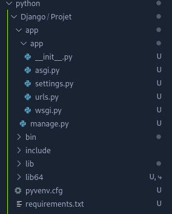

# Le framework Django


## Introduction
Django est un framework Python qui permet de créer des applications web rapidement et facilement. Il est conçu pour être facile à utiliser et à personnaliser. Il est composé de plusieurs modules qui peuvent être utilisés pour créer des applications web. 

#### Les versions de Django selon Python

|Version de Django|	Versions de Python|
|-|-|
|3.2	|3.6, 3.7, 3.8, 3.9, 3.10 (ajoutée dans 3.2.9)|
|4.0	|3.8, 3.9, 3.10|
|4.1	|3.8, 3.9, 3.10, 3.11 (ajoutée dans 4.1.3)|
|4.2	|3.8, 3.9, 3.10, 3.11, 3.12 (ajoutée dans 4.2.8)|
|5.0	|3.10, 3.11, 3.12|
|5.1	|3.10, 3.11, 3.12|


## Créer un premier projet

Afin de séparer les packages Django des autres projets, on peut lancer un environnement virtuel avec la commande `python -m venv <nom-du-projet>` et l'activer avec `source <nom-du-projet>/bin/activate`.<br>
Ensuite, on peut installer Django avec `python -m pip install Django`.<br>
Le package Django est installé, ainsi qu'un certain nombre de dépendances : des packages dont Django a besoin pour fonctionner.

Gardons la trace de tous ces packages dans un fichier requirements.txt. Il existe un raccourci très pratique pour faire cela :

`pip freeze > requirements.txt`<br>
Le fichier est créé avec les dépendances listées :
```text
asgiref==3.3.1
Django==3.1.7
pytz==2021.1
sqlparse==0.4.1
```

Une fois dans le projet de l'application, on exécute la commande `django-admin startproject projet`, celle-ci crée un répertoire avec le nom du projet et un fichier `settings.py` qui contient les paramètres de configuration de l'application :



#### Qu'a-t-il été fait ?

On vient de créer de générer automatiquement le code de base de notre application Django.

Le code de base est un code gabarit ou code de démarrage : c'est le code de base dont on a besoin pour un projet Django fonctionnel, mais vide.

On a généré notre code de base en lançant la commande `django-admin`, suivie de la sous-commande `startproject` et en passant l'argument `projet` comme nom à utiliser pour le projet. C'est ce nom qui est utilisé pour le répertoire de premier niveau. 

À l'intérieur, on a un autre répertoire appelé `projet`, dont on parlera plus tard dans ce chapitre. On a également un script Python appelé `manage.py`.

Maintenant, lorsqu'on utilisera l'utilitaire de ligne de commande de Django, on l'appelera via `manage.py` au lieu de `django-admin`. En fait, `manage.py` est conçu pour fonctionner spécifiquement avec le projet, alors que `django-admin` est une version plus générique de l'utilitaire.

Avec le code de base en place, on a tout ce dont on a besoin pour lancer le site pour la première fois.

### Exécuter le serveur de développement

Pour lancer le serveur de développement, on utilise la commande `python manage.py runserver`.

```bash
(Projet) @rootdev ➜ .../Projet/app (main) $ python manage.py runserver
Watching for file changes with StatReloader
Performing system checks...

System check identified no issues (0 silenced).

You have 18 unapplied migration(s). Your project may not work properly until you apply the migrations for app(s): admin, auth, contenttypes, sessions.
Run 'python manage.py migrate' to apply them.
August 19, 2024 - 14:55:05
Django version 5.1, using settings 'app.settings'
Starting development server at http://127.0.0.1:8000/
Quit the server with CONTROL-C.

[19/Aug/2024 14:55:16] "GET / HTTP/1.1" 200 12068
Not Found: /favicon.ico
[19/Aug/2024 14:55:17] "GET /favicon.ico HTTP/1.1" 404 2205
```


## Création de la base de données

Lorsque l'on a démarré le serveur, on a les lignes suivantes :

```bash
You have 18 unapplied migration(s). Your project may not work properly until you apply the migrations for app(s): admin, auth, contenttypes, sessions.
Run 'python manage.py migrate' to apply them.
```

Les migrations représentent un moyen de configurer la base de données de notre application.<br>
On peut voir que l'on a 18 migrations non appliquées, ce qui signifie que la base de données n'est pas encore configurée.

Pour configurer la base de données, on utilise la commande `python manage.py migrate`.

```bash
(Projet) @rootdev ➜ .../Projet/app (main) $ python manage.py migrate
Operations to perform:
  Apply all migrations: admin, auth, contenttypes, sessions
Running migrations:
  Applying contenttypes.0001_initial... OK
  Applying auth.0001_initial... OK
  [...]
  Applying sessions.0001_initial... OK
```

Suite à la création de la base de données, on aperçoit désormais le fichier `db.sqlite3` qui contient les données de la base de données.

:::danger Attention 
Si vous utilisez Git pour suivre votre code source, il est recommandé d'ajouter `db.sqlite3` à votre fichier `.gitignore`, afin qu'il ne soit pas suivi dans votre repository. Il s'agit d'une bonne pratique pour les vrais projets.
:::

## Générer le code de base de l'application

Dans Django, une application est une sous-section du projet entier. Django encourage à compartimenter le projet entier Django en applications, pour deux raisons principales :
* cela permet de garder le projet organisé et gérable au fur et à mesure qu'il se développe 
* cela signifie qu'une application peut éventuellement être réutilisée dans plusieurs projets

Chaque application doit avoir un nom approprié qui représente le concept dont l'application est responsable. Le premier concept que l'on veut développer dans notre app est la liste des marchandises. On va donc nommer notre première application « listings ».

Pour générer le code de base de l'application, on utilise la commande `python manage.py startapp nom_du_module`.

```bash
(Projet) @rootdev ➜ .../Projet/app (main) $ python manage.py startapp listings
```


::: tip Conventions
Notez que `listings`, votre répertoire d'applications, se trouve à côté de `app`, votre répertoire de projet. Remarquez aussi que le répertoire du projet a le même nom (app) que le répertoire au-dessus de lui par défaut. C'est la convention dans la structure d'un projet Django.
:::

La dernière étape de l'ajout de l'application « listings » à notre projet « app » consiste à « installer » l'application dans le projet.

Lorsque l'on a généré le code de base du projet, l'un des fichiers créés s'appelait `settings.py`. On va ouvrir ce fichier et trouver une liste Python appelée ***INSTALLED_APPS***. En bas de cette liste, on va ajouter la chaîne de caractères `listings`:


Par défaut, le code de base de Django comprend l'installation d'un certain nombre d'applications utiles, que la plupart des projets utiliseront probablement à un moment ou à un autre, c'est ces autres applications qui sont listées dans `INSTALLED_APPS`.

::: tip Et les autres applications ?
Contrairement à l'application « listings », ces applications supplémentaires ne se trouvent pas dans le code source, on ne voit pas de répertoire dans le code appelé `django.contrib.admin`, ces applications sont, en fait, importées depuis le package de Django que l'on a installé avec pip.
:::

### Structure actuelle du projet Django

On a le répertoire racine de notre repository `Projet/`, qui contient les fichiers suivants :
* **.gitignore** - un fichier qui contient une liste des fichiers et répertoires à ignorer lors de la création d'un commit
* **requirements.txt** - une liste des packages requis
* **app/** - le répertoire contenant notre projet Django, l'application, la base de données et l'utilitaire de ligne de commande
* **app/manage.py** - le script utilitaire de ligne de commande de Django
* **app/db.sqlite3** - le fichier de la base de données de Django
* **app/app/settings.py** - la configuration de l'ensemble du projet
* **app/listings/**- le répertoire de l’application généré par `python manage.py startapp listings`

<FileTree content="
- app/
  - app/
    - settings.py
- listings/
    - []
- db.sqlite3
- .gitignore
- manage.py
"/>

## Création d'une nouvelle page

Pour créer une nouvelle page, on va ouvrir le fichier `listings/views.py` et éditer le code suivant :

```python
from django.shortcuts import render

# Create your views here.
```

On va supprimer le commentaire pour le remplacer par une simple fonction. On va également ajouter une déclaration d'import supplémentaire en haut :

```python
from django.http import HttpResponse
from django.shortcuts import render

def hello(request):
    return HttpResponse('<h1>Premier projet Django !</h1>')
```

On vient ici de créer une vue, l'un des blocs constitutifs de l'architecture MVT. Une vue a pour fonction de répondre à la visite d'un utilisateur sur le site en renvoyant une page que l’utilisateur peut voir, ou en termes de Python :

Une vue est une fonction qui accepte un objet `HttpRequest` comme paramètre et retourne un objet `HttpResponse`.

Dans cet exemple de vue, on renvoie une réponse HTTP avec un contenu HTML simple : un titre H1 disant « Premier projet Django ! ».

On va désormais ouvrir le fichier `app/urls.py`. Actuellement, le code ressemble à ceci :

```python
"""
URL configuration for app project.

The `urlpatterns` list routes URLs to views. For more information please see:
    https://docs.djangoproject.com/en/5.1/topics/http/urls/
Examples:
Function views
    1. Add an import:  from my_app import views
    2. Add a URL to urlpatterns:  path('', views.home, name='home')
Class-based views
    1. Add an import:  from other_app.views import Home
    2. Add a URL to urlpatterns:  path('', Home.as_view(), name='home')
Including another URLconf
    1. Import the include() function: from django.urls import include, path
    2. Add a URL to urlpatterns:  path('blog/', include('blog.urls'))
"""

from django.contrib import admin
from django.urls import path

urlpatterns = [
    path("admin/", admin.site.urls),
]
```

On va donc importer le module views que l'on vient d'éditer en ajoutant une déclaration d'import. Puis on va ajouter un nouvel élément à la liste `urlpatterns`, où l'on va faire référence à la fonction vue que l'on vient de créer :

```python
from django.contrib import admin
from django.urls import path
from listings import views # On importe le module views de notre application listings

urlpatterns = [
path('admin/', admin.site.urls),
path('first/', views.first) # On ajoute un nouvel élément à la liste urlpatterns
]
```

Maintenant, chaque fois que quelqu'un visite l'URL `first/` sur notre site, la vue `first` va générer une page.
On peut essayer de le faire en visitant l'URL `http://127.0.0.1:8000/first/` dans un navigateur web après avoir lancé le serveur de développement avec la commande `python manage.py runserver`.

Django fonctionne ainsi, il génère automatiquement le code de notre page `html` sans même créer ce fichier.

::: tip
Pour plus d'informations sur les URLs, vous pouvez consulter la documentation officielle de Django : https://docs.djangoproject.com/en/5.1/topics/http/urls/
:::

<hr>
<br>

::: info Sources
Ce cours s'inspire de la documentation officielle de Django & du cours OpenClassrooms "Débutez avec Django" :
https://docs.djangoproject.com/en/5.1/
https://openclassrooms.com/fr/courses/7172076-debutez-avec-le-framework-django
:::

