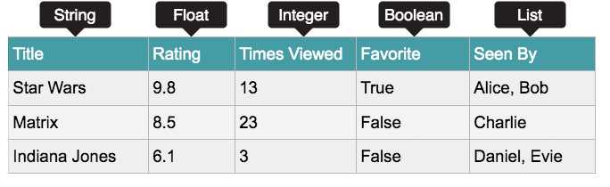

# Introduction à Python
<Badge type="tip" text="Rédigé le 02/04/2024" />
<Badge type="warning" text="En cours de rédaction" />

## Hello World !

```python:line-numbers=1
print("Hello World !")
```
On peut contrôler ce qui est affiché à l'écran en utilisant l'instruction  `print()`. Tout ce qui se trouve entre parenthèses `()` sera affiché. Cependant, comme on imprime une chaîne, on doit les mettre entre guillemets `""`.

## Opérateurs mathématiques

|Opérateur|Syntaxe|Exemple|
|-|-|-|
|Addition|`+`|1 + 1 = 2|
|Soustraction|`-`|2 - 1 = 1|
|Multiplication|`*`|2 * 2 = 4|
|Division|`/`|10 / 2 = 5|
|Modulo|`%`|10 % 2 = 0|
|Exposant|`**`|5 ** 2 = 25 (5²)|

Exemple, calcul du volume d'une sphère :

La formule étant (4π/3) × rayon³, on va procéder de telle manière :

```python:line-numbers=1
import math
rayon = 10.0
volume = (4.0 * math.pi / 3.0) * (rayon ** 3)
print(volume)
```

L'import du module `math` permet d'obtenir une valeur précise de pi.
Le symbole `*` permet de multiplier, tandis que le symbole `**` permet de calculer le rayon puissance 3. Le symbole pour la division est la barre oblique `/`.

## Opérateurs de comparaison

|Opérateur|Syntaxe|
|-|-|
|Plus grand que|`>`|
|Plus petit que|`<`|
|Égal à|`==`|
|Différent de|`!=`|
|Plus grand ou égal à|`>=`|
|Plus petit ou égal à|`<=`|

## Opérateurs booléens

|Opérateur|Syntaxe|
|-|-|
|Les deux conditions doivent être vraies pour que la déclaration soit vraie|`AND`|
|Une seule condition de la déclaration doit être vraie|`OR`|
|Si une condition est l'opposé d'un argument|`NOT`|

## Variables

Les variables permettent de stocker et de mettre à jour des données dans un programme informatique. Il s'agit d'une valeur stockée sous un nom :

```python:line-numbers=1
marque = "Yamaha"
prix = 5000
```
Ici nous avons **délcaré** la variable `marque` sous la valeur `"Yamaha"`, qui est une chaine de caractère (*string*), ainsi que la variable `prix` sous la valeur `5000`, qui est un entier (*int*).

Les valeurs de celles-ci peuvent être modifiées à tout moment lors du programme, comme l'exemple si dessous :
```python:line-numbers=1 {4}
prix = 5000
prix = prix + 5
print(prix)
5005 # [!code ++]
```

On peut également remplacer une valeur d'une variable depuis une autre variable :
```python:line-numbers=1 {4}
phrase1 = "Un petit mot dans la boîte"
phrase2 = phrase1.replace("petit", "gros")
print(phrase2)
Un gros mot dans la boîte# [!code ++]
```
La fonction replace va récupérer le premier argument "petit", qui sera celui qui est remplacé, par le second, "gros". 
La fonction replace va remplacer toutes les instances de la chaîne de caractère qu'elle trouve dans la phrase. Si on a 3 fois le mot "petit", les trois occurrences du mot seront remplacées.

Si on veut afficher les deux valeurs dans un seul `print`, on peut utiliser l'argument `sep=` :
```python:line-numbers=1 {5}
a = 0
b = 1
c = 2
print(a, b, c, sep=" + ")
0 + 1 + 2# [!code ++]
```

Ici, les valeurs des 3 variables seront "print" séparées par le caractère sélectionné, "+".

On peut également utiliser les `f-string` afin d'afficher les valeurs d'une variable dans un `print` :
```python:line-numbers=1 {5}
a = 0
b = 1
c = 2
print(f"La valeur de a est {a}, celle de b est {b} et celle de c est {c}, b plus c est égal à {b + c}")
La valeur de a est 0, celle de b est 1, et celle de c est 2, b plus c est égal à 3 # [!code ++]
```

La `f-string` est déclarée avec le caractère `f` suivi de la chaine de caractère à afficher. **Cette fonctionnalité est disponible depuis Python 3.6**.

On peut faire la même chose avec la méthode `format()` :
```python:line-numbers=1 {5}
a = 0
b = 1
c = 2
print("La valeur de a est {a}, celle de b est {b} et celle de c est {c}, b plus c est égal à {egal}".format(a=a, b=b, c=c, egal=b + c))
La valeur de a est 0, celle de b est 1, et celle de c est 2, b plus c est égal à 3 # [!code ++]
```

La méthode `format()` s'utilise dans les versions antérieures de Python 3.6, on l'utilise pour les mêmes raisons que la méthode `f-string`. 
`format(a=b)` : ici le premier argument `a` est l'emplacement où l'argument doit être inséré, `b` est la valeur qui sera insérée.

#### Quand utiliser `f-string` ou `format()` ?

La méthode `f-string` nécessite que les variables soient déclarées pour être utilisées.<br>
En revanche, la méthode `format()` permet d'utiliser des variables non déclarées, exemple : <br>

On a un premier fichier `a.py` :
```python:line-numbers=1
messageDeBienvenue = "Bonjour {prenom}, enchanté !"
```

On a un second fichier `b.py` :
```python:line-numbers=1
from a import messageDeBienvenue
user = input("Quel est votre prénom ?")
print(a.messageDeBienvenue.format(prenom=user))
Bonjour Jean, enchanté !# [!code ++]
```

Lorsque l'on veut que l'utilisateur entre sa propre valeur, on peut utiliser l'argument `input()` dans une variable :
```python:line-numbers=1{3}
portefeuille = input("Combien avez-vous dans votre portefeuille ?")
print(portefeuille)
# [!code ++]Combien avez-vous dans votre portefeuille ?
# L'utilisateur est invité à entrer une valeur
```
De cette manière, la valeur entrée par l'utilsiateur sera de type `string`.

Dans le cas où l'on voudrait afficher cette valeur **int** ou **float**... dans un print, on pourrait utiliser l'argument suivant :
```python:line-numbers=1
portefeuille = 5000
print("Total dans le portefeuille : {}".format(portefeuille))
```
Ici, l'arguement `format` va convertir la valeur de la variable de `int` à `string`. La valeur sera placée à la place de `{}`, ils sont appelés **placeholders**.

## Types de données

1. ***Chaîne de caractère*** (String) : utilisée pour les combinaisons de caractères, tels que des lettres ou des symboles.
2. ***Entier*** (Integer) : Nombres entiers
3. ***Float*** : Nombres contenant des points décimaux 
4. ***Booléen*** : Utilisé pour les données limitées aux options `Vrai` ou `Faux`
5. ***Liste*** : Série de différents types de données stockés dans une collection
6. ***Tuple*** : Similaire aux listes, cependant les tuples sont immutables, ce qui signifie que les valeurs ne peuvent pas être changées une fois affectées.
    **Ce déclare de la façon suivante :**
    ```python
    tuple = ("Premier", 45, True)
    ```



## Les listes

Pour déclarer une liste, on utilise la syntaxe suivante :
```python:line-numbers=1
liste = ["Yamaha", "Guitare", "Piano"]
```

On peut accéder à chaque élément d'une liste en utilisant l'index de l'élément. Par exemple, pour accéder à l'élément 0 de la liste précédente, on peut utiliser l'instruction suivante :
```python:line-numbers=1{2}
print(liste[0])
Yamaha
```

Pour récupérer le premier élément, on utilise les crochets et l'indice `0`.

Pour récupérer le dernier élément, peu importe la taille de la liste, on utilise l'indice `-1`.

Pour récupérer les deux premiers éléments de la liste, on utilise une syntaxe un peu spéciale, qui se nomme ***slicing***. En effet, plutôt que de spécifier un seul indice entre les crochets, on peut spécifier un indice de départ et un indice de fin.

Ainsi, pour récupérer les deux premiers éléments, on peut utiliser la syntaxe :
```python:line-numbers=1
liste[0:2]
```

On n'a même pas besoin d'indiquer le 0 et Python comprendra qu'on veut commencer depuis le début de la liste, jusqu'au deuxième élément inclus `liste[:2]`. 

Pour récupérer les deux derniers éléments, peu importe la taille de la liste, on utilise là encore un indice négatif et toujours le même principe de '***slicing***' : 
```python:line-numbers=1
liste[-2:]`
```

Si on veut récupérer un élément sur deux, on peut utiliser le '***slicing***' de la manière suivante : 
```python:line-numbers=1
liste[::2]`
```

La syntaxe complète du slicing est donc : `liste[indice_de_depart:indice_de_fin:pas]`

Si on veut récupérer les éléments de 4 à 25 avec un pas de 3 on fera donc :

```python:line-numbers=1{3}
liste = range(100)
liste[4:26:3]
[4, 7, 10, 13, 16, 19, 22, 25]
```

On peut également ajouter un élément à la fin de la liste :
```python:line-numbers=1{2}
liste.append("Clarinet")
print(liste)
Yamaha Guitare Piano Clarinet
```

Pour en ajouter plusieurs, on peut utiliser la fonction `extend()` :
```python:line-numbers=1{2}
liste.extend(["Clarinet", "Orgue"])
print(liste)
Yamaha Guitare Piano Clarinet Orgue
```

On peut également supprimer un élément à partir de la liste :
```python:line-numbers=1{2}
liste.remove("Piano")
print(liste)
Yamaha Guitare Clarinet
```


## Les conditions

L'utilisation des conditions `if`, `elif` et `else` permettent aux programmes de prendre des décisions.

```python:line-numbers=1
portefeuille = 1000
prix = 2000
if portefeuille < prix :
    print("Vous n'avez pas assez d'argent")
else :
    print("Vous avez assez d'argent")
```
Ici, **si** l'argent dans mon **portefeuille** est **inférieur** au **prix**, alors que je ne peux pas acheter le produit. **Sinon**, je peux acheter le produit.

Lorsque l'on veut que l'utilisateur entre sa propre valeur, on peut vérifier que la valeur correspond bien :
```python:line-numbers=1{2,4}
portefeuille = input("Combien avez-vous dans votre portefeuille ?")
if portefeuille.isdigit() : # La fonction isdigit() vérifie que les valeurs entrées sont des nombres
    print(portefeuille)
else:
    print("La valeur entrée n'est pas conforme.")
    portefeuille = input("Combien avez-vous dans votre portefeuille ?")
```

## Les boucles

En programmation, les boucles permettent aux programmes d’itérer et d’effectuer des actions un certain nombre de fois. Il existe deux types de boucles : `for` et `while`.

### La boucle While

```python:line-numbers=1
i = 1
while i <= 10:
    print(i)
    i = i + 1
```

Ici, `i` est égal à **1**. ***Tant que*** `i` n'est pas égal à **10**, alors, `print` de `i` et `i + 1`.

### La boucle For

Une boucle for est utilisée pour itérer sur une séquence telle qu’une liste. 

```python:line-numbers=1
siteweb = ["rootdev.fr", "tryhackme.com", "udemy.com"]
for site in siteweb:
    print(site)
rootdev.fr# [!code ++]
tryhackme.com# [!code ++]
udemy.com # [!code ++]
```

Ici, `siteweb` est une liste comprenant les valeurs *rootdev.fr*, *tryhackme.fr* et *udemy.com*. ***Pour chaque*** élément *(site)*, `print` l'élement.

En Python, on peut également itérer sur une plage de nombres à l’aide de la fonction `range`. Ci-dessous un exemple de code Python qui affichera les nombres de 0 à 4. En programmation, 0 est souvent le nombre de départ.

```python:line-numbers=1
for i in range(5):
    print(i)
```

<hr>
<br>

::: info Sources
Ce cours s'inspire (et utilise les images) de TryHackMe.com de la chambre "*Python basics*" :

https://tryhackme.com/r/room/pythonbasics <Badge type="tip" text="Gratuit" />
:::
