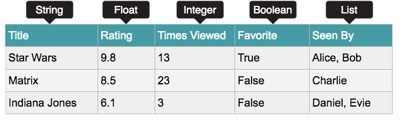

# Introduction à Python
<Badge type="tip" text="Rédigé le 02/04/2024" />
<Badge type="warning" text="En cours de rédaction" />

## Hello World !

```python:line-numbers=1
print("Hello World !")
```
On peut contrôler ce qui est affiché à l'écran en utilisant l'instruction  `print()`. Tout ce qui se trouve entre parenthèses `()` sera affiché. Cependant, comme on imprime une chaîne, on doit les mettre entre guillemets `""`.

## Opérateurs mathématiques

|Opérateur|Syntaxe|Exemple|
|-|-|-|
|Addition|`+`|1 + 1 = 2|
|Soustraction|`-`|2 - 1 = 1|
|Multiplication|`*`|2 * 2 = 4|
|Division|`/`|10 / 2 = 5|
|Modulo|`%`|10 % 2 = 0|
|Exposant|`**`|5 ** 2 = 25 (5²)|

Exemple, calcul du volume d'une sphère :

La formule étant (4π/3) × rayon³, on va procéder de telle manière :

```python:line-numbers=1
import math
rayon = 10.0
volume = (4.0 * math.pi / 3.0) * (rayon ** 3)
print(volume)
```

L'import du module `math` permet d'obtenir une valeur précise de pi.
Le symbole `*` permet de multiplier, tandis que le symbole `**` permet de calculer le rayon puissance 3. Le symbole pour la division est la barre oblique `/`.

## Opérateurs de comparaison

|Opérateur|Syntaxe|
|-|-|
|Plus grand que|`>`|
|Plus petit que|`<`|
|Égal à|`==`|
|Différent de|`!=`|
|Plus grand ou égal à|`>=`|
|Plus petit ou égal à|`<=`|

## Opérateurs booléens

|Opérateur|Syntaxe|
|-|-|
|Les deux conditions doivent être vraies pour que la déclaration soit vraie|`AND`|
|Une seule condition de la déclaration doit être vraie|`OR`|
|Si une condition est l'opposé d'un argument|`NOT`|

## Variables

Les variables permettent de stocker et de mettre à jour des données dans un programme informatique. Il s'agit d'une valeur stockée sous un nom :

```python:line-numbers=1
marque = "Yamaha"
prix = 5000
```
Ici nous avons **délcaré** la variable `marque` sous la valeur `"Yamaha"`, qui est une chaine de caractère (*string*), ainsi que la variable `prix` sous la valeur `5000`, qui est un entier (*int*).

Les valeurs de celles-ci peuvent être modifiées à tout moment lors du programme, comme l'exemple si dessous :
```python:line-numbers=1 {4}
prix = 5000
prix = prix + 5
print(prix)
5005
```

On peut également remplacer une valeur d'une variable depuis une autre variable :
```python:line-numbers=1 {4}
phrase1 = "Un petit mot dans la boîte"
phrase2 = phrase1.replace("petit", "gros")
print(phrase2)
Un gros mot dans la boîte
```
La fonction replace va récupérer le premier argument "petit", qui sera celui qui est remplacé, par le second, "gros". 
La fonction replace va remplacer toutes les instances de la chaîne de caractère qu'elle trouve dans la phrase. Si on a 3 fois le mot "petit", les trois occurrences du mot seront remplacées.

Si on veut afficher les deux valeurs dans un seul `print`, on peut utiliser l'argument `sep=` :
```python:line-numbers=1 {5}
a = 0
b = 1
c = 2
print(a, b, c, sep=" + ")
0 + 1 + 2
```

Ici, les valeurs des 3 variables seront "print" séparées par le caractère sélectionné, "+".

Lorsque l'on veut que l'utilisateur entre sa propre valeur, on peut utiliser l'argument `input()` dans une variable :
```python:line-numbers=1{3}
portefeuille = input("Combien avez-vous dans votre portefeuille ?")
print(portefeuille)
Combien avez-vous dans votre portefeuille ?
# L'utilisateur est invité à entrer une valeur
```
De cette manière, la valeur entrée par l'utilsiateur sera de type `string`.

Dans le cas où l'on voudrait afficher cette valeur **int** ou **float**... dans un print, on pourrait utiliser l'argument suivant :
```python:line-numbers=1
portefeuille = 5000
print("Total dans le portefeuille : {}".format(portefeuille))
```
Ici, l'arguement `format` va convertir la valeur de la variable de `int` à `string`. La valeur sera placée à la place de `{}`, ils sont appelés **placeholders**.

## Types de données

1. ***Chaîne de caractère*** (String) : utilisée pour les combinaisons de caractères, tels que des lettres ou des symboles.
2. ***Entier*** (Integer) : Nombres entiers
3. ***Float*** : Nombres contenant des points décimaux 
4. ***Booléen*** : Utilisé pour les données limitées aux options `Vrai` ou `Faux`
5. ***Liste*** : Série de différents types de données stockés dans une collection
6. ***Tuple*** : Similaire aux listes, cependant les tuples sont immutables, ce qui signifie que les valeurs ne peuvent pas être changées une fois affectées.
    **Ce déclare de la façon suivante :**
    ```python
    tuple = ("Premier", 45, True)
    ```



## Les conditions

L'utilisation des conditions `if`, `elif` et `else` permettent aux programmes de prendre des décisions.

```python:line-numbers=1
portefeuille = 1000
prix = 2000
if portefeuille < prix :
    print("Vous n'avez pas assez d'argent")
else :
    print("Vous avez assez d'argent")
```
Ici, **si** l'argent dans mon **portefeuille** est **inférieur** au **prix**, alors que je ne peux pas acheter le produit. **Sinon**, je peux acheter le produit.

Lorsque l'on veut que l'utilisateur entre sa propre valeur, on peut vérifier que la valeur correspond bien :
```python:line-numbers=1{2,4}
portefeuille = input("Combien avez-vous dans votre portefeuille ?")
if portefeuille.isdigit() : # La fonction isdigit() vérifie que les valeurs entrées sont des nombres
    print(portefeuille)
else:
    print("La valeur entrée n'est pas conforme.")
    portefeuille = input("Combien avez-vous dans votre portefeuille ?")
```

## Les boucles

En programmation, les boucles permettent aux programmes d’itérer et d’effectuer des actions un certain nombre de fois. Il existe deux types de boucles : `for` et `while`.

### La boucle While

```python:line-numbers=1
i = 1
while i <= 10:
    print(i)
    i = i + 1
```

Ici, `i` est égal à **1**. ***Tant que*** `i` n'est pas égal à **10**, alors, `print` de `i` et `i + 1`.

### La boucle For

Une boucle for est utilisée pour itérer sur une séquence telle qu’une liste. 

```python:line-numbers=1
siteweb = ["rootdev.fr", "tryhackme.com", "udemy.com"]
for site in siteweb:
    print(site)
```

Ici, `siteweb` est une liste comprenant les valeurs *rootdev.fr*, *tryhackme.fr* et *udemy.com*. ***Pour chaque*** élément *(site)*, `print` l'élement.

En Python, on peut également itérer sur une plage de nombres à l’aide de la fonction `range`. Ci-dessous un exemple de code Python qui affichera les nombres de 0 à 4. En programmation, 0 est souvent le nombre de départ.

```python:line-numbers=1
for i in range(5):
    print(i)
```
## Les fonctions d'origine

Les fonctions "d'origine", familièrement appelées, sont les fonctions disponibles dans Python dès son installation. Plusieurs ont été citées plus haut, elles ont un intérêt dans la conception des programmes, que ce soit pour organiser des listes, vérifier des données, etc.

### La fonction `split()`

Permet de séparer la chaîne de caractère en plusieurs éléments, en opérant la séparation sur un caractère.
Exemple :

```python:line-numbers=1 {4}
chaine = "Thomas, Théo, Ludo, Olivier, Antho"
chaineListe = chaine.split(", ")
print(chaineListe)
["Thomas", "Théo", "Ludo", "Olivier", "Antho"]
```

Ici, la fonction `split()` a transformé la variable `str` en une liste. Les éléments de cette liste ont été identifiés par chaque séparation ", ", indiqué comme argument dans la fonction.

### La fonction `sort()`

Permet de trier les valeurs de façon croissante.

Exemple :
```python:line-numbers=1 {4,8}
chaine = ["Thomas", "Théo", "Ludo", "Olivier", "Antho"]
print(chaine)
["Thomas", "Théo", "Ludo", "Olivier", "Antho"]
chaine.sort()
chaineTriee = ", ".join(chaine)
print(chaine)
Antho, Ludo, Olivier, Théo, Thomas
```

Dans l'exemple ci-dessus, on peut s'apercevoir que les prénoms ont été triés dans l'ordre alphabétique.

### La fonction `join()`
Permet joindre différents éléments d'une liste par une chaîne de caractère. 
Exemple : 

```python:line-numbers=1 {4,8}
chaine = ["Thomas", "Théo", "Ludo", "Olivier", "Antho"]
chaineStr = ", ".join(chaine)
print(chaineStr)
Antho, Ludo, Olivier, Théo, Thomas
```

Dans l'exemple ci-dessus, on comprend que la liste `chaine` est devenue une `str`, chaque élément de la liste ont été séparés par l'argument précédent la fonction `join()`, ici ", ".

### La fonction `isdigit()`

Renvoie une valeur `True` ou `False` selon l'argument entré dans la fonction si oui ou non il s'agit de nombres.
Exemple :

```python:line-numbers=1 {2}
portefeuille = input("Combien avez-vous dans votre portefeuille ?")
if portefeuille.isdigit() : # La fonction isdigit() vérifie que les valeurs entrées sont des nombres
    print(portefeuille)
else:
    print("La valeur entrée n'est pas conforme.")
```

Dans l'exemple ci-dessus, on demande à l'utilisateur d'entrer une valeur numérique, si celui-ci entre une valeur en `str`, `isdigit(valeur)` renverra `False` et passera à la ligne `else`, sinon, il "printera" la valeur donnée par l'utilisateur.

### La fonction `list()` & `range()`

Permet la création rapide d'une liste de nombre selon une échelle donnée.
La fonction `list` permet elle de créer une liste selon un argument donné, ici la variable `liste`.
Exemple :

```python:line-numbers=1 {4}
liste = range(5, 15)
liste2 = list(liste)
print(liste2)
[5, 6, 7, 8, 9, 10, 11, 12, 13, 14]
```

On peut également entrer un seul argument dans la fonction `range`, qui débutera alors par 0 jusqu'au nombre donné, exemple : 

`liste = list(range(10)) => [0, 1, 2, 3, 4, 5, 6, 7, 8, 9]`

**Attention !** Depuis Python 3, la fonction `range()` ne retourne pas une liste mais un objet de type 'range'.

Si on veut créer une liste de nombres pairs, on peut donner un écart entre chaque nombre :
`liste = range(2, 101, 2)`

Ici ce sera le dernier arguement de la fonction `range()` qui définira l'écart.

### La fonction `random()`

Permet de générer une valeur aléatoire.
Exemple : 

```python:line-numbers=1 {6,7,8,9,10}
import random

for _ in range(5):
    nombre = random.choice(range(1, 7))
    print(nombre)
5
1
1
2
5
```

### La fonction `count()`

Permet de compteur le nombre d'un argument choisi.
Exemple : 

```python:line-numbers=1 {6}
lettre_a_chercher = "o"
phrase = "Bonjour tout le monde"

x = phrase.count(lettre_a_chercher)
print(x)
4
```

Ici, la fonction `count()` va chercher le nombre de "o" dans la phrase "Bonjour tout le monde", et retourne donc la valeur 4.
Cependant, si on a une phrase contenant des "O" majuscules, ceux-ci ne seront pas comptabilisés, pour cela, on peut rendre minuscule chaque lettre avec la fonction `lower` :
<br>
`x = phrase.lower(phrase.count(lettre_a_chercher))`

## Les erreurs

### Try & Except

Lorsqu'une erreur se produit, ou également appelée *exception*, Python s'arrête et génère un message d'erreur.
Ces exceptions peuvent être gérées grâce à l'instruction ***Try***.

```python
try:
    print(i)
except:
    print("Une erreur est survenue, la valeur demandée n'existe pas.")
```

Ici, l'exception sera notée car aucune variable "i" n'a été déclarée plus tôt.
On peut également sélectionner "la raison" pour laquelle l'exception est déclarée. <br>
Par exemple, on demande une valeur *int* à l'utilisateur, mais une valeur *str* est entrée, alors on déclare l'exception :

```python
while True:
    try:
        i = int(input("Entrer une valeur"))
        break
    except ValueError: #ValueError vérifie que l'entrée correspond à ce qui est demandé.
        print("Uniquement une valeur INT, réessayez.")
```

### Erreurs dans la déclaration d'une variable

```python
list = range(3)
list2 = range(5)
list(list2)
Traceback (most recent call last):
  File "<stdin>", line 1, in <module>
TypeError: 'range' object is not callable
```

Le problème qui survient dans ce code vient du fait que 'range(3)' est assigné dans une variable qui est déjà utilisée par Python pour convertir un objet en liste (la fonction list).

Ainsi, quand on essaie de convertir la liste 'list2', avec la fonction list, l'erreur `TypeError: 'range' object is not callable` apparaît.
En écrasant le mot réservé 'list' par 'range(3)', on écrase la fonction list et quand on veut l'utiliser plus loin dans le script, Python essaie de convertir la liste 'list2' avec l'objet 'range' contenu à l'intérieur de la variable 'list' au lieu d'utiliser la fonction list.

#### Noms réservés par Python

```
False               def                 if                  raise
None                del                 import              return
True                elif                in                  try
and                 else                is                  while
as                  except              lambda              with
assert              finally             nonlocal            yield
break               for                 not                 
class               from                or                  
continue            global              pass 
```

À cette liste on peut ajouter toutes les fonctions de base de Python, comme la fonction str, la fonction int, la fonction dict, la fonction print, la fonction list etc...
Il faut faire très ***attention à ne pas écraser des noms réservés*** par Python.
<hr>
<br>

::: info Sources
Ce cours s'inspire (et utilise les images) de TryHackMe.com de la chambre "*Python basics*" :

https://tryhackme.com/r/room/pythonbasics <Badge type="tip" text="Gratuit" />
:::
