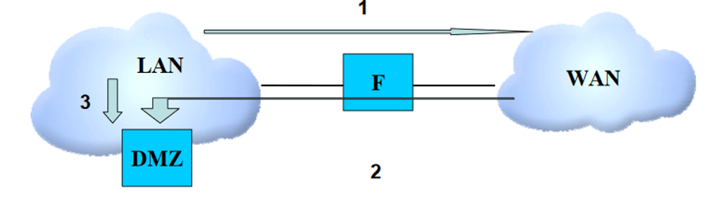
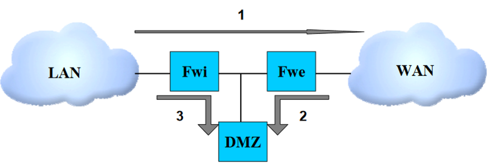
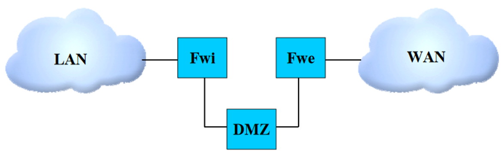
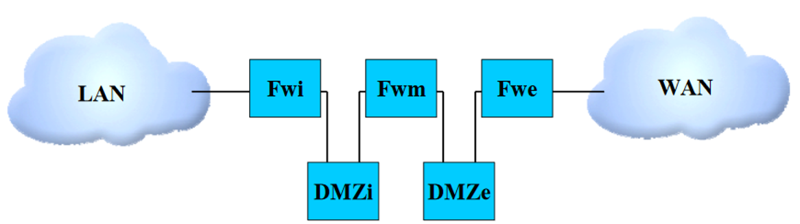
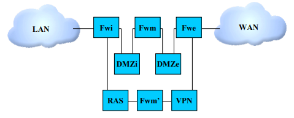
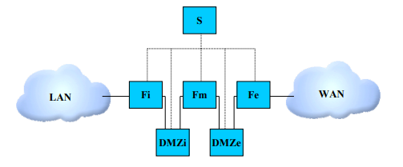

# ⛑️ Architecture sécurisée
<ais />

## Introduction

Ce chapitre présente les différents principes permettant de définir l'architecture d'une passerelle d'interconnexion sécurisée.

Ne seront considérées ici que les interconnexions entre un réseau privé (un LAN) hébergeant des informations sensibles mais non classifiées et un réseau ouvert (typiquement Internet).

Pour illustrer cela, le contexte sera une petite entreprise disposant d'un réseau interne et qui souhaite interconnecter ce réseau avec Internet pour permettre :

- d'une part à ses utilisateurs d'accéder à internet depuis leur poste de travail;
- d'autre part aux internautes d'accéder au site web de l'entreprise.

Ce chapitre n’édicte pas de règle impérative, mais décrit un ensemble de concepts ou de recommandations que chacun pourra adapter en fonction de ses contraintes et de ses enjeux.

## Analyse succincte des menaces

Les principales menaces considérées sont :

- **Compromission de données sensibles** : Fuite accidentelle ou intentionnelle d'informations confidentielles du réseau interne vers Internet.
- **Défiguration du serveur web** : Altération malveillante du contenu web pour nuire à l'entreprise.

La sécurité du réseau interne (postes utilisateurs, serveurs et administration) est primordiale, car une passerelle seule ne peut pas empêcher toutes les fuites de données, notamment en cas de compromission d'un poste ou d'action malveillante d'un utilisateur légitime.

### Les règles de base à respecter :

1. Maintenir les équipements à jour
2. Limiter les privilèges utilisateurs au strict nécessaire
3. Désactiver les services inutiles
4. Configurer les pare-feux personnels
5. Définir une politique de sécurité réseau
6. Mettre en place une surveillance et des logs
7. Former les utilisateurs aux risques

## Principes généraux et démarche

La mise en place d'une passerelle d'interconnexion nécessite d'identifier les fonctions de sécurité requises et leur position dans l'architecture.

Trois critères guident le choix des composants :

- Sa contribution à la sécurité 
- Sa résistance aux attaques 
- La capacité de l'équipe à le gérer de façon sécurisée

### Apport pour la sécurité

L'apport sécuritaire d'un produit correspond à sa fonction principale de sécurité.

Un pare-feu, par exemple, bloque les flux non autorisés. Ses autres fonctionnalités (détection d'intrusion, routage) sont secondaires.

L'efficacité de cette fonction principale peut être évaluée via les certifications ***ANSSI*** (*Agence nationale de la sécurité des systèmes d'information*).

### Robustesse

La robustesse d'un produit représente sa capacité à résister aux attaques. Les équipements ne doivent pas introduire de vulnérabilités, notamment via leurs fonctions secondaires comme l'administration.

L'évaluation se fait principalement via les alertes des **CERT**, dont le **CERTA**. Un produit suivi et régulièrement mis à jour est préférable à un produit non surveillé.

### Maîtrise par les administrateurs et maintenabilité

Une mauvaise gestion peut compromettre la sécurité, même pour un produit robuste. L'équipe doit avoir les compétences adaptées à la complexité du produit.

La maintenabilité dépend de la qualité de la documentation, des interfaces de configuration sécurisées, des mises à jour fiables et des outils de diagnostic appropriés.

### Démarche

On part d'une architecture simple pour évoluer vers une structure plus robuste mais complexe. Les choix d'architecture dépendent de trois facteurs principaux :

- La sécurité de la passerelle ;
- Sa facilité de maintenance ;
- Les contraintes opérationnelles et budgétaires.

### _Légende des schémas_

Les éléments suivants seront utilisés dans les schémas :

- **LAN** (Réseau Local) : Réseau interne de l'entreprise contenant les données sensibles à protéger.
- **WAN** (Réseau Étendu) : Réseau externe (Internet) d'où proviennent la plupart des attaques.
- **FW** (Firewall) : Filtre les paquets au niveau réseau et transport, basé sur les adresses IP et ports.
- **DMZ** (Zone Démilitarisée) : Zone hébergeant les services web, mail et sécurité.

Les équipements de niveau 2 (hubs, switches) ne sont pas toujours représentés car non qualifiés par l'ANSSI. On privilégie les switches aux hubs.

::: danger Important
Les zones réseau doivent être physiquement séparées. On évite toute connexion directe entre LAN et WAN (wifi, 3G, etc.) contournant la passerelle.
:::

## Études d'architecture

### Architecture basique

L'architecture la plus simple consiste en un pare-feu unique reliant le réseau local à Internet, comme illustré en *Figure 1*.

Les serveurs, y compris le serveur web public, sont directement connectés au LAN. Les flux suivants sont considérés :

1. Navigation web depuis le LAN
2. Accès au serveur web depuis Internet
3. Publication de contenu web depuis le LAN

> *Figure 1*

Les flèches montrent la direction des flux initiés, bien que les échanges soient bidirectionnels. Les pare-feux modernes (stateful) filtrent les paquets WAN non sollicités.

Cette architecture présente trois failles majeures :

- **Problème 1 :** Les flux Internet traversent directement le LAN pour atteindre le serveur web, exposant le réseau interne aux attaques.
- **Problème 2 :** Le pare-feu est un point unique de défaillance - sa compromission donnerait accès à tout le réseau.
- **Problème 3 :** Aucune protection contre la défiguration du site web via l'exploitation de vulnérabilités.

Une architecture plus robuste est nécessaire pour réduire ces risques.

### Architecture « accès DMZ via le pare-feu »

Le premier problème est résolu en connectant le serveur web directement à une interface du pare-feu, comme montré en *Figure 2*.

> *Figure 2*

Les serveurs nécessitant un accès externe sont placés sur cette interface, tandis que les serveurs internes (fichiers, bases de données) restent sur le LAN avec un accès restreint.

L'entreprise doit alors bien distinguer les données publiques des données privées.

Bien que cette architecture résolve le problème des flux web traversant le LAN, le pare-feu reste un point critique et le risque de défiguration persiste.

### Architecture basée sur deux pare-feu

Cette architecture utilise deux pare-feux distincts : un pare-feu interne (FWi) à l'entrée du réseau local et un pare-feu externe (FWe) à la limite du réseau étendu. La jonction entre la DMZ et les deux pare-feux peut se faire via un commutateur réseau.

> *Figure 3*

Cette configuration réduit les risques car la compromission d'un seul pare-feu ne suffit pas à accéder au LAN. Le FWi, qui gère principalement les flux sortants, est plus simple à configurer.

Pour une sécurité optimale, les deux pare-feux doivent être différents pour éviter qu'une même vulnérabilité ne puisse les compromettre tous les deux.

La diversification doit s'appliquer à trois niveaux :

- Au niveau du système d'exploitation (JunOS, IOS, OpenBSD, Linux, etc.);
- Au niveau du moteur de filtrage (Packet Filter (PF), Netfilter);
- Idéalement, au niveau du matériel.

Cette diversification ne doit toutefois être mise en place que si l'équipe dispose des ressources et compétences nécessaires pour gérer efficacement des équipements différents.

Il est recommandé d'ajouter un serveur mandataire (proxy) sur la DMZ pour filtrer les échanges applicatifs entre le LAN et Internet. Ce proxy gère la décontamination, le filtrage de contenus, et les listes blanches/noires, comme illustré dans la Figure 4.

> *Figure 4*

Dans cette architecture, la DMZ utilise une coupure physique pour tous les flux, garantissant que toute communication entre les pare-feux passe obligatoirement par la DMZ (*Figure 5*). Sans cette coupure, un flux sortant pourrait atteindre directement le WAN sans filtrage applicatif.

> *Figure 5*

Cependant, l'architecture ne protège pas encore le serveur web contre une possible altération.

### Architecture « en double DMZ »

Cette architecture crée deux zones distinctes :

- Une DMZ interne (DMZi) reliée au pare-feu interne pour les services fonctionnels
- Une DMZ externe (DMZe) reliée au pare-feu externe pour les services de sécurité

> *Figure 6*

Pour les **flux entrants** :

- La DMZi héberge le serveur web
- La DMZe contient un reverse proxy qui filtre les requêtes entrantes (URL suspectes, tentatives d'injection SQL, etc.)

Pour les **flux sortants** :

- La DMZi utilise un proxy cache pour stocker temporairement les pages web consultées
- La DMZe fournit un proxy de filtrage standard

Le reverse proxy de la DMZe protège le serveur web, mais cette protection n'est pas absolue. Une page web peut être compromise de plusieurs façons :

- Par l'altération directe du serveur web (disques, mémoire)
- Via les équipements réseau (pare-feu, reverse-proxy)
- Par compromission des serveurs DNS

HTTPS peut réduire ces risques, mais le chiffrement SSL/TLS empêche le filtrage.
Des accélérateurs SSL placés avant le reverse proxy peuvent résoudre ce problème.

### Architecture avec 3 pares-feux

Pour améliorer la sécurité, un troisième pare-feu (FWm) est ajouté entre les deux DMZ, permettant une séparation physique plutôt que logique.

Ce pare-feu établit une séparation physique entre les différents serveurs accessibles depuis l'extérieur (web, mail, DNS). Chaque serveur est connecté à une interface distincte du pare-feu.

Cette configuration limite les risques en permettant uniquement les flux nécessaires entre les serveurs et leurs reverse proxies respectifs. Si un composant est compromis, le pare-feu médian empêche l'attaquant d'accéder aux autres services, réduisant ainsi le risque d'exploitation en chaîne des vulnérabilités.

## Problématiques rencontrées

### Problématique de l'adressage IP

Une même connexion Internet peut gérer les flux DMZ entrants et sortants, mais il est recommandé d'utiliser des adresses IP distinctes pour chaque type d'accès.

L'adresse IP sortante devrait être dynamique pour minimiser l'association avec l'entité, réduisant ainsi les risques d'image liés à une utilisation inappropriée.

Pour les flux entrants, une IP statique est appropriée. La redondance via deux opérateurs améliore la disponibilité, mais nécessite un routage dynamique (AS) complexe pour les flux entrants.

La redondance du trafic sortant est plus simple à implémenter.

### Problématique de la mutualisation des ressources

L'architecture peut nécessiter le regroupement de différents services sur une seule machine physique, soit via le même système d'exploitation, soit par virtualisation.

Les principaux risques de cette mutualisation sont :

- **Risque de déni de service:** Une panne d'application peut entraîner l'indisponibilité de tous les services sur la machine.
- **Risque de compromission:** La prise de contrôle d'un service peut faciliter la compromission des autres services sur la même machine.

Recommandations pour la mutualisation :

- Regrouper uniquement des services de nature similaire
- Isoler les services moins sécurisés
- Ne pas héberger un serveur principal et son backup sur la même machine

Les contraintes techniques et les dépendances entre services (comme DNS et serveur web) doivent également être prises en compte lors de la mutualisation.

### Problématique des postes nomades

L'accès à distance au système d'information nécessite un équilibre entre sécurité, usage et fonctionnalités des postes nomades. Voici les points essentiels :

1. **Durcissement des postes :** Les postes nomades doivent suivre les mêmes règles de sécurité que le LAN : pas de droits administrateur, mises à jour et authentification strictes.
2. **Usages spécifiques :** Désactiver les interfaces sans fil si possible, chiffrer le disque dur, et sensibiliser les utilisateurs aux bonnes pratiques de sécurité.
3. **Architecture de la passerelle :** La configuration doit inclure :
    - Un VPN pour l'accès distant sécurisé
    - Un filtrage strict des flux web
    - Une authentification renforcée
    - La surveillance des activités
    - Des systèmes de détection d'intrusion

Une politique de sécurité claire et la sensibilisation des utilisateurs sont essentielles pour garantir la sécurité des accès à distance.

Notre architecture utilise une machine dédiée pour la vérification et la sécurisation des ordinateurs distants, gérant le déchiffrement IPsec entre ces postes et la passerelle.

Seuls les ordinateurs vérifiés et autorisés peuvent communiquer avec la passerelle. Cette machine est placée sur le pare-feu FWe pour garantir une vérification et un chiffrement robustes.

Le chiffrement des données pose un défi : les pare-feux ne peuvent pas analyser efficacement le trafic chiffré, limitant notre contrôle sur le contenu.

Après déchiffrement, les données passent par le filtre FWm qui vérifie l'organisation du réseau et le trafic Internet. Les informations sont ensuite dirigées soit vers un serveur RAS pour l'accès Web, soit vers le réseau d'entreprise selon le niveau de confiance accordé aux postes distants.

Le trafic distant traverse systématiquement la chaîne de sécurité (*VPN, FWm', FWi, DMZi, FWm, DMZe, FWe*) avant d'atteindre Internet, assurant un contrôle complet.

### Problématique de la supervision

La gestion à distance des équipements de la passerelle s'effectue via des ordinateurs dédiés connectés à des interfaces spécifiques de chaque machine. Ces équipements n'envoient aucun trafic vers cette interface de supervision.

La machine de supervision est protégée par un pare-feu pour éviter les rebonds d'informations entre les différentes zones de la passerelle.

Les informations d'administration sont chiffrées pour plus de sécurité, mais ce chiffrement complique leur filtrage. Il est donc préférable d'éviter leur passage par les pare-feux de la passerelle.

### Question des interfaces réseau

Les machines de la passerelle gèrent plusieurs connexions réseau, parfois via des cartes multi-ports (4 connexions Ethernet sur une même carte).

Pour les flux entrants, sortants et l'administration, il est conseillé d'utiliser des cartes réseau physiquement distinctes plutôt que des connexions multiples sur une même carte, car celles-ci partagent un composant unique.

Cette configuration commune ne garantit pas un véritable cloisonnement physique des flux.

### Points clés

Voici les aspects essentiels pour la conception d'une passerelle d'interconnexion :

- **Mise à jour :** Maintenir une politique de mise à jour rapide pour corriger les vulnérabilités.
- **Supervision :** Surveiller la passerelle en temps réel et traiter toute connexion inattendue comme une menace potentielle.
- **Configuration IP :** Privilégier les adresses IP statiques plutôt que le DNS, et configurer manuellement les associations d'adresses pour plus de sécurité.
- **Technologies :** Diversifier les équipements pour réduire l'impact des vulnérabilités, tout en maintenant une gestion efficace.