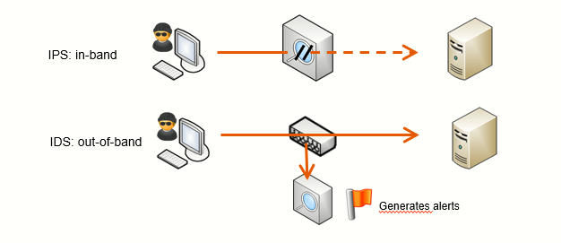
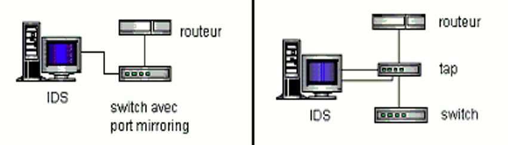
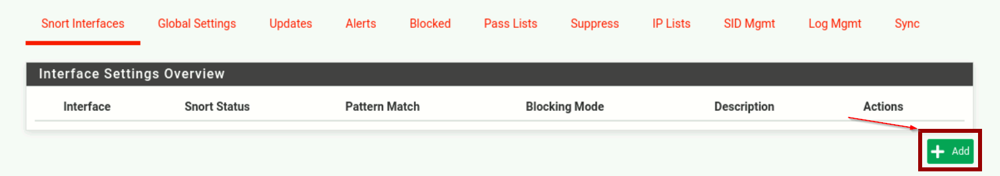
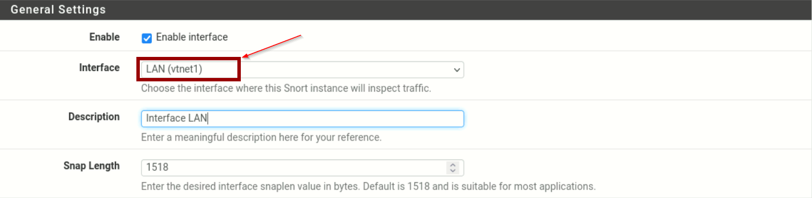
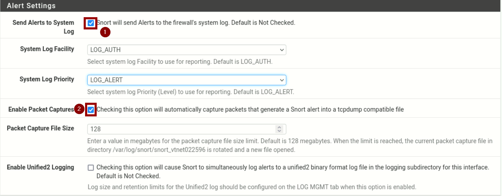
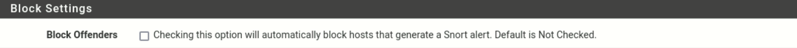
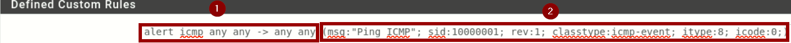

# 🤖 NIDS & NIPS
<ais />

## **🚨 Les sondes réseaux**

Une sonde réseau analyse les flux du LAN pour détecter des comportements problématiques. Ces équipements sont puissants mais génèrent beaucoup de faux positifs et d'informations qui peuvent devenir ingérables sans configuration optimisée.

Ce module familiarisera avec Snort, une sonde réseau open source maintenue par **Cisco Systems**.

## **🆚 NIDS vs NIPS**

Il existe deux types de sondes réseaux :

- ***Les NIDS*** : Network Intrusion Detection System
- ***Les NIPS*** : Network Intrusion Prevention System

Le NIDS génère des alertes basées sur des règles en analysant une copie du trafic. Le NIPS, lui, peut également bloquer le trafic malveillant car il est placé directement sur le chemin réseau.

Le NIDS présente moins de risques car ses faux positifs n'impactent pas le trafic, mais offre moins de protection. Le NIPS ajoute la prévention active mais ses faux positifs peuvent perturber le réseau.

Les NIDS sont plus simples à déployer, mais les NIPS gagnent en popularité via les NGFW et UTM.
- ***NGFW*** : Un pare-feu nouvelle génération est aussi appelé NGFW. Il analyse le trafic entre les réseaux, et autorise ou bloque le passage en fonction des politiques de pare-feu définies concernant les caractéristiques du trafic.
- ***UTM*** : Unified threat management, ou UTM fait référence à des pare-feu réseau possédant de nombreuses fonctionnalités supplémentaires qui ne sont pas disponibles dans les pare-feu traditionnels.

> Snort **peut fonctionner dans les deux modes** selon la configuration choisie.

## **🗺 Le positionnement des sondes**

Le placement des sondes réseaux est une décision stratégique qui dépend des besoins en supervision. Quatre emplacements sont possibles : LAN, DMZ, en amont du Firewall ou sur le Firewall.

La DMZ est l'emplacement privilégié car les serveurs y sont plus exposés aux interactions externes. L'installation sur le Firewall est une alternative économique quand celui-ci le permet.

Dans le LAN, la priorité est donnée aux réseaux critiques hébergeant les serveurs, plutôt qu'aux réseaux utilisateurs qui génèrent trop de faux positifs.

Le placement en amont du Firewall, bien que moins conventionnel, peut fournir des informations sur les menaces bloquées.

Pour alimenter un NIDS en données (contrairement au NIPS qui est en coupure), deux options principales existent : le Port Mirroring et le TAP.

- ***Le Port Mirroring*** : copie les flux via une interface du switch. Simple mais consommateur en ressources.

- ***Le TAP*** : équipement dédié qui copie les flux plus efficacement, mais attention à sa sécurisation s'il est administrable sur le réseau.

## 📏 **Règles de détections**

Dans cette partie, on se concentre sur les règles de détection chez Snort. Si la syntaxe de ces règles peut varier d'un éditeur à un autre, la logique, elle, reste toujours la même, il est donc important de se familiariser avec. De plus, la création de règles adéquates est un élément clef de l'optimisation de la sonde réseau.

On se rend dans le menu *Services > Snort*, où on va pouvoir spécifier une interface du Firewall à écouter, lui ajouter des règles, et modifier la configuration de Snort.

Pour commencer, cliquer sur le bouton Add.

Différentes informations sur l'interface sont à configurer. Dans un premier temps, l'interface à écouter doit être définie. On spécifie ici l'interface LAN qui sera écoutée.

Ensuite, on va configurer les modalités d'alertes. En utilisant Snort par le biais de PFsense, il est possible d'intégrer les alertes Snort dans les journaux d'un Firewall, ainsi que de générer un fichier compatible avec **Wireshark** et **tcpdump**.

D'autres configurations sont possibles. À noter toutefois que parmi ces configurations se trouve la possibilité de bloquer des machines, qui peut s'avérer très intéressant, mais ***présente des risques en cas de faux positif***.

On valide donc la mise en place de l'interface en écoute.

Avant de commencer à créer des règles, il est nécessaire de faire un point sur la structure de ces dernières. Une règle est composée de deux parties : un en-tête et des options.

On va donc créer unee règle générant une alerte à la détection de ping ICMP.

La première partie constitue l'en-tête, elle contient des informations sur l'objectif de la règle : `alert`, le protocole réseau : `icmp`, l'`adresse ip` et le port source et destination : `any`.

La seconde partie constitue les options, parmi ces dernières, le message et le SID sont obligatoires. Toutefois, il existe une grande variété de paramètre pouvant être renseignés dans ces options, la [documentation](https://docs.snort.org/welcome) de Snort possède de nombreuses informations complètes sur le sujet.
