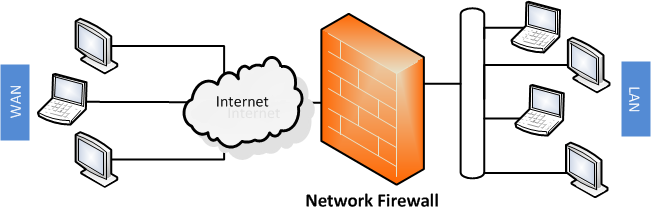
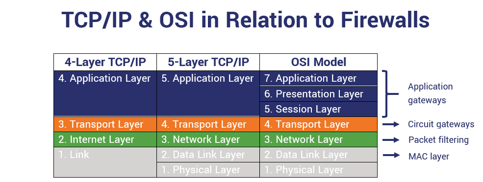
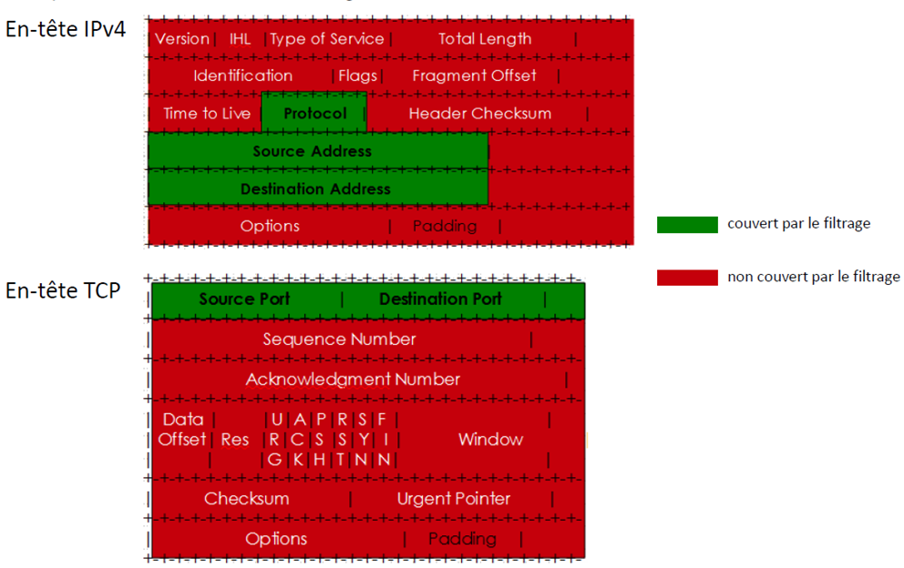
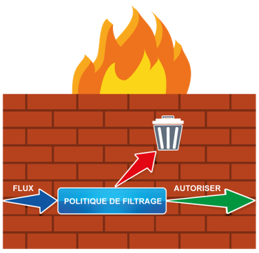
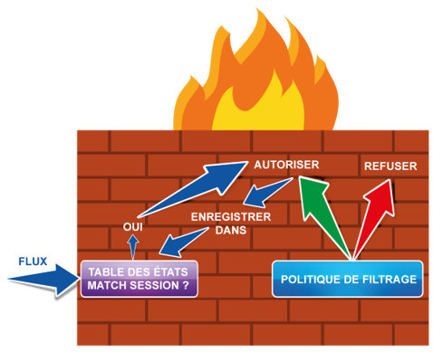
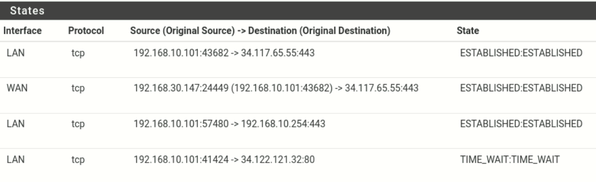
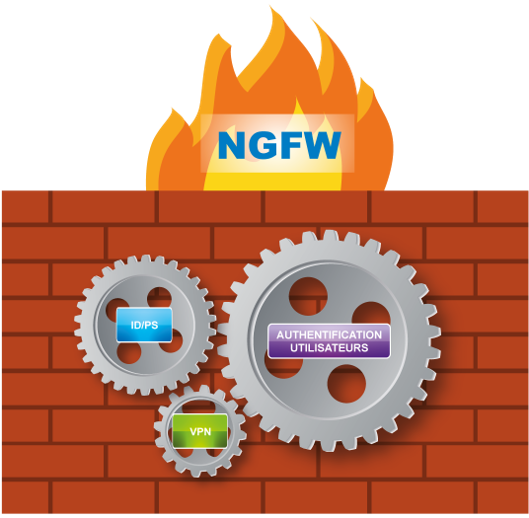
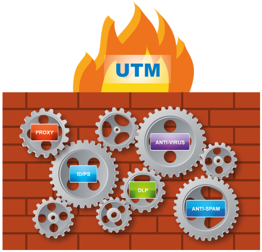
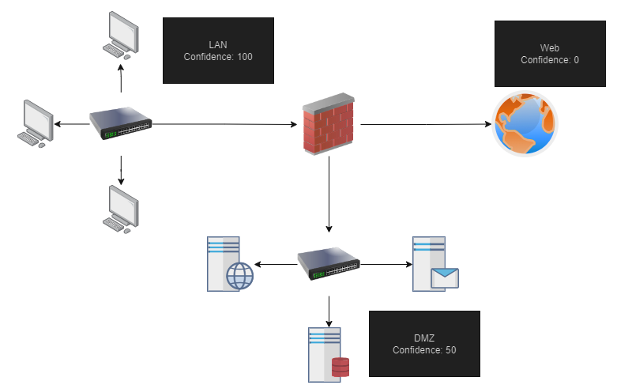
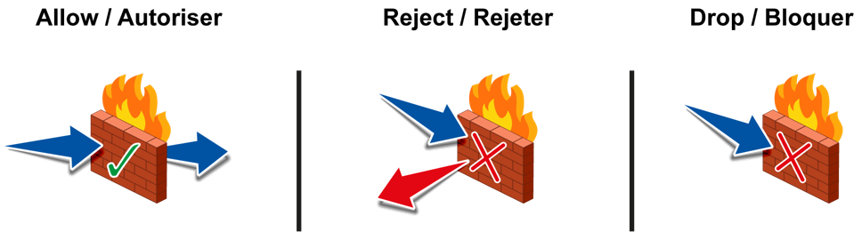

# 🧱 Pare-feu
<ais />

## 🧰 Pfsense

[Pfsense](https://www.pfsense.org/) est un pare-feu Open Source léger basé sur FreeBSD, développé par [Netgate](https://www.netgate.com/).

Il permet d'intégrer plusieurs fonctionnalités comme une sonde réseau Snort ou un proxy Squid via son gestionnaire de paquets.

Pfsense offre également des fonctionnalités VPN et dispose d'une interface de navigation organisée en menus :

- Le Dashboard est accessible via le logo
- Le menu **System** gère les configurations
- Le menu **Interfaces** gère les réseaux
- Le menu **Firewall** contrôle le pare-feu
- Le menu **Services** configure DHCP, DNS et packages
- Le menu **VPN** gère les connexions VPN
- Le menu **Status** permet la supervision
- Le menu **Diagnostics** aide au dépannage

Pfsense est disponible en version virtuelle, physique ou cloud. Une [documentation complète](https://docs.netgate.com/pfsense/en/latest/solutions/) est fournie par Netgate.

## 🧱 Firewalls

Un Firewall est un équipement responsable du filtrage des flux entrants et sortants d'un réseau. Cette frontière peut être entre Internet et votre réseau local, entre deux réseaux locaux, ou entre une machine et le réseau local.

Traditionnellement, la fonctionnalité de Firewall travaille sur les couches 3 et 4 du modèle OSI (2 et 3 de TCP/IP). Toutefois, la notion de firewall applicatif est aujourd'hui un élément à connaître, qui étend ce périmètre de travail aux couches supérieures.

Les pare-feu peuvent router les paquets, mais un routeur reste souvent nécessaire pour l'accès WAN. Deux questions se posent :

- Positionnement : avant ou après le routeur ?
- Attribution du NAT : pare-feu ou routeur ?

Les réponses varient selon les technologies utilisées.

## 🕸️ Les Filtrages

Le pare-feu filtre les paquets selon sa politique de filtrage, en utilisant principalement :

- Adresses IP source/destination
- Ports TCP/UDP source/destination
- Flags TCP
- Messages ICMP
- En-têtes HTTP

Les pare-feu traditionnels utilisent moins de critères :

Règles de base du filtrage (sauf pare-feu hôtes comme Windows Defender) :

- Lecture séquentielle des règles
- Application de la première règle correspondante
- Whitelist : tout est interdit sauf exceptions

La whitelist est préférée car plus sûre : il est difficile de prévoir tout ce qui doit être bloqué.

Il existe deux types de filtrage :

- Stateless
- Stateful

### 🚪 Stateless

Le mode stateless est le mode historique des pare-feu où chaque paquet est traité indépendamment, nécessitant une règle spécifique pour chaque autorisation.

Cette approche demande plus de règles et complexifie les configurations.

| |Direction|@ source|@ destination|Protocole|Port source|Port destination|ACK=1|Action|
|---|---|---|---|---|---|---|---|---|
|A|Out|192.168.0.0|0.0.0.0|TCP|>1023|80| |Accordé|
|B|In|0.0.0.0|192.168.0.0|TCP|80|>1023| |Accordé|
|C|Out|192.168.0.0|0.0.0.0|TCP|>1023|25| |Accordé|
|D|In|0.0.0.0|192.168.0.0|TCP|25|>1023|YES|Accordé|
|E|All|All|All|All|All|All| |Refusé|

L'exemple montre la configuration des protocoles HTTP et SMTP vers le WAN, avec SMTP bloqué en entrée.

Ce mode est encore utilisé dans les ACL *(Access Control List)* des équipements non pare-feu, permettant un filtrage complémentaire sur les routeurs, notamment pour les VLANs.

### 🛅 Stateful

Le mode Stateful fonctionne par connexions plutôt que par paquets. Le Firewall utilise une table d'état pour suivre les connexions, y compris pour les protocoles stateless comme UDP.

À l'arrivée d'un paquet, le Firewall consulte d'abord sa table d'état pour vérifier son appartenance à une connexion existante avant de consulter la table de routage.

En filtrant les connexions plutôt que les paquets individuels, ce mode simplifie la gestion et réduit le nombre de règles nécessaires.

| |Direction|@ source|@ destination|Protocole|Port destination|Action|
|---|---|---|---|---|---|---|
|A|Out|192.168.0.0|0.0.0.0|TCP|80|Accordé|
|B|Out|192.168.0.0|0.0.0.0|TCP|25|Accordé|
|C|All|All|All|All|All|Refusé|

Ces règles accomplissent les mêmes objectifs que le mode Stateless, mais de façon plus concise.

Les états de connexion varient selon le protocole (TCP ou UDP) et vont de l'absence de réponse à la connexion établie.

Le tableau ci-dessus provient de la table d'état d'un pfsense, on peut constater 3 connexions établies, ainsi qu'une connexion en cours d'arrêt.

Dans une situation d'établissement de connexion, on peut potentiellement constater deux valeurs différentes sur la même ligne, dû à la différence d'état entre la source et la destination.

## 📚 Les types de Firewalls

Les firewalls ont évolué vers deux types principaux : les **Next Generation Firewalls** (***NGFW***) et les **Unified Threat Management** (***UTM***).

Les NGFW se concentrent sur le filtrage avancé avec des fonctionnalités comme la sonde réseau intégrée et la protection DDoS.

Les UTM, privilégiés par les PME, combinent plusieurs outils de sécurité comme l'antivirus et l'anti-spam.

Aujourd'hui, la distinction entre NGFW et UTM s'estompe. L'essentiel est de choisir l'outil correspondant à ses besoins.

Attention toutefois : selon l'ANSSI, multiplier les fonctionnalités sur un firewall augmente sa surface d'attaque. Une utilisation prudente est recommandée.

## 📏 Les règles de Firewall

Les règles de Firewall sont composées de plusieurs éléments essentiels :

Le nom (choisi par l'utilisateur) et l'ID (attribué par le Firewall) identifient la règle. Une convention de nommage cohérente est recommandée.

La direction indique si le flux est "Entrant" (zone moins fiable vers plus fiable) ou "Sortant" (inverse). Certains pare-feu, comme pfSense, utilisent plutôt une gestion par interface.

Le LAN représente généralement la zone de confiance maximale.

Les autres paramètres comprennent :

- Le protocole IP (IPv4/IPv6)
- La source et destination (adresses IP)
- Le service (port du serveur)
- L'action (Autoriser, Bloquer, Refuser)

Autoriser est l'action principalement utilisée dans les Firewall aujourd'hui. La différence entre Rejeter et Bloquer réside dans le fait que Rejeter implique l'envoie d'un message de refus à l'émetteur. Ainsi, l'action Bloquer est à privilégier si vous souhaitez interdire une connexion explicitement.

Finalement, les paramètres journaux et Stats permettent le suivi du fonctionnement du Firewall, ainsi, sauf exception, la journalisation doit être activée.