# 🥽 Proxy / Serveur mandataire
<ais />

## 🙏 **Serveurs mandataires**

Les serveurs mandataires (ou proxies) interceptent et retransmettent les paquets vers leurs destinations à la place de l'émetteur. On utilisera [Squid](https://www.squid-cache.org/), une solution open source.

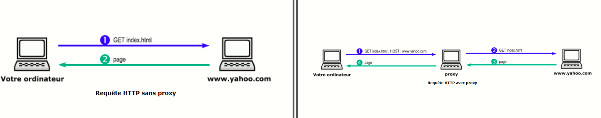

## 🤸 **Les usages**

Les serveurs mandataires ont diverses applications, dont certaines vont au-delà de la sécurité. Leur usage initial visait à contrôler la navigation web en entreprise. Aujourd'hui, ils servent principalement à restreindre l'accès aux sites de confiance et à prévenir le phishing.

Le proxy cache est une autre fonction importante : il conserve en mémoire les pages consultées pour optimiser leur accès et économiser la bande passante.

Les reverse proxies, placés devant les serveurs applicatifs, servent d'intermédiaire avec les utilisateurs pour protéger contre les attaques.

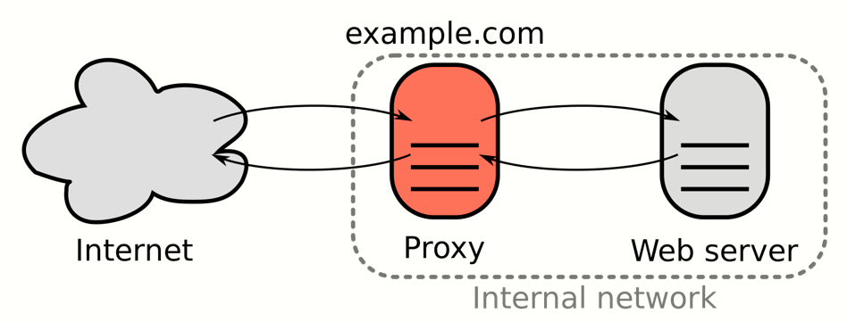

La supervision est un autre usage majeur des serveurs mandataires en entreprise, permettant de générer des logs de communications Web essentiels pour l'analyse des incidents de sécurité.

Enfin, l'anonymisation est possible en utilisant des serveurs mandataires distants, bien que cet usage soit peu courant en entreprise. De ce fait, de nombreux sites limitent l'accès aux utilisateurs de proxy pour prévenir les abus.

## 🙊 **Filtrer avec un proxy**

Pour se familiariser avec l'usage de proxy, on va manipuler un proxy Squid installé sur le Firewall Pfsense. On se rend donc dans le menu du *service Squid*, une fois celui-ci installé sur une instance de Pfsense.

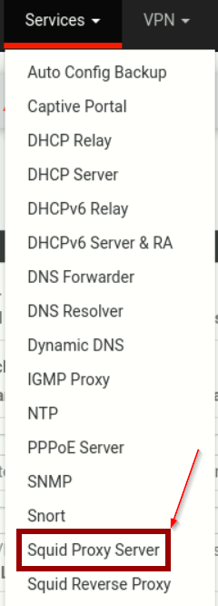

Avant de configurer le squid, il est important d'informer ce dernier du besoin ou absence de rôle de cache sur le proxy. Ainsi, on clique sur *Local Cache*. Ici, on ne se concetrera pas sur le rôle de proxy cache, on coche donc la première case visant à désactiver ce rôle.

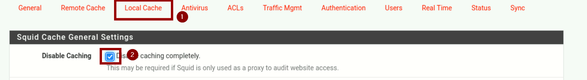

Dans un premier temps, quelques paramètres doivent être adaptés. Le premier d'entre eux est l'activation de Squid, il est aussi possible de customiser le **protocole IP**, l'**interface d'écoute**, ou le **port** utilisé.

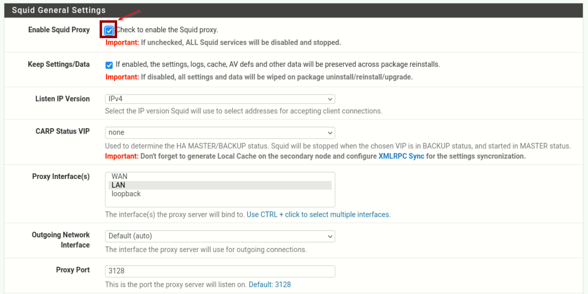

Les *General Settings* contiennent d'autre paramètre intéressant, tel que la possibilité de définir une **autorité de certification** supplémentaire pour permettre la gestion de `https` par le proxy.

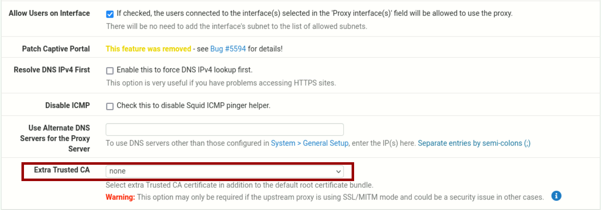

Ensuite, on configure le proxy transparent. Il s'agit d'une fonctionnalité permettant au proxy de fonctionner sans nécessité de configuration supplémentaire par les clients. Dans la configuration du proxy transparent, il est possible de spécifier des adresses IP pour lesquelles le proxy ne doit pas intervenir.

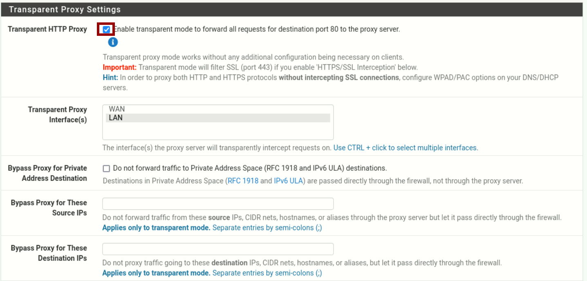

En dessous de la section concernant le proxy transparent se trouve la section traitant de l'interception **SSL/TLS**.

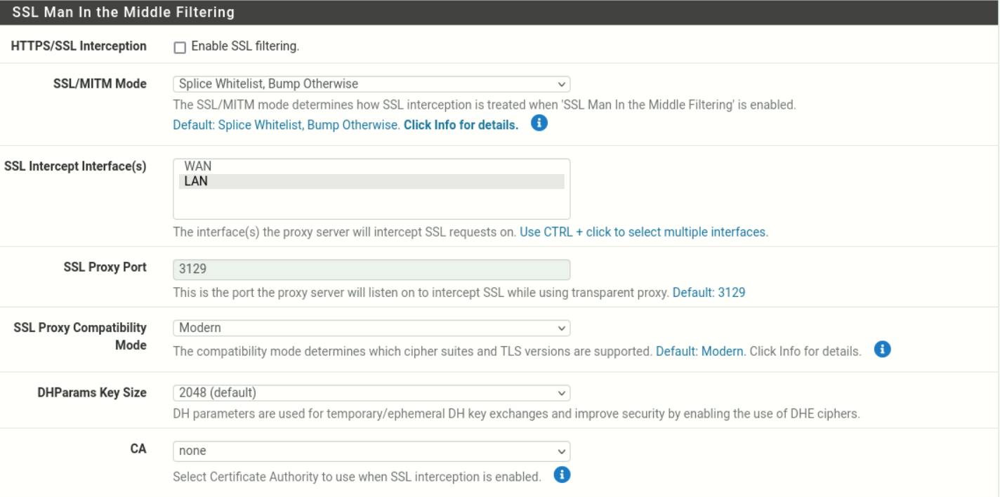

La configuration suivante est extrêmement importante. Il s'agit de la mise en place de la journalisation par le proxy. Il est nécessaire de bien l'activer, ainsi que de définir une durée de conservation des logs. Ici, on définira une conservation d'un an.

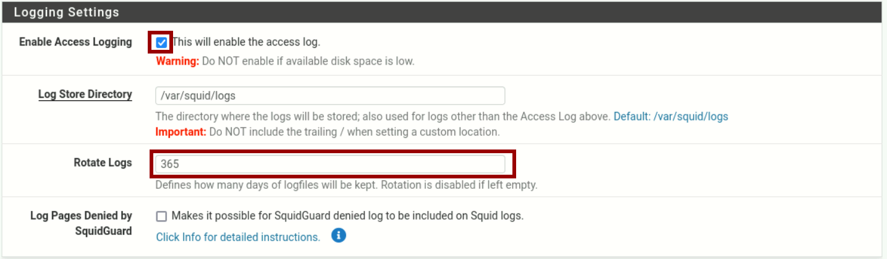

Finalement, Squid propose de configurer les en-têtes, la langue, etc. Diverses configurations sont possibles, mais l'une d'entre-elles est très recommandée : le masquage de la version. Une fois, cela fait, confirmez la configuration.

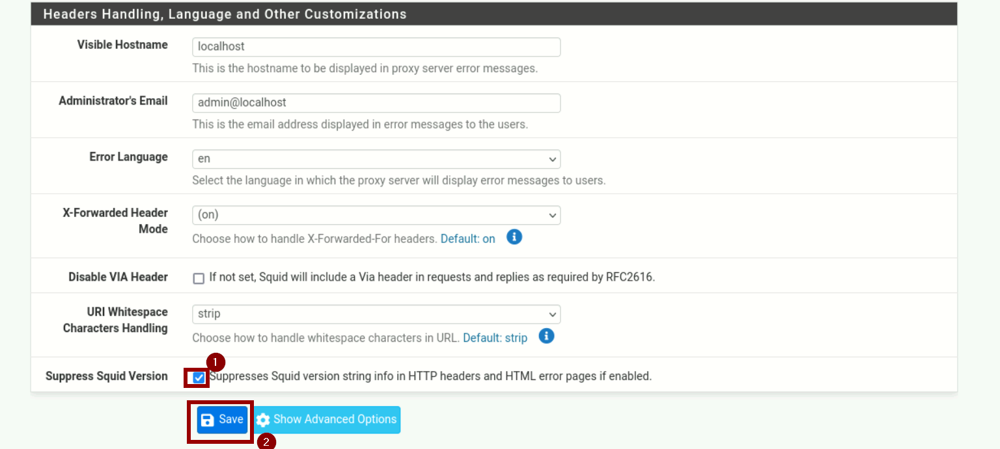

Il est maintenant de configurer le filtrage par le proxy. Pour ce faire, dans le menu service, se rendre sur *SquidGuard Proxy Filter*.

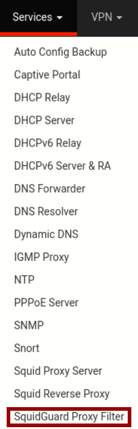

Il faut ensuite activer le rôle Squidguard. Ne pas cliquer tout de suite sur *Apply*, on reviendra ici une fois les configurations effectuées, car il est nécessaire de cliquer sur *Apply* pour en tenir compte.

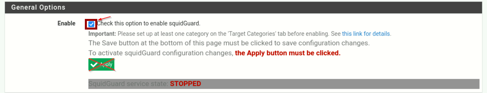

On souhaite aussi activer la journalisation de **squidguard**, qui générera des logs relatives aux activités de filtrage du proxy.

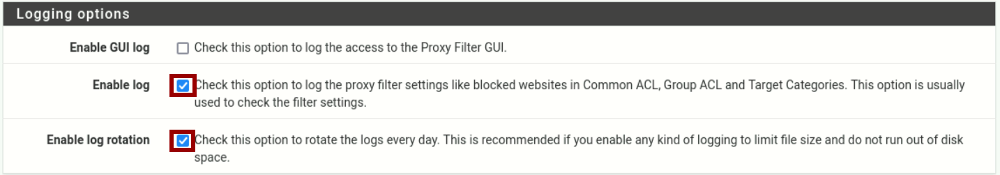

Finalement, il est possible de configurer la blacklist. Ici, on utilisera le lien suivant : [BlackList](http://dsi.ut-capitole.fr/blacklists/download/blacklists_for_pfsense.tar.gz). Il s'agit d'une blacklist open source communément utilisée.

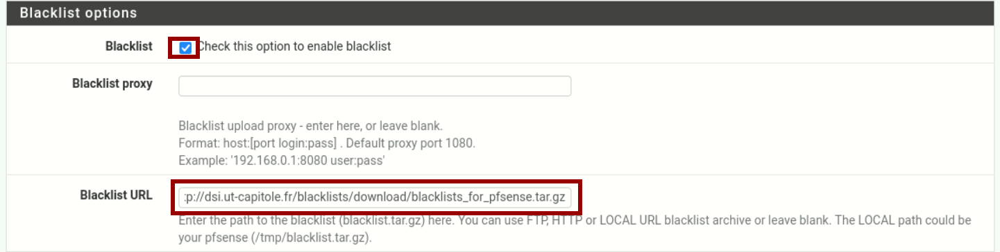

Une fois la blacklist configurée, on sauvegarde puis on se rend dans l'onglet *blacklist*.

Cliquer ensuite sur le bouton *Download* afin de télécharger la blacklist précédemment renseignée. L'avancée du téléchargement apparaîtra en bas de l'écran.

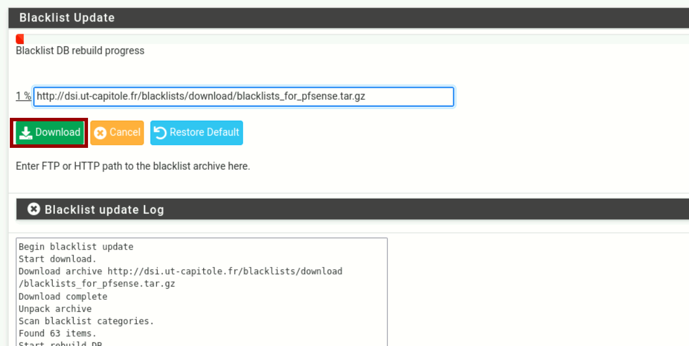

Une fois la blacklist téléchargée, on se rend dans l'onglet *Common ACL* afin de pouvoir observer les différentes catégories de site web connu par la liste. Cela permettra aussi de spécifier les catégories autorisées ou non.

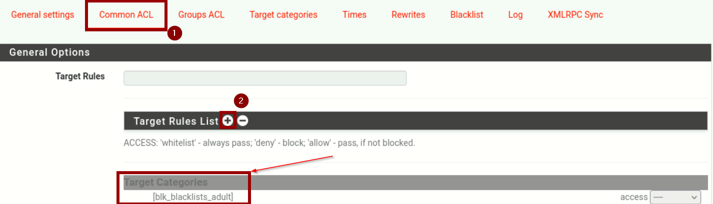

Il existe deux façons d'aborder la configuration de ces catégories, **Whitelisting** ou **Blacklisting**. On sélectionne les catégories à autoriser et où à interdire dans la liste proposée.

Une fois, cela fait, il reste encore à interdire les communications vers des adresses `IPs` :

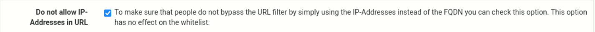

Une fois, cela fait, il ne reste plus qu'à sauvegarder ce menu de configuration, puis à se rendre dans le menu et à finalement cliquer sur le bouton *Apply* afin de tenir compte des changements.