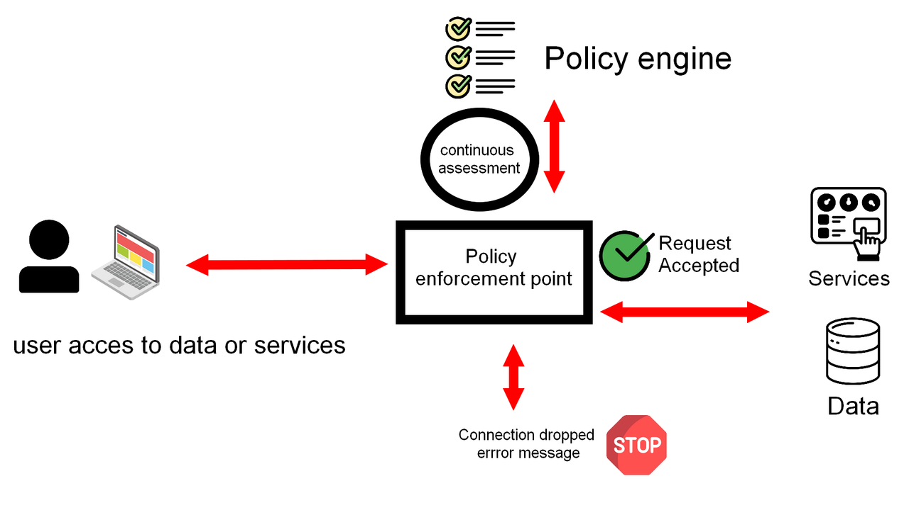
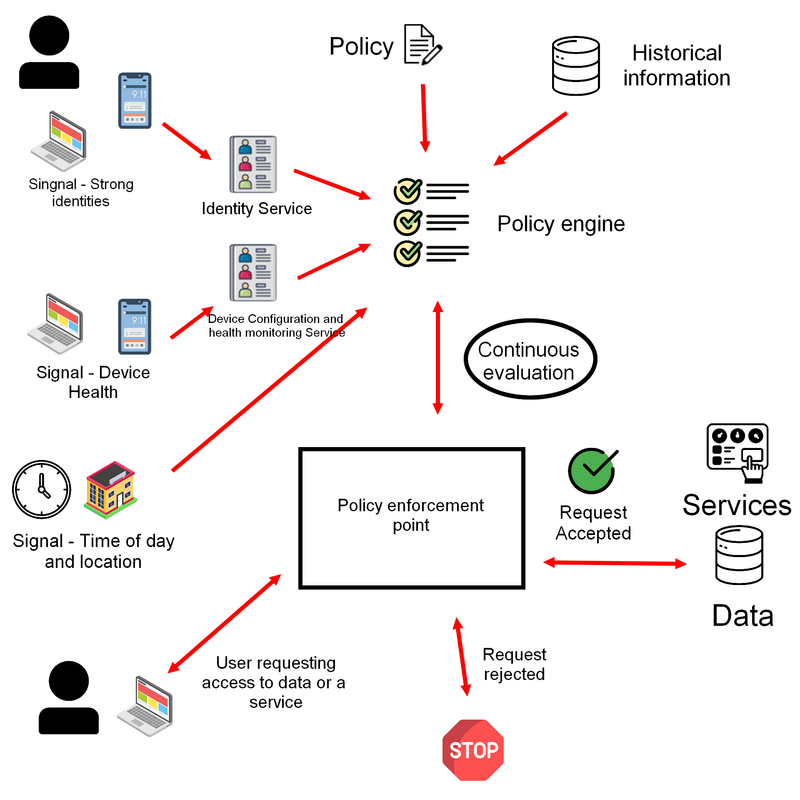

# 0️⃣ Zero Trust
<ais />

## **📑 Aperçu des principes**

Les principes clés de Zero Trust.

**1. Connaître son architecture** : Identifier tous les composants de l'infrastructure.

**2. Gérer les identités** : Suivre utilisateurs, services et appareils.

**3. Surveiller les comportements** : Évaluer les actions des utilisateurs et l'état des systèmes.

**4. Appliquer des politiques** : Autoriser l'accès selon des règles strictes.

**5. Authentifier partout** : Vérifier chaque accès avec plusieurs facteurs.

**6. Observer les acteurs** : Surveiller utilisateurs, appareils et services.

**7. Méfiance des réseaux** : Ne faire confiance à aucun réseau.

**8. Services compatibles** : Utiliser des solutions conçues pour Zero Trust.

## 🎬 Introduction au Zero Trust

Une architecture à confiance zéro supprime la confiance inhérente au réseau. Le réseau est considéré hostile et chaque demande d'accès est vérifiée selon une politique stricte.

La fiabilité d'une demande repose sur l'authentification forte, l'autorisation, l'état de l'appareil et la sensibilité des données.

## 🎯 Concepts clés

Les principes Zero Trust s'appuient sur des concepts fondamentaux.

### **🚦 Le réseau est hostile**

* Le réseau est considéré comme **compromis** et **hostile**, sans confiance accordée.
* La connexion au réseau ne garantit pas l'accès à toutes les ressources. Chaque demande d'accès nécessite une authentification et une autorisation spécifiques.
* Sans ces contrôles, un attaquant pourrait facilement se déplacer latéralement après avoir compromis un point d'accès.
* L'architecture Zero Trust améliore la détection des mouvements latéraux malveillants, même si elle ne les élimine pas totalement.

### **📈 Gagner la confiance de manière dynamique**

* Sans confiance dans le réseau, il faut établir la confiance des utilisateurs, appareils et services de façon continue.
* L'évaluation de la fiabilité des connexions doit être permanente plutôt que basée sur un contrôle initial.
* Pour les utilisateurs, vérifier l'identité, le comportement et l'état de l'appareil avant tout accès.
* Pour les services interconnectés, s'assurer de la légitimité des communications et de la santé des services.
* Le niveau de confiance requis varie selon la sensibilité des données ou l'impact de l'action.

**Par exemple**, l'accès aux données sensibles nécessite une authentification forte et un appareil sécurisé de l'organisation, tandis que l'accès à des informations basiques comme le menu du jour est plus souple.

## 📋 Terminologie

Lorsque l'on parle d'architectures de confiance zéro, il est utile d'avoir un vocabulaire commun. Ci-dessous certains termes utilisés dans les principes de la confiance zéro.

- **Politique d'accès** : Conditions requises pour qu'une demande d'accès soit fiable et autorisée.
- **Politique de configuration** : politique décrivant les options de configuration des appareils et des services.
- **Signal** : élément d'information tel que l'état de santé ou la localisation d'un appareil, qui peut être utilisé pour s'assurer de la fiabilité d'un bien. On utilisera souvent un certain nombre de signaux pour décider d'accorder ou non l'accès à une ressource.
- **Moteur de politique** - Composant qui prend les signaux et les compare aux politiques d'accès pour déterminer une décision d'accès.
- **Point d'application de la politique** - Médiation des demandes d'un utilisateur ou d'un appareil vers un service ou des données à l'aide du moteur de politique afin de déterminer si les demandes peuvent être autorisées.
- **Santé de l'appareil** - Confiance dans le fait qu'un appareil est conforme aux politiques de configuration et qu'il est en bon état. Par exemple, les derniers correctifs ont été installés ou une fonction comme le démarrage sécurisé est activée.

## 👨‍💻 Connaître son architecture

Dans le modèle Zero Trust, une connaissance approfondie de tous les composants est essentielle : utilisateurs, appareils, services et données.

La première étape consiste à faire l'inventaire complet des actifs, que ce soit via des outils automatisés ou des procédures manuelles comme la consultation des dossiers d'approvisionnement.

Il est crucial d'**identifier l'emplacement** et la **sensibilité des données** pour définir des politiques d'accès adaptées.

### 0️⃣ Transition vers la confiance zéro

La découverte des actifs est essentielle, que ce soit pour une transition depuis un système existant ou pour un nouveau déploiement. Sans prise en compte des services existants, ceux-ci peuvent être exposés à des risques accrus car non conçus pour un réseau hostile.

### 🎓 Effectuer une évaluation des risques

Une fois l'architecture identifiée, on évalue les risques pour l'architecture cible et leurs moyens d'atténuation.

Après la découverte des actifs, on commence par une évaluation des risques incluant la modélisation des menaces. Cela permet de vérifier si les composants Zero Trust peuvent protéger contre tous les risques identifiés.

L'atténuation dépend de la criticité des actifs. On évalue leur importance pour définir les protections nécessaires. Si certains risques ne peuvent être atténués par Zero Trust, on conserve les contrôles de sécurité existants.

## 🏛️ Connaître les identités des utilisateurs, des services et des appareils

L'identité est un facteur critique pour les décisions d'accès dans un réseau Zero Trust.

Une identité peut être un utilisateur, un service ou un appareil. Chacun nécessite une identification unique et vérifiable cryptographiquement pour accéder aux ressources. Ces identités constituent des signaux essentiels pour le moteur de politique qui gère les décisions d'accès.

Par exemple, le moteur vérifie l'authenticité de l'utilisateur et de l'appareil avant d'autoriser l'accès. Un exercice de découverte initial permet d'établir une source d'identité unique pour tous les acteurs.

### 👨‍💼 Identité de l'utilisateur

L'organisation doit maintenir un répertoire d'utilisateurs central avec des comptes individuels, via un annuaire virtuel ou synchronisé.

Les identités sont liées à des rôles définissant les accès minimums nécessaires, basés sur la fonction de l'utilisateur.

L'annuaire doit être compatible avec tous les services pour fournir une identité unique et une authentification centralisée.

**Un service d'identité des utilisateurs doit :**

- Gérer les groupes et rôles (***principe du moindre privilège***)
- Supporter l'authentification forte (***MFA, sans mot de passe***)
- Gérer les identifiants de façon sécurisée
- Permettre l'authentification fédérée (***SAML 2.0, OAuth 2.0, OpenID Connect***)
- Gérer les identités externes (***SCIM 2.0***)
- Gérer le cycle de vie des utilisateurs
- Supporter l'identification fédérée tierce

### 🌌 La migration

La migration d'un annuaire existant requiert une planification précise. Les services d'annuaire permettent souvent l'import, la synchronisation ou la fédération pour une transition progressive.

### 🚪 Accès externe

L'accès des personnes externes peut être géré via une fédération avec des fournisseurs d'identité externes, avec des droits limités selon leur rôle. Par exemple, un visiteur accède au menu, un prestataire uniquement à ses documents.

### 🪙 Jetons de service

Les services ne doivent pas avoir d'accès illimité. Il est préférable d'utiliser des jetons d'accès temporaires et restreints, liés à l'identité utilisateur.

En cas de comportement anormal, le niveau de confiance diminue et des actions correctives sont déclenchées automatiquement *(déconnexion, MFA)*.

### 🪪 Identité du service

Chaque service doit avoir une identité propre avec des privilèges minimaux et des communications réseau limitées aux besoins essentiels.

L'authentification peut se faire via des certificats uniques permettant des connexions TLS mutuelles entre les processus.

L'accès utilisateur doit être centralisé via un répertoire unique, avec des décisions d'accès basées sur des signaux multiples.

### 🆔 Identité des appareils

Les appareils de l'organisation doivent être identifiés de façon unique dans un répertoire centralisé pour une gestion efficace.

Les politiques Zero Trust utilisent la conformité et la santé des appareils pour gérer les accès, nécessitant une identité forte.

La fiabilité de l'identité dépend de l'appareil :

- **L'utilisation d'un coprocesseur matériel sécurisé** (TPM) offre une confiance maximale.
- **Sur un appareil géré**, les clés logicielles offrent une confiance moyenne.
- **Sur un appareil non géré**, les clés logicielles offrent une confiance minimale.
- **L'identification inter-organisations** nécessite des accords techniques et de gouvernance.

## 🎓 Évaluer le comportement des utilisateurs et l'état des systèmes

Le comportement des utilisateurs et l'état des appareils et services sont des indicateurs clés pour la sécurité des systèmes. Une surveillance continue permet d'évaluer leur fiabilité et d'alimenter les décisions d'accès via un moteur de politiques.

Ces évaluations nécessitent des sources d'identité uniques et une phase préalable de découverte des actifs.

### 💻 Appareils

La santé des appareils est cruciale pour contrôler l'accès aux données et services. Elle repose sur le respect des politiques de configuration et l'état général du système.

Définir des politiques de sécurité de base, les appliquer via un service de gestion des appareils et vérifier leur conformité régulièrement.

L'état de santé se mesure par les fonctions de sécurité actives, comme le démarrage sécurisé, et l'intégrité du micrologiciel, du démarrage et du système d'exploitation.

L'attestation permet d'évaluer l'état d'un appareil en analysant ses composants matériels et logiciels. Les suites de sécurité des points finaux fournissent également des indicateurs de confiance.

Les utilisateurs doivent disposer d'une procédure claire pour maintenir ou restaurer la conformité de leurs appareils, notamment pour les mises à jour de sécurité après une période hors ligne.

### 🏛️ Les services

La santé des services doit être surveillée lors des accès utilisateurs et des communications inter-services.

L'infrastructure Zero Trust (moteur et points d'application de politique) est également considérée comme un service.

- Les services doivent utiliser leurs fonctions de sécurité natives pour respecter les principes Zero Trust.

> Par exemple, activer l'authentification forte et désactiver les protocoles hérités non compatibles.

- Maintenir les services à jour avec les derniers correctifs de sécurité et surveiller leur version. Appliquer rapidement les correctifs critiques.

- Surveiller l'état des services - tout changement inattendu peut signaler une activité malveillante.

Les indicateurs clés incluent : le ***niveau des correctifs*** et la ***conformité aux politiques de configuration***.

> Par exemple, éviter l'exécution des conteneurs en mode privilégié.

- Vérifier que le code provient d'un pipeline de livraison fiable.

### 👨‍💼 Les utilisateurs

La surveillance du comportement des utilisateurs permet de définir les activités normales et de détecter les anomalies. Les politiques de connexion vérifient les conditions d'accès, comme la localisation géographique ou l'heure de connexion inhabituelle.

Des facteurs d'authentification supplémentaires peuvent être requis pour renforcer la sécurité.

### 🏗️ L'infrastructure

La surveillance de l'état de santé de l'infrastructure *(sur site ou IaaS)* s'effectue via l'analyse des flux réseau et des journaux.

Cette surveillance permet de détecter les menaces comme les appareils malveillants, les flux de données non autorisés ou les processus suspects.

## 📚 Utiliser les politiques pour autoriser les demandes

Chaque demande d'accès doit être validée par une politique.

Les politiques d'accès sont au cœur de l'architecture Zero Trust. Elles permettent de gérer les risques tout en facilitant le partage avec les utilisateurs externes.

On prévilégiera les solutions compatibles avec l'authentification et l'autorisation continues.

**Exemple** - Processus d'autorisation

1. L'utilisateur se connecte via un point d'application de politique
2. Le point d'application consulte le moteur de politique pour la décision d'accès
3. L'accès est accordé ou refusé selon la décision
4. L'autorisation est réévaluée en continu - tout changement peut modifier l'accès

La manière dont on utilise les règles pour autoriser les demandes dépend des technologies de confiance zéro que l'on déploie.

> Par exemple, la confiance zéro utilisant des services cloud gérés sera différente de celle d'un réseau sur site.

Dans certaines approches, les noms et la terminologie utilisés peuvent être légèrement différents de l'exemple ci-dessus.

### 📈 Évaluation continue

L'évaluation continue surveille les signaux des utilisateurs et appareils. Si leur niveau de sécurité se dégrade, une réauthentification peut être exigée pour maintenir l'accès. Le moteur de politique n'autorise les connexions que si les politiques strictes sont respectées.

### 🛡️ Protéger le moteur de la politique

Les composants qui appliquent la politique d'accès doivent être particulièrement sécurisés car leur compromission permettrait de contrôler tous les accès.

Le moteur de politique doit :

- Ne communiquer qu'avec des sources de confiance authentifiées
- Valider toutes les entrées avant analyse
- Limiter l'importation des politiques aux utilisateurs autorisés

### 📽️ Utiliser plusieurs signaux pour prendre des décisions d'accès

Les décisions d'accès s'appuient sur des signaux historiques et en temps réel pour établir un contexte de confiance. Ces signaux alimentent le moteur de politique pour une prise de décision éclairée.

L'utilisation de multiples signaux est essentielle pour vérifier l'**authenticité** du demandeur et la **sécurité** de son appareil.

Le niveau d'exigence varie selon l'impact de l'action : strict pour des actions critiques *(ex: création d'admin)*, plus souple pour des actions mineures *(ex: consultation de menu)*.

**Exemple** - évaluation des signaux

Le moteur de politique évalue en continu les signaux et l'accès des utilisateurs via des points d'application dédiés. Bien que l'implémentation puisse varier, ce principe reste constant.

### 0️⃣ Achat d'une technologie Zero Trust

Pour choisir des technologies Zero Trust, on évalue leur compatibilité avec le moteur de politiques et les signaux qu'elles peuvent traiter.

Les signaux principaux incluent :

- le rôle de l'utilisateur
- l'emplacement physique
- l'authentification
- l'état de l'appareil
- l'heure d'accès
- la sensibilité du service
- le niveau de risque

### ☸️ Moteurs basés sur les risques

Les moteurs de politique évaluent la confiance accordée aux utilisateurs et appareils pour ajuster dynamiquement les accès.

> Par exemple, lors d'un premier accès à un service sensible hors des heures habituelles, une authentification supplémentaire peut être demandée.

### 💼 Autres considérations

**Accès refusé**

> Adapter les messages de refus d'accès : trop d'informations aident les attaquants, trop peu frustrent les utilisateurs légitimes. Privilégier des messages génériques d'erreur d'authentification sans détails spécifiques.

**Break glass**

> Prévoir une procédure d'urgence pour les accès critiques, même si une politique ne peut être respectée. Documenter chaque utilisation sur un support partagé pour détecter les abus. Limiter les risques en restreignant ces accès à des comptes spécifiques, des appareils dédiés, des lieux précis, avec une durée et des privilèges minimaux.

**Disponibilité**

> Après la définition des politiques d'accès, évaluer leur impact sur la disponibilité. Commencer par une phase d'observation sans blocage pour valider le fonctionnement.
> Pendant cette phase, auditer régulièrement les journaux et réagir rapidement aux tentatives malveillantes. Une période de transition peut être nécessaire, où les contrôles traditionnels restent actifs pendant l'évaluation des nouvelles politiques.

## 📃 Authentifier et autoriser partout

On doit considérer le réseau comme hostile - authentifier et autoriser chaque connexion aux données et services. On doit utiliser une authentification forte et intégrer un moteur de politique dans les applications.

Évaluer le risque en fonction de l'état de l'appareil, sa localisation, l'identité et le statut de l'utilisateur.

### Multi-facteurs

L'authentification multifactorielle (AMF) est indispensable en Zero Trust, mais peut rester fluide pour l'utilisateur.

L'AMF s'active uniquement quand la confiance diminue. Les notifications push sur appareil de confiance remplacent la saisie de codes.

Certains facteurs sont invisibles, comme l'authentification sans mot de passe via `FIDO2`.

### Facilité d'utilisation

L'authentification forte doit préserver la convivialité du service. Demander des facteurs d'authentification supplémentaires uniquement pour les actions à fort impact comme l'accès aux données sensibles ou la création d'utilisateurs. Utiliser le SSO pour réduire les frictions.

Une approche basée sur le risque permet d'optimiser le niveau d'authentification requis. Si la confiance dans l'utilisateur est élevée, les facteurs supplémentaires peuvent être évités.

L'authentification sans mot de passe (`FIDO2`) offre un excellent compromis entre sécurité et expérience utilisateur.

### Service à service

Les services s'authentifient entre eux via des **jetons d'API**, **OAuth 2.0** ou **PKI**.

L'authentification mutuelle garantit que les deux services sont légitimes, essentiel pour établir des listes d'autorisation basées sur l'identité.

## 🚔 Concentrer la surveillance sur les utilisateurs, les appareils et les services

Une surveillance complète est essentielle pour protéger les appareils et services contre les attaques. Dans une architecture Zero Trust, la surveillance se concentre sur trois éléments clés : *les utilisateurs*, *les appareils* et *les services*. Cette approche permet d'évaluer leur cyber santé.

La surveillance s'effectue sur l'appareil et est transmise de manière sécurisée vers un emplacement central. Les comportements inhabituels des utilisateurs, les actions des appareils et les interactions avec les services sont surveillés pour détecter toute anomalie.

Ces données alimentent le moteur de politique pour les décisions d'accès et permettent de vérifier l'application correcte des règles définies.

### 🛂 Déplacement du contrôle de protection

Dans une architecture traditionnelle, les appareils utilisent un VPN pour acheminer le trafic via un chemin contrôlé permettant une surveillance centralisée. En Zero Trust, le contrôle de protection doit être déplacé sur chaque appareil.

Les suites de sécurité des terminaux fournissent des informations de surveillance en détectant les menaces et comportements suspects.

### 📱 BYOD et appareils invités

Les appareils BYOD et invités ne peuvent pas être surveillés aussi étroitement que les appareils d'entreprise. Il convient donc de leur accorder moins de confiance.

Des solutions comme la gestion des appareils (MDM) et des applications mobiles (MAM) peuvent renforcer leur sécurité.

### 📹 Surveillance du réseau

Malgré l'hostilité présumée du réseau, sa surveillance reste cruciale pour les performances et l'hygiène cyber. La surveillance des réseaux permet de mesurer les performances, d'identifier les appareils connectés et de détecter les menaces, en particulier pour les services sur site.

Combinée à la surveillance des appareils, elle améliore la visibilité en permettant de retracer l'origine des connexions.

## 🚨 Ne faites confiance à aucun réseau, y compris le vôtre

En Zero Trust, tout réseau est considéré hostile. La confiance doit être établie au niveau des utilisateurs, appareils et services. Les communications doivent utiliser un transport sécurisé (`TLS`) sur tous les réseaux, même locaux.

Les appareils doivent être protégés contre les attaques locales : usurpation DNS, man-in-the-middle et connexions non sollicitées. La protection des services réseau fondamentaux nécessite un transport sécurisé. Les services doivent être protégés par des protocoles authentifiés et chiffrés, ou via un VPN si nécessaire.

Une surveillance appropriée doit être maintenue quelle que soit la méthode de protection choisie.

### Appliquer la politique d'utilisation des appareils

Dans une architecture Zero Trust, le trafic Internet n'étant pas centralisé, la sécurité doit être appliquée directement sur l'appareil.

Les politiques de navigation, le blocage des domaines malveillants et le contrôle des protocoles réseau sont donc gérés localement. La détection des URL malveillantes et du phishing devient une fonction de sécurité de l'appareil. Si la sécurité locale est insuffisante, le trafic peut être routé via un proxy cloud géré.

La disponibilité et la sécurité de ces services doivent être évaluées.

### Hygiène cybernétique générale

Malgré la méfiance envers le réseau, une bonne hygiène cyber reste nécessaire. La surveillance des hôtes non autorisés et la mise à jour des composants réseau garantissent performance et disponibilité.

## 💼 Choisir des services conçus pour une Zero Trust

Privilégier les services intégrant nativement la prise en charge Zero Trust. Ces services doivent être conçus pour se protéger contre toutes les sources d'attaque potentielles, y compris l'internet.

### Services hérités

Les services hérités peuvent nécessiter des composants supplémentaires pour la confiance zéro, augmentant ainsi les coûts et la complexité de gestion.

### Ne pas réinventer la roue

Éviter de créer sa propre infrastructure. Utiliser des solutions professionnelles éprouvées.

### Rechercher des normes

Privilégier les technologies standardisées *(comme OpenID Connect, OAuth 2.0, SAML)* pour garantir l'interopérabilité.

### Services gérés dans le nuage

De nombreux services cloud sont conçus selon les principes Zero Trust. Vérifier la fiabilité des fournisseurs avant de les adopter.