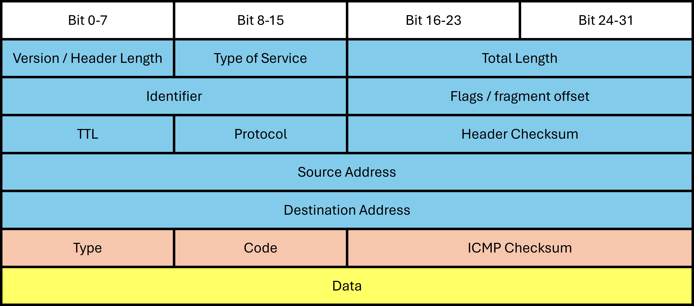
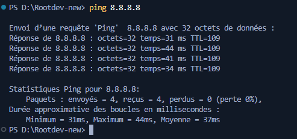
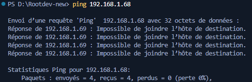
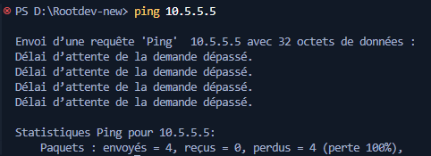
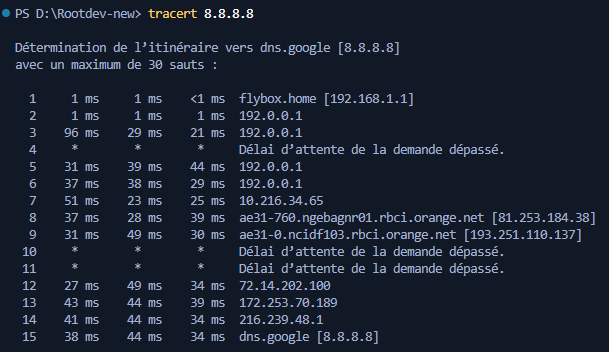
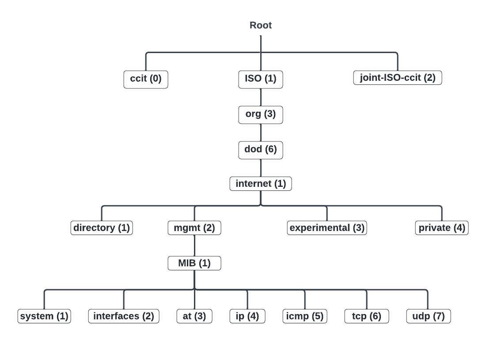
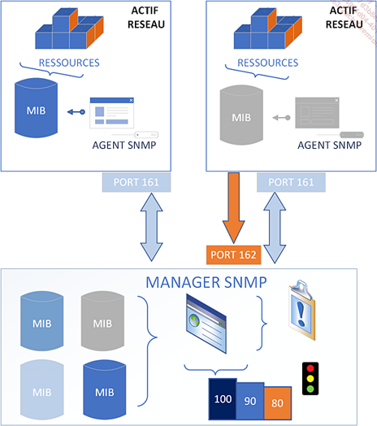

# 🔎 Introduction
<ESDInfo />

## **📶 ICMP**

**Internet Control Message Protocol**: protocole réseau (couche 3 OSI) échangeant des informations diagnostiques dans les réseaux IP. Utilisé par les routeurs pour signaler des erreurs et communiquer l'état du réseau.

Les messages ICMP sont envoyés comme datagrammes. Pour éviter les cascades d'erreurs, aucune erreur n'est générée sur les paquets ICMP eux-mêmes, assurant ainsi une gestion efficace du réseau.

Ce cours traite uniquement IPv4, mais ICMP est également compatible IPv6.

Un paquet ICMP en IPv4 se compose comme suit :



Dans un message ICMP, la partie bleue est l'en-tête IP qui encapsule les données pour le transport réseau.

La partie orange et jaune représente l'en-tête ICMP, essentielle pour l'analyse.

- **Type** : Indique la nature du message ICMP, comme une requête ping (type 8) ou sa réponse (type 0).
- **Code** : Précise les détails du message, notamment la raison spécifique de son envoi.
- **ICMP** Le checksum vérifie l'intégrité de l'en-tête. Si le calcul ne correspond pas à l'original, le paquet peut être rejeté.

Nul besoin de mémoriser tous les types et codes ICMP. L'important est de savoir où trouver ces informations via Wireshark ou les documentations techniques. ([RFC 792](https://datatracker.ietf.org/doc/html/rfc792),[RFC 950](https://datatracker.ietf.org/doc/html/rfc950), [RFC 1256](https://datatracker.ietf.org/doc/html/rfc1256), [Wiki ICMP](https://fr.wikipedia.org/wiki/Internet_Control_Message_Protocol)).

## **🏓 Commande ping et tracert**

La commande `ping` envoie un **echo request** (ICMP type 8 code 0) et attend un **echo reply** (type 0 code 0). Cela vérifie la connectivité bidirectionnelle et mesure le temps de réponse, formant un test réseau simple et efficace.



L'adresse 8.8.8.8 est le DNS public de Google. On peut utiliser n'importe quelle IP, y compris des adresses privées locales.

Ici, les DNS Google répondent avec 0 paquets perdus, un temps stable et un TTL de 250 indiquant le nombre de routeurs traversés.

Si ces résultats montrent un fonctionnement normal, ce cours de dépannage s'intéresse particulièrement aux situations problématiques :

**Host unreachable**



Cette erreur survient lorsque le destinataire est inaccessible, ou qu'un appareil réseau intercepte et rejette le paquet. Le protocole ICMP renverra alors un message d'erreur, comme *Destination Unreachable (type 3)*, pour indiquer que le paquet n'a pas pu atteindre sa destination.

**Request timed out**



Cette erreur survient lorsque l'émetteur ne reçoit pas de réponse, soit en raison d'une erreur de routage, soit parce qu'un appareil réseau bloque la communication.

## **👣 Tracert**

La commande `tracert` permet de suivre le chemin qu'emprunte un paquet pour aller d'un point A (vous) à un point B (la destination). Elle affiche chaque routeur traversé, et elle aide à localiser des problèmes éventuels, comme un routeur défaillant ou un chemin réseau incorrect.



## **👀 nslookup**

La commande `nslookup` permet d'interroger les serveurs DNS (Domain Name System) pour résoudre des noms de domaine en adresses IP, ou inversement. Elle est couramment utilisée pour diagnostiquer des problèmes liés à la résolution des noms de domaine et pour vérifier la configuration DNS.

```bash
nslookup ip
ou
nslookup Nom_DNS
```

## **📊 netstat**

**netstat** (Network Statistics) surveille les connexions réseau, détecte les services en écoute et identifie les connexions actives.

Options principales :

```
netstat help
```

```
netstat
```

Sans option : affiche toutes les connexions TCP/UDP actives.

```
netstat -t
```

Avec -t : montre uniquement les connexions TCP.

Avec -r : affiche la table de routage.

```
netstat help
```

Affiche toutes les commandes et leurs fonctions.

Pour quitter : **Ctrl + C**.

## **💼 SNMP**

Le *protocole SNMP* (Simple Network Management Protocol) permet de superviser et gérer les équipements réseau. Il fonctionne principalement sur UDP (ports 161/162), mais peut utiliser TCP.

**Agent SNMP**: Programme intégré dans un équipement réseau qui collecte les données de performance (bande passante, erreurs, etc.).

La **MIB (Management Information Base)** est un modèle structuré en arbre qui répertorie les ressources supervisables. Chaque élément est identifié par un **OID** (Object Identifier).

Un **OID** est une chaîne numérique (ex: .1.3.6.1.2.1.1.5.0) qui identifie un objet dans la MIB, facilitant l'accès aux informations spécifiques.



Trois versions principales:

- **SNMPv1**: Premier RFC définissant le protocole.
- **SNMPv2c**: Version la plus utilisée, avec commandes améliorées (Get-Bulk, Inform).
- **SNMPv3**: Ajoute sécurité, authentification et intégrité des données.



Le protocole SNMP peut être utilisé sous 2 formats:

- **Polling:** Ce format implique une vérification active, où des requêtes sont envoyées régulièrement pour obtenir des informations sur l'état des dispositifs. Cela permet de surveiller en continu les performances et l'état des équipements réseau.
- **Traps:** Dans ce format, des informations sont envoyées uniquement lorsqu'un événement particulier se produit. Cela permet aux agents SNMP d'alerter le gestionnaire SNMP en temps réel sans nécessiter de demande préalable, ce qui peut réduire la charge sur le réseau.

## **↔️ ARP**

**ARP** est un protocole qui permet de résoudre les adresses IP des différentes machines dans un réseau en les associant aux adresses MAC correspondantes. Lorsqu'un appareil souhaite communiquer avec un autre dans un réseau local, il utilise ARP pour déterminer l'adresse MAC associée à l'adresse IP cible. Une fois cette information obtenue, elle est stockée dans une table ARP.

La commande ci-dessous permet d'afficher la table ARP.

```bash
arp -a
```

La commande ci-dessous permet de supprimer la ligne correspondant à l'adresse IP.

```
arp -d @ip
```

La commande ci-dessous permet d'ajouter les informations rentrées dans la table ARP.

```
arp -s @ip @mac
```

## **3️⃣ hping 3**

**hping3** est un outil souvent utilisé pour réaliser des tests d'analyse réseau. Il permet de générer des paquets réseau personnalisés et de tester différents services. Grâce à sa flexibilité, il peut manipuler des paquets TCP, UDP, ICMP et RAW-IP, ce qui en fait un outil polyvalent pour les administrateurs réseau et les professionnels de la sécurité.

```
hping3 -S -p 80 google.com
```

L'option -S signifie l'envoie d'un paquet SYN (synchronisation d'un paquet TCP) sur le port 80 de Google.

## ©️ Cisco

### **🏃 show running config**

La commande **show running-config** est une commande utilisée sur les appareils Cisco pour afficher la configuration actuelle d'un appareil, qu'il s'agisse d'un routeur ou d'un commutateur. Voici comment l'utiliser :

```bash
show running-config
ou
do show running-config
```

### **🔵🔴 show vlan**

Show vlan est une commande Cisco permettant d'afficher la configuration des Vlans sur l'appareil.

```
show vlan
ou
do show vlan
```

### **📱 show interface**

Show interface est une commande Cisco permettant d'afficher les informations détaillées sur les interfaces réseau. Elle est utilisée pour diagnostiquer les problèmes de connectivité et vérifier les performances des interfaces.

```
show interface
ou
show interface Nom_interface
```

### **💻 show mac**

Show mac est une commande Cisco permettant d'afficher la table MAC des appareils cisco

```
show mac address-table
```

### **🛣️ show ip route**

Show ip route est une commande Cisco pour les appareils de couche 3 (routeurs et certains commutateurs) qui permet d'afficher la table de routage et de vérifier d'éventuelles erreurs de routage.

```
show ip route
ou
do show ip route
```