# 🦈 Wireshark
<ESDInfo />

## **🏰 Historique**

Dans les années 90, Gerald Combs se penche sur une solution d’analyse de paquets et crée en 1998 **Ethereal**. Huit ans plus tard, le projet est renommé pour devenir ce que l’on connaît aujourd’hui sous le nom de **Wireshark**.

Wireshark est un logiciel open source, c'est-à-dire qu'il permet un accès libre au code source et la création de travaux dérivés. Si 30 ans après le projet Wireshark est toujours aussi populaire c'est grace à sa communauté qui compte près de 2000 contributeurs en 2024 (dont Gerard Combs) qui continuent de faire vivre Wireshark et proposent des améliorations continues. Ainsi Wireshark peut bénéficier encore aujourd'hui de mise à jour environ tous les mois.

*Logo de Wireshark*

## **📱 L'interface Wireshark**

Une fois ouvert, voici la fenêtre principale.

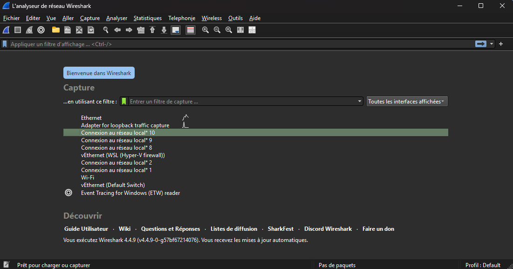

**De quoi s'agit-il ?** 

Cette fenêtre affiche les interfaces réseau de la machine. Les interfaces actives sont identifiables par leur tracé à droite. 

> *Les interfaces sans signal sont généralement des cartes réseau virtuelles inactives.*

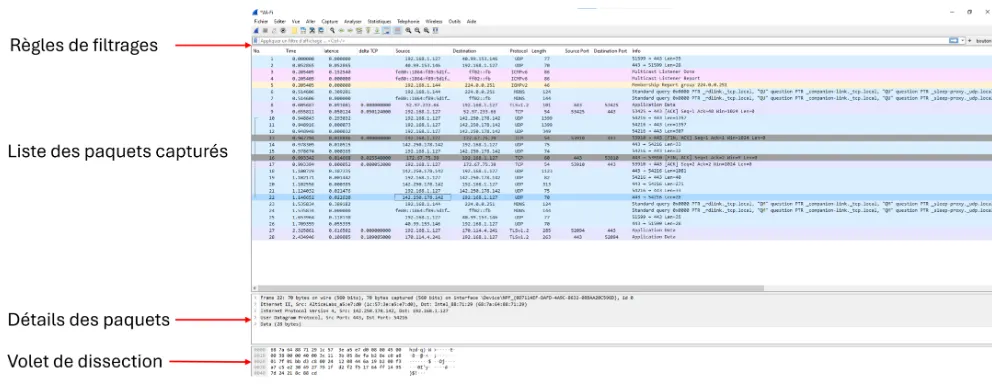

Chaque ligne représente un paquet capturé.

Les boutons principaux en haut à gauche permettent de :

|Bouton|Fonction|
|---|---|
|Démarrer la capture||
|Arrêter la capture||
|Relancer la capture||
|Accéder aux options de capture automatique|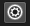|

Les colonnes principales sont :

- **N°**: Numéro du paquet
- **time**: Temps écoulé
- **source**: Émetteur
- **destination**: Destinataire
- **protocol**: Protocole utilisé
- **info**: Détails additionnels

Pour une analyse approfondie, le volet des détails des paquets montre les informations par protocoles et couches.

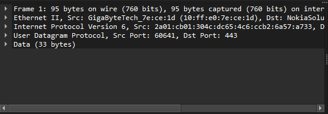

### **🏛️ Créer des colonnes**

Les colonnes personnalisées permettent d'afficher directement les informations importantes des paquets sans avoir à ouvrir les détails.

Deux méthodes pour ajouter des colonnes :

- **Première méthode** : clic droit sur l'information dans les détails puis "Appliquer en colonne"

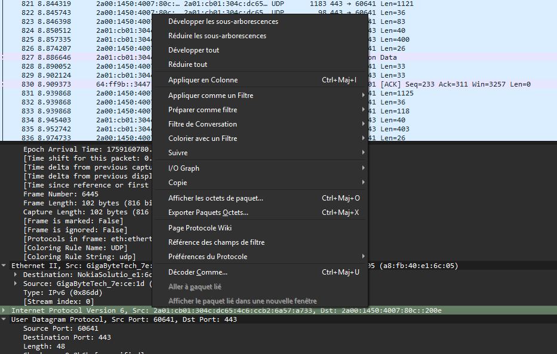

- **Seconde méthode** : Éditer -> Préférences -> Apparence -> Colonnes

La fenêtre des colonnes permet d'ajouter, supprimer et réorganiser les colonnes pour personnaliser l'affichage selon les besoins.

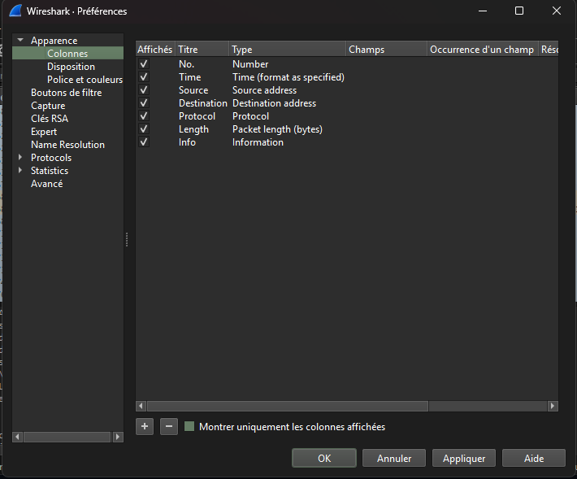

### **🪟 Les différentes fenêtres**

### **👨‍💻 Information Expert**

Dans l'onglet *Analyse*, on trouve **Information Expert**

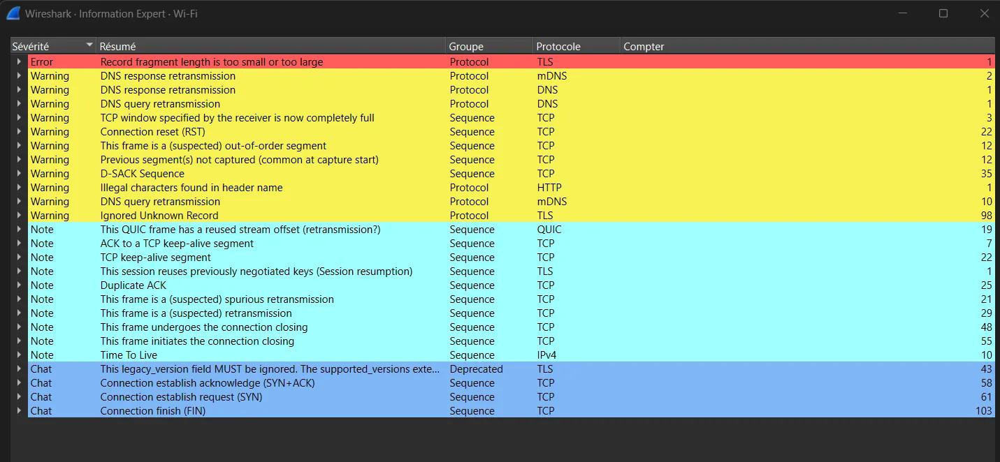

L'information Expert détecte les anomalies potentielles. Ces indications servent de point de départ mais nécessitent une analyse approfondie pour confirmation.

### **💾 Propriété du fichier de capture**

Dans l'onglet *Statistiques*, on trouve **Propriétés du fichier** de capture. Cette section fournit des informations complémentaires sur la capture que l'on analyse, telles que la date de la capture, le nombre de paquets, la durée de la capture, et d'autres détails pertinents. Ces données pourront aider à contextualiser l'analyse et à mieux comprendre le trafic enregistré.

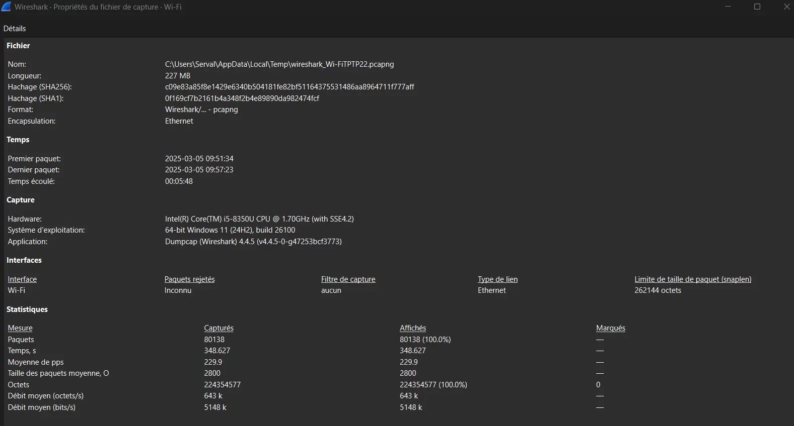

### **🫡 Hiérarchie des protocoles**

La hiérarchie des protocoles affiche la répartition et le poids des protocoles dans la capture. En comparant avec les utilisations habituelles du réseau, elle permet d'identifier des anomalies potentielles comme les attaques DDoS, ping of death ou les scans réseau.

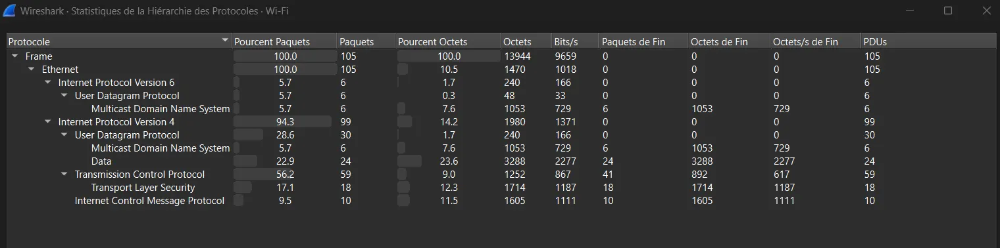

### **🗣️ Conversation**

Cette fonctionnalité permet de mettre en avant les différentes machines qui ont communiqué entre elles, en les identifiant par leurs adresses IP et MAC. On peut également voir le nombre de messages envoyés et la taille des paquets. Si on suspecte la compromission d'une machine, cet outil peut s'avérer précieux pour aider à la détection et à l'analyse des comportements anormaux. Cela permet de suivre les communications suspectes et d'identifier d'éventuelles menaces sur le réseau.

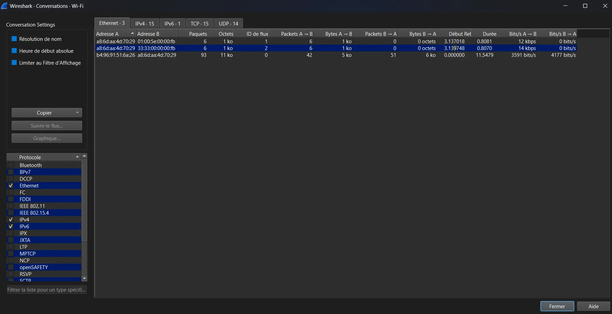

### **🔚 Endpoint**

Endpoint affiche les appareils présents dans une capture et leurs communications. Il permet de visualiser les interactions sur le réseau et d'identifier les comportements anormaux en analysant les relations entre les différents dispositifs.

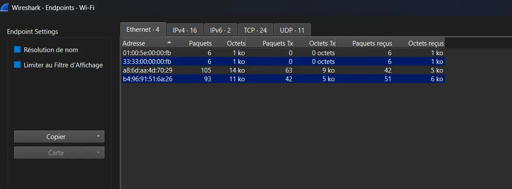

### **🛃 Le graphique d'E/S**

Le graphique d'entrée-sortie visualise la distribution temporelle des paquets sur le réseau. Il met en évidence les périodes d'activité forte et faible, permettant d'identifier rapidement les tendances, pics de trafic et anomalies potentielles pour détecter les problèmes de performance ou de sécurité.

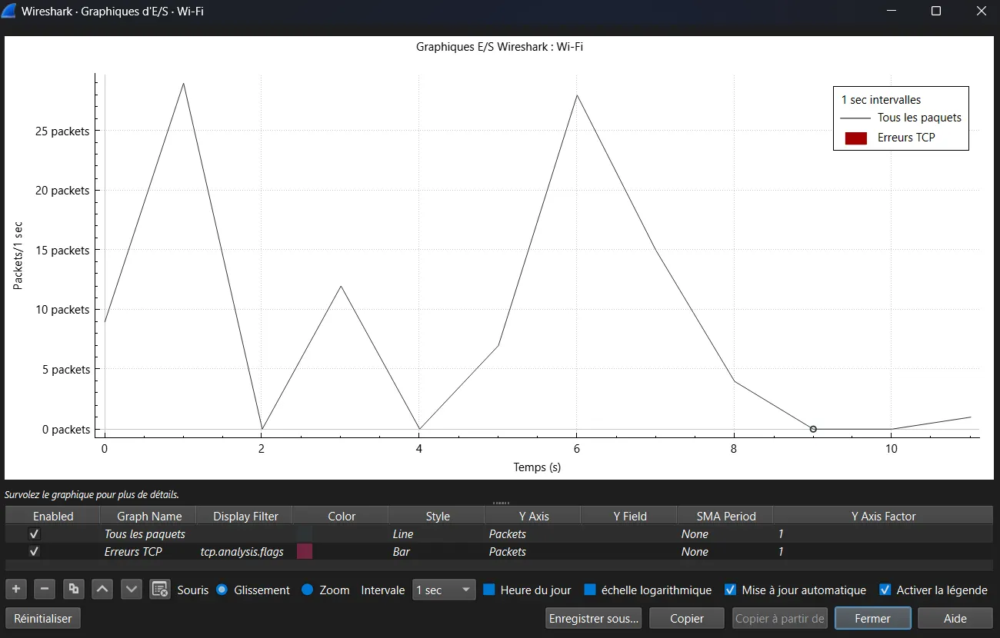

### **📈 Graphique des flux**

Ce graphique visualise les connexions et les flux de données entre les hôtes du réseau. Il permet d'identifier rapidement les interactions entre dispositifs et de repérer les anomalies potentielles pour résoudre les problèmes de performance ou de sécurité.

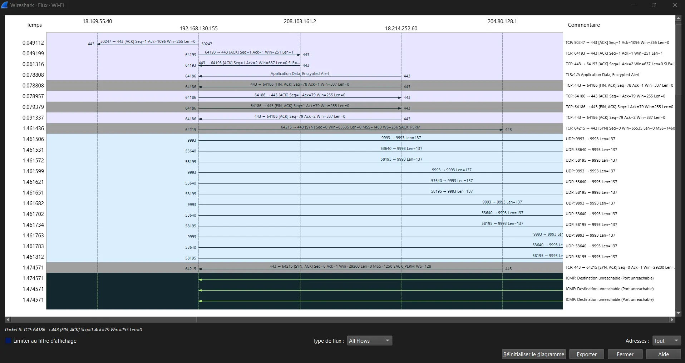

## **🌐 Où placer ses sondes réseaux ?**

Selon l'endroit où est placé son analyseur, les informations capturées seront différentes. Il est donc primordial de bien identifier les informations que l'on cherche pour savoir où se placer. Pour bien comprendre la différence, on va les placer dans un réseau relativement simple.

|Capture au point n°|Description|
|---|---|
|1️⃣|Au niveau du client, capture des signaux envoyés et reçus du même réseau, incluant broadcast et multicast.|
|2️⃣|Les switchs transmettent la trame sans modification. Même capture qu'au point 1. ***Note : Les switchs niveau 3 donnent les mêmes résultats qu'au point 3.***|
|3️⃣|Le switch niveau 3 modifie l'en-tête Ethernet et décrémente le TTL. Si destination inconnue, renvoie une erreur ICMP.|
|4️⃣|Le NAT effectue les mêmes modifications que le routeur, plus la translation d'IP privée en publique.|    
|5️⃣|Côté serveur, même capture qu'au point précédent.|

### **ℹ️ Résumé des informations**

Points 1-3 : pas d'adresse MAC destinataire

Points 3-5 : pas d'adresse MAC client

Point 5 : pas d'IP client

### **🚏 Capturer le trafic**

 

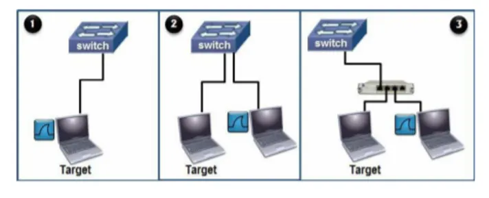

Voici les différentes méthodes pour capturer le trafic réseau :

- **Méthode 1 - Sur la machine**: Capture directe des paquets entrants/sortants et broadcast, nécessite l'installation d'un service.
- **Méthode 2 - Spanning de port**: Copie tout le trafic d'un port cible, idéal pour les appareils sans logiciel de capture. Ne transmet pas les trames erronées.
- **Méthode 3 - TAP**: Dispositif entre switch et hôte capturant tout le trafic, y compris les erreurs.

Types de TAP :

1. **TAP passif**: Divise le signal sans modification. Risque de perte sur longue distance. 
2. **TAP actif**: Amplifie les signaux, filtre et équilibre la charge. 

## **📏 Les règles de filtrage**

Pour bénéficier pleinement de la puissance de Wireshark, il est essentiel d'utiliser les règles de filtrage. Ces règles de filtrage sont basées sur différents critères, tels que :

- **protocoles** (ARP, IPv4, IPv6, TCP…)
- **applications** (DNS, HTTP, HTTPS…)
- **nom de domaine** (domaine.home)
- **caractéristiques spécifiques** (tcp.analysis.flag)

### **📐 Les opérateurs logiques**

Dans les règles de filtrage, on peut utiliser différents opérateurs pour affiner les recherches.

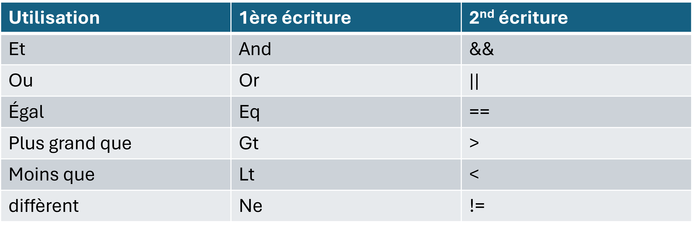

### **📝 Les commandes de filtrages**

### **Règle de filtrage 1️⃣**

Explorons l'utilisation des règles de filtrage avec un exemple pratique :

***Le dernier paquet d'une connexion TCP sur le port 80, d'une communication entre l'adresse IP 23.229.232.192 en source et 10.9.25.101 en destination.***

Sur 16 731 paquets initiaux, on peut réduire ce nombre avec des filtres ciblés.

Wireshark propose l'auto-complétion avec le point (".") et un code couleur (vert pour correct, rouge pour erreur).

Pour filtrer une connexion TCP port 80, deux options :

- **http**
- **tcp.port == 80**

La seconde option est préférable car elle capture tous les paquets TCP port 80, y compris ceux sans dissector HTTP.

### **Règle de filtrage 2️⃣**

Pour filtrer les adresses IP, on utilise :

`ip.src == 23.229.232.193 && ip.dst == 10.9.25.101`

En combinant avec le port : `tcp.port == 80 && ip.src == 23.229.232.193 && ip.dst == 10.9.25.101`

### **Règle de filtrage 3️⃣**

Pour le dernier paquet TCP : `tcp.flags.fin == True`

Filtre final : `tcp.port == 80 && ip.src == 23.229.232.193 && ip.dest == 10.9.25.101 && tcp.flags.fin == True`

### **Règle de filtrage 4️⃣**

Astuces supplémentaires :

- Clic droit sur un élément pour l'appliquer comme filtre
- On crée des boutons de filtres personnalisés dans les préférences
- On utilise l'outil de suivi du flux TCP pour voir tous les échanges

## **🔍 Identifier la latence**

La latence mesure le délai entre l'envoi d'une requête et sa réponse. Elle peut provenir de trois sources :

- Latence trajet
- Latence client
- Latence du serveur

### **🛣️ Latence trajet**

La latence de trajet (ou RTT - round-trip delay time) est le temps aller-retour d'une requête. Elle identifie mais ne localise pas les ralentissements.

Causes principales :

- Conflits de priorité entre trafics réseau
- Goulots d'étranglement de bande passante

Dans Wireshark, cette latence s'observe via ICMP et TCP, le protocole ARP ne fournissant pas d'information temporelle.

Le ping (ICMP type 8, code 0) permet de mesurer le temps de latence entre l'envoi et la réception.

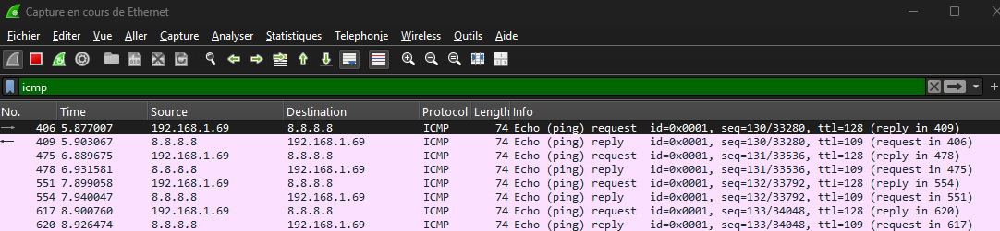

L'information du temps de réponse est directement visible dans les details du paquet.

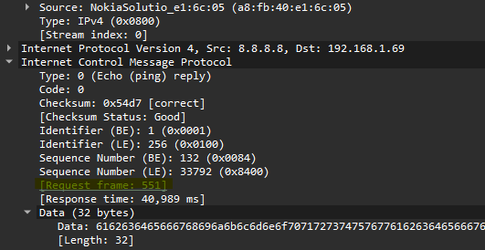

Cette information est uniquement visible sur les paquets reply.

La latence sur les paquets TCP peut être observée sur les deux premiers paquets du three-way handshake ***(SYN / SYN-ACK)***. L'objectif est de calculer le ***RTT*** (Round-trip Time) entre les deux paquets.

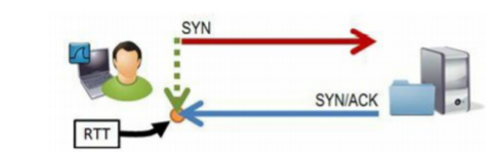

Cette information pourra être récupérée dans la partie timestamps (horodatage)

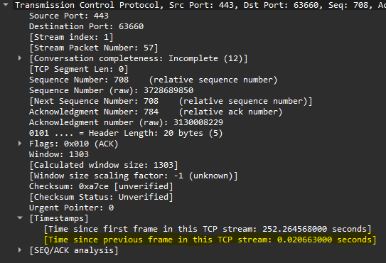

### **💇 Latence client**

La latence côté client correspond au délai pouvant être causé par les utilisateurs, les applications ou un manque de ressources.

La latence dite "naturelle", comme celle liée au temps de réaction de l'utilisateur (par exemple, le temps nécessaire pour cliquer sur un lien), ne peut pas être modifiée. Il est donc essentiel de se concentrer sur la latence côté serveur.

### **🖥️ Latence serveur**

La latence serveur correspond au temps que met le serveur à répondre.

Un délai trop élevé peut être causé par :

- un manque de puissance côté serveur
- une application mal optimisée
- la nécessité de consulter un autre serveur dans une architecture multi-niveaux

Dans Wireshark, ce type de latence se manifeste par un délai de réponse après le signal ACK.

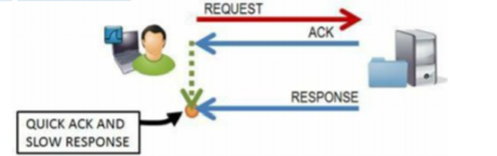

### **🛆 Delta time**

Dans une analyse réseau, le facteur temps est crucial. C’est pourquoi, par défaut, la colonne Time est mise en avant. Cependant, cette colonne n’est pas toujours la plus adaptée lorsqu’il s’agit de mesurer des délais. Il peut être intéressant d’ajouter une colonne supplémentaire, comme *Delta Time*, pour une analyse plus précise.

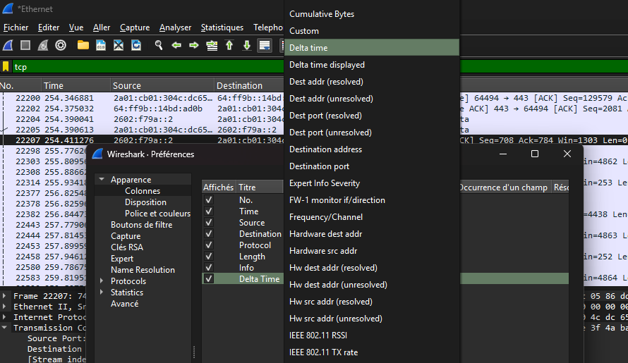

*Le Delta time permet de mettre en avant le délai entre 2 paquets consécutifs.*

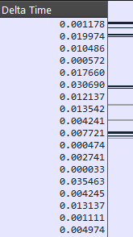

Attention, cette approche atteint rapidement ses limites. Dans une capture réseau, il est rare de n’avoir qu’une seule conversation active ; d’autres communications peuvent venir perturber votre analyse. Dans ce contexte, l’ordre des paquets dans la capture ne correspond pas toujours à celui attendu, rendant l’interprétation plus complexe.

L’indicateur **TCP Delta Time** est alors utile, car il permet de suivre la latence d’une communication TCP spécifique, sans se baser uniquement sur le paquet reçu précédemment.

## **📦 La perte de paquet**

La perte de paquets survient quand des données n'atteignent pas leur destination, impactant les performances du réseau. Son identification nécessite une bonne connaissance du réseau et de ses protocoles.

Avec TCP, les paquets perdus sont automatiquement retransmis et apparaissent comme dupliqués dans les logs.

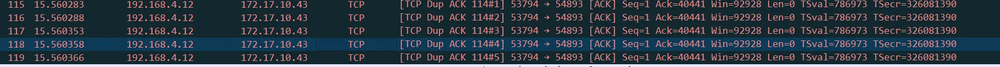

Avec UDP, protocole sans connexion, la détection est plus difficile car il n'y a pas de retransmission. Il faut comparer le nombre de requêtes envoyées et reçues.

## **🧪 Analyse paquet ICMP**

Dans les modules précédents sur les outils de dépannage réseau, le protocole ICMP a été abordé. Bien qu’il puisse sembler simple au premier abord, il devient souvent plus complexe dès que l’on évoque les notions de type et de code, qui peuvent rapidement dérouter. Cette difficulté est renforcée par le fait que ces informations ne sont pas visibles lorsque vous utilisez la commande `ping` dans un terminal.

Ce sujet est abordé à nouveau en raison d'un lien important. En effet, ces deux valeurs (type et code) figurent dans le contenu d’un paquet ICMP. Wireshark permet d’analyser en détail le contenu des paquets, et ainsi d’identifier ces informations cruciales.

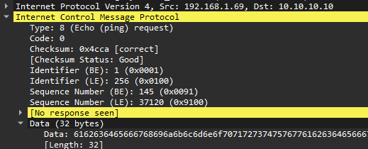

Pour rappel, ces informations seront particulièrement utiles pour analyser et comprendre les dysfonctionnements du réseau. La commande `ping`, fréquemment utilisée comme premier outil pour tester les communications, permet souvent d’identifier ou de localiser une panne.