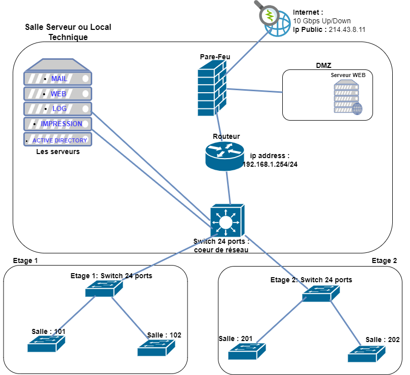

# 📐 Architecture
<ais />

## **🎬 Introduction**

Les architectes et administrateurs réseau doivent pouvoir visualiser et présenter la structure de leurs réseaux, en identifiant les connexions et l'emplacement des composants.

La conception d'une architecture réseau comprend deux étapes essentielles :

- L'élaboration d'un plan d'adressage IP
- La réalisation d'un schéma réseau

En pratique, il est souvent nécessaire de revoir la configuration des VLAN et des plages d'adresses IP pour deux raisons principales :

- Une conception VLAN inadaptée causant des problèmes de gestion
- Des plages d'adresses IP insuffisantes limitant l'expansion

Une bonne planification réseau initiale est essentielle pour éviter ces problèmes et permettre une croissance fluide.

## **🛕 Les types d'architecture réseau**

Une architecture réseau doit être facilement compréhensible pour tous les administrateurs, permettant un dépannage rapide.

Il existe **trois** types d'architecture réseau :

1. **Plan de câblage**
2. **Architecture logique**
3. **Architecture physique**

### **🏗️ Le plan de câblage**

Le plan de câblage est un schéma qui représente les connexions des câbles et fibres optiques dans un réseau. Il facilite la maintenance et le dépannage en montrant précisément comment les composants sont interconnectés.

*Exemple simple d'une documentation ds prises :*

|Prise|Description|
|---|---|
|1|BAT120-SALLE1-PRISE1|
|2|BAT120-SALLE1-PRISE2|
|3|BAT120-SALLE1-PRISE3|
|4|BAT120-SALLE1-PRISE4|
|5|BAT120-SALLE1-PRISE5|

### **🧱 Architecture logique**

L'architecture logique représente l'organisation conceptuelle des composants réseau et leurs interactions pour la communication et le partage de ressources, indépendamment de leur implémentation physique.

Éléments clés :

- La segmentation du réseau : sous-réseaux, VLANs, DMZ.
- Adresses logiques : adresses IP statiques et plages d'IP dynamiques des équipements.
- Routage et commutation : flux de données entre points A et B, liens Trunk et VLANs autorisés.

### **🏋️‍♂️ Architecture physique**

L'architecture physique représente les aspects matériels du réseau, incluant les dispositifs, câblages et emplacements. Elle définit l'installation des équipements, leurs interactions et les infrastructures nécessaires au bon fonctionnement du réseau. Cette architecture est essentielle pour assurer la fiabilité, la performance et la sécurité.

Composants principaux :

- Équipements réseaux : routeurs, switchs, points d'accès, pare-feu
- Infrastructure : câbles Ethernet, fibre optique, armoires réseau
- Emplacement physique des équipements
- Sécurité physique : caméras, lecteurs de badge, détecteurs

## **🪪 Schéma d'adressage IP**

Chaque équipement réseau nécessite une adresse IP pour communiquer. Dans un réseau d'entreprise, il est essentiel de sélectionner des plages d'adresses IP privées spécifiques selon les bonnes pratiques du domaine.

Les plages recommandées sont 192.168.0.0/16 ou 172.16.0.0/12. Bien que le dimensionnement initial se base sur les besoins actuels, il est crucial de prévoir une marge importante pour l'évolution future du réseau sur le long terme.

|Prefix|Plage d'adresses|Nombre d'adresses|
|---|---|---|
|192.168.0.0/16|192.168.0.0 à 192.168.255.255|65536|
|172.16.0.0/12|172.16.0.0 à 172.16.255.255|4096|
|10.0.0.0/8|10.0.0.0 à 10.255.255.255|16777216|
