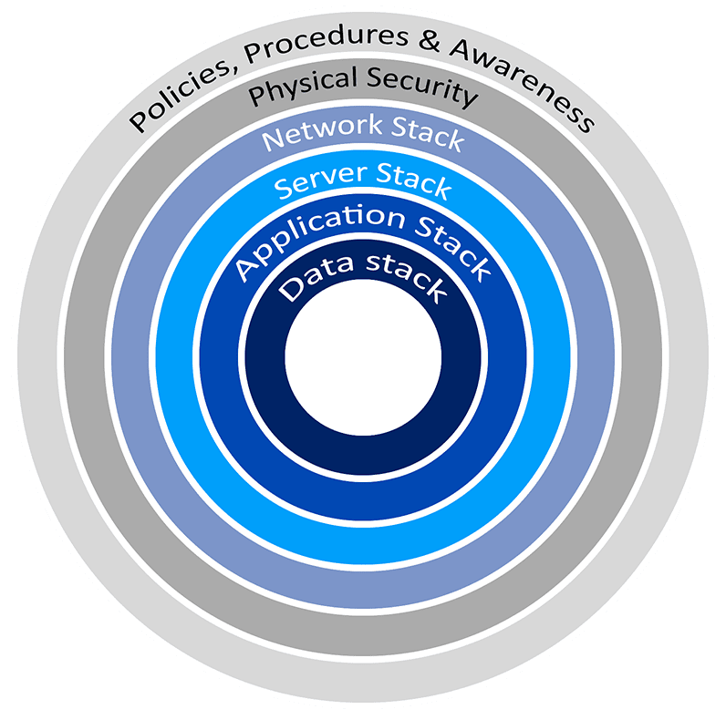

# 🔎 Introduction
<ESDInfo />

### **🎬 Introduction**

L'informatique a transformé notre mode de vie, notamment avec l'essor du télétravail et des services numériques. Face aux menaces constantes dans ce monde connecté, une protection multicouche s'impose, incarnée par le principe de défense en profondeur.

## **🏰 Défense en profondeur**

Les mécanismes de sécurité sont nombreux et complémentaires, formant une **défense en profondeur**.

La défense en profondeur (**defense-in-depth**) est une approche de sécurité informatique qui protège les systèmes avec **plusieurs couches de défense**.

Si une couche est compromise, les autres continuent d'assurer la protection du système. Ces couches fonctionnent en complémentarité, chacune agissant comme une **ligne de défense** pour renforcer la sécurité globale.

Tous les actifs n'ayant pas la même sensibilité, leur protection doit être adaptée selon leur niveau de risque.

Il est donc essentiel d'**identifier les risques** majeurs pour concentrer les ressources sur la protection des éléments critiques.

Cette stratégie multicouche réduit ainsi le risque qu'une faille unique ne compromette l'ensemble du système d'information.

## **📗 Politiques et procédures**

La protection du SI repose d'abord sur les utilisateurs. Les organisations mettent en place des formations et une *Politique de Sécurité du Système d'Information* (PSSI) définissant les bonnes pratiques. Des GPOs (Group Policy Objects) sont déployées pour faire respecter ces règles, notamment concernant les mots de passe.

En cybersécurité, une attaque est inévitable. Pour y faire face, les organisations établissent un *Plan de Continuité d'Activité* (PCA) pour maintenir un fonctionnement partiel, et un *Plan de Reprise d'Activité* (PRA) pour relancer les systèmes de façon ordonnée après un incident.

Ces plans s'appliquent aussi aux incidents non-informatiques comme les incendies. Dans le contexte IT, on parle plutôt de *Plan de Continuité Informatique* (PCI) et *Plan de Reprise Informatique* (PRI).

## **💪 Physique**

La barrière physique sécurise les locaux et contrôle l'accès aux zones sensibles via des badges, tout en empêchant les connexions réseau non autorisées.

## **🛜 Réseau**

La protection du réseau comprend :

- segmentation réseau
- équipements réseaux
- prévention et détection

### **🖱️ La segmentation des réseaux**

La segmentation divise le réseau en sous-réseaux isolés pour :

- **Gérer le trafic** : optimiser la circulation des données et contrôler les accès
- **Renforcer la sécurité** : limiter la propagation des attaques via des règles de filtrage
- **Assurer la conformité** : isoler les données sensibles selon les réglementations
- **Contrôler les accès** : appliquer des politiques par segment

Types de segmentation :

- **VLANs** : segments logiques sur un même réseau physique
- **Segmentation physique** : isolation complète via du matériel distinct
- **Sous-réseaux** : division par plages IP avec contrôle via ACLs
- **Zones de sécurité** : séparation par niveau de confiance (ex: DMZ pour serveurs externes)

### **⌨️ Équipements réseaux**

- **Pare-feu** : Équipement ou logiciel filtrant les flux de données réseau selon des règles prédéfinies. Opère principalement sur les couches 3 et 4 (IP, TCP, UDP).
- **VPN** : Réseau virtuel sécurisé permettant la communication entre réseaux distants.
- **Sonde IPS/IDS** : Systèmes d'analyse du trafic réseau pour la détection d'intrusions.
- IPS : **Intrusion Prevention System** bloque les paquets suspects.
- IDS : **Intrusion Detection System** génère des alertes sans bloquer.
- **Antivirus** : Protection contre les malwares via :
    - Émulation en sandbox
    - Analyse du code
    - Détection par signatures
- **EDR** : Outil avancé de surveillance et protection des endpoints, offrant détection et réponse aux menaces en temps réel.

## **📀 Les applications**

La sécurité des applications repose principalement sur **les mises à jour**. Chaque logiciel ayant des vulnérabilités, il faut maintenir un inventaire des applications pour suivre et appliquer les correctifs disponibles.

## **💾 Les données**

La protection des données nécessite un chiffrement adapté selon les bonnes pratiques.

**Identification :** Étape où l'utilisateur déclare son identité au système, sans encore la prouver.

**Authentification :** Processus de vérification de l'identité déclarée, via un mot de passe, une empreinte digitale ou un jeton de sécurité.