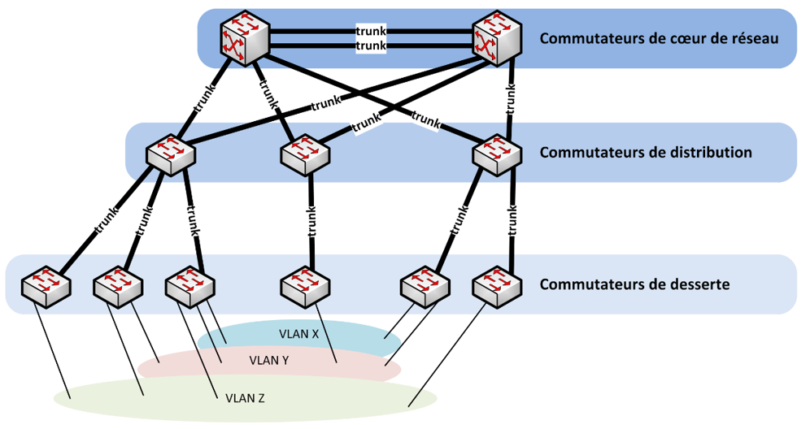
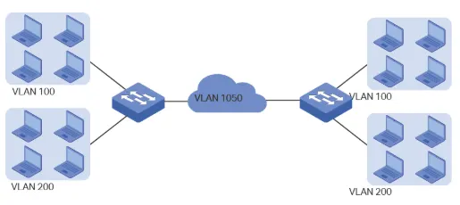
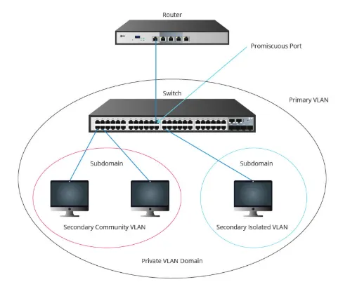
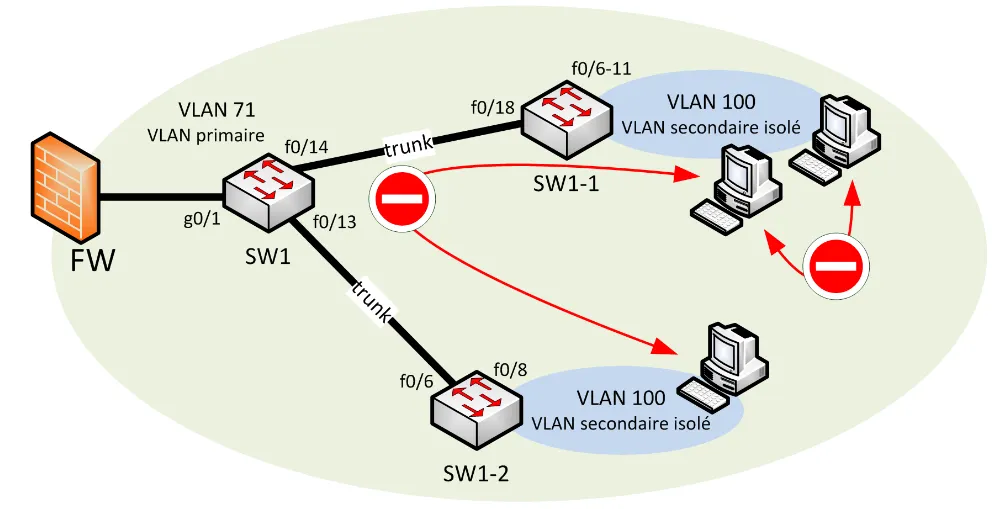

# 🔂 Sécurisation des commutateurs
<ais />

## **⚙️ Les commutateurs dans le SI**

 

Il existe trois principaux types de commutateurs :

1️⃣ **Les commutateurs de cœur de réseau** : reliés aux serveurs et routeurs au cœur du réseau.

2️⃣ **Les commutateurs de distribution** : regroupent le trafic des commutateurs de desserte vers le cœur de réseau.

3️⃣ **Les commutateurs de desserte** : connectent directement les équipements utilisateurs (PC, téléphones IP).

Ces types diffèrent par leur usage, leurs capacités techniques, leurs débits et leurs ports.

## **🏢 Administration**

Un réseau dédié à l'administration des équipements du SI est recommandé, séparé des réseaux de données métier. Un port physique spécifique doit être réservé à l'administration du commutateur.

La séparation peut se faire via un réseau physique dédié (méthode optimale) ou un VLAN d'administration.

Accès à l'administration du commutateur :

- ***CTY*** : ligne console physique, utilisée avec un câble console. **Ne jamais désactiver ce port** car il permet la reprise en main sans réinitialisation.
- ***VTY*** : lignes virtuelles (0-15) pour l'accès distant. Utiliser SSH v2 uniquement, conforme au RGS. **TELNET à proscrire**.
- ***AUX*** : port physique asynchrone pour accès distant via modem.
- ***TTY*** : ligne physique pour protocoles distants (*SLIP, PPP, etc.*).

* Le serveur HTTP intégré doit être désactivé pour réduire la surface d'attaque et préserver les performances.
* Limiter l'attribution d'adresses IP et restreindre l'accès administratif aux seuls administrateurs via filtrage pare-feu ou ACL.

### **📰 Journalisation des authentifications**

La journalisation des accès et tentatives d'accès à l'administration des commutateurs est essentielle pour la détection d'intrusion et l'imputabilité.

### **🛡️ Protection contre l'attaque par brute force**

Bloquer l'authentification pendant 5 minutes après 3 erreurs en 2 minutes.

### **🫴 Gestion des comptes utilisateurs**

Utiliser uniquement des comptes nominatifs pour tracer les actions administratives. Limiter les privilèges à deux niveaux : non privilégié et administrateur.

### **▶️ Accès enable ou system-view**

Désactiver la commande enable et utiliser uniquement des comptes administrateurs nominatifs pour éviter la gestion complexe de mots de passe partagés.

## **🏠 Comptes locaux et centralisés**

Deux types de comptes existent :

- Comptes locaux : gérés dans la configuration du commutateur
- Comptes centralisés : gérés dans l'annuaire du SI

Les comptes centralisés sont préférables car ils simplifient la gestion et améliorent la traçabilité. Chaque utilisateur dispose d'un compte nominatif dans l'annuaire central.

Un compte local "localadmin" est maintenu sur chaque commutateur comme solution de secours.

### **🧑‍💼 Gestion des comptes locaux**

Choisir la méthode de hashage la plus adaptée parmi celles proposées par le commutateur.

### **🗑️ Désactivation des comptes par défaut**

Supprimer les comptes par défaut tout en conservant un compte administrateur local de secours.

### **🛃 Contrôle d'accès**

Deux méthodes de contrôle d'accès sont disponibles :

1. **Le contrôle d'accès local** : authentification via la configuration du commutateur
2. **Le contrôle d'accès distant** : authentification via un annuaire centralisé

Le contrôle distant est recommandé car il permet une gestion centralisée et une meilleure traçabilité. Les protocoles ***AAA*** (comme ***TACACS+***) assurent l'authentification, l'autorisation et la traçabilité.

### **🔒 Politique de sécurité des mots de passe**

Les mots de passe doivent respecter la PSSI de l'entité.

### **🚩 Bannière de connexion**

Les bannières de connexion sont à éviter car elles peuvent révéler des informations sensibles aux attaquants.

## **⭕ Cloisonnement des réseaux**

Privilégier le cloisonnement physique. Si impossible, utiliser les VLAN en restant simple pour limiter les erreurs de configuration.

Limiter le nombre de VLAN au strict nécessaire pour maintenir la sécurité et faciliter la gestion.

### **🤖 Configuration automatique des VLAN**

Les protocoles ***VTP***, ***MVRP*** et ***GVRP*** permettent la configuration automatique des VLAN. Cette automatisation est déconseillée car elle réduit le contrôle de la configuration.

### **🛠️ Configuration des VLAN**

Les ports d'un commutateur peuvent être configurés en deux modes :

- **Mode access** : connexion directe aux terminaux, sans marquage des trames Ethernet
- **Mode trunk** : interconnexion avec d'autres équipements 802.1Q, avec marquage des trames

Pour éviter les attaques par switch spoofing, il faut configurer manuellement le mode des ports et filtrer les VLAN autorisés sur les ports trunk.

> Le switch spoofing consiste à simuler un port trunk pour intercepter le trafic du commutateur.

### **📋 DTP**

DTP, protocole propriétaire Cisco, négocie automatiquement le mode trunk/access. Étant activé par défaut mais inutile avec une configuration manuelle, il doit être désactivé.

### **😷 VLAN de quarantaine**

VLAN destiné aux ports inutilisés, offrant une protection supplémentaire. Les ports y sont isolés entre eux et du reste du SI.

### **😶 VLAN par défaut et VLAN natif**

Deux VLAN spéciaux avec des risques de sécurité spécifiques :

- **VLAN par défaut** : VLAN initial (***VLAN 1***) pour les interfaces non configurées.
- **VLAN natif** : Utilisé pour les services internes (***STP***, ***CDP***, ***VTP***). Non marqué sur les liens trunk, il traite automatiquement les trames non marquées.

Risques de sécurité liés à une mauvaise configuration :

- Impact sur la disponibilité
- Attaque par saut de VLAN
- Les ports non configurés dans le VLAN 1 (par défaut) peuvent accéder au trafic du VLAN natif, compromettant la sécurité.
- Des VLAN natifs différents peuvent créer des sauts de VLAN permanents sur les ports trunk.
- Un double marquage malveillant peut provoquer un saut de VLAN unidirectionnel.

### **💀 Le VLAN natif**

Le VLAN par défaut ne doit jamais être utilisé.

- Configurer un VLAN natif différent du VLAN par défaut
- Ne pas l'attribuer aux ports access
- Maintenir le même VLAN natif sur tous les commutateurs

Ne pas utiliser pour le trafic métier ou d'administration.

## **🔐 Private VLAN (PVLAN)**

Le PVLAN ajoute un niveau de compartimentation dans les VLAN. Il économise les adresses IP et améliore la sécurité via le VLAN isolé.

Le VLAN isolé empêche la communication directe entre machines d'un même VLAN.

### **🔧 Principe de fonctionnement des Private VLAN**

Les VLAN secondaires sont inclus dans un VLAN primaire et peuvent être de deux types :

- **Communauté (community)** : les ports peuvent communiquer entre eux mais pas avec d'autres VLAN secondaires.
- **Isolé (isolated)** : les ports ne communiquent qu'avec la passerelle par défaut.

Un seul VLAN isolé est possible par VLAN primaire, contrairement aux VLAN de communauté.

|Port en mode|Isolated|Promiscuous|Community 1|Community 2|
|---|---|---|---|---|
|Isolated|:x:|:white_check_mark:|:x:|:x:|
|Promiscuous|:white_check_mark:|:white_check_mark:|:white_check_mark:|:white_check_mark:|
|Community 1|:x:|:white_check_mark:|:white_check_mark:|:x:|
|Community 2|:x:|:white_check_mark:|:x:|:white_check_mark:|

*Exemple* : Dans le VLAN primaire 71, le VLAN secondaire isolé 100 permet aux terminaux de communiquer uniquement avec leur passerelle (FW), sans communication possible entre eux.

### **⏏️ Protected Port et Port Isolation**

Le Protected Port, similaire au Private VLAN isolé, agit localement sur un commutateur pour bloquer le trafic direct entre terminaux d'un même VLAN.

Cette fonction de sécurité simple limite les communications malveillantes entre équipements terminaux.

Le Private VLAN isolé est préférable car il agit globalement. Si impossible, utiliser au minimum le Protected Port.

Le Protected Port étant local, deux machines sur différents commutateurs peuvent encore communiquer directement.

## **🛣️ Routage**

### **🚗 Routage par les commutateurs**

Les commutateurs ne doivent pas faire de routage. Cette fonction est réservée aux équipements de niveau 3. Désactiver le routage inter-VLAN sur les commutateurs d'accès.

Le danger est le transit direct des données entre VLAN sans filtrage.

### **📨 Mandataire ARP (Proxy ARP)**

La fonction mandataire ARP permet la communication entre réseaux IP sans routage. À désactiver pour des raisons de sécurité.

### **🚱 Source Routing**

L'option source routing dans IP permet de spécifier le routage d'un paquet. Son utilisation est déconseillée pour la sécurité.

Elle risque de permettre des accès malveillants à des sous-réseaux normalement inaccessibles.