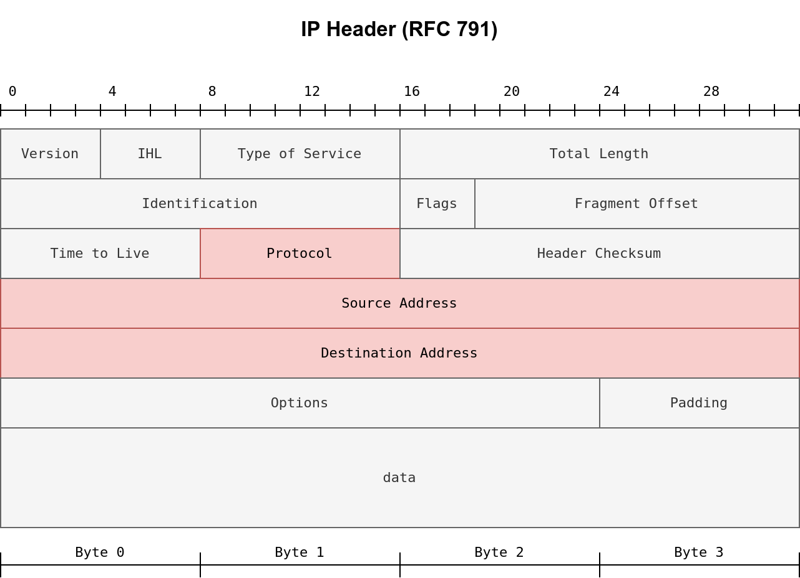
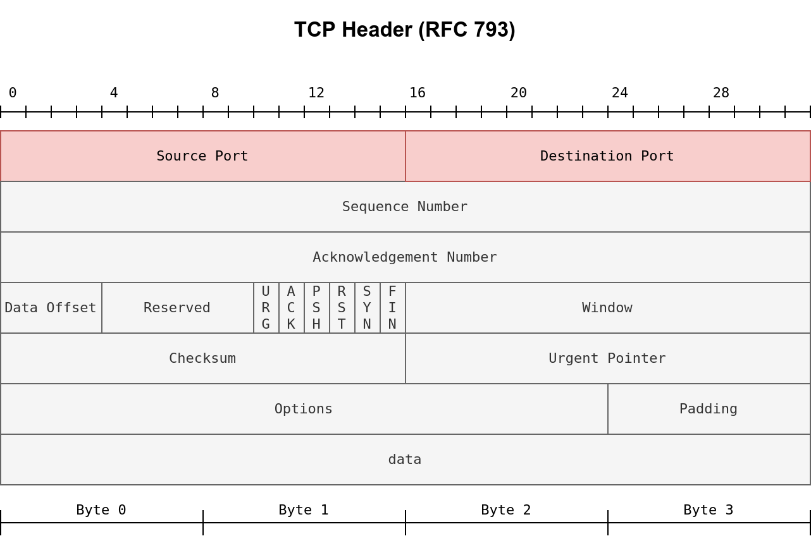
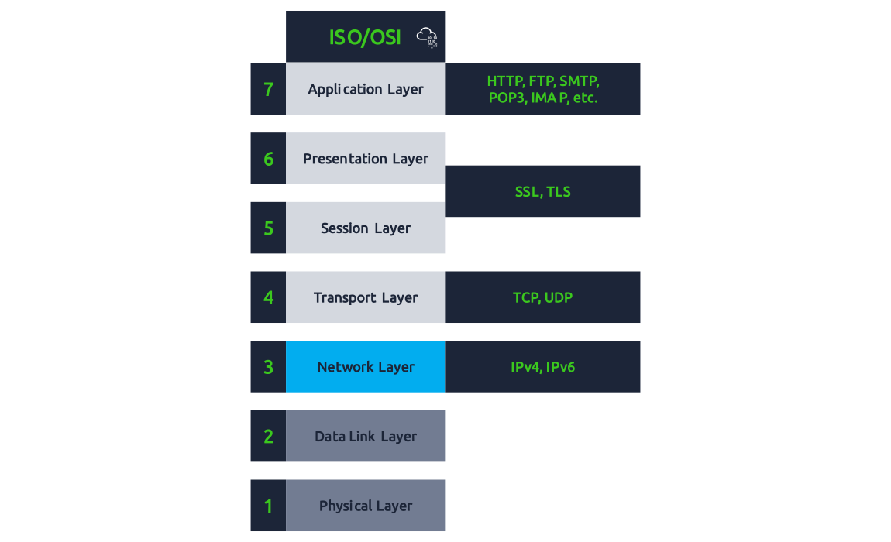

# Les Firewall
<Badge type="tip" text="Rédigé le 02/04/2024" />
<Badge type="warning" text="En cours de rédaction" />

## Introduction

Le Firewall a pour objectif de déterminer quel trafic est autorisé à entrer & sortir du réseau. Il peut être configuré de façon à ce que l'entrée ou la sortie du trafic soit autorisée ou refusée selon les facteurs suivants :
* La provenance du trafic *(Le pare-feu a-t-il reçu l’ordre d’accepter/refuser le trafic provenant d’un réseau spécifique ?)*
* La destination du trafic *(Le pare-feu a-t-il reçu l’ordre d’accepter/refuser le trafic destiné à un réseau spécifique ?)*
* Le port attribué *(Le pare-feu a-t-il reçu l’ordre d’accepter/refuser le trafic destiné au port 80 uniquement ?)*
* Le protocole utilisé *(a-t-on demandé au pare-feu d’accepter/refuser le trafic UDP, TCP ou les deux ?)*

Les pare-feu répondent à ces questions en analysant tous les paquets transitant sur le réseau.

Les pare-feu sont de toutes formes et de toutes tailles. Qu’il s’agisse de matériel dédié, que l’on trouve souvent dans les grands réseaux comme les entreprises, qui peuvent gérer une grande quantité de données, de routeurs résidentiels ou de logiciels tels que Snort.

Ci-dessous, les deux grands catégories de pare-feu :

| Catégorie | Description |
|-|-|
|***Stateful***| Ce type de pare-feu utilise l’intégralité des informations d’une connexion. Plutôt que d’inspecter un paquet individuel, ce pare-feu **détermine le comportement d’un périphérique en fonction de l’ensemble de la connexion**. Il consomme beaucoup de ressources par rapport aux pare-feu sans état suite à une prise de décision dynamique.|
|***Stateless***| Ce type de pare-feu utilise un ensemble statique de règles pour **déterminer si les paquets individuels sont acceptables ou non**. Un appareil qui envoie un paquet défectueux ne signifie pas nécessairement que l’ensemble de l’appareil est alors bloqué. Ceux-ci consomment beaucoup moins de ressources, cependant ils se montrent stupides : ces pare-feu ne sont efficaces qu'en fonction des règles qui y sont définies. En revanche, ils se montrent efficaces dans les cas d'attaque de déni de service.

Avant d'entrer dans les détails des pare-feu, il est utile de se souvenir du **contenu d'un paquet IP** et d'**un segment TCP**. La figure suivante montre les champs qu'il faut s'attendre à trouver dans un en-tête IP. Différents types de pare-feu sont capables d'inspecter différents champs de paquets, cependant, le pare-feu le plus basique devrait être capable d'inspecter au moins les champs suivants :

* ***Protocole***
* ***Adresse source***
* ***Adresse de destination***

Selon le champ du protocole, les données du datagramme IP peuvent constituer l'une des nombreuses options possibles. Trois protocoles courants sont :

1. ***TCP***
2. ***UDP***
3. ***ICMP***

Dans le cas de ***TCP*** ou ***UDP***, le pare-feu doit au moins être capable de vérifier les en-têtes TCP et UDP pour :

* *Numéro de port source*
* *Numéro de port de destination*

L'en-tête TCP est illustré dans la figure ci-dessous. On remarque qu'il existe de nombreux champs que le pare-feu peut ou non analyser, cependant, même le pare-feu le plus limité devrait permettre à l'administrateur du pare-feu de contrôler les numéros de port source et de destination autorisés ou bloqués :

## Types de Firewall

### Les différents types de Firewall

1. ***Pare-feu matériel*** : Un pare-feu d'appliance est un élément matériel distinct par lequel le trafic réseau doit passer. Les exemples incluent *Cisco ASA* (Adaptive Security Appliance), *WatchGuard Firebox* et *Netgate* *pfSense Plus*.
2. ***Pare-feu logiciel*** : Il s'agit d'un logiciel fourni avec le système d'exploitation, ou ou que l'on peut installer en tant que service supplémentaire. *MS Windows* dispose d'un pare-feu intégré, *Windows Defender Firewall*, qui fonctionne avec les autres services du système d'exploitation et applications utilisateur. Un autre exemple est *Linux iptables* et *firewalld*.

### Les différents objectifs d'utilisation

1. ***Pare-feu personnel*** : Un pare-feu personnel est conçu pour protéger un seul système ou un petit réseau, par exemple un petit nombre d'appareils et de systèmes sur un réseau domestique. De nombreux points d'accès sans fil conçus pour les maisons disposent d'un pare-feu intégré. Un exemple est *Bitdefender BOX*, ou encore le pare-feu qui fait partie de nombreux points d'accès sans fil et routeurs domestiques de *Linksys* et *Dlink*.
2. ***Pare-feu commercial*** : Un pare-feu commercial protège les réseaux de taille moyenne à grande. Par conséquent, on s'attend à une fiabilité et une puissance de traitement plus élevées, en plus de prendre en charge une bande passante réseau plus élevée.

La classification la plus cruciale serait basée sur les capacités d’inspection des pare-feu. Il convient de réfléchir aux capacités du pare-feu en termes de couches ISO/OSI illustrées dans la figure ci-dessous. Avant de classer les pare-feu en fonction de leurs capacités, il convient de rappeler que les pare-feu se concentrent sur les couches 3 et 4 et, dans une moindre mesure, sur la couche 2. Les pare-feu de nouvelle génération sont également conçus pour couvrir les couches 5, 6 et 7. 

Plus un pare-feu peut inspecter de couches, plus il devient sophistiqué et plus il a besoin de puissance de traitement.

En fonction des capacités du pare-feu, nous pouvons répertorier les types de pare-feu suivants :

* ***Pare-feu de filtrage de paquets*** : Le filtrage de paquets est le type de pare-feu le plus basique. Ce type de pare-feu inspecte le protocole, les adresses IP source et de destination ainsi que les ports source et de destination dans le cas des datagrammes TCP et UDP. Il s'agit d'un pare-feu d'inspection sans état (*stateless*)
* ***Circuit-Level Gateway*** (*trd bandacale* : *Passerelle au niveau du circuit*) : En plus des fonctionnalités offertes par les pare-feu de filtrage de paquets, les *Circuit-Level Gateway* peuvent fournir des fonctionnalités supplémentaires, telles que la vérification de la négociation à trois voies TCP par rapport aux règles du pare-feu.
* ***Pare-feu d'inspection avec état*** : Par rapport aux types précédents, ce type de pare-feu offre une couche de protection supplémentaire car il assure le suivi des sessions TCP établies. Il peut détecter et bloquer tout paquet TCP en dehors d'une session TCP établie.
* ***Pare-feu proxy*** : Un pare-feu proxy est également appelé **pare-feu d'application** (*AF*) et **pare-feu d'application Web** (*WAF*). Il est conçu pour se faire passer pour le client d'origine et faire des demandes en son nom. Ce processus permet au pare-feu proxy d'*inspecter le contenu de la charge utile* du paquet au lieu de se limiter aux en-têtes du paquet. De manière générale, cela est **utilisé pour les applications Web** et ne fonctionne pas pour tous les protocoles.
* ***Pare -feu de nouvelle génération*** (NGFW) : NGFW offre la protection par pare-feu la plus élevée. Il peut pratiquement surveiller toutes les couches du réseau, de la couche OSI 2 à la couche OSI 7. Il connaît et contrôle les applications. Les exemples incluent la série *Juniper SRX* et *Cisco Firepower*.
* ***Cloud Firewall*** ou ***Firewall as a Service*** (FWaaS) : FWaaS remplace un pare-feu matériel dans un environnement cloud. Ses fonctionnalités peuvent être comparables à celles de NGFW, cependant, il bénéficie de l’évolutivité de l’architecture cloud. Un exemple est *Cloudflare Magic Firewall*, qui est un pare-feu au niveau du réseau. Un autre exemple est *Juniper vSRX* : il possède les mêmes fonctionnalités qu'un NGFW mais est déployé dans le cloud. Il convient également de mentionner *AWS WAF* pour la protection des applications Web et *AWS Shield* pour la protection DDoS.

 

::: info Sources
Ce cours s'inspire (et utilise les images) de TryHackMe.com de la chambre "*Extending your network*" & "*Redteam Firewalls*" :

https://tryhackme.com/r/room/extendingyournetwork  <Badge type="danger" text="Payant" />

https://tryhackme.com/r/room/redteamfirewalls  <Badge type="danger" text="Payant" />
:::

