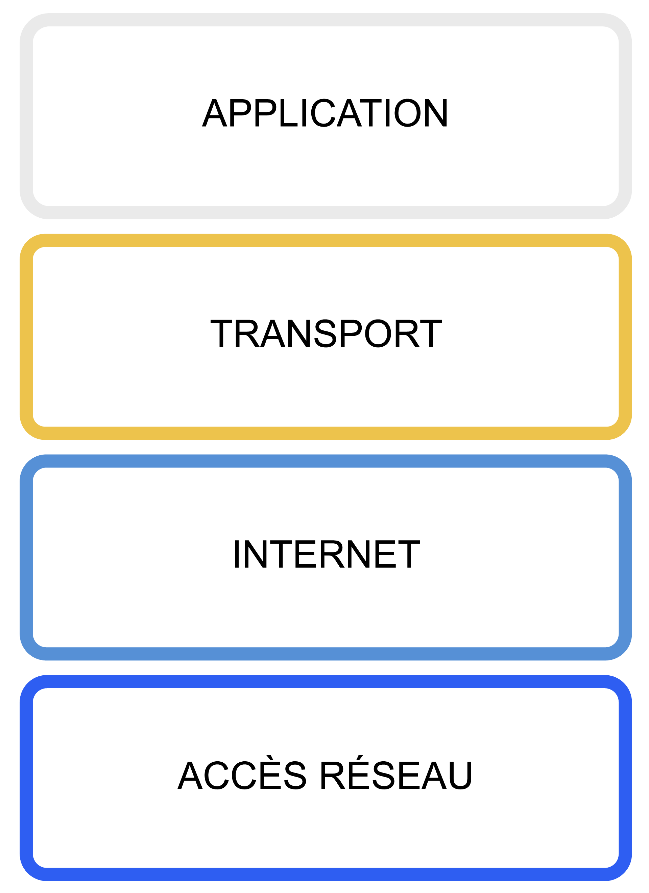
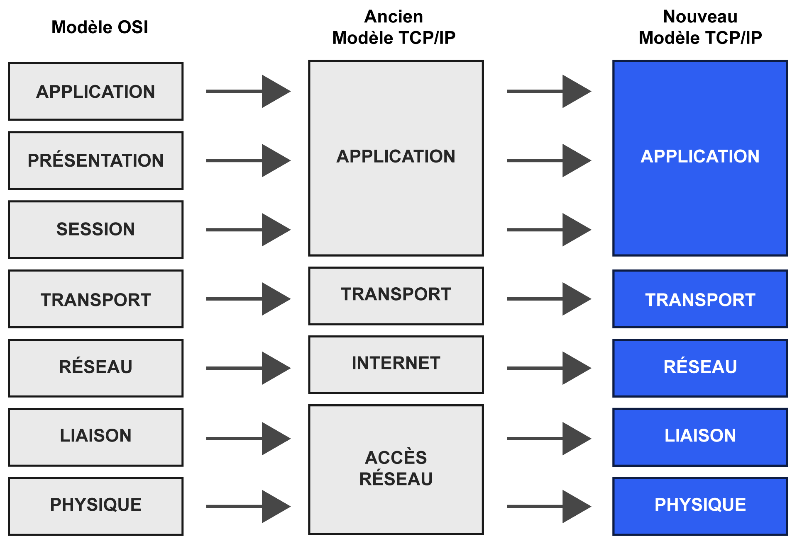
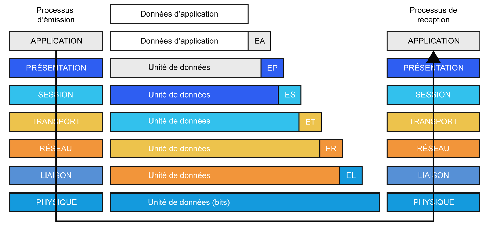
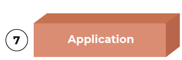
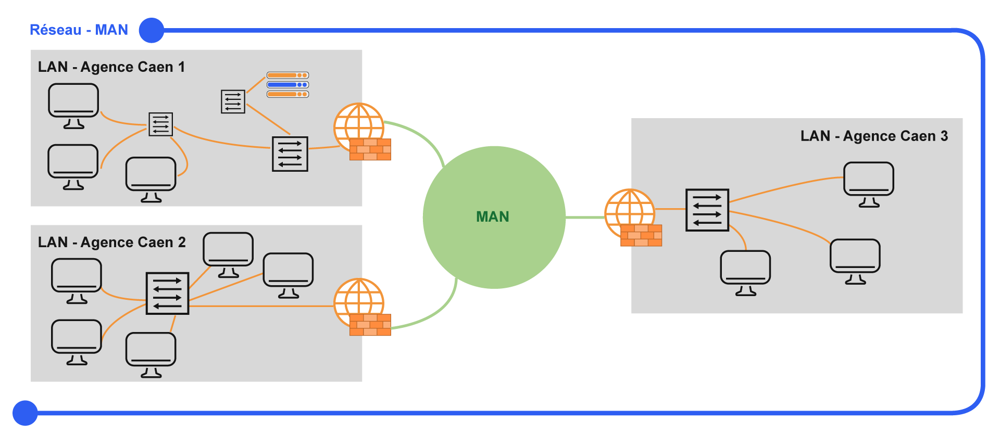
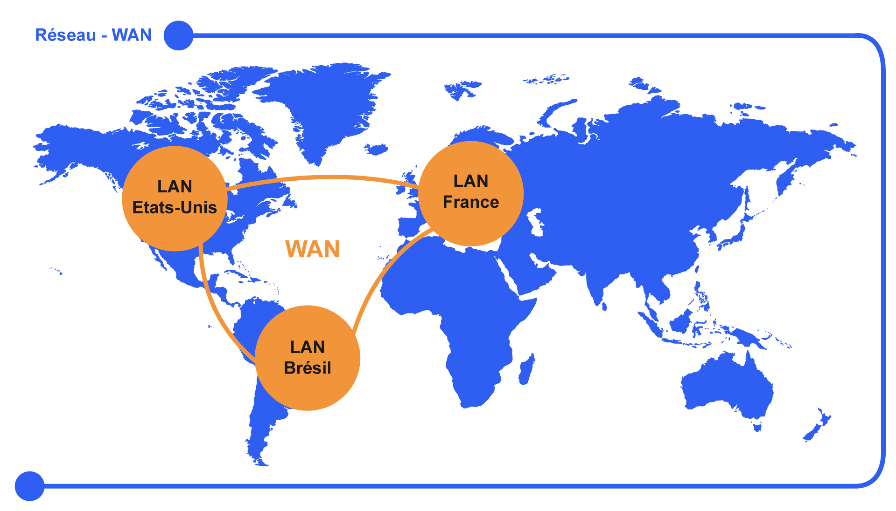

# 📕 Fondamentaux des réseaux

<ESDInfo />

## **📺 TCP/IP**

Le modèle TCP/IP est composé de 4 couches qui contiennent des protocoles déjà existants depuis les années 1976.

Aujourd'hui, la majorité des entreprises et des ordinateurs utilisent le TCP/IP.

Dans ce « Nouveau Modèle TCP/IP », seules les 2 premières couches du modèle OSI sont présentes.  
En effet, ces 2 couches ont des rôles bien différents ; il est donc intéressant de les distinguer.

En revanche, les couches "*Session*", "*Présentation*" et "*Application*" ne sont pas très intéressantes en termes de réseau et sont maintenant regroupées en une seule et même couche « *Application* ». L’implémentation du modèle TCP/IP est conservée.

**Ce modèle qui mélange OSI et TCP/IP est celui réellement utilisé dans la pratique.**

## 📦 OSI

- Le modèle de référence OSI en matière de réseaux sépare distinctement tous les services, interfaces et protocoles. Il est donc très flexible et les protocoles de chaque couche peuvent être remplacés facilement en fonction de la nature du réseau.
- Permet de séparer le problème en différentes parties (les couches), cela est donc plus facile à dépanner.
- Facilité de développement et de modification.
- Une couche peut être modifiée de façon indépendante.

Il faut imaginer ici une 8e couche qui est l’humain.

Quand en tant qu’humain, on envoie une information comme par exemple un e-mail, l’information est transmise à la couche 7 qui va effectuer un travail sur l’information que l'on envoie, puis l’envoyer à la couche 6 qui elle aussi va effectuer un travail, elle effectue un travail pour que l’information qu’elle a reçu de la couche 7 puisse arriver sans soucis, elle est donc prestataire de service pour la couche 7.

La couche 6 va ensuite envoyer l’information à la couche 5 et ainsi de suite.

Chaque couche à une fonction précise et effectue un travail pour que l’information soit acheminée sans soucis jusqu’au destinataire.

En fonction de la couche, la donnée doit être appelée « *trame* », « *paquet* » ou autres…

Chaque couche a une fonction précise pendant la transmission des données, suivant le principe de séparation des responsabilités. La couche N utilise les services de la couche N-1 et fournit des services à la couche N+1.

L'encapsulation intervient quand les données d'une couche deviennent les données de la couche inférieure, avec ajout d'en-têtes spécifiques à chaque niveau.

Dans une communication OSI, les données traversent les couches de haut en bas chez l'expéditeur (avec ajout d'en-têtes), puis de bas en haut chez le destinataire (chaque couche vérifiant son en-tête).

Bien que conçu pour avoir un protocole par couche, certains protocoles fonctionnent sur plusieurs couches ou partiellement, adaptés par les constructeurs selon leurs besoins.

### **⚖️ Les couches du modèle OSI**

* Fournit un **support de transmission** pour les données via des signaux électriques, électromagnétiques ou lumineux entre émetteur et récepteur.

* Codage en données numériques (0/1). Concerne les câbles, ports RJ45, modems et répéteurs.

* La couche liaison permet la communication entre objets d'un même réseau via l'**Adresse MAC** identifiant chaque point.

* Les trames contiennent l'adresse physique émetteur/destinataire, traduites en signal sur le **support de transmission**.

* Définit les **règles d'accès au support**.

* Gère les communications entre appareils sur un réseau de façon organisée, évitant conflits et confusion.

* Fait communiquer les réseaux entre eux.

* Choisit le meilleur itinéraire (**routage**).

* Utilise l'adressage logique (**IPv4**/**IPv6**) pour identifier réseaux et ordinateurs.

* Gère le choix du meilleur chemin vers le destinataire.

* Calcule un coût selon plusieurs paramètres (réseaux traversés, durée, encombrement...).

* Compare les coûts pour déterminer le meilleur chemin.

* Permet la communication entre applications.

* Utilise des protocoles comme ***HTTP*** pour la communication navigateur-serveur web.

* Fonctionne avec des numéros de ports.

* Un serveur peut offrir plusieurs services *(HTTP port 80/TCP, HTTPS port 443/TCP)* - la couche 3 indique l'adresse IP, la couche 4 dirige vers le service souhaité.

* Principaux protocoles: ***TCP*** et ***UDP***.

* ***TCP (mode connecté/statefull)***: vérifie la transmission complète des informations. Le plus utilisé.

* ***UDP (mode non connecté/stateless)***: sans vérification, plus léger et rapide. Utilisé pour le streaming et les appels audio/vidéo.

* Contrôle les connexions inter-ordinateurs.

* Suit les dialogues (sessions) entre ordinateurs.

* Établit, contrôle et termine les sessions entre applications.

* Met en forme les données: paramètres internationaux, formats divers.

* Fonction typique du ***HTML***.

* Gère chiffrement et compression.

* Utilise des codages comme ***MIME***, ***ASCII*** ou ***ASN.1***.

* Interface entre l'humain et la machine.

* S'utilise via des logiciels.

* *Exemple: navigateur avec protocole HTTP*.

* Nombreux protocoles: ***HTTP***, ***FTP***, ***DHCP***, ***SMTP***, ***POP3***, ***SSH***, ***LDAP***, ***RDP***, ***TELNET***, etc.

## 📏 La taille des réseaux

Il existe différentes tailles de réseau. Peu importe sa taille, un réseau permet l’échange de données. Cependant, en fonction de la taille du réseau, il utilisera certaines technologies ou protocoles qui lui sont propres.

### **Réseaux PAN**

PAN pour **Personal Area Network** correspond à un réseau à l'échelle d'une personne, et on parle aussi de WPAN lorsqu'il s'agit de connexions sans-fil.

Un réseau PAN correspond à la connexion entre plusieurs appareils tel qu'un ordinateur et un périphérique connecté USB, ou un smartphone connecté à une paire d'écouteurs Bluetooth.

Comme autres méthodes de connexion, on peut citer la technologie **NFC**, le protocole **ZigBee** utilisé par des objets connectés ou encore l'infrarouge (**IrDA**).

Lors d'une synchronisation directe entre deux appareils, par exemple deux ordinateurs, on parle également d'un réseau PAN.

### **Réseaux LAN**

LAN, qui signifie **Local Area Network**, est ce que l'on appelle le réseau local. Plus précisément, il s'agit du réseau informatique avec une portée limitée : le réseau informatique d'une habitation ou d'une organisation.

*Quand on accède à Internet, on sort du LAN pour atteindre le WAN.*

Le réseau d'une entreprise, même s'il s'étend sur plusieurs bâtiments et plusieurs étages, et qu'il connecte plusieurs dizaines ou centaines d'ordinateurs, d'imprimantes, etc., est un réseau de type "LAN".

### **Réseaux MAN**

MAN pour **Metropolitan Area Network** est un réseau dont l'étendue est de plusieurs dizaines de kilomètres, donc on peut considérer que c'est un réseau à l'échelle d'une ville entière.

L'objectif d'un réseau MAN est d'interconnecter plusieurs réseaux LAN par l'intermédiaire de liaison à très haut débit grâce à la fibre optique et ce que l'on appelle une dorsale haute capacité (backbone).

En fait, ces différents réseaux locaux (LAN) dispersés dans une ville, sont physiquement reliés entre eux pour constituer le réseau MAN.

On peut prendre l'exemple d'une entreprise qui dispose de trois agences réparties dans la ville et interconnectées afin de former un réseau MAN.

Ce réseau MAN mène également à Internet. Dans ce cas, les serveurs peuvent être regroupés sur une seule agence et être accessibles depuis l'ensemble des agences de l'entreprise.

### **Réseaux WAN**

WAN pour **Wide Area Network** correspond à un réseau étendu, et il s'agit d'un réseau étendu à l'échelle d'un pays ou d'un continent puisqu'il peut couvrir des centaines ou des milliers de kilomètres.

Le WAN couvre une zone beaucoup plus large que le LAN et le MAN.

Il faut savoir qu'Internet est considéré comme un WAN public. En fait, un réseau WAN est un réseau longue distance comme c'est le cas du réseau de certaines grandes entreprises et de fournisseurs d'accès à Internet.

Les communications sur un réseau WAN s'appuient de la fibre optique, des liaisons satellites, mais aussi des câbles sous-marins afin de relier les continents entre eux. Même si elles ne sont plus utilisées en priorité, il ne faut pas oublier les liaisons cuivre (ADSL, VDSL, SDSL).

Le terme WAN est très souvent utilisé au sein des logiciels, sur les équipements réseau, etc… pour identifier la carte réseau qui mène à l'extérieur du réseau, en faisant référence bien souvent à Internet, c'est-à-dire à un réseau WAN.

Si l'on se positionne au niveau d'un réseau local comme celui que l'on a à la maison, dès que l'on sort de ce réseau, pour atteindre Internet par exemple, on atteint un réseau WAN.

Un autre exemple de réseau WAN, une entreprise qui souhaite interconnecter plusieurs sites répartis sur des continents différents.

En effet, grâce à un réseau WAN, l'entreprise va pouvoir relier ses différents sites en utilisant des protocoles, des supports et technologies spécifiques (***MPLS***, ***SD-WAN***, ***5G***, ***VPN***, etc.).

Le GAN pour **Global Area Network** qui n'a aucune limite de portée et qui fait référence à un réseau mondial (ou réseau global), il est donc encore au dessus du WAN, mais c'est un terme qui n'est pas fréquemment utilisé.

## 👁️ Le DICP

**DICP = Disponibilité, intégrité, confidentialité, preuve**

Selon l'ANSSI, voici les définitions du DICP :

**Confidentialité**

> Propriété d’une information qui n’est ni disponible, ni divulguée aux personnes, entités ou processus non autorisés.
> 

**Intégrité**

> Garantie que le système et l’information traitée ne sont modifiés que par une action volontaire et légitime.
> 

**Disponibilité**

> Propriété d'accessibilité au moment voulu des biens par les personnes autorisées
> 

Depuis maintenant quelques années, un critère complémentaire est souvent associé au CID, il s'agit de la **traçabilité** ou de la **preuve**, il n'est pas rare de parler de **CIDT** ou de **CIDP**.

**Preuve**

> Propriété d'un bien permettant de retrouver, avec une confiance suffisante, les circonstances dans lesquelles ce bien évolue.
> 

Cette propriété englobe notamment :

- La traçabilité des actions menées
- L’authentification des utilisateurs
- L’imputabilité du responsable de l’action effectuée

Ainsi, afin d'évaluer si un bien est correctement protégé, il est **nécessaire de réaliser un audit de son niveau de sécurité** ***Disponibilité***, ***Intégrité***, ***Confidentialité*** **et** ***Preuve***. L'évaluation de ces critères sur une échelle permet de déterminer si cet actif est correctement protégé.

Il n'est pas nécessaire que tous les biens d'un système d'information (S.I.) atteignent les mêmes niveaux de DICP. Prenons l'exemple d'un site institutionnel simple (statique) d'une entreprise qui souhaite promouvoir ses services sur Internet :

| **Confidentialité** | **Intégrité** | **Disponiblité** | **Preuve** |
| --- | --- | --- | --- |
| Faible | Très fort | Très fort | Faible |

Un faible niveau de confidentialité suffit. En effet, les informations contenues dans ce site web sont publiques par nature.

Un haut niveau d’intégrité des informations présentées est nécessaire. En effet, l’entreprise ne souhaiterait pas qu’un concurrent modifie frauduleusement le contenu du site web pour y insérer des informations erronées.

Un haut niveau de disponibilité du site web est nécessaire, sans quoi l’entreprise ne peut atteindre son objectif de faire connaître ses services au public.

Un faible niveau de preuve suffit. En effet, ce site web ne permet aucune interaction avec les utilisateurs, il fournit simplement des informations fixes.

En adaptant les niveaux de DICP en fonction des spécificités de chaque actif au sein du système d'information, on peut assurer une protection appropriée et équilibrée de chaque bien. Cette approche permet de garantir la sécurité globale du système d'information tout en tenant compte des besoins spécifiques et des risques associés à chaque actif.

Pour combler ces besoins de sécurité, des mécanismes de sécurité doivent être mis en place, comme par exemple l'antivirus qui permet de détecter les menaces (virus, trojan, etc…) dont la signature est connue. Il comble les besoins de sécurité tels que l'intégrité, la confidentialité et la disponibilité.

Les programmes malveillants peuvent être utilisés, par exemple, pour des attaques de déni de service (atteinte à la disponibilité) et/ou pour de l'espionnage (atteinte à la confidentialité) et/ou pour modifier des informations (atteinte à l'intégrité). Étant donné que l'antivirus a pour objectif de détecter et de bloquer les programmes malveillants, il aide à combler les besoins d'intégrité, de confidentialité et de disponibilité. Tous les biens d'un système d'information n'ont pas les mêmes besoins en DICP. Il est donc essentiel de bien les évaluer pour appliquer les mesures appropriées et déterminer quels mécanismes de sécurité mettre en place.