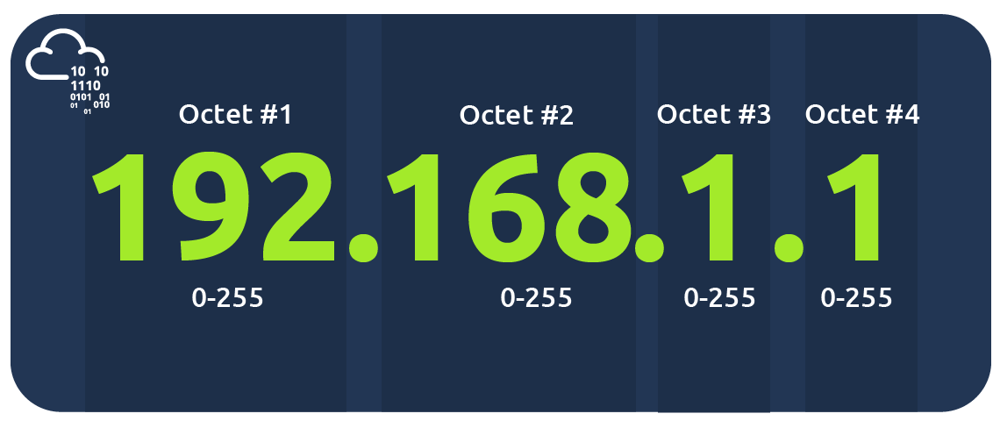

# Les réseaux locaux (LAN) 
<Badge type="tip" text="Rédigé le 13/03/2024" />

LAN : Local Area Network

## Topologies du réseau local

Avec le temps, plusieurs mises en oeuvre diverses de conception de réseaux ont vu le jour. La topologie d'un réseau signifie sa conception, ci-dessous voici les différents types :

### Topologie en étoile

Dans cette topologie, les équipements sont connectés individuellement via un switch.  C'est la plus fréquente aujourd'hui car **fiable** & **extensible** : mais à un **coût**.

Malgré le coût en câble & matériel réseau pour la conception de cette topologie, celle-ci peut se montrer avantageuse lorsque l'on veut étendre notre réseau. Cependant, plus le réseau est grand, plus la maintenance de celui-ci est importante.

Supposons que notre matériel central devient HS : tous les équipements connectés ne pourront plus communiquer.

### Topologie de l'autobus

Dans cette topologie, les équipements devant communiquer sont connectés à ce que l'on pourrait appeler "*une colonne vertébrale*". Ici, étant donné que les dispositifs communiquent en utilisant le même câble (colonne vertébrale), la vitesse de communication peut se montrer lente si tous les équipements demandent simultanément des données. De même que si le câble venait à céder, les communications passantes par celui-ci se retrouveraient bloquées.

En revanche, son coût est favorable & rentable à mettre en place.

### Topologie de l'anneau/jeton

Dans cette topologie, les dispositifs tels que les PC sont connectés directement entre eux pour former une boucle : peu de câblage & moins de dépendance aux matériels réseau.
Une topologie comme celle-ci fonctionne en envoyant les données le long de l'anneau jusqu'à trouver son destinataire.

Il n'y a qu'un seul sens de circulation des données, donc si celui-ci vient à se mettre en défaut, il devient assez facile de résoudre l'incident, mais celui-ci est coupé le temps de sa résolution. Cependant, la communication peut également se trouver longue selon le nombre de dispositifs présent dans l'anneau.

## Les équipements réseau

### Les switchs/commutateurs

Un switch est un équipement réseau permettant de **regrouper plusieurs dispositifs** grâce à ces ports.

|  x | x  |   | x  |   |
|---|---|---|---|---|
|   |   | x  | x  |   |

Supposons que ce tableau est un switch, est que chaque croix représente un ordinateur branché à un port grâce à un câble Ethernet.
Et bien les PC pourront communiquer entre eux car ils feront tous parti du même réseau : le switch

### Les routeurs

Les routeurs ont comme mission de connecter les réseaux entre eux et de transmettre les données, pour ce faire, ils utilisent le **routage**.
Le routage c'est le processus de transmission des données à travers les réseaux. Le routage implique la création d'un chemin entre les réseaux afin que ces données puissent être transmises avec succès.

## Les sous-réseaux

 Le sous-réseau est le terme utilisé pour *diviser un réseau en réseaux miniatures* plus petits au sein de lui-même. Il consiste à réserver une partie du réseau à un département, exemple : le département de la comptabilité, de la finance...
 Le sous-réseau est obtenu en divisant le nombre d'hôtes pouvant tenir dans le réseau, représenté par un nombre appelé masque de sous-réseau :

 

Une adresse IP est composée de quatre sections appelées octets. Il en va de même pour un masque de sous-réseau qui est également représenté sous la forme d'un nombre de quatre octets (32 bits), allant de 0 à 255.

Les sous-réseaux utilisent les adresses IP de trois manières différentes :
* Identifier l'adresse réseau
* Identifiez l'adresse de l'hôte
* Identifiez la passerelle par défaut

|    Type       |                                           But                                       |                                          Exemple                                 |
|---------------|-------------------------------------------------------------------------------------|-----------------------------------------------------------------------------------|
|Adresse réseau | Identifie le début du réseau réel et est utilisée pour identifier l'existence d'un réseau | un appareil avec l'adresse IP 192.168.1.100 sera sur le réseau identifié par 192.168.1.0.
|Adresse de l'hôte | Une adresse IP ici est utilisée pour identifier un appareil sur le sous-réseau | Par exemple, un appareil aura l'adresse réseau de 192.168.1.1
|Passerelle par défaut | L'adresse de passerelle par défaut est une adresse spéciale attribuée à un appareil du réseau capable d'envoyer des informations à un autre réseau. | Toutes les données devant être transmises à un appareil qui n'est pas sur le même réseau (c'est-à-dire qui n'est pas sur 192.168.1.0) seront envoyées à cet appareil. Ces appareils peuvent utiliser n'importe quelle adresse d'hôte, mais utilisent généralement la première ou la dernière adresse d'hôte d'un réseau (.1 ou .254).

Le sous-réseau offre de nombreux avantages, notamment :
* Efficacité
* Sécurité
* Controle total

Prenons le café typique de la rue. Ce café aura deux réseaux :
* Un pour les employés, les caisses enregistreuses et autres appareils de l'établissement
* Un pour le grand public à utiliser comme hotspot

## Le protocole ARP

Les dispositifs peuvent avoir deux identifiants : l'adresse **MAC** et l'adresse **IP**.

L'**ARP** (**A**ddress **R**esolution **P**rotocol) est la technologie utilisée qui permet aux appareils de s'identifier sur un réseau.

C'est ce protocole qui permettra à un appareil d'*associer son adresse MAC à son adresse IP*, dont chaque appareil conserve un journal des adresses MAC associés aux appareils.
Afin de mapper ces deux identifiants ensemble (adresse IP et adresse MAC), le protocole ARP envoie deux types de messages :
* **Demande ARP**
* **Réponse ARP**

Lorsqu'une requête ARP est envoyée, un message est diffusé à tous les autres appareils trouvés sur un réseau par l'appareil, demandant si l'adresse MAC de l'appareil correspond ou non à l'adresse IP demandée. Si l'appareil possède l'adresse IP demandée, une réponse ARP est renvoyée à l'appareil initial pour en accuser réception. Le périphérique initial s'en souviendra désormais et le stockera dans son cache, comme illustré ci-dessous :

## Le protocole DHCP

Les adresses IP peuvent être configurées de deux manières différents sur un réseau :
* Manuellement, en configurant l'adresse depuis les paramètres de l'appareil
* Automatiquement, en utilisant un serveur DHCP

DHCP pour **D**ynamic **H**ost **C**onfiguration **P**rotocol.

Un nouvel appareil se connecte sur le réseau sans adresse IP. Il va donc faire une demande au serveur DHCP afin qu'il lui en attribue une, celui-ci lui fait une **offre** : il propose une adresse IP disponible et invite l'appareil à l'utiliser.

## La redirection des ports

La redirection de port est un élément essentiel dans la connexion des applications et des services à Internet. Sans redirection de port, les applications et services tels que les serveurs Web ne sont disponibles que pour les appareils appartenant au même réseau direct.

Ci-dessous l'exemple d'un réseau comprenant 2 clients et un serveur web (192.168.1.10). Seul les deux clients présents dans le réseau peuvent accéder au serveur web :

Si l'administrateur souhaitait que le site Web soit accessible au public (via Internet), il devrait implémenter la redirection de port, comme dans le schéma ci-dessous :

Avec cette conception, le réseau n°2 pourra désormais accéder au serveur Web exécuté sur le réseau n°1 en utilisant l'adresse IP publique du réseau n°1 (82.62.51.70).
La redirection de port est configurée sur le routeur d'un réseau.

 

::: info Sources
Ce cours s'inspire (et utilise les images) de TryHackMe.com de la chambre "*Intro to LAN*" & "*Extending your network*" :

https://tryhackme.com/room/introtolan  <Badge type="tip" text="Gratuit" />

https://tryhackme.com/r/room/extendingyournetwork <Badge type="danger" text="Payant" />
:::