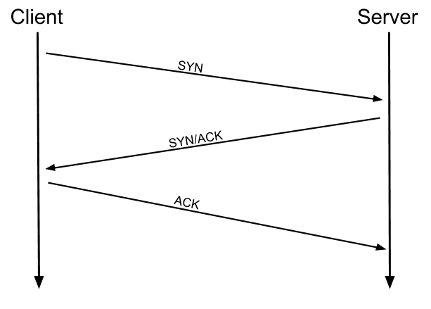

# Le modèle TCP/IP
<Badge type="tip" text="Rédigé le 24/03/2024" />

Le modèle TCP/IP est, à bien des égards, très similaire au modèle OSI. Il a quelques années de plus et sert de base à un réseautage réel. Le modèle TCP/IP se compose de quatre couches : **application**, **transport**, **Internet** et **interface réseau**. Ensemble, ceux-ci couvrent le même éventail de fonctions que les sept couches du modèle OSI.

|TCP/IP|
|------|
|Application|
|Transport|
|Internet|
|Interface réseau|

***Remarque*** : *Certaines sources récentes divisent le modèle TCP/IP en cinq couches, divisant la couche d'interface réseau en couches de liaison de données et physique (comme avec le modèle OSI). Ceci est accepté et bien connu ; cependant, il n'est pas officiellement défini (contrairement aux quatre couches originales définies dans la [RFC1122](https://datatracker.ietf.org/doc/html/rfc1122)).*

Pour comparaison, voilà à quoi correspond le modèle OSI au modèle TCP/IP :

Les processus d'encapsulation et de désencapsulation fonctionnent exactement de la même manière avec le modèle TCP/IP qu'avec le modèle OSI. À chaque couche du modèle TCP/IP, un en-tête est ajouté lors de l'encapsulation et supprimé lors de la désencapsulation.

## En pratique

Lorsque nous parlons de TCP/IP, c'est bien beau de penser à une table comportant quatre couches, mais nous parlons en réalité d'une suite de protocoles & des ensembles de règles qui définissent la manière dont une action doit être effectuée. TCP/IP tire son nom des deux plus importants d'entre eux : le **protocole de contrôle de transmission** qui contrôle le flux de données entre deux points de terminaison, et le **protocole Internet**, qui contrôle la manière dont les paquets sont adressés et envoyés.

TCP est un protocole basé sur la connexion. En d'autres termes, avant d'envoyer des données via TCP, on doit d'abord établir une connexion stable entre les deux ordinateurs. Le processus de formation de cette connexion est appelé *three-way handshake* (*négocation à trois*).

Lorsque on tente d'établir une connexion, l'ordinateur envoie d'abord une requête spéciale au serveur distant indiquant qu'il souhaite initialiser une connexion. Cette requête contient quelque chose appelé un ***bit SYN*** (abréviation de *synchroniser*), qui établit essentiellement le premier contact lors du démarrage du processus de connexion. Le serveur répondra alors avec un paquet contenant le ***bit SYN***, ainsi qu'un autre bit « d'accusé de réception », appelé ***ACK*** . Enfin, l'ordinateur enverra un paquet contenant lui-même le ***bit ACK***, confirmant que la connexion a été établie avec succès. Une fois la **négociation à trois** terminée avec succès, les données peuvent être transmises de manière fiable entre les deux ordinateurs. Toutes les données perdues ou corrompues lors de la transmission sont renvoyées, conduisant ainsi à une connexion qui semble sans perte.

***Il faut savoir que la négociation à trois doit être effectuée avant qu'une connexion puisse être établie via TCP.***

Le schéma ci-dessous l'explique clairement :

